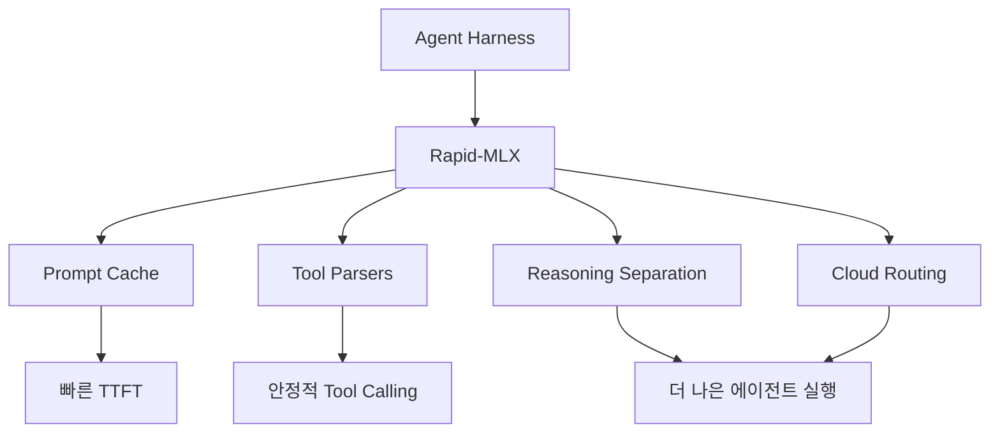

Rapid-MLX의 README는 꽤 도발적이다.

- `The fastest local AI engine for Apple Silicon`
- `4.2x faster than Ollama`
- `0.08s cached TTFT`
- `100% tool calling`
- `Drop-in OpenAI replacement`

이 저장소가 흥미로운 이유는 단순히 “Mac에서 모델을 돌린다”가 아니라,  
**Apple Silicon 위에서 에이전트 하네스를 가장 빠르게 붙일 수 있는 로컬 백엔드**를 노리기 때문이다.

<!--more-->

## Sources

- GitHub: <https://github.com/raullenchai/Rapid-MLX>
- README: <https://raw.githubusercontent.com/raullenchai/Rapid-MLX/main/README.md>

## 1. Rapid-MLX는 로컬 LLM 서버가 아니라 “로컬 agent backend”에 가깝다

README는 시작부터 방향을 분명히 한다.

- Cursor
- Claude Code
- Aider
- OpenAI-compatible app 전반

과 바로 연결되는 것을 핵심 가치로 내세운다.

즉 Rapid-MLX의 포지션은:

- 모델을 띄우는 도구

가 아니라

- **기존 에이전트/IDE가 바로 붙을 수 있는 OpenAI-compatible local endpoint**

에 가깝다.

그래서 이 프로젝트를 이해할 때 중요한 질문은 “어떤 모델을 지원하나?”보다  
**“어떤 하네스가 바로 붙느냐?”** 다.

## 2. 가장 중요한 차별점은 Apple Silicon 최적화다

Rapid-MLX는 MLX 기반 생태계 위에서 움직이는 만큼, 처음부터 Apple Silicon을 전제로 한다.

README가 직접 제시하는 대상은:

- M1
- M2
- M3
- M4

즉 범용 로컬 추론 엔진이 아니라,  
**Mac을 로컬 AI 박스로 쓰려는 사람들을 정면으로 겨냥한 엔진**이다.

이 포지셔닝이 좋은 이유는 분명하다.

많은 개발자에게 로컬 AI의 실제 환경은:

- Linux 서버
- 멀티 GPU 워크스테이션

이 아니라

- MacBook Air
- Mac Mini
- Mac Studio

이기 때문이다.

Rapid-MLX는 바로 이 현실 위에서 “가장 빠른 기본값”을 노린다.

## 3. 이 프로젝트는 “모델 실행”보다 “도구 호출 품질”을 더 전면에 둔다

README가 눈에 띄게 강조하는 건 단순 tok/s만이 아니다.

- `100% tool calling`
- `17 tool parsers`
- `reasoning separation`
- `prompt cache`
- `cloud routing`

즉 Rapid-MLX는 단순 대화 서버보다  
**에이전트가 도구를 잘 부르는가**를 더 중요한 경쟁 축으로 본다.

이건 아주 실전적이다.

Cursor, Claude Code, Aider 같은 도구를 실제로 붙이면 병목은 자주 모델 IQ보다:

- tool schema 해석
- function calling 안정성
- TTFT
- 반복 호출 오버헤드

에서 나온다.

Rapid-MLX는 바로 이 지점에 맞춰 설계된 느낌이 강하다.

## 4. “OpenAI drop-in replacement”라는 포지션이 강하다

README의 quick start는 의도적으로 단순하다.

```bash
rapid-mlx serve qwen3.5-4b
```

그 뒤 `http://localhost:8000/v1`을 열고, 아무 OpenAI-compatible 클라이언트가 붙게 만든다.

이 방식의 장점은 명확하다.

사용자는 새로운 프레임워크를 배우기보다:

- base URL만 바꾸고
- api key는 더미값을 넣고
- 기존 툴을 그대로 쓴다

즉 로컬 AI 도입이 “새 툴로 갈아타기”가 아니라,  
**기존 하네스의 백엔드만 로컬로 바꾸기**가 된다.

이건 채택 장벽을 매우 낮춘다.


## 5. Works With 섹션이 사실상 이 프로젝트의 진짜 소개다

README에서 가장 흥미로운 부분 중 하나는 `Works With`다.

여기에는 단순 UI 클라이언트뿐 아니라 agent harness들이 직접 나온다.

### Agent Harnesses

- Hermes Agent
- PydanticAI
- LangChain
- smolagents
- OpenClaude
- Aider
- Goose
- Claw Code

### UI / IDE Clients

- Cursor
- Continue.dev
- LibreChat
- Open WebUI
- Any OpenAI-compatible app

즉 Rapid-MLX는 “내장 UI가 멋진 로컬 챗앱”이 아니라,  
**여러 상위 에이전트 런타임을 받쳐 주는 범용 inference substrate**를 노린다.

이건 Ollama와 겹치면서도, 더 agent-centric하게 보이는 지점이다.

## 6. MHI(Model-Harness Index)라는 발상도 흥미롭다

README는 `Model-Harness Index (MHI)`라는 자체 평가 체계를 제시한다.

구성은 이렇다.

- Tool Calling 50%
- HumanEval 30%
- MMLU 20%

이게 시사하는 바는 크다.

Rapid-MLX는 모델 성능을 “벤치마크 점수” 하나로 보지 않고:

- 하네스 안에서 도구를 잘 부르는가
- 실제 코드 생성이 되는가
- 기본 지식이 유지되는가

를 합쳐서 본다.

즉 로컬 모델의 평가는 더 이상 “원본 모델이 똑똑한가?”가 아니라,  
**에이전트 시스템 안에서 실제로 쓸 만한가?** 로 바뀌고 있다는 뜻이다.

이건 꽤 좋은 방향이다.

## 7. Rapid-MLX가 빠르다고 주장하는 이유는 단순 연산량이 아니다

README의 수치들은 공격적이다.

- 16GB Air에서 4B 모델 160 tok/s
- 32GB+에서 30B급 141 tok/s
- 96GB+에서 122B급 57 tok/s
- 128GB+에서 DeepSeek V4 Flash 158B 계열도 구동

물론 환경과 모델에 따라 실제 체감은 다르겠지만, 중요한 건 철학이다.

Rapid-MLX는:

- prompt cache
- cached TTFT
- parser optimization
- harness compatibility

같은 요소를 함께 묶어 “빠름”을 만든다.

즉 tok/s만이 아니라,  
**에이전트가 실제로 첫 응답을 빨리 시작하고 도구를 덜 헤매는 것**까지 속도의 일부로 본다.

## 8. 클라우드 라우팅까지 넣은 건 현실적이다

README 설명에 `cloud routing`이 들어간다는 점도 흥미롭다.

이 말은 Rapid-MLX가 무조건 “전부 로컬”만 고집하지 않는다는 뜻으로 읽힌다.

실제 운영에서는 종종:

- 평소엔 로컬
- 어려운 작업만 클라우드
- 모델별 역할 분리

가 더 현실적이다.

즉 Rapid-MLX는 local-first이지만,  
**로컬만이 정답이라는 순수주의보다 라우팅 가능한 실용주의** 쪽에 가깝다.

## 9. 이 프로젝트를 가장 잘 설명하는 문장은 “Ollama 경쟁자”보다 “Mac용 agent engine”이다

표면적으로는 Rapid-MLX를 Ollama 대안으로 볼 수 있다.

하지만 README를 끝까지 읽으면 더 정확한 표현은 이것이다.

**Mac에서 Cursor, Claude Code, Aider, Hermes 같은 상위 도구를 더 빠르게 돌리기 위한 agent engine**

즉 경쟁 대상은 단순 모델 서버라기보다:

- 로컬 추론의 지연
- 약한 tool calling
- 느린 TTFT
- 하네스 호환성 부족

같은 실제 운영 병목이다.

이 점에서 Rapid-MLX는 단순 로컬 LLM 런타임보다  
**개발자용 로컬 에이전트 백플레인(backplane)** 에 가깝다.



## 10. 최신 저장소 기준 메타데이터

GitHub 기준 현재 확인한 저장소 정보는 다음과 같다.

- 저장소: `raullenchai/Rapid-MLX`
- 설명: `The fastest local AI engine for Apple Silicon...`
- stars: `1,471`
- forks: `208`
- 기본 브랜치: `main`
- 라이선스: `Apache-2.0`
- 주 언어: `Python`

추가로 README 기준:

- Python `3.10+`
- 테스트 `2100+`
- Apple Silicon 전용 최적화
- OpenAI-compatible endpoint 제공

즉 Rapid-MLX는 단순 데모성 프로젝트라기보다,  
Apple Silicon 위에서 **로컬 에이전트 인프라를 진지하게 최적화하려는 프로젝트**로 보는 편이 맞다.
