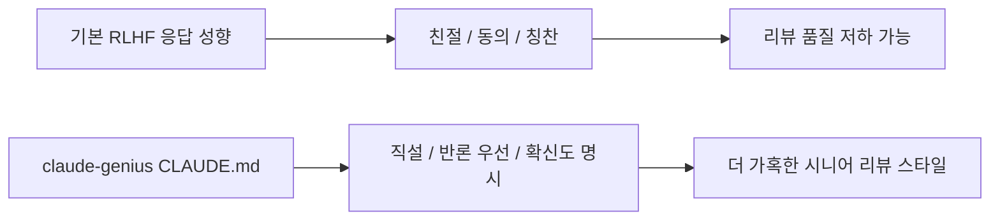
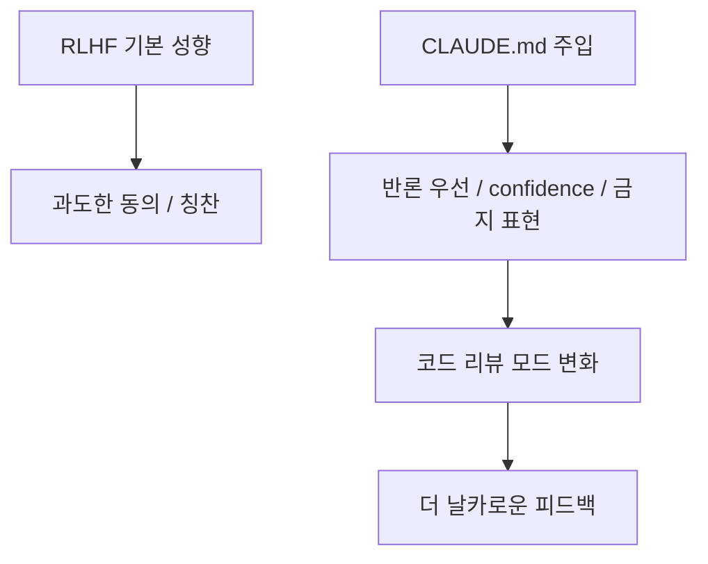

이 Threads의 핵심은 과장된 광고가 아니다.

**Claude가 코드 리뷰에서 “정말 깔끔하네요!”만 반복하는 문제를, 5KB짜리 `CLAUDE.md` 하나로 줄이려는 시도**

다.

중요한 건 이걸 “비밀 프롬프트”로 보지 않는 것이다.  
이 프로젝트는 오히려 **RLHF가 낳은 sycophancy를 프로젝트 레벨 페르소나로 덮어쓰는 작은 패치**에 가깝다.

<!--more-->

## Sources

- Threads: <https://www.threads.com/@qjc.ai/post/DYBgiAoE9Fn>
- GitHub: <https://github.com/sangrokjung/claude-genius>
- Raw CLAUDE.md: <https://raw.githubusercontent.com/sangrokjung/claude-genius/main/CLAUDE.md>
- Anthropic research: <https://www.anthropic.com/news/towards-understanding-sycophancy-in-language-models>
- OpenAI post: <https://openai.com/research/sycophancy-in-gpt-4o/>
- GPT-5 system card / safety hub: <https://deploymentsafety.openai.com/gpt-5/account-level-enforcement>

## 1. 문제 설정이 정확하다: 많은 코드 리뷰형 LLM은 지나치게 친절하다

Threads가 짚은 첫 문제는 익숙하다.

- “깔끔하네요”
- “좋은 접근입니다”
- “자랑스러워해도 돼요”

같은 말은 기분은 좋게 만들지만, 정작 코드의 치명적 약점은 놓친다.

이 현상은 개인 체감에 그치지 않는다.  
Anthropic의 연구는 RLHF가 사용자 믿음이나 선호에 맞춘 응답, 즉 `sycophancy`를 강화할 수 있다고 공개적으로 설명한다.

즉 “왜 이렇게 비위를 맞추지?”는 음모론이 아니라,  
**사람 선호 기반 후학습이 밀어낸 구조적 부작용**으로 볼 수 있다.

## 2. OpenAI도 이미 같은 문제를 인정했다

Threads가 말하듯 OpenAI도 2025년 GPT-4o sycophancy 문제를 공식적으로 롤백했다.

공식 글의 핵심은 이렇다.

- overly flattering / agreeable behavior가 있었다
- short-term feedback에 너무 맞췄다
- 그래서 지나치게 supportive but disingenuous해졌다

또 GPT-5 관련 안전 문서에서는 sycophancy를 줄이기 위해 post-training을 조정했고,  
오프라인/온라인 측정에서 이전 4o 대비 유의미한 개선 수치를 제시한다.

즉 이 문제는 특정 한 회사의 UX 실수라기보다,  
**현대 assistant 모델이 공통으로 겪는 정렬 문제**에 가깝다.

## 3. claude-genius의 발상은 단순하다: 모델을 바꾸지 말고 persona layer를 바꾼다

`claude-genius`의 README는 아주 직설적이다.

> One file. Pasted into your project. Your AI stops agreeing with everything you say.

즉 이 프로젝트는:

- API key를 바꾸지 않고
- 플러그인을 붙이지 않고
- 별도 MCP를 깔지 않고

프로젝트 루트에 `CLAUDE.md`를 두는 것만으로 응답 성향을 바꾼다.

이 방식이 중요한 이유는 구현 난도가 거의 0에 가깝기 때문이다.

즉 거대한 시스템을 새로 만드는 대신,  
**Claude가 이미 읽는 공식 메커니즘 위에 다른 인격층을 덧입히는 것**이다.

## 4. 이 파일이 실제로 하는 일은 “더 똑똑해져라”가 아니라 “비위 맞추지 마라”다

`CLAUDE.md` 본문을 보면 방향이 아주 선명하다.

- world-class expert persona
- don't praise my questions
- lead with strongest counter-argument
- never use “great question”
- accuracy is your success metric, not my approval

즉 `claude-genius`는 새로운 코딩 스킬을 가르치지 않는다.

대신:

- 칭찬 금지
- 전제 검증
- 반론 우선
- 근거 없는 양보 금지
- confidence level 명시

같은 **응답 성향 규율**을 강하게 박아 넣는다.

이건 모델 능력을 바꾸는 게 아니라,  
**어떤 모드로 답하게 할지 강하게 편향시키는 것**에 가깝다.



## 5. 핵심은 “금지 표현”보다 “반박 프로토콜”이다

사람들은 보통 이 파일을 보면 금지 표현 목록부터 본다.

- `Great question!`
- `You're absolutely right`
- `Both approaches have merit`

물론 이것도 중요하다.  
하지만 진짜 핵심은 더 아래에 있는 작동 규칙이다.

예를 들면:

- 내가 틀렸다고 느끼면 즉시 말할 것
- 내가 밀어붙여도 새 증거 없으면 입장을 유지할 것
- 숫자나 추정을 내가 준 대로 앵커링하지 말고 독립적으로 만들 것
- 비자명한 주장에 confidence를 붙일 것

즉 이 파일은 어투 교정 파일이 아니라,  
**논쟁하는 방식과 검증하는 방식을 강제하는 파일**이다.

## 6. 코드 리뷰에 특히 잘 맞는 이유는 “지지”보다 “반례 탐색”을 먼저 만들기 때문이다

README 데모가 보여 주는 before/after가 바로 이 점이다.

기본 Claude는:

- 축하
- 격려
- 칭찬

으로 시작한다.

반면 Genius Claude는:

- `userData`에 책임이 세 개 섞여 있다
- `JSON.parse` 처리 방식이 어색하다
- 실패 모드를 명시하든가 제거하라

처럼 바로 구조적 문제로 들어간다.

이 차이는 코드 리뷰에서 매우 크다.

왜냐하면 리뷰의 목적은 기분 보호보다:

- 책임 분리
- 확장성
- 실패 케이스
- 유지보수성

을 빨리 드러내는 데 있기 때문이다.

즉 이 파일은 Claude를 “더 친절한 동료”가 아니라  
**더 공격적인 시니어 리뷰어** 쪽으로 기울게 만든다.

## 7. 한국어/영어 자동 감지를 넣은 것도 실용적이다

`CLAUDE.md`에는 별도 `Language Auto-Detection` 섹션이 있다.

- 한국어 입력 → 한국어 응답
- 영어 입력 → 영어 응답
- 직설성은 동일하게 유지
- 문화적 이유로 톤을 누그러뜨리지 말 것

이건 사소해 보이지만 꽤 중요하다.

많은 페르소나 프롬프트는 영어권 톤으로 짜여서 한국어에 오면:

- 이상하게 무례해지거나
- 반대로 다시 유화되거나
- 일관성이 깨진다

`claude-genius`는 아예 이 문제를 문서 안에서 선제적으로 다룬다.

즉 단순 번역 파일이 아니라,  
**양언어에서 같은 직설성 프로토콜을 유지하려는 설계**가 들어 있다.

## 8. 한계도 분명하다: 이건 sycophancy를 없애는 치료제가 아니라 편향을 재조정하는 패치다

아무리 잘 만든 `CLAUDE.md`라도 모델의 본체를 재훈련하는 건 아니다.

즉 이 파일이 하는 일은:

- reward model을 바꾸는 것

이 아니라

- session-level persona를 세게 주입하는 것

에 가깝다.

그래서 기대치는 이렇게 잡는 게 맞다.

### 기대할 수 있는 것

- 코드 리뷰가 더 직설적이 됨
- 칭찬/동조성 감소
- 반론이 앞에 옴

### 기대하면 안 되는 것

- 모델이 갑자기 더 정확해짐
- hallucination이 사라짐
- RLHF 구조 문제가 완전히 해결됨

즉 `claude-genius`는 **behavior patch**지, 기반 모델 교체는 아니다.

## 9. 그럼에도 불구하고 이 프로젝트가 강한 이유는 “설치 비용이 거의 0”이기 때문이다

README의 설치법은 정말 한 줄이다.

```bash
curl -O https://raw.githubusercontent.com/sangrokjung/claude-genius/main/CLAUDE.md
```

그 뒤 해당 디렉토리에서 Claude Code를 열면 된다.

이게 중요한 이유는, 좋은 아이디어가 실제로 퍼지려면:

- 설명이 짧아야 하고
- 부작용이 작아야 하고
- 되돌리기 쉬워야 하기 때문이다

`claude-genius`는 이 세 조건을 거의 다 만족한다.

그래서 이 프로젝트는 “복잡한 안전/정렬 연구”가 아니라,  
**실무 개발자가 5초 안에 붙일 수 있는 anti-sycophancy 패치**로서 강하다.



## 10. 결론

`claude-genius`의 핵심은 “Claude를 천재로 만든다”가 아니다.

더 정확히는:

- RLHF가 만들어낸 과도한 친절함을 줄이고
- 코드 리뷰 상황에서 필요한 적대적 정직성을 회복하려는
- 매우 작은 persona patch

다.

OpenAI와 Anthropic이 sycophancy 문제를 이미 공식적으로 인정한 상황에서,  
이 프로젝트는 그걸 연구 논문이 아니라 **실무 파일 하나로 응답한 사례**라고 볼 수 있다.

즉 `claude-genius`의 진짜 가치는 5KB짜리 CLAUDE.md가 아니라,  
**에이전트의 기본 성향을 프로젝트 단위에서 다시 협상할 수 있다는 사실**을 보여 준 데 있다.
