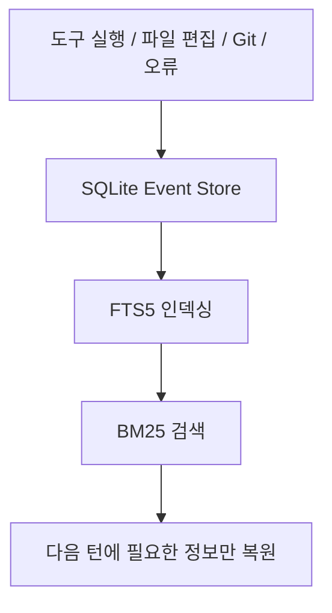
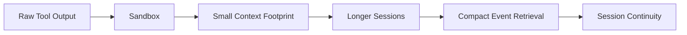

Context Mode의 README 첫 문장은 꽤 정확하다.

**The other half of the context problem.**

많은 사람이 컨텍스트 문제를 “긴 대화”로만 생각하지만, 이 프로젝트는 다른 절반을 찌른다.

- 도구 출력이 너무 크고
- 그 출력이 문맥창을 오염시키고
- 압축 이후에는 에이전트가 무엇을 하던 중이었는지 잊어버린다

즉 Context Mode는 단순 토큰 절감기가 아니라,  
**도구 샌드박싱과 세션 연속성을 묶어 컨텍스트 위생을 관리하는 레이어**에 가깝다.

<!--more-->

## Sources

- GitHub: <https://github.com/mksglu/context-mode>
- README: <https://raw.githubusercontent.com/mksglu/context-mode/main/README.md>

## 1. Context Mode가 보는 문제는 “대화가 길다”보다 “도구가 너무 많이 쏟아낸다”다

README의 문제 정의는 아주 구체적이다.

- Playwright snapshot 한 번에 `56 KB`
- GitHub issues 20개에 `59 KB`
- access log 하나에 `45 KB`

즉 문맥창은 사용자가 장황해서만 차는 게 아니라,  
**도구가 raw output을 그대로 뿜어내기 때문에** 금방 소모된다.

이 관점은 중요하다.

왜냐하면 실제 코딩 에이전트 세션에서 문맥을 가장 많이 먹는 경우가 자주:

- 브라우저 스냅샷
- 로그
- 대량 파일 읽기
- 이슈/문서 덤프

같은 도구 출력이기 때문이다.

Context Mode는 바로 이 raw output flood를 문제의 시작점으로 본다.

## 2. 이 프로젝트의 핵심은 단일 기능이 아니라 4개 층이다

README는 Context Mode가 네 가지를 함께 해결한다고 말한다.

1. Context Saving  
2. Session Continuity  
3. Think in Code  
4. Output Compression

이 네 개를 따로 보면 익숙한 이야기지만, 한 시스템 안에 묶어 둔 점이 차별점이다.

### 2-1. Context Saving

sandbox tools로 raw data를 컨텍스트 창 밖에 둔다.

README 표현대로면:

- `315 KB → 5.4 KB`
- `98% reduction`

즉 핵심은 “도구를 쓰지 말라”가 아니라  
**도구 출력 전체를 LLM 문맥에 다 싣지 말라**는 것이다.

### 2-2. Session Continuity

파일 편집, git 작업, task, error, user decision을 SQLite에 기록한다.

그리고 compact 이후에는 이걸 다시 긴 텍스트로 밀어 넣는 대신:

- FTS5
- BM25 search

로 필요한 것만 재검색한다.

즉 압축 이후의 기억 상실을 줄이려는 구조다.

### 2-3. Think in Code

README에서 가장 인상적인 주장이다.

> The LLM should program the analysis, not compute it.

즉 50개 파일을 일일이 읽게 하지 말고:

- 스크립트를 쓰게 하고
- 계산은 스크립트가 하게 하고
- 결과만 짧게 받아라

는 것이다.

이건 단순 최적화가 아니라 **에이전트 사고방식 교정**에 가깝다.

### 2-4. Output Compression

README는 거의 스타일 가이드처럼 말한다.

- terse like caveman
- only fluff die
- fragments OK

즉 기술 정보는 유지하되:

- 군더더기
- 헤징
- 불필요한 예의
- 장황한 연결어

를 죽여서 출력 토큰도 줄인다.

## 3. 진짜 차별점은 “세션 연속성”이다

토큰 절감 도구는 이미 많다.  
하지만 Context Mode가 더 흥미로운 이유는 `Session Continuity`를 전면에 둔다는 점이다.

README에 따르면, compact 후에도 다음이 추적된다.

- file edit
- git operation
- task
- error
- user decision

그리고 이전 세션을 무조건 다 끌고 오는 게 아니라:

- fresh session이면 이전 데이터 삭제
- 이어 가는 세션이면 relevant event만 재검색

하는 식이다.

즉 이 프로젝트는 “기억을 많이 남기자”보다  
**지금 필요한 기억만 재구성하자**는 쪽에 가깝다.

이게 훨씬 실용적이다.

## 4. Think in Code는 사실 가장 큰 철학적 전환이다

README가 드는 예시는 강력하다.

- Before: `47 × Read() = 700 KB`
- After: `1 × ctx_execute() = 3.6 KB`

이건 단순히 압축을 잘하는 수준이 아니다.

에이전트에게:

- 데이터를 직접 먹이지 말고
- 분석 스크립트를 생성하게 하고
- 결과만 뽑게 하라

고 강제하는 것이다.

즉 LLM을:

- 데이터 처리기

가 아니라

- 분석 프로그램 생성기

로 다시 위치시킨다.

이 관점은 앞으로 더 중요해질 가능성이 크다.  
컨텍스트 문제는 모델 창이 커져도 사라지지 않기 때문이다.

## 5. 14개 플랫폼 지원도 “설치 편의성”보다 “습관 강제력”에서 의미가 있다

README는 14개 플랫폼을 지원한다고 말한다.

특히 hook-capable platform에서는:

- SessionStart
- PreToolUse
- PostToolUse
- PreCompact

같은 훅으로 routing을 강제할 수 있다고 설명한다.

이게 중요한 이유는 Context Mode의 가치는 단순 설치가 아니라,  
**에이전트가 raw Bash/Read/WebFetch 대신 sandbox tool을 우선 쓰게 만드는 것**에 있기 때문이다.

즉 좋은 아이디어만으로는 부족하고,  
실제로 그 행동을 세션 시작부터 주입해야 한다.

그래서 이 프로젝트는 도구 모음이라기보다  
**행동 교정 런타임**에 더 가깝다.

## 6. Claude Code 지원 방식도 흥미롭다: MCP-only가 아니라 plugin+hooks다

README의 Claude Code 섹션을 보면 두 가지 길을 준다.

### Full plugin install

- marketplace add
- plugin install
- SessionStart / PreToolUse / PostToolUse / PreCompact
- slash commands

### MCP-only install

- MCP tools만 사용
- routing 강제는 없음

즉 개발자는 “그냥 도구 몇 개 더 추가”하는 것도 가능하지만,  
제작자는 분명히 **전체 plugin + hooks 경로**를 권장한다.

왜냐하면 Context Mode의 본질은 도구 개수보다  
**도구 선택 습관을 바꾸는 것**이기 때문이다.

## 7. Output Compression은 과해 보이지만, 실은 agent UX를 겨냥한다

README의 압축 규칙은 일부러 과장돼 보인다.

- caveman style
- fragments OK
- filler die

하지만 이건 나름 타당하다.

코딩 에이전트 세션에서 자주 낭비되는 건:

- 쓸데없는 친절
- 반복 설명
- “just / really / basically” 같은 filler

같은 것들이다.

즉 Output Compression은 단순 글쓰기 스타일이 아니라  
**토큰 예산을 technical substance에 몰아주기 위한 응답 프로토콜**이다.

다만 이 부분은 호불호가 있을 수 있다.  
설명 중심 사용자는 오히려 답변이 너무 거칠다고 느낄 수 있기 때문이다.

## 8. 이 프로젝트를 가장 잘 설명하는 표현은 “context saver”보다 “context hygiene runtime”이다

Context Mode는 단순히 용량을 줄이지 않는다.

- raw output를 샌드박싱하고
- 이벤트를 저장하고
- 필요한 정보만 검색해 복원하고
- 에이전트에게 코드를 쓰게 하고
- 출력 자체도 압축한다

즉 문제를 단일 포인트가 아니라 **문맥 수명주기 전체**에서 본다.

그래서 이 프로젝트는 단순 최적화 도구보다,  
**AI coding session의 위생 관리 런타임**이라고 부르는 편이 더 정확하다.

## 9. 최신 저장소 기준 메타데이터

GitHub 기준 현재 확인한 저장소 정보는 다음과 같다.

- 저장소: `mksglu/context-mode`
- 설명: `Context window optimization for AI coding agents...`
- stars: `13,594`
- forks: `932`
- 기본 브랜치: `main`
- 주 언어: `TypeScript`

라이선스는 주의가 필요하다.

- GitHub API 응답: `NOASSERTION`
- README 배지: `ELv2`

즉 현재는 **README와 GitHub 메타데이터가 완전히 일치하지 않으므로**, 실제 사용 전에는 저장소의 LICENSE 파일을 직접 확인하는 편이 안전하다.

## 10. 결론

Context Mode가 중요한 이유는 “토큰 98% 절감” 수치 자체보다,  
그 절감을 위해 **에이전트가 일하는 방식을 바꾼다**는 점에 있다.

핵심은:

- raw output를 문맥에 다 밀어 넣지 말 것
- 필요한 기억만 다시 찾을 것
- LLM에게 데이터를 직접 읽히지 말고 코드를 쓰게 할 것
- 답변도 압축해서 토큰을 아낄 것

이다.

즉 이 프로젝트는 단순 saver가 아니라  
**도구 샌드박싱 + 세션 연속성 + think-in-code를 결합한 context runtime**으로 보는 편이 맞다.
