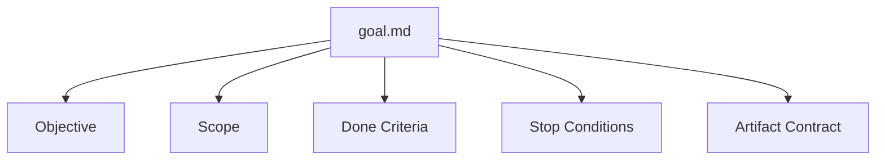
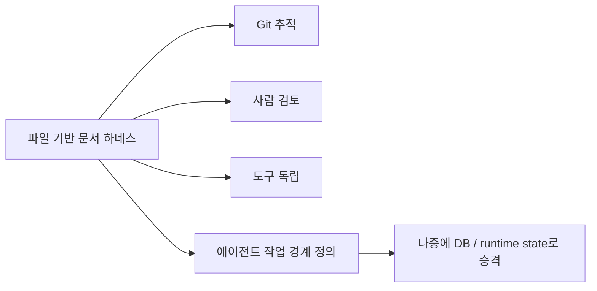

에이전트 런타임을 만들겠다고 하면 보통 바로 거대한 시스템이 떠오른다.

- SQLite state
- agent scheduler
- multi-agent orchestrator
- memory graph
- permission engine

하지만 실제로는 그 전에 해야 할 일이 있다.  
**에이전트가 무엇을 해야 하고, 어디서 멈추고, 무엇을 남겨야 하는지 문서로 먼저 분리하는 것**이다.

<!--more-->

## Sources

- Moonshot Notes: <https://moonshotnotes.com/posts/coding-agent-runtime-05-harness-documents/>
- OpenAI Codex harness 글: <https://openai.com/index/introducing-upgrades-to-codex/>

## 1. 이 글의 핵심은 “런타임을 당장 만들지 않아도 된다”는 점이다

Moonshot Notes 글의 가장 실용적인 메시지는 이것이다.

> 처음부터 거대한 agent runtime을 만들 필요는 없습니다.

이 말이 중요한 이유는, 많은 팀이 에이전트 운영을 도입하려 할 때 너무 일찍 복잡한 인프라를 상상하기 때문이다.

하지만 MVP 단계에서 진짜 필요한 건:

- 스케줄러가 아니라 목표 정의
- 큐 엔진이 아니라 실행 기록
- 메모리 그래프가 아니라 기억 승격 기준
- 정책 엔진이 아니라 중단 조건 문서

다.

즉 초기 하네스의 핵심은 코드가 아니라 **문서 계약**이다.

## 2. 최소 문서 세트 5개가 이 글의 핵심 제안이다

Moonshot Notes는 문서 기반 하네스의 최소 세트를 아주 명확하게 제시한다.

- `goal.md`
- `run-ledger.md`
- `artifact-contract.md`
- `memory-policy.md`
- `permission-policy.md`

이 구조가 좋은 이유는 역할을 섞지 않게 만들기 때문이다.

각 문서는 서로 다른 질문에 답한다.

### goal.md

무엇을 끝낼 것인가?

### run-ledger.md

실제로 무엇을 했는가?

### artifact-contract.md

무엇을 남길 것인가?

### memory-policy.md

무엇을 기억할 것인가?

### permission-policy.md

무엇을 막을 것인가?

즉 좋은 하네스는 “에이전트에게 뭘 하라고 시킨다”에서 끝나지 않고,  
**목표 / 실행 / 산출물 / 기억 / 권한을 서로 다른 계약으로 분리**한다.

## 3. 왜 파일 기반 문서 세트로 시작하는가

글은 파일 기반 하네스의 장점을 다섯 가지 정도로 요약한다.

- 사람이 읽기 쉽다
- git으로 추적 가능하다
- 도구 독립적이다
- 점진적으로 확장 가능하다
- 실패를 대화가 아니라 산출물로 남길 수 있다

이건 매우 현실적이다.

처음부터 데이터베이스와 앱 서버를 만들면 멋있어 보일 수 있지만,

- 팀원이 읽기 어렵고
- 규칙을 검토하기 어렵고
- 변경 이력도 눈에 잘 안 들어온다

반면 문서 세트는:

- PR에서 바로 검토할 수 있고
- diff가 남고
- Claude Code, Codex, Cursor 등 어떤 에이전트와도 함께 쓸 수 있다

즉 MVP로서는 파일이 훨씬 강하다.

## 4. 추천 디렉터리 구조가 좋은 이유는 ‘기억’과 ‘산출물’을 분리하기 때문이다

글이 제안하는 구조는 대략 이런 식이다.

```text
agent-runtime/
  goals/
    profile-update/
      goal.md
      plan.md
      run-ledger.md
      artifacts/
        changed-files.md
        test-result.md
        risk-summary.md
  policies/
    artifact-contract.md
    memory-policy.md
    permission-policy.md
  memory/
    candidates/
    validated/
```

이 구조가 좋은 이유는, `기록`과 `정책`과 `기억`이 한 파일에 뒤섞이지 않기 때문이다.

예를 들면 흔히 이런 혼란이 생긴다.

- 실패 기록을 memory처럼 남긴다
- 산출물 요구사항을 goal 문서 안에만 묻어 둔다
- 권한 정책을 instruction 문장으로만 처리한다

이렇게 되면 에이전트는 경계를 잃는다.

반대로 위 구조는:

- 현재 goal
- 실행 이력
- 결과 산출물
- 승격된 기억
- 금지 사항

을 서로 다른 위치에 둔다.

## 5. goal.md는 단순 TODO가 아니라 중단 조건까지 포함한 계약이다

글이 제시하는 `goal.md` 템플릿에서 특히 중요한 부분은 `Stop Conditions`다.

예시로는 이런 것들이 들어간다.

- DB schema 변경 필요 시 중단
- 인증/권한 로직 변경 필요 시 중단
- 외부 비용 발생 시 중단
- secret 접근 필요 시 중단
- production 배포 필요 시 중단

이게 핵심이다.

에이전트 작업이 위험해지는 이유는 자주 목표가 없어서가 아니라,  
**어디서 멈춰야 하는지 정의되지 않아서**다.

즉 좋은 goal 문서는:

- 목표
- 범위
- 완료 조건

뿐 아니라

- 중단 조건

을 함께 갖고 있어야 한다.



## 6. run-ledger.md는 대화 로그가 아니라 작업 일지다

Moonshot Notes는 Run Ledger를 계속 강조해 왔고, 이번 글에서도 그 역할이 명확해진다.

핵심 필드는 다음과 같다.

- task_id
- attempt_id
- input
- action
- result
- evidence
- diagnosis
- next_action
- artifact_created
- memory_decision
- human_review_required

이 구조가 좋은 이유는 작업 이력을 “채팅 기록”이 아니라 **검토 가능한 시도 단위의 기록**으로 바꾸기 때문이다.

즉 나중에 사람이 이 문서를 보면:

- 무엇을 시도했고
- 왜 실패했고
- 다음엔 무엇을 해야 하는지

를 대화 로그를 뒤지지 않고 바로 파악할 수 있다.

## 7. artifact-contract.md가 중요한 이유는 ‘예쁜 응답’ 대신 ‘검토 가능한 산출물’을 강제하기 때문이다

많은 에이전트 작업은 마지막 응답이 너무 잘 써져 있어서 오히려 위험하다.

- 요약은 그럴듯한데
- 실제 변경 파일 목록이 없고
- 실행한 검증 명령이 안 남고
- 실패한 테스트가 가려진다

`artifact-contract.md`는 이런 문제를 막기 위해:

- changed files
- test result
- failure artifact
- risk summary

를 명시적으로 요구한다.

즉 최종 출력은 “대답”이 아니라 **검토 가능한 패키지**가 된다.

이 관점은 에이전트 작업을 사람 검토와 연결하는 데 매우 중요하다.

## 8. memory-policy와 permission-policy를 분리한 것이 특히 좋다

이 두 문서는 비슷해 보이지만 절대 같은 게 아니다.

### memory-policy.md

- 무엇을 다음 작업의 전제로 남길 것인가
- 어떤 실패는 ledger에만 둘 것인가
- 언제 validated memory로 승격할 것인가

### permission-policy.md

- secret 접근 금지
- 외부 비용 발생 금지
- production 변경 금지
- 특정 디렉터리/명령 차단

즉 memory는 **context 필터**이고, permission은 **행동 제약**이다.

이 둘을 섞으면 보통:

- “이건 기억이야? 규칙이야?”
- “모델이 참고만 해야 하나, 실제로 멈춰야 하나?”

가 흐려진다.

문서 세트가 이 둘을 분리하면 에이전트도, 사람도 해석이 쉬워진다.

## 9. 이 문서 세트의 진짜 가치는 “나중에 DB로 승격 가능하다”는 점이다

글은 반복해서 말한다.

지금은 파일로 시작해도 되지만, 나중에는:

- SQLite state
- runtime state
- app server

로 승격할 수 있다.

이게 중요한 이유는 문서 세트가 일회성 임시방편이 아니기 때문이다.

오히려 좋은 문서 세트는:

- 나중에 상태 저장 구조로 옮기기 쉬운 스키마 초안
- 런타임 모델의 선언적 인터페이스

가 된다.

즉 이 문서들은 프로토타입 산출물이 아니라,  
**장래 런타임의 스키마를 먼저 파일로 실험하는 단계**로 볼 수 있다.



## 10. 결론

이 글의 핵심은 단순하다.

에이전트 런타임을 만들기 전에,  
먼저 **작업 계약과 산출물 계약을 파일로 분리하라**는 것이다.

그 시작점은 거대한 시스템이 아니라:

- `goal.md`
- `run-ledger.md`
- `artifact-contract.md`
- `memory-policy.md`
- `permission-policy.md`

같은 문서 세트다.

결국 좋은 하네스는 “에이전트에게 무엇을 시킬까?”에서 끝나지 않는다.  
**어디서 멈출지, 무엇을 남길지, 무엇을 기억할지, 무엇을 막을지를 명시하는 것**이 진짜 시작이다.
