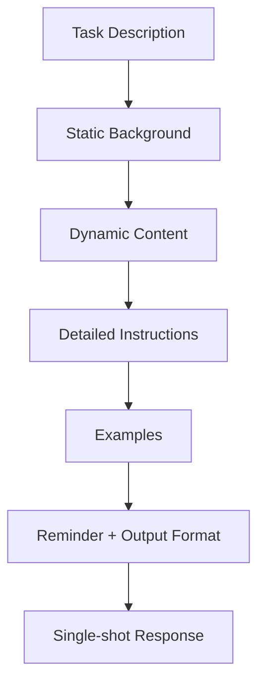

Anthropic의 `Prompting 101` 영상은 프롬프트를 “예쁘게 쓰는 문장 기술”로 설명하지 않는다.

핵심은 오히려 반대다.  
**좋은 프롬프트는 문장력이 아니라 구조**라는 것이다.

특히 API 기반 애플리케이션에서는 대화를 여러 번 주고받기보다,  
한 번의 메시지로 처음부터 맞는 답을 받는 `single-shot` 설계가 중요하다는 점을 아주 실전적으로 보여 준다.

<!--more-->

## Sources

- YouTube: <https://www.youtube.com/watch?v=ysPbXH0LpIE>
- Anthropic Prompting docs: <https://docs.anthropic.com/en/docs/build-with-claude/prompt-engineering/overview>
- Anthropic Console: <https://console.anthropic.com/>

## 1. Prompting 101이 실제로 가르치는 건 “말 잘하기”가 아니라 “작업 설계”다

영상 초반에서 Anthropic 팀은 prompt engineering을 이렇게 설명한다.

- clear instructions
- give the model the context it needs
- arrange information in the best way

이 정의가 중요하다.

많은 사람이 프롬프트를:

- 멋진 한 문장
- 비밀 프롬프트
- 창의적인 주문

처럼 생각하지만, Anthropic은 이를 **작업 설계 문서**에 더 가깝게 본다.

즉 질문을 잘하는 것보다:

- 모델이 무슨 역할인지
- 어떤 데이터를 보는지
- 어떤 순서로 판단해야 하는지
- 어떤 형식으로 답해야 하는지

를 구조적으로 설계하는 게 중요하다는 뜻이다.

## 2. 영상이 강조하는 첫 번째 원칙: single-shot task에서는 프롬프트 구조가 더 중요해진다

영상은 챗봇식 대화와 API 태스크를 구분한다.

### 챗봇형

- 몇 번이고 왕복하면서 수정 가능

### 애플리케이션형

- 한 번의 메시지로
- 처음부터 정확한 결과를 얻어야 함

보험사 사고 판정 예시는 바로 이 후자다.

즉 사용자는 길게 대화를 이어가며 정정할 수 없다.  
그래서 프롬프트가 처음부터:

- 역할
- 배경
- 자료
- 절차
- 출력 포맷

을 다 갖춰야 한다.

이건 에이전트 하네스나 백엔드 프롬프트 설계에서도 그대로 적용된다.

## 3. Anthropic이 제시한 기본 뼈대는 5단계다

영상은 좋은 prompt structure를 대략 다음처럼 설명한다.

1. task description  
2. content  
3. detailed instructions  
4. examples  
5. reminder / final emphasis

이 흐름이 좋은 이유는 모델이 정보를 읽는 순서를 통제할 수 있기 때문이다.

### Task Description

“너는 오늘 무엇을 하러 왔는가?”

### Content

실제로 분석할 이미지/문서/데이터

### Detailed Instructions

어떤 절차로 판단할지

### Examples

어려운 케이스를 어떻게 처리할지

### Reminder

환각 금지, 근거 확인, 출력 형식 등 마지막 제약

즉 프롬프트는 감성적 설득이 아니라,  
**입력 순서와 판단 절차를 정렬하는 컨테이너**다.

## 4. 첫 번째 개선은 “상황을 설명하는 것”만으로도 크게 일어난다

영상의 데모는 아주 재밌다.

스웨덴어 차량 사고 보고서와 손그림 스케치를 그냥 던졌을 때 Claude는 처음에 이를 스키 사고처럼 오해한다.

왜냐하면:

- 무슨 도메인인지
- 어떤 종류의 폼인지
- 무엇을 판단해야 하는지

가 안 주어졌기 때문이다.

하지만 두 번째 버전에서:

- 자동차 보험 사고라는 점
- 인간 클레임 조정사를 돕는 역할이라는 점
- 확신 없으면 판단하지 말라는 점

을 넣자, 모델은 적어도 **차량 사고 문맥**으로 해석하기 시작한다.

이 장면이 중요한 이유는, 모델이 멍청해서 실수한 게 아니라  
**우리가 상황을 충분히 안 줘서 추정으로 메웠다**는 걸 보여 주기 때문이다.

## 5. 두 번째 개선은 static context를 system prompt로 올리는 것이다

영상에서 가장 실무적인 팁 중 하나는 이것이다.

폼의 구조처럼 **항상 바뀌지 않는 정보**는 system prompt 쪽에 올려라.

예를 들면:

- 이 폼은 항상 같은 레이아웃이다
- 두 개의 컬럼은 vehicle A / B를 뜻한다
- 17개 체크박스는 각각 어떤 의미를 가진다
- 사람들은 X 대신 동그라미, 낙서, 애매한 표시를 할 수 있다

이런 정보는 매 요청마다 새로 추론하게 하지 말고,  
미리 알려 주는 편이 낫다.

이건 RAG나 prompt caching과도 잘 연결된다.

즉 `dynamic input`과 `static background knowledge`를 분리하면:

- 모델의 해석 비용이 줄고
- 입력 이해 정확도가 올라가고
- 응답도 더 안정된다

## 6. 영상이 계속 강조하는 건 “Claude loves structure”다

Anthropic 팀은 중간에 아주 분명히 말한다.

Claude는 구조를 좋아한다.

그래서 추천하는 도구가:

- XML tags
- Markdown sections
- 명시적 구획

이다.

이건 단순 미관 문제가 아니다.

예를 들어:

- `<task_context>`
- `<background>`
- `<examples>`
- `<important_guidelines>`

처럼 구획이 나뉘면, 모델은 어떤 정보가 어떤 역할인지 더 잘 추적한다.

즉 구분자는 사람이 보기 좋으라고 넣는 게 아니라,  
**모델이 문맥의 계층을 읽기 쉽게 하려고 넣는 것**이다.

## 7. 세 번째 개선은 “판단 순서”를 지정하는 것이다

영상에서 가장 중요한 부분 중 하나는 detailed instructions 단계다.

보험 사례에서는 판단 순서가 핵심이었다.

Anthropic 팀이 제안한 흐름은 대략 이렇다.

1. 먼저 폼을 읽어라  
2. 어떤 체크박스가 표시됐는지 확인해라  
3. 그 사실을 바탕으로 스케치를 해석해라  
4. 마지막에 책임 판단을 내려라

이게 중요한 이유는, 모델이 자유롭게 판단 순서를 정하게 두면  
그림 같은 애매한 데이터부터 읽고 추정을 시작할 수 있기 때문이다.

즉 좋은 프롬프트는 정보만 주는 게 아니라  
**어떤 순서로 추론해야 하는지까지 준다.**

이건 코드 리뷰, 버그 트리아주, 로그 분석 같은 작업에도 그대로 적용된다.

## 8. Examples와 conversation history는 “정답 기억”이 아니라 “판단 습관 주입”이다

영상 후반은 examples와 conversation history도 언급한다.

특히 examples는:

- 어려운 사례
- 자주 틀리는 회색지대
- 인간이 이미 올바르게 레이블한 케이스

를 system prompt 안에 few-shot처럼 넣을 수 있다고 설명한다.

핵심은 단순 예시가 아니라:

- 어떤 데이터를 받고
- 어떤 reasoning을 통해
- 어떤 output을 내는지

를 패턴으로 주입하는 것이다.

즉 examples는 모델에게 답을 외우게 하기보다  
**판단 습관을 시연하는 장치**에 가깝다.

## 9. 마지막 개선은 출력 형식을 미리 닫는 것이다

영상의 마지막 포인트는 output formatting이다.

애플리케이션 관점에서는 이게 매우 중요하다.

인간 입장에서는 설명이 길어도 괜찮지만,

- DB에 저장하려면
- 후속 시스템이 파싱하려면
- 대시보드에 쓰려면

결과가 구조화되어야 한다.

그래서 Anthropic 팀은:

- XML tags
- prefilling
- JSON-like 시작 토큰

같은 방식으로 출력을 닫는 방법을 설명한다.

즉 좋은 프롬프트는 “잘 생각해 줘”에서 끝나지 않고,  
**답을 어디에 써먹을지까지 고려해서 형식을 강제**한다.

## 10. 이 영상이 진짜로 말하는 핵심

이 전체 데모를 한 문장으로 요약하면 이렇다.

모델은 추론을 대신해 주지만,  
**무엇을 먼저 보고 어떤 순서로 판단하며 어떤 형식으로 결론을 내릴지는 여전히 사람이 설계해야 한다.**

즉 Prompting 101은 “프롬프트 장인 되기”가 아니라:

- 상황을 명확히 주고
- 바뀌지 않는 배경은 system prompt로 옮기고
- 추론 순서를 설계하고
- 예시로 경계 사례를 보강하고
- 출력 포맷까지 닫으라

는 매우 실무적인 메시지다.

## 11. 결론

Anthropic의 Prompting 101이 좋은 이유는 프롬프트를 신비화하지 않기 때문이다.

핵심은 결국 구조다.

- task
- content
- instructions
- examples
- reminders
- output format

을 나누고, 그 안에서 모델이 추정해야 할 부분을 줄이는 것.

즉 좋은 프롬프트는 화려한 문장이 아니라,  
**모델이 처음부터 일을 제대로 하게 만드는 작업 설계 문서**다.
