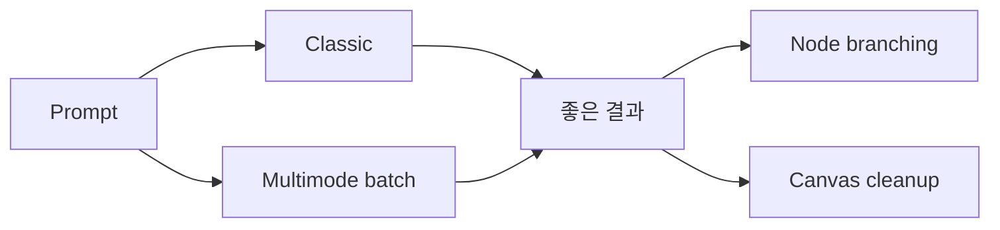
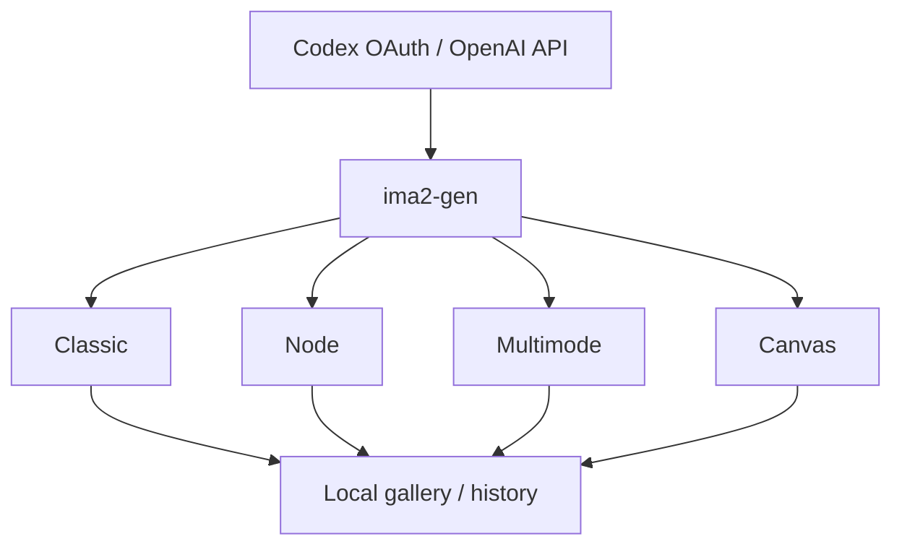

`ima2-gen`을 한 줄로 설명하면 README 표현 그대로다.

**ChatGPT/Codex 이미지 워크플로를 작은 데스크톱형 웹앱으로 옮긴 로컬 이미지 생성 스튜디오**

이 프로젝트가 흥미로운 이유는 이미지 생성 모델 하나를 감싸는 CLI에 머물지 않고,  
**히스토리·브랜칭·배치·캔버스 편집까지 묶은 작업 환경**으로 확장하려 하기 때문이다.

<!--more-->

## Sources

- GitHub: <https://github.com/lidge-jun/ima2-gen>
- README: <https://raw.githubusercontent.com/lidge-jun/ima2-gen/main/README.md>
- Live site: <https://lidge-jun.github.io/ima2-gen/>

## 1. ima2-gen의 본질은 “모델 호출기”보다 “작은 이미지 작업실”이다

README가 스스로를 설명하는 문장이 좋다.

> a local image generation studio for people who want the ChatGPT/Codex image workflow in a small desktop-like web app

즉 이 프로젝트는:

- 프롬프트 한 줄 보내기
- 결과 이미지 한 장 받기

에서 끝나지 않는다.

대신 사용자가 실제로 필요한 작업 흐름을 의식한다.

- 이전 결과를 다시 이어가기
- 여러 후보를 병렬로 뽑기
- 브랜치 분기하기
- 캔버스에서 마무리 편집하기
- 히스토리를 로컬에 보존하기

즉 “generate API wrapper”가 아니라  
**로컬 이미지 생성 워크벤치**에 더 가깝다.

## 2. 이 프로젝트의 가장 독특한 부분은 provider 경로를 둘로 나눈 점이다

README는 image generation 경로를 두 가지로 설명한다.

- `provider: "oauth"` → local Codex/ChatGPT OAuth proxy
- `provider: "api"` → OpenAI Responses API + hosted image_generation tool

이 구조가 중요한 이유는 사용자가 두 가지 서로 다른 운영 방식을 고를 수 있기 때문이다.

### OAuth 경로

- 로컬에서 빠르게 실험
- 기본값으로 쓰기 쉬움
- API 키를 따로 다루지 않는 흐름

### API 경로

- OpenAI API key 기반
- classic generate / edit / mask-guided edit / multimode / node generation
- 세부 옵션을 더 명시적으로 제어

즉 `ima2-gen`은 단순히 “무료 경로”만 파는 게 아니라,  
**실험용 로컬 OAuth 하네스와 정식 API 경로를 모두 품은 이중 백엔드 스튜디오**다.

## 3. Quick Start가 단순한 이유도 중요하다

README의 첫 시작은 매우 짧다.

```bash
npx ima2-gen serve
```

그리고 Codex 로그인만 되어 있으면 바로 웹 UI가 뜬다.

이 단순함이 의미 있는 이유는, 이미지 생성 툴이 자주 실패하는 이유가 모델 성능이 아니라 **설치 마찰**이기 때문이다.

사용자는 보통:

- 복잡한 API 설정
- 키 관리
- 별도 대시보드
- 빌드 파이프라인

없이 바로 써 보고 싶어 한다.

`ima2-gen`은 그 첫 접점을 최대한 얇게 만든다.

즉 이미지 생성 도구를 “API 제품”보다  
**로컬에서 바로 열리는 앱**처럼 느끼게 한다.

## 4. Classic / Node / Multimode / Canvas라는 4분해가 꽤 좋다

README를 읽으면 이 프로젝트가 어떤 사용자 행동을 상정하는지 드러난다.

### Classic Mode

한 번의 프롬프트로 빠르게 하나의 강한 결과를 얻고 싶을 때.

### Node Mode

좋은 이미지 하나를 출발점으로 여러 방향으로 분기하고 싶을 때.

### Multimode Batches

같은 프롬프트에서 여러 후보를 병렬 생성하고 비교할 때.

### Canvas Mode

거의 맞는 이미지 위에:

- annotation
- erase
- cleanup
- alpha export

같은 후처리를 할 때.

이 4분해가 중요한 이유는 이미지 생성 실무가 실제로:

- 생성
- 비교
- 분기
- 후편집

의 반복이기 때문이다.

즉 `ima2-gen`은 모델을 쓰는 순간보다  
**모델을 쓴 뒤에 사용자가 하는 다음 행동**을 더 잘 의식하고 있다.



## 5. Node Mode가 있다는 건 “이미지 생성 = 그래프 탐색”으로 본다는 뜻이다

README의 Node Mode 설명은 꽤 인상적이다.

각 node는:

- 자기만의 prompt
- 자기만의 result

를 갖고, child node는 parent image를 source로 삼는다.

이건 중요하다.

이미지 생성은 종종 한 번에 정답을 얻는 행위가 아니라:

- 좋은 시드 하나를 찾고
- 여러 방향으로 분기하고
- 가장 가능성 있는 가지를 계속 키우는

탐색 과정이기 때문이다.

즉 Node Mode는 이미지 생성을 “한 장 뽑기”가 아니라  
**branchable search tree**로 보는 UX다.

## 6. Canvas Mode가 붙으면서 이 도구는 생성기보다 편집기 쪽으로 더 가까워진다

많은 생성 도구는 결과를 뽑고 나면 끝난다.

하지만 `ima2-gen`은:

- zoom / pan
- annotation
- eraser
- multiselect
- sticky notes
- background cleanup
- alpha / matte export

까지 제공한다.

즉 모델의 출력이 조금만 아쉬워도 다시 전체 프롬프트를 돌리는 게 아니라,  
**가까운 결과를 다듬어 다음 반복으로 넘길 수 있게** 만든다.

이건 실제 작업에서 굉장히 중요하다.

좋은 이미지 생성 워크플로는 새로 만드는 것보다  
**거의 맞는 결과를 더 싸게 수정하는 능력**에 좌우될 때가 많기 때문이다.

## 7. Prompt Library import도 이 프로젝트가 단순 앱이 아니라는 신호다

README는 prompt library import를 꽤 비중 있게 다룬다.

가져올 수 있는 소스가:

- local files
- GitHub folders
- curated sources
- GPT-image hint packs

까지 열려 있다.

이건 단순 편의 기능처럼 보이지만, 실제로는 지식 운영 기능에 가깝다.

즉 이미지를 잘 뽑는 경험이:

- 개별 세션의 일회성 성공

이 아니라

- 재사용 가능한 프롬프트 자산

으로 축적되도록 설계한 것이다.

이렇게 되면 `ima2-gen`은 생성 앱이 아니라  
**프롬프트 자산을 쌓는 이미지 작업 환경**이 된다.

## 8. CLI와 Web UI를 둘 다 끝까지 챙긴 점도 좋다

프로젝트 이름만 보면 CLI 같지만, 실제로는 Web UI가 중심이고 CLI도 꽤 깊다.

예를 들면:

- `ima2 gen`
- `ima2 edit`
- `ima2 multimode`
- `ima2 ls`
- `ima2 show`
- `ima2 prompt ls`

등이 다 있다.

이건 사용자 층을 넓힌다.

### Web UI가 좋은 경우

- 이미지를 보고 비교해야 할 때
- Canvas로 직접 손봐야 할 때

### CLI가 좋은 경우

- 배치 실행
- 자동화
- 빠른 반복
- 서버/스크립트 연동

즉 `ima2-gen`은 시각 작업 도구이면서도,  
**자동화 가능한 이미지 파이프라인의 일부**로도 설계돼 있다.

## 9. 이 프로젝트를 가장 잘 설명하는 표현은 “OpenAI image harness”다

README에는 이런 말들이 계속 나온다.

- local image generation studio
- Codex OAuth
- OpenAI-compatible workflow
- desktop-like web app

그래서 이 프로젝트의 본질은 모델 자체보다,  
**이미지 생성 모델을 어떻게 다루게 해 주느냐**에 있다.

즉 `ima2-gen`은 이미지 모델이 아니라  
**OpenAI 계열 이미지 생성 백엔드를 위한 작업 하네스**라고 보는 편이 더 정확하다.



## 10. 최신 저장소 기준 메타데이터

GitHub 기준 현재 확인한 저장소 정보는 다음과 같다.

- 저장소: `lidge-jun/ima2-gen`
- 설명: `Minimal CLI + web UI for OpenAI GPT Image 2 generation...`
- stars: `179`
- forks: `29`
- 기본 브랜치: `main`
- 주 언어: `TypeScript`

라이선스는 주의가 필요하다.

- GitHub API 응답에서는 `null`
- README 배지에는 `MIT`

즉 실제 사용 전에는 저장소의 `LICENSE` 파일을 직접 확인하는 편이 안전하다.

## 11. 결론

`ima2-gen`이 흥미로운 이유는 GPT Image 2를 단순 호출하게 해 주는 도구가 아니라,  
**생성 → 비교 → 분기 → 후편집 → 기록**이라는 실제 이미지 작업 루프를 작은 로컬 스튜디오로 묶어 준다는 데 있다.

특히:

- OAuth와 API 두 경로를 동시에 제공하고
- Node branching으로 탐색성을 주고
- Canvas로 후편집을 붙이고
- Prompt library로 지식을 축적한다는 점

이 결합되면서, `ima2-gen`은 단순 CLI보다 훨씬 큰 의미를 가진다.

즉 이 프로젝트의 본질은 “이미지 생성기”가 아니라  
**OpenAI 이미지 워크플로를 데스크톱형 작업실로 바꾸는 하네스**다.
