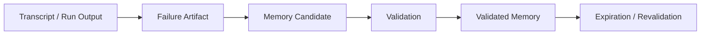
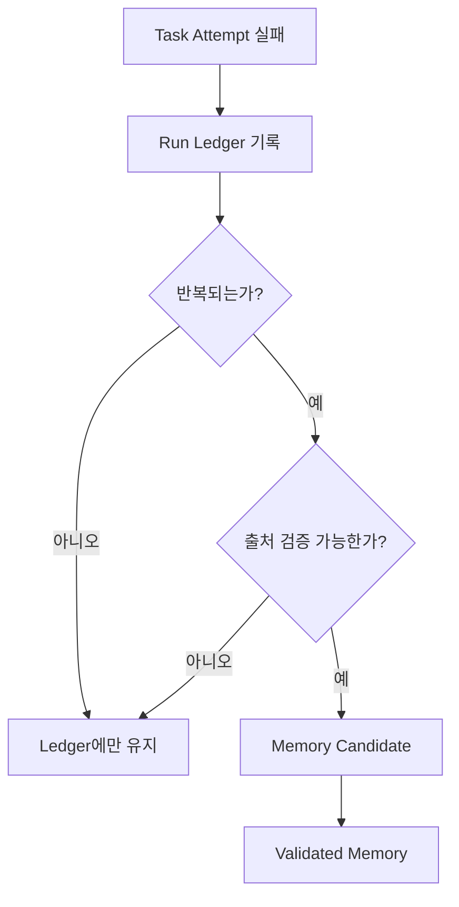

AI 에이전트에서 `memory`는 가장 쉽게 과장되는 기능 중 하나다.

모든 대화와 실패를 다 기억시키면 더 똑똑해질 것 같지만, 실제로는 반대일 때가 많다.  
오래된 가정과 일회성 실패가 다음 작업을 오염시키기 때문이다.

그래서 중요한 건 “많은 기억”이 아니라  
**실패는 먼저 Run Ledger에 남기고, 반복 가능하고 검증된 사실만 Memory로 승격하는 절차**다.

<!--more-->

## Sources

- Moonshot Notes: <https://moonshotnotes.com/posts/coding-agent-runtime-04-ai-memory-run-ledger/>
- GitHub Copilot Memory docs: <https://docs.github.com/en/copilot/how-tos/context/copilot-memories>
- Claude Code memory docs: <https://docs.anthropic.com/en/docs/claude-code/memory>

## 1. RAG와 Memory는 목적부터 다르다

Moonshot Notes 글의 가장 중요한 문장은 이 구분이다.

- RAG는 외부 지식을 검색하는 계층
- Memory는 검증된 반복 지식을 다음 작업에 넘기는 계층

예를 들어:

### RAG에 가까운 것

- API 문서 검색
- README 검색
- 이전 PR 검색
- 이슈 검색

### Memory 후보에 가까운 것

- 이 저장소는 `pnpm`만 사용한다
- integration test 전에 `db:prepare`를 실행해야 한다
- billing 모듈 수정 시 contract test도 같이 바꿔야 한다
- `src/lib/db.ts`를 거치지 않는 DB 접근은 금지한다

즉 RAG는 지금 당장 필요한 외부 지식을 끌어오는 것이고,  
Memory는 **작업을 하면서 확인된 반복 지식**을 다음 턴과 다음 작업으로 넘기는 것이다.

## 2. Memory를 제대로 설계하려면 계층을 나눠야 한다

이 글이 좋은 이유는 “기억”이라는 단어를 한 덩어리로 보지 않기 때문이다.

구분해야 하는 대상은 최소한 이 정도다.

- Transcript
- Failure Artifact
- Memory Candidate
- Validated Memory

이걸 섞어 버리면 모든 실패가 곧바로 장기 기억이 되고,  
결국 에이전트는 오래된 실패와 우연한 조건에 끌려다니게 된다.

즉 중요한 건 저장량이 아니라 **승격 절차**다.

## 3. GitHub Copilot Memory가 보여 주는 핵심 원칙 3가지

Moonshot Notes는 GitHub Copilot Memory 문서를 예로 들며 세 가지 원칙을 뽑아낸다.

1. Memory에는 출처가 있어야 한다  
2. 현재 코드베이스에서 검증되어야 한다  
3. 오래된 memory는 만료되어야 한다

이건 매우 중요하다.

좋은 memory는 단순 문장이 아니라:

- Fact
- Source
- Scope
- Validated At
- Expiration

을 가져야 한다.

즉 “아까 테스트가 실패했다”는 건 memory가 아니다.  
그건 transcript이거나 run ledger entry다.

반대로 “integration test 실행 전 `pnpm db:prepare`가 필요하다”는 사실은:

- package.json
- docs
- CI workflow

로 검증되었다면 장기 기억 후보가 된다.

## 4. Claude Code memory가 보여 주는 건 `instruction`과 `memory`의 분리다

Moonshot Notes는 Claude Code memory 문서도 함께 끌어온다.

여기서 중요한 구분은 다음이다.

- `CLAUDE.md` = 사람이 쓰는 instruction / workflow / rule
- Auto memory = 에이전트가 작업 중 배운 패턴
- Permission policy = 실제 차단과 승인

이 구분이 중요한 이유는 memory를 enforcement와 섞으면 안 되기 때문이다.

예를 들어:

- `CLAUDE.md`에 “secret을 읽지 마라”라고 적는 건 instruction
- 실제 secret 접근 차단은 permission layer가 해야 한다

즉 memory는 어디까지나 **context**다.  
정책 집행 레이어가 아니다.

이 원칙은 많은 agent runtime 설계에서 자주 흐려진다.

## 5. 장기 기억이 어려운 이유는 단순 저장 문제가 아니라 시간성 때문이다

글은 LoCoMo 같은 장기 기억 연구도 함께 끌어온다.

핵심 메시지는 이것이다.

장기 기억은 단순한 저장소가 아니라:

- temporal reasoning
- causal reasoning
- multi-hop reasoning

과 얽혀 있다.

코딩 에이전트에서도 마찬가지다.

예전에는 맞았던 기억이 지금은 틀릴 수 있다.

- 예전에는 npm을 썼지만 지금은 pnpm이다
- 예전 테스트 명령은 더 이상 유효하지 않다
- 예전 DB 경로는 리팩터링으로 사라졌다

그래서 memory 시스템의 핵심은 많이 저장하는 것이 아니라,  
**적게 저장하되 계속 검증하는 것**이다.

## 6. 실패는 goal이 아니라 task attempt 단위로 남겨야 한다

이 글에서 가장 실무적인 부분은 `실패 산출물 단위`를 다루는 대목이다.

실패는 보통 goal 전체에서 일어나지 않는다.

- Goal: checkout flow 개선
- Task: payment client 교체
- Attempt: 특정 구현을 시도했다가 실패

즉 실패를 기록하는 적절한 크기는:

- Agent Turn보다 크고
- Goal보다 작고
- 검토 가능한 단위

여야 한다.

이걸 Moonshot Notes는 `Task Attempt`라고 정리한다.

너무 작으면 노이즈가 많고,  
너무 크면 원인을 잃는다.

## 7. 그래서 Run Ledger가 필요하다

글이 제안하는 기본 구조는 `Run Ledger`다.

Run Ledger는 장기 기억이 아니라 **작업 실행 기록**이다.

예시 구조는 대략 이렇다.

- task_id
- attempt_id
- input
- action
- result
- evidence
- diagnosis
- next_action
- memory_decision

여기서 중요한 건 마지막 필드다.

`memory_decision: 보류`

즉 한 번의 실패는 그냥 memory로 승격하지 않는다.  
먼저 ledger에 남기고, 나중에 반복성과 검증이 확인되면 그때 memory 후보가 된다.

이 구조 덕분에 에이전트는:

- 실패를 잊지 않으면서도
- 실패를 곧바로 진리로 오해하지 않을 수 있다

## 8. 이 설계가 좋은 이유는 “실패를 보존하되 오염은 막는다”는 점이다

대부분의 memory 설계는 둘 중 하나로 치우친다.

### 아무것도 안 남기는 경우

- 같은 실패를 반복한다
- 배운 게 축적되지 않는다

### 모든 걸 남기는 경우

- 오래된 실패가 현재를 오염시킨다
- 일회성 사건이 규칙처럼 굳어진다

Run Ledger + promotion 모델은 이 둘의 중간을 잡는다.

- 실패는 버리지 않는다
- 하지만 ledger에 둔다
- 검증되기 전까지는 memory가 아니다

즉 기억 시스템을 “보관소”가 아니라  
**승격 파이프라인**으로 본다.

## 9. 이 글의 진짜 결론은 “Memory는 저장소가 아니라 정책”이라는 점이다

Moonshot Notes 글을 읽고 나면 핵심이 선명해진다.

Memory 시스템의 차별점은 벡터 DB나 저장 매체가 아니다.

진짜 차이는:

- 무엇을 transcript로 볼지
- 무엇을 failure artifact로 남길지
- 무엇을 memory candidate로 올릴지
- 무엇을 validated memory로 승인할지
- 언제 만료하고 재검증할지

를 정하는 정책에 있다.

즉 Memory는 기술보다 **운영 규칙**에 가깝다.

## 10. 결론

“AI Memory는 RAG가 아니다”라는 제목은 과장이 아니다.

RAG는 지금 필요한 지식을 가져오는 계층이고,  
Memory는 반복해서 써야 할 검증된 지식을 유지하는 계층이다.

그리고 그 사이에는 반드시:

- Transcript
- Failure Artifact
- Run Ledger
- Validation
- Expiration

이 있어야 한다.

결국 좋은 memory 시스템은 많이 기억하는 시스템이 아니라,  
**실패를 ledger에 남기고 검증된 사실만 승격시키는 시스템**이다.
