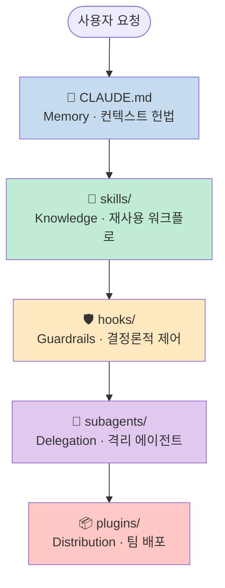
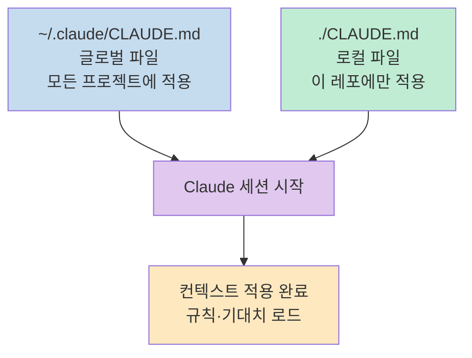
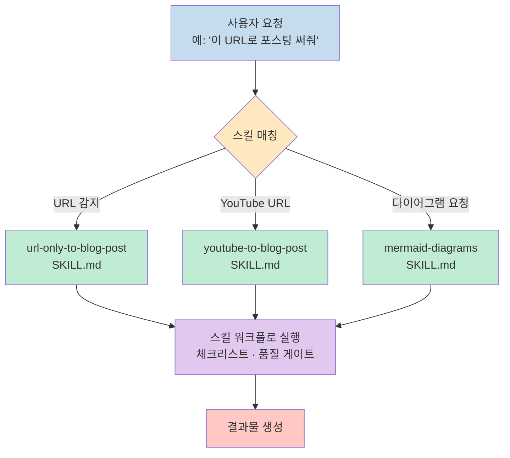
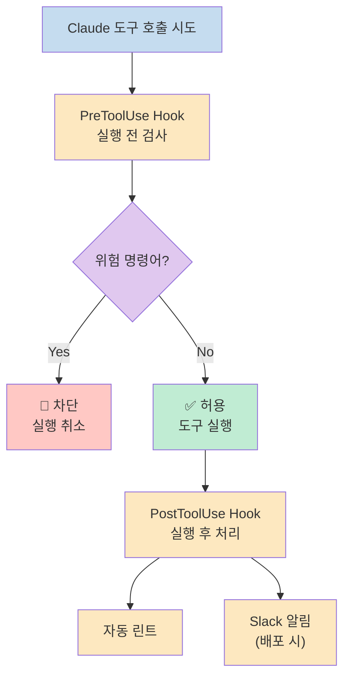
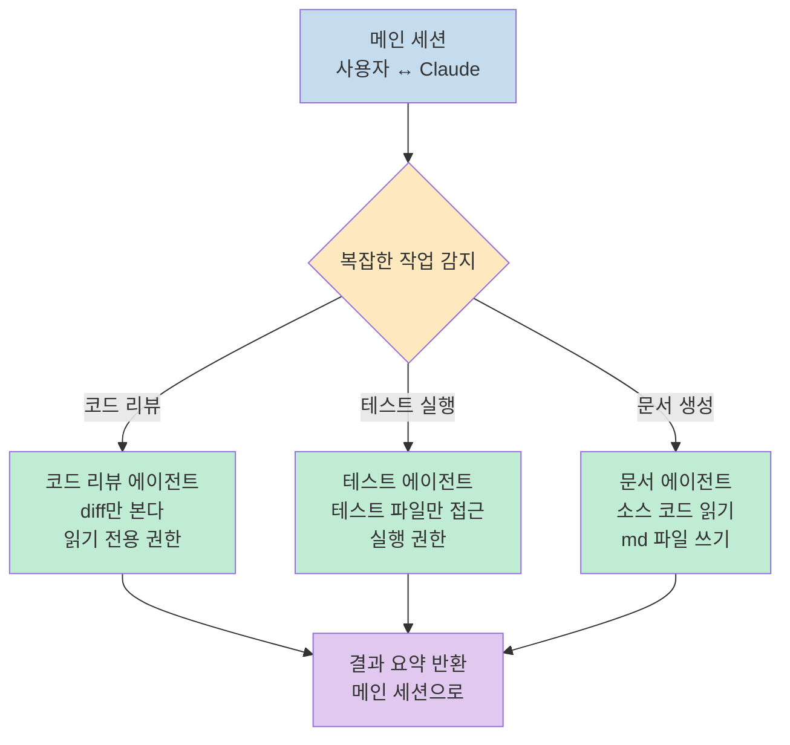
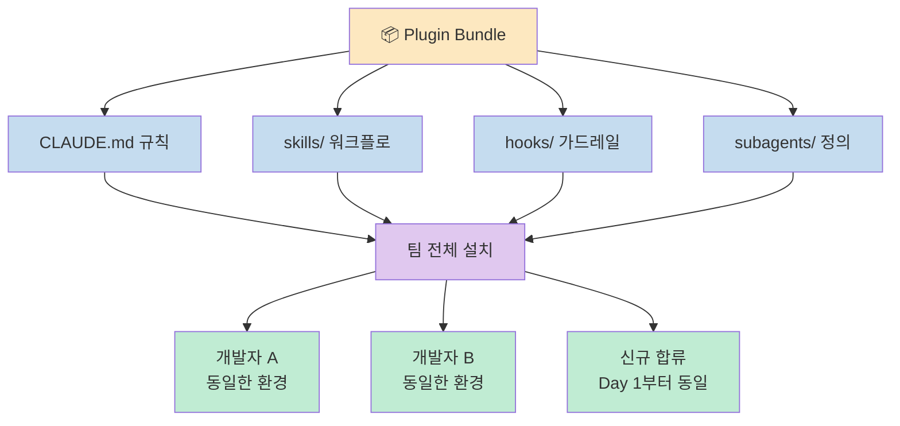
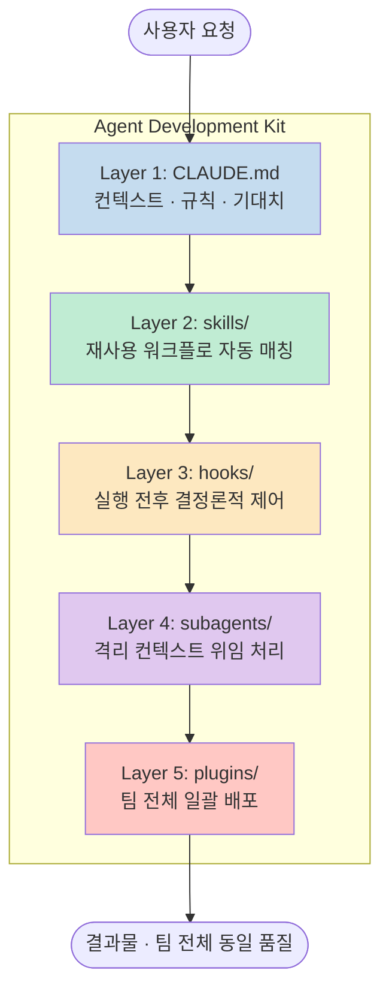

Claude Code를 혼자 쓰면 강력한 어시스턴트다. 
5개 폴더를 갖추면 개발팀이 된다.

이 글은 **Agent Development Kit(ADK)** — Claude Code를 팀 수준으로 끌어올리는 5계층 구조를 해설한다.

<!--more-->

## 왜 5개 레이어인가

AI 코딩 도구 대부분은 "대화"로 끝난다. 요청 → 응답 → 끝. 컨텍스트는 세션마다 초기화되고, 팀원끼리 같은 환경을 공유할 방법이 없다.

ADK는 이 문제를 구조로 푼다. 각 레이어가 서로 다른 책임을 맡고, 합쳐지면 일관된 개발 환경이 만들어진다.

---

## Layer 1. CLAUDE.md — Memory

> Your repo's constitution. Naming rules, structure, expectations. 
> One global file for all projects, one local file per repo.

**CLAUDE.md** 는 Claude가 세션을 시작할 때 가장 먼저 읽는 파일이다. 팀의 코딩 컨벤션, 금지 명령어, 디렉터리 구조, 배포 규칙이 여기에 담긴다.

두 단계로 운용한다.

글로벌 파일에는 모든 프로젝트에 공통으로 적용할 원칙(페르소나, 언어 감지, 금지 표현 등)을 넣는다. 
로컬 파일에는 이 레포 특화 규칙(빌드 커맨드, 카테고리 제한, 파일 네이밍 등)을 넣는다.

**CLAUDE.md가 없으면** Claude는 매 세션마다 같은 질문을 반복하고, 팀마다 다른 결과를 낸다.

---

## Layer 2. skills/ — Knowledge

> Reusable workflows Claude auto-invokes by matching the task description. 
> No slash commands. It just knows.

**스킬** 은 재사용 가능한 워크플로 명세다. Claude는 사용자의 요청을 읽고, 매칭되는 스킬을 자동으로 불러와 실행한다. 슬래시 커맨드를 외울 필요가 없다.

좋은 스킬은 세 가지를 포함한다.
1. **트리거 조건** — 어떤 상황에서 이 스킬을 쓸지
2. **단계별 워크플로** — 순서가 명확한 체크리스트
3. **품질 게이트** — 완료 전 검증 기준

스킬이 없으면 Claude는 매번 맥락 없이 즉흥적으로 판단한다. 팀원마다 결과가 달라진다.

---

## Layer 3. hooks/ — Guardrails

> Shell scripts that run before and after every tool call. 
> Block dangerous commands. Auto-lint on save. Ping Slack on deploy. 
> Deterministic. Not AI.

**훅** 은 AI가 아니다. 도구 호출 전후에 실행되는 쉘 스크립트다. Claude가 파일을 쓰기 전, 명령어를 실행하기 전 — 훅이 먼저 동작한다.

실제 활용 예시:
- `rm -rf /` 같은 파괴적 명령어 차단
- 파일 저장 시 자동 prettier 실행
- `git push` 후 Slack 채널에 배포 알림
- 커밋 전 테스트 통과 확인

훅의 핵심은 **결정론적** 이라는 점이다. AI가 판단하는 게 아니라 규칙이 실행된다. "이번엔 잊어버리지 않겠지"가 아니라 "물리적으로 불가능하다"가 된다.

---

## Layer 4. subagents/ — Delegation

> Isolated agents with their own context window. 
> A code reviewer that only sees the diff. A test runner with custom permissions. 
> Keeps your main session clean.

**서브에이전트** 는 격리된 컨텍스트 윈도우를 가진 독립 에이전트다. 메인 세션의 컨텍스트를 오염시키지 않고 특정 작업을 위임할 수 있다.

서브에이전트가 중요한 이유:
- **컨텍스트 격리** — 메인 세션이 100k 토큰으로 오염되지 않는다
- **권한 분리** — 각 에이전트가 필요한 권한만 갖는다
- **병렬 실행** — 독립적인 작업을 동시에 처리한다
- **전문화** — 코드 리뷰어는 diff만, 테스트 러너는 테스트만 본다

---

## Layer 5. plugins/ — Distribution

> Bundle the whole system into one install. 
> Every teammate gets the same skills, same hooks, same agents. 
> Aligned from day one.

**플러그인** 은 위의 4개 레이어를 하나로 묶어 배포하는 단위다. 팀에 새 멤버가 합류하면 플러그인 하나를 설치하는 것으로 같은 환경을 갖는다.

플러그인이 없으면 팀원마다 다른 CLAUDE.md를 쓰고, 다른 스킬을 갖고, 다른 결과를 낸다. "Claude가 내 팀원 것은 되는데 내 것은 안 돼" 같은 상황이 생긴다.

---

## 전체 시스템: 5계층이 합쳐지면

각 레이어가 하는 일을 한 줄로 정리하면:

| 레이어 | 폴더 | 역할 | 성격 |
|--------|------|------|------|
| 1 | `CLAUDE.md` | 기억 · 컨텍스트 헌법 | 정적 |
| 2 | `skills/` | 지식 · 워크플로 자동 실행 | AI |
| 3 | `hooks/` | 가드레일 · 결정론적 제어 | 결정론적 |
| 4 | `subagents/` | 위임 · 격리 에이전트 | AI |
| 5 | `plugins/` | 배포 · 팀 정렬 | 정적 |

---

## 마치며

Claude Code는 도구다. ADK는 그 도구를 조직으로 만드는 구조다.

5개 폴더. 그게 전부다. 
갖추고 나면 Claude는 질문에 답하는 챗봇이 아니라 — 규칙을 기억하고, 워크플로를 실행하고, 위험을 차단하고, 작업을 위임하고, 팀 전체에 일관성을 제공하는 시스템이 된다.

시작점은 간단하다: `CLAUDE.md` 하나를 써라. 나머지 레이어는 필요가 생길 때 추가하면 된다.
