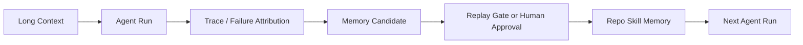
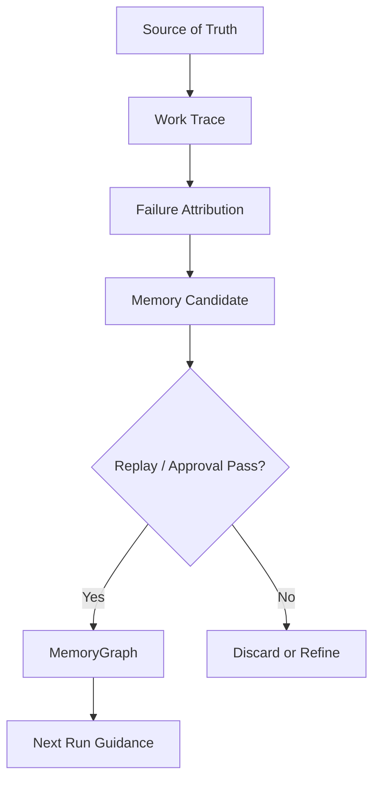

AI 코딩 에이전트는 늘 같은 약점을 드러낸다.

- 어제 실패한 실수를 오늘 다시 반복하고
- 지난 실행에서 확인한 레포 규칙을 또 잊고
- 이미 겪은 verifier 실패를 매번 새로 추론한다

그래서 문제는 “컨텍스트를 더 많이 넣을까?”가 아니다.  
진짜 문제는 **긴 문맥에서 다음 실행에 재사용할 규칙을 어떻게 뽑아낼까**다.

Moonshot Notes의 이번 글이 흥미로운 이유는 바로 이 지점을 `Ctx2Skill` 논문과 연결하기 때문이다.  
핵심은 문맥을 더 길게 주는 것이 아니라, **문맥에서 규칙과 절차를 추출해 Repo Skill Memory로 바꾸는 것**이다.

<!--more-->

## Sources

- Moonshot Notes: <https://moonshotnotes.com/posts/ctx2skill-harness-01-operating-memory/>
- arXiv: <https://arxiv.org/abs/2604.27660>

## 1. Ctx2Skill의 핵심은 “문맥을 다시 읽지 말고 스킬로 바꾸자”는 데 있다

`Ctx2Skill`은 긴 문맥을 그냥 매번 다시 읽게 하지 말고,  
그 안에서 반복 가능한 **규칙과 절차**를 자연어 skill로 추출하자는 접근이다.

예를 들어 긴 기술 문서를 그대로 넣는 방식은:

- 비용이 크고
- 노이즈가 많고
- 반복 작업에서 비효율적이다

반면 skill extraction은:

- 다음 실행에 필요한 규칙만 남기고
- 작업 절차를 더 짧은 형태로 재사용하게 만든다

즉 이 논문의 포인트는 “더 긴 context”가 아니라  
**inference-time skill augmentation**에 가깝다.

## 2. 개발 하네스에서는 이 skill이 요약문이 아니라 실행 규칙이 된다

여기서 Moonshot Notes가 중요한 해석을 붙인다.

일반적인 skill은 “이 문서는 이런 내용을 말한다” 정도의 요약에 가깝다.  
하지만 개발 하네스용 skill은 다음 실행의 행동을 바꾸는 규칙이어야 한다.

예를 들면:

- public API를 바꾸면 contract artifact도 같이 갱신한다
- 호환성 관련 수정이면 old path / new path를 나눠 각각 검증한다
- flaky failure와 real mismatch를 같은 버킷에 넣지 않는다

즉 개발 하네스에서 skill은 단순 요약이 아니라:

- 실행 의무
- 검증 절차
- 산출물 갱신 조건
- 실패 기록 기준

까지 포함한 **작업 계약**이 된다.

## 3. 그래서 핵심 질문은 “실패를 덜 반복하게 만들 수 있나”로 바뀐다

Moonshot Notes는 Ctx2Skill을 개발 하네스로 옮기면서 질문을 바꾼다.

> 에이전트가 지난 실행에서 겪은 실패를 다음 실행에서 실제로 덜 반복하게 만들 수 있을까?

이 질문이 중요한 이유는 대부분의 에이전트 메모리가 아직도 너무 거칠기 때문이다.

- 긴 transcript를 그냥 저장하거나
- 실패 로그를 통째로 보관하거나
- 임시 규칙을 곧바로 장기 memory로 승격한다

이러면 기억이 쌓이는 게 아니라 오염이 쌓인다.

그래서 필요한 것은 “많은 memory”가 아니라  
**검증된 compact rule만 남기는 승격 구조**다.

## 4. 논문의 self-play 구조는 하네스에 그대로 복사되지 않는다

논문 쪽 구조는 대략 이렇게 요약할 수 있다.

- Context
- Challenger
- Reasoner
- Judge
- Skill Update
- Cross-Time Replay

개발 하네스에선 이걸 이렇게 다시 읽는 편이 맞다.

- Context → 코드, 문서, 테스트 정책, CI 규칙
- Reasoner → 실제 코딩 에이전트
- Judge → test / lint / build / verifier
- Skill Update → memory candidate builder
- Cross-Time Replay → replay gate / regression probe

중요한 차이는 `Judge`다.

논문은 외부 피드백이 빈약한 context learning 문제를 다루지만,  
개발 하네스는 다르다. 이미 강한 실행 피드백이 있다.

- exit code
- test result
- build result
- contract verifier
- CI result

그래서 개발 하네스에서는 LLM Judge보다  
**deterministic verifier가 중심**이 되는 편이 훨씬 안전하다.

## 5. Repo Skill Memory는 “레포용 작업 기억”에 가깝다

Moonshot Notes는 이 구조를 `RSME`,  
즉 `Repository Skill Memory Engineering`으로 정리한다.

이 관점이 좋은 이유는 메모리의 지위를 분명히 하기 때문이다.

### Source of truth

- code
- tests
- CI
- contract
- production behavior

### Memory layer

- 레포 고유 규칙
- 작업 절차
- 금지 행동
- 자주 실패하는 패턴
- 회귀 방지 체크리스트

여기서 핵심은 아주 단순하다.

**메모리는 진실이 아니다.**  
메모리는 에이전트가 진실의 원천을 더 빨리 찾게 해 주는 가속 레이어다.

이 구분이 없으면 memory는 빠르게 stale해지고,  
오히려 다음 실행을 잘못된 확신으로 이끈다.

## 6. 그래서 MemoryGraph에 들어갈 것은 raw log가 아니라 검증된 규칙이어야 한다

이 글이 기존 memory 논의보다 실전적인 이유는 승격 경계를 강하게 잡기 때문이다.

바로 저장하면 안 되는 것:

- raw transcript
- 한 번 실패한 우연한 케이스
- 지나치게 넓은 일반화
- 특정 세션에서만 맞았던 임시 힌트

저장 후보가 될 수 있는 것:

- scope가 분명한 규칙
- evidence가 있는 규칙
- verifier 또는 replay로 다시 확인한 규칙
- 다음 실행에서 재사용 가치가 있는 compact rule

예를 들어:

- 나쁜 memory: “contract 실패는 환경 문제일 수 있으니 막지 않는다”
- 좋은 memory: “특정 flaky signature를 동반한 contract verifier 실패만 environment blocker로 분류한다”

둘의 차이는 단순함이 아니라:

- 범위
- 예외
- 증거
- replay 결과

를 갖고 있느냐에 있다.

## 7. AWTL과 replay gate가 필요한 이유는 과적합을 막기 위해서다

한 번의 실패를 잘 막는 memory가  
항상 다음 작업에도 좋은 memory는 아니다.

오히려 이런 식으로 망가질 수 있다.

- 실패 하나를 막으려다 규칙이 너무 넓어진다
- 특정 프로젝트 상황에만 맞는 규칙이 보편 규칙처럼 굳어진다
- 다음 실행에서 다른 정상 작업까지 막아 버린다

그래서 Moonshot Notes는:

- action 단위 실패 관측(`AWTL`)
- replay gate
- human approval

같은 층을 둔다.

즉 하네스는 기억 저장소가 아니라  
**실패를 관측하고, memory candidate를 만들고, replay로 위험한 기억을 걸러내는 운영 시스템**이 된다.

## 8. 이 글의 진짜 메시지는 “기억”보다 “운영”에 있다

겉으로 보면 이 글은 Ctx2Skill을 개발 하네스에 적용하는 이야기다.  
하지만 더 본질적인 메시지는 따로 있다.

에이전트는:

- 긴 컨텍스트를 더 많이 넣는다고 좋아지지 않고
- 실패를 더 많이 저장한다고 똑똑해지지도 않는다

좋아지는 시점은 딱 하나다.

**실패를 작업 단위로 관측하고, 검증된 규칙만 재사용 가능한 memory로 승격할 때**다.

그래서 이 글은 memory 설계 글이면서 동시에  
하네스를 “LLM 호출기”가 아니라 **운영 메모리 시스템**으로 다시 보게 만든다.

## 9. 결국 Ctx2Skill을 하네스에 가져온다는 건, 문맥을 skill로 바꾸는 것이 아니라 실행 규율로 바꾸는 일이다

논문 쪽 표현만 보면 `context → skill`은 추상적으로 들릴 수 있다.  
하지만 개발 하네스에서 이 말은 훨씬 구체적이다.

- 긴 문맥을 다시 읽는 대신
- 반복 가능한 작업 규칙을 뽑고
- deterministic verifier로 검증하고
- replay로 과적합을 걸러
- 다음 실행의 Repo Skill Memory로 넘긴다

즉 Ctx2Skill의 아이디어를 개발 하네스에 옮긴다는 것은  
문서를 요약하는 능력을 높이는 일이 아니라,

**에이전트가 같은 실패를 덜 반복하도록 작업 규율을 축적하는 일**이다.

이 관점이 잡히면 memory는 더 이상 “대화 기록 저장소”가 아니다.  
그건 `Repository Operating Memory`에 가까워진다.
