코딩 에이전트의 결과물 차이는 모델 성능이 아니라 **요구사항을 얼마나 명확하게 넘겼는가** 에서 갈린다.

영상은 여기서 한 발 더 들어간다. 
"명확한 프롬프트가 중요하다"는 이미 다 알고 있는 이야기이고, 진짜 문제는 *나도 내가 뭘 원하는지 모른다는 것* 이다.

그래서 발상을 뒤집는다. 
**내가 명확한 프롬프트를 만들려 애쓰는 대신, AI가 나에게 역으로 질문하게 만든다.** 이게 "딥 인터뷰" 스킬의 출발점이다.

그리고 발화자는 이렇게 단언한다. **Plan Mode 전에 먼저 이 스킬부터 써야 한다**.

<!--more-->

## Sources

- YouTube: <https://youtu.be/vet6pZmm2_w?si=TQSrU7MuDSCsPXfd>

## 1. 코딩 에이전트 결과물 차이의 진짜 원인

발화자는 같은 코딩 에이전트(Codex, Claude Code 등)를 써도 사람마다 결과물 퀄리티 차이가 매우 크다는 점을 짚는다. LLM 모델 자체의 성능은 빠르게 올라왔는데, 그 성능을 동일하게 누리지 못하는 이유는 다른 곳에 있다는 것이다.

> "결과물의 퀄리티 차이를 만들어 내는 가장 큰 원인 중 하나는, 명확한 지시 사항이 부족했기 때문이라고 생각한다." ([?t=60](https://youtu.be/vet6pZmm2_w?t=60))

핵심은 단순하다. 모델이 더 똑똑해져도, 입력이 흐리면 출력은 사용자가 원한 것과 다른 방향으로 빠르게 수렴한다.

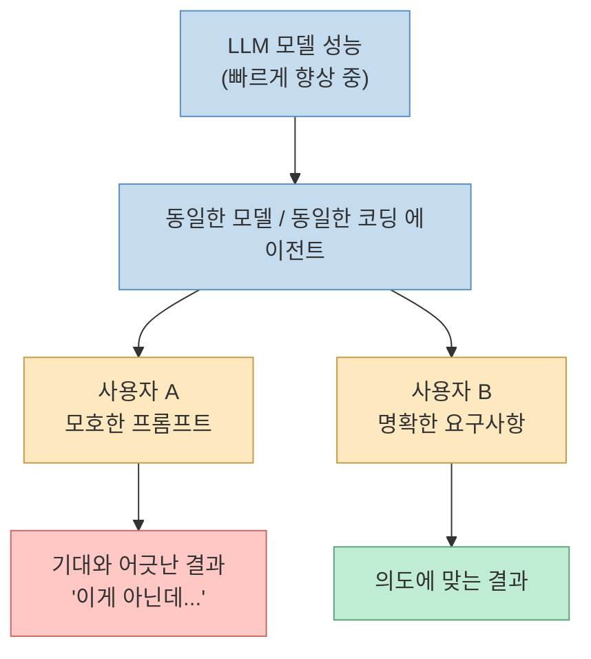

## 2. 명확한 프롬프트가 어려운 진짜 이유

발화자는 여기서 한 단계 더 들어간다. "명확한 프롬프트를 작성하라"는 조언은 누구나 한다. 그런데 정작 그 조언이 실전에서 잘 안 먹히는 이유는 따로 있다.

> "왜냐면, 나도 내가 뭘 원하는지 모르는 상태인 게 많거든요." ([?t=90](https://youtu.be/vet6pZmm2_w?t=90))

처음부터 최종 결과물의 완벽한 모습을 그리는 것은 거의 불가능하다. 그래서 빈 프롬프트, 모호한 프롬프트가 그대로 에이전트로 흘러가고, 에이전트는 그 빈칸을 *추측* 으로 채운다.

> "비어 있는 프롬프트를 에이전트에게 넘겨서 실행해 버리면, AI가 그 빈칸을 추측하면서 결과물은 빨리 나오지만 '내가 원한 건 이게 아닌데'가 되기 굉장히 쉽다." ([?t=110](https://youtu.be/vet6pZmm2_w?t=110))

이 지점에서 두 가지 선택지가 갈린다.

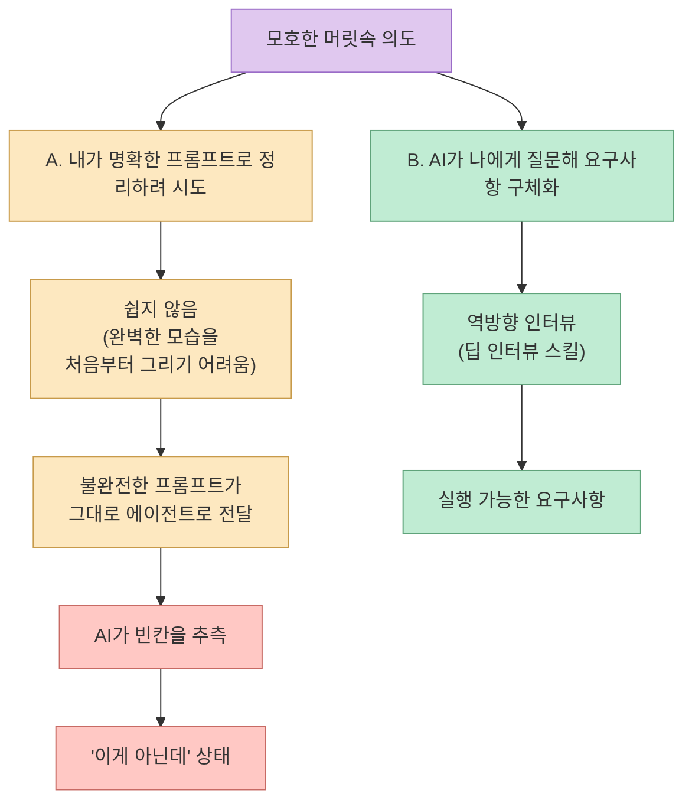

발상의 전환은 이 한 줄로 요약된다. **"역으로 AI가 나에게 질문하게 함으로써, 내 요구 사항을 AI가 구체화시켜 줄 수 있다."** ([?t=140](https://youtu.be/vet6pZmm2_w?t=140))

## 3. 딥 인터뷰 스킬: 트리거와 호출 시점

영상에서 발화자가 공유한 스킬 정의 자체를 그대로 복기하면 다음과 같다.

- **목적**: 모호한 요청을 소크라테스식 질문으로 인터뷰해서 *실행 가능한 요구사항* 으로 정리한다.
- **호출 트리거**: 사용자가 다음 중 하나를 요청할 때.
  - "딥 인터뷰"
  - "심층 인터뷰"
  - "요구사항 명확화"
  - "생각 정리"
- **자동 호출 조건**: 목표 / 범위 / 제약 / 완료 기준이 흐릿할 때, AI가 이 스킬을 알아서 호출한다.

> "요구사항이 불명확하다 싶으면, 알아서 AI가 이 스킬을 호출해서 명확화를 해 주기도 한다." ([?t=215](https://youtu.be/vet6pZmm2_w?t=215))

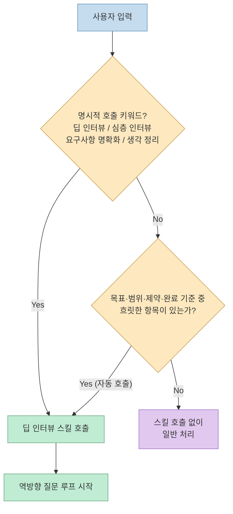

이 구성에서 중요한 두 가지를 짚어 둘 만하다. 첫째, 명시적 호출과 자동 호출이 둘 다 살아 있다는 점. 둘째, 자동 호출의 판정 기준이 *모호함의 4가지 차원* (목표/범위/제약/완료 기준)으로 명문화되어 있다는 점이다. 이 4가지는 뒤에서 다시 다룬다.

## 4. 스킬의 4가지 구성 요소

딥 인터뷰 스킬은 한 번의 질문 턴마다 다음 4가지를 항상 함께 출력한다.

> "현재 이해 / 마킹 결정 / 추천 답안 / 질문 한 개. 이 네 가지 구성 요소를 가지고 계속해서 반복적으로 AI가 나에게 역으로 질문하면서 내 요구사항을 구체화해 준다." ([?t=170](https://youtu.be/vet6pZmm2_w?t=170))

각 항목의 역할을 분해하면 다음과 같다.

- **현재 이해**: AI가 지금까지 파악한 요구사항의 누적 상태를 사용자가 검수할 수 있도록 명시한다. 잘못 이해된 부분을 사용자가 즉시 정정할 수 있는 *체크포인트* 역할이다.
- **마킹 결정**: 어떤 항목이 이미 *결정 완료* 인지, 어떤 항목이 아직 *열린 상태* 인지를 표시한다. 결정과 미결정을 분리해 둠으로써, 다음 질문이 어디로 향해야 하는지가 자동으로 정해진다.
- **추천 답안**: 단순히 열린 질문만 던지지 않는다. 1~3개 정도의 선택지를 먼저 제시한 뒤, 그중 하나를 *추천* 으로 명시한다. 사용자가 0에서부터 답을 만들어 내지 않아도 되도록 인지 부담을 줄인다.
- **질문 한 개**: 한 턴에 단 하나의 질문. 사용자가 동시에 여러 질문에 답하느라 산만해지지 않도록, 가장 우선순위 높은 불확실성 하나를 골라 던진다.

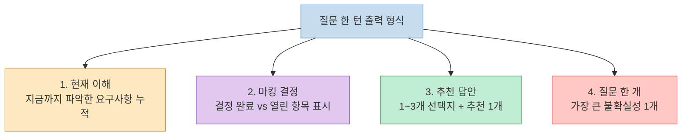

이 4가지 출력은 단순한 양식이 아니라 *상태 머신* 처럼 동작한다. "현재 이해"는 누적 상태, "마킹 결정"은 다음 질문 방향의 인덱스, "추천 답안"은 인지 부담 절감 장치, "질문 한 개"는 다음 턴의 단일 진입점이다.

## 5. "한 번에 하나씩" 원칙과 소크라테스식 질문법

이 스킬의 가장 핵심적인 운영 원칙은 한 줄로 정리된다.

> "핵심은 질문을 많이 하는 것이 아니고, 가장 큰 불확실성 하나를 골라서 한 번에 하나씩 푸는 것이다." ([?t=275](https://youtu.be/vet6pZmm2_w?t=275))

발화자는 AI가 한 번에 여러 질문을 동시에 쏟아 낼 때 답변자가 오히려 정신없이 흩어지는 경험을 지적한다. 그래서 이 스킬은 **"질문 하나"** 를 강제 제약으로 박아 둔다.

질문의 형식도 그냥 묻지 않는다. *소크라테스식 질문* — 즉 답을 대신 정해 주는 게 아니라, **사용자의 암묵적 가정 / 선택지 / 판단 기준이 드러나도록** 묻는다.

> "답을 대신 정하기보다, 사용자의 암묵적 가정·선택지·판단 기준이 드러나게 질문하는 것을 이 스킬의 가장 핵심 개념으로 넣어 두고 있다." ([?t=300](https://youtu.be/vet6pZmm2_w?t=300))

다음 두 다이어그램은 같은 상황을 비교한다. 비교 다이어그램은 세로로 분리해 보여 준다.

**Anti-pattern: 한 번에 여러 질문**

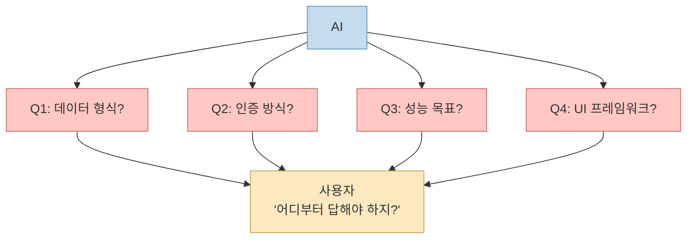

**Deep Interview pattern: 가장 큰 불확실성 하나**

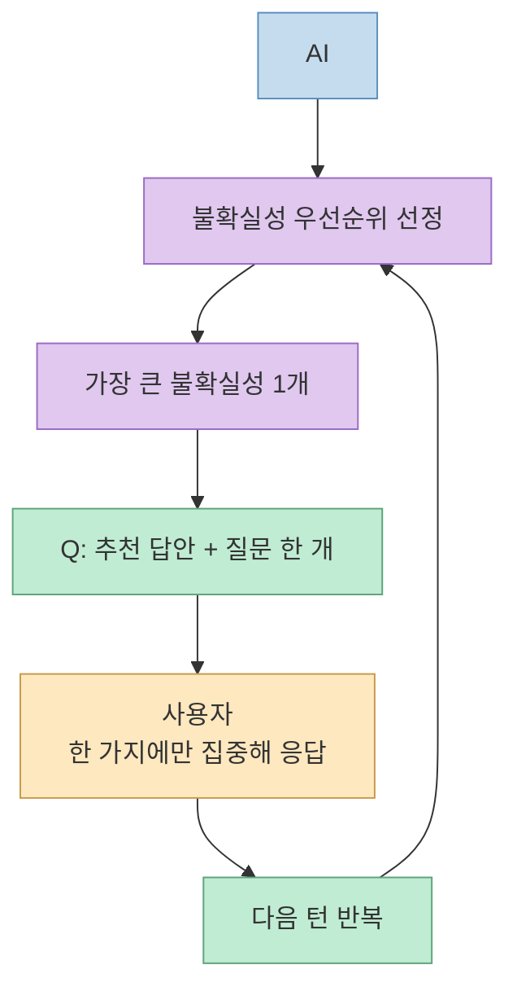

핵심 차이는 *질문 수* 가 아니라 *질문 선택의 의식성* 이다. AI가 자기 마음대로 떠오르는 질문을 늘어놓는 게 아니라, "지금 이 단계에서 가장 큰 불확실성이 무엇인가"를 매 턴마다 명시적으로 고른다.

## 6. 질문 축: 5가지 명확화 차원

스킬은 질문이 어떤 축을 따라 던져져야 하는지도 사전에 정의해 둔다.

> "질문 축도 이렇게 정의해 뒀습니다. 목표 범위와 제외 범위, 제약, 완료 기준, 맥락과 영향 범위." ([?t=325](https://youtu.be/vet6pZmm2_w?t=325))

다섯 가지 축을 풀어 보면 이렇다.

- **목표 범위 (In-scope)**: 이 작업이 무엇을 *해야* 하는가.
- **제외 범위 (Out-of-scope)**: 이 작업이 무엇을 *하지 않을* 것인가. 명시적으로 잘라 두어야 에이전트가 범위를 부풀리지 않는다.
- **제약 (Constraints)**: 기술 스택, 성능, 보안, 비용, 일정 등 반드시 지켜야 하는 경계 조건.
- **완료 기준 (Definition of Done)**: 어떤 상태가 되면 이 작업을 *끝났다고 본다* 인지.
- **맥락과 영향 범위 (Context & Blast Radius)**: 이 변경이 어디까지 영향을 미치는가. 다른 모듈, 다른 팀, 운영 환경과의 관계.

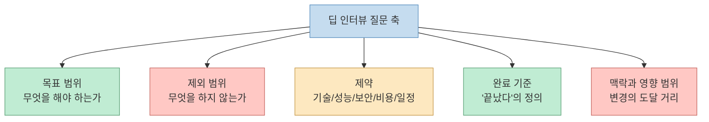

이 5축은 단순한 분류가 아니라 *자동 호출 조건* 과 정확히 정렬되어 있다. 앞서 3절에서 본 것처럼, 이 중 흐릿한 축이 있을 때 스킬이 자동으로 호출된다.

## 7. 코드베이스에서 답할 수 있는 질문은 묻지 말기

스킬은 사용자에게 *불필요한 질문* 을 하지 않도록 설계되어 있다. 발화자의 표현을 그대로 옮기면 다음과 같다.

> "코드베이스를 보면 답할 수 있는 질문은 절대로 사용자에게 묻지 말고 직접 확인해라." ([?t=340](https://youtu.be/vet6pZmm2_w?t=340))

이 한 줄은 실제로 *질문 효율* 을 결정한다. AI가 모든 모호함을 사용자에게 그대로 떠넘기는 게 아니라, 코드/파일/설정에서 자체적으로 검증 가능한 항목은 자기 책임으로 확인한다.

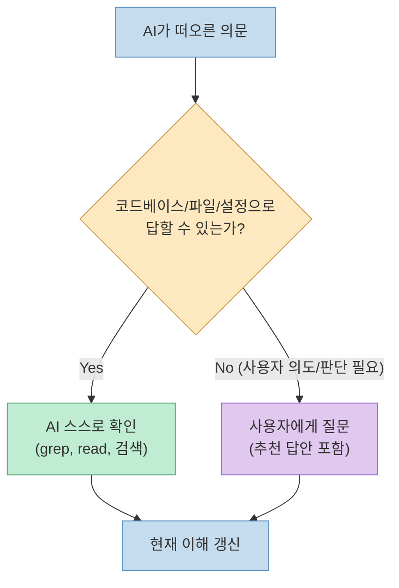

결과적으로 사용자에게 도달하는 질문은 *진짜로 사용자만이 답할 수 있는 의도/판단/제약* 만 남는다. 이게 "한 번에 하나씩" 원칙이 실전에서 작동하는 전제 조건이다.

## 8. Plan Mode와의 관계 그리고 Extended Plan

이 영상의 가장 중요한 메시지 중 하나는 *Plan Mode 자체에 대한 비판* 이다. Claude Code, Codex, Cursor AI 등에 기본 탑재된 Plan Mode는 너무 빨리 "계획을 끝내 버린다"는 것이다.

> "이 Plan Mode는 너무 계획을 빨리 끝내 버린다. 그래서 Plan Mode만으로 요구사항을 명확히 하기는 쉽지 않다." ([?t=250](https://youtu.be/vet6pZmm2_w?t=250))

발화자의 워크플로우는 두 단계로 분리된다.

1. **딥 인터뷰 스킬**로 *요구사항 자체* 를 명확화한다.
2. 그 다음, 기본 Plan Mode 대신 직접 만든 **"Extended Plan"** 스킬로 더 깊은 계획을 세운다.

> "기본으로 들어가 있는 Plan Mode를 사용하는 것보다, 좀 더 확장된 Extended Plan이라는 스킬을 새로 만들어서 활용하고 있다." ([?t=280](https://youtu.be/vet6pZmm2_w?t=280))

배경은 코딩 에이전트의 *장기 실행 추세* 다. 에이전트가 점점 더 긴 시간 동안 한 번에 작업을 이어 나가는 방향으로 진화하면서, 짧고 얕은 Plan Mode는 갈수록 부족해진다.

> "코딩 에이전트가 점점 장기간 작업을 실행하게 되는데, 기본 Plan Mode만 활용하는 것은 굉장히 부족하다고 생각한다." ([?t=230](https://youtu.be/vet6pZmm2_w?t=230))

**기존 워크플로우 (Plan Mode 단독)**

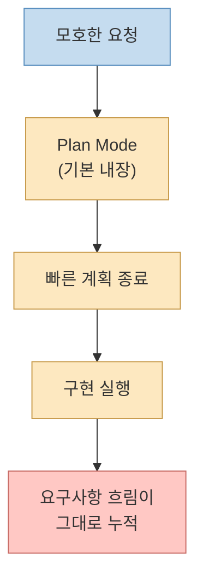

**제안 워크플로우 (Deep Interview → Extended Plan → 구현)**

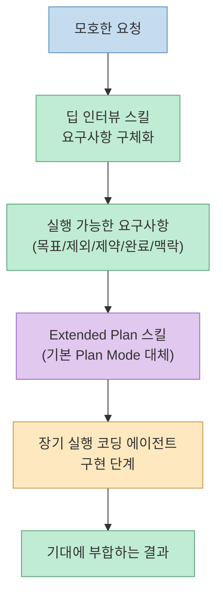

비교의 핵심은 단계 수의 차이가 아니라, **요구사항 명확화 단계가 계획 단계 *앞* 에 별도 레이어로 분리되어 있는가** 이다. Plan Mode는 본질적으로 "어떻게 만들 것인가"를 다루는 단계이고, 그 *입력* 인 요구사항이 흐리면 아무리 좋은 Plan을 세워도 결과는 어긋난다.

## 9. 종료 기준: 인터뷰 루프는 언제 멈춰야 하는가

루프 형태의 스킬은 *언제 멈추는가* 가 굉장히 중요하다. 종료 기준이 흐리면 루프는 무한히 늘어지거나 너무 일찍 끝난다. 발화자도 이 점을 명시한다.

> "루프를 돌면서 계속 반복적인 작업을 하는 경우에는 종료 기준을 정해 주는 것이 굉장히 중요하다." ([?t=370](https://youtu.be/vet6pZmm2_w?t=370))

종료 조건은 다음 두 가지 축을 동시에 만족할 때 성립한다.

- **목표 달성**: 스킬이 처음에 달성하려고 한 목표가 충족된다.
- **요구사항 정리 완료**: 다음 5가지가 모두 정리된다.
  - 포함 범위
  - 제외 범위
  - 지켜야 할 제약
  - 완료 판단 기준
  - 아직 남은 *열린 질문*

여기서 흥미로운 부분은, 마지막 항목이 "열린 질문 = 0"이 아니라 **"열린 질문이 무엇인지 *명시되었음*"** 이다. 이 단계까지만 정리되면, 그 이후 결정은 Plan/구현 단계에서 다뤄도 된다는 판단이다.

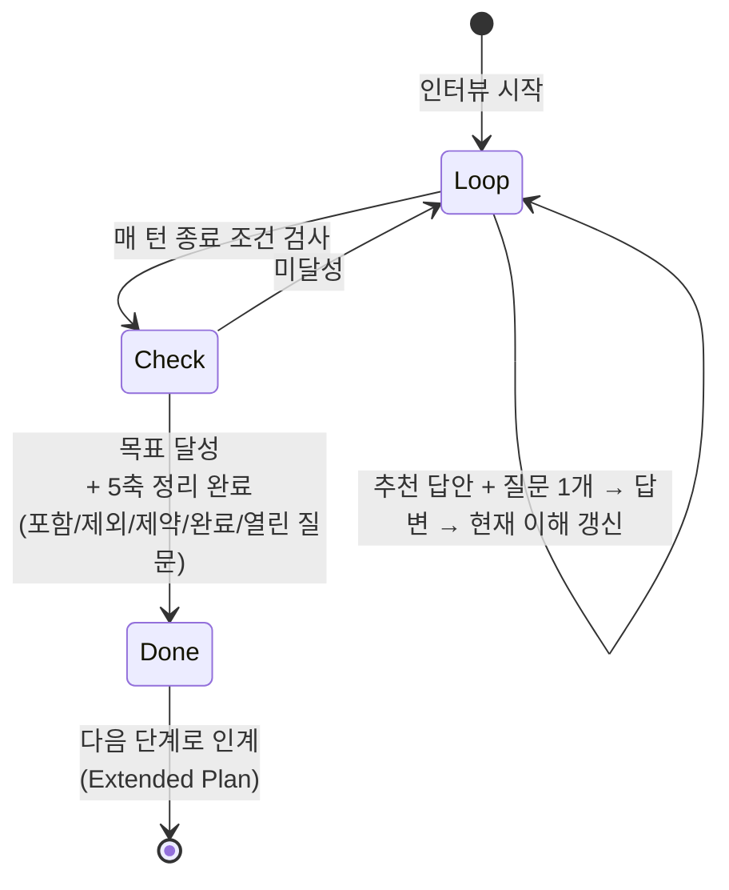

이 종료 기준은 단순한 형식이 아니라, *결과물 인계의 계약서* 다. 인터뷰가 끝났다는 건 다음 단계(Plan/구현)에 *충분히 명확한 인계 패키지* 가 만들어졌다는 뜻이다.

## 10. 코딩 너머의 활용

발화자가 마지막에 강조하는 부분은 이 스킬의 *적용 범위가 코딩에 한정되지 않는다* 는 점이다. 영상 자체도 이 스킬을 사용해 기획되었다고 명시한다.

> "이 스킬은 코딩할 때만 사용할 수 있는 게 아니다. 예를 들어 이번 영상을 기획하는 것도 이 딥 인터뷰 스킬을 사용해서 했다. 업무 자동화, 제품 기획, 콘텐츠 기획처럼 시작점에 모호함이 있는 경우에 그 모호함을 줄일 때 꼭 활용해 보면 좋을 것 같다." ([?t=400](https://youtu.be/vet6pZmm2_w?t=400))

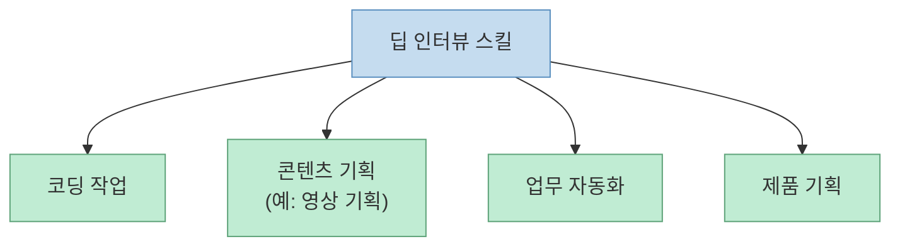

핵심 조건은 도메인이 아니라 *입력의 성질* 이다. **"시작점에 모호함이 있는 모든 작업"** — 이게 이 스킬의 적용 영역이다. 코드, 콘텐츠, 자동화, 제품 어디든 *내가 뭘 원하는지 아직 정리되지 않은 단계* 라면 적합하다.

## 핵심 요약

- 코딩 에이전트 결과물 차이의 가장 큰 원인은 모델 성능이 아니라 **요구사항 명확성** 이다.
- 명확한 프롬프트 작성이 어려운 진짜 이유는 *나도 내가 뭘 원하는지 모르기 때문* 이다.
- "딥 인터뷰" 스킬은 발상을 뒤집어, **AI가 사용자에게 역으로 질문해 요구사항을 구체화** 한다.
- 한 턴의 출력 형식은 항상 4가지: **현재 이해 / 마킹 결정 / 추천 답안 / 질문 한 개**.
- 운영 원칙은 **"가장 큰 불확실성 하나를 골라 한 번에 하나씩"** + **소크라테스식 질문** (사용자의 암묵적 가정/선택지/판단 기준을 드러냄).
- 질문 축은 5가지: **목표 범위 / 제외 범위 / 제약 / 완료 기준 / 맥락과 영향 범위**. 이 중 흐릿한 축이 있을 때 스킬이 자동 호출된다.
- 효율을 위해 **코드베이스에서 자체 확인 가능한 질문은 사용자에게 묻지 않는다**.
- Plan Mode는 너무 빨리 끝나기 때문에 부족하다. 발화자는 그 앞에 *딥 인터뷰* 를 두고, 그 뒤에 *Extended Plan* 스킬을 따로 두는 2단 구조를 쓴다.
- 종료 기준은 **목표 달성 + 5축 정리 완료(포함/제외/제약/완료/열린 질문)** 이다.
- 적용 범위는 코딩이 아니라 **모호함이 있는 모든 시작점** — 콘텐츠 기획, 업무 자동화, 제품 기획까지.

## 결론

이 영상의 가장 강한 메시지는 단 한 줄이다. 
**"Plan Mode는 너무 빨리 끝난다. 그 앞에 요구사항을 명확화하는 별도의 단계를 두어라."**

딥 인터뷰 스킬은 그 별도 단계를 *형식* 으로 박아 둔 도구다. 4가지 출력 항목, "한 번에 하나씩" 원칙, 5축 질문 차원, 코드베이스 자체 확인 규칙, 그리고 명시적 종료 기준까지. 모두 *인터뷰가 항상 같은 모양으로 진행되도록* 강제하는 장치들이다.

코딩 에이전트가 점점 더 길게, 더 깊게 일하는 방향으로 진화하는 흐름에서 이 메시지는 점점 더 무거워진다. 에이전트의 실행 길이가 늘어날수록, 그 시작점에 들어가는 *흐림* 의 비용은 기하급수적으로 누적되기 때문이다. 그래서 Plan Mode 앞에 별도의 명확화 레이어가 필요하다는 발화자의 주장은, 단순한 워크플로우 추천이 아니라 *장기 실행 시대의 코딩 에이전트 운영 방식* 에 대한 제안에 가깝다.
