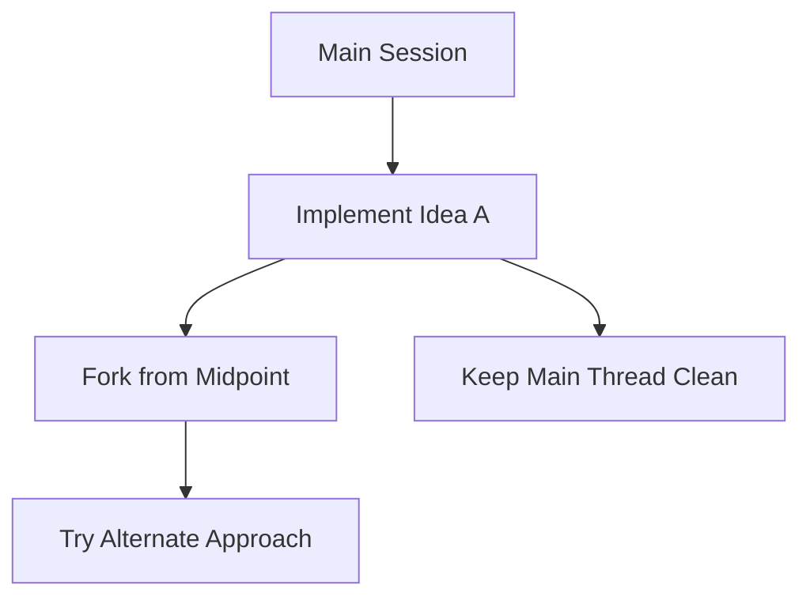
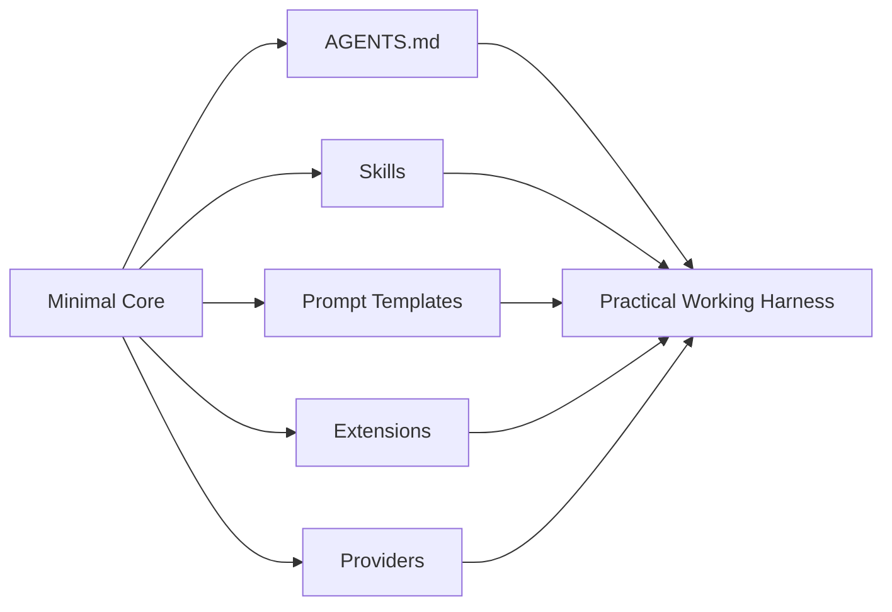

`Pi`는 요즘 코딩 에이전트들 가운데서 조금 이상한 위치에 있다.

더 많은 기능으로 주목받는 게 아니라,  
오히려 **기능을 덜 넣어서** 주목받고 있기 때문이다.

이 영상이 흥미로운 이유도 여기에 있다.  
핵심 메시지는 “Pi가 Claude Code나 OpenCode보다 기능이 많다”가 아니다.  
오히려 반대다.

**작은 하네스에 필요한 것만 붙여 쓰는 방식이 실제로 더 조용하고 오래 가는 작업 흐름을 만든다**는 주장이다.

<!--more-->

## Sources

- YouTube: <https://www.youtube.com/watch?v=8yac_swVw8I>
- Pi docs: <https://pi.dev/docs/latest>
- GitHub: <https://github.com/badlogic/pi-mono>

## 1. Pi의 출발점은 “적게 해서 덜 망가진다”는 철학이다

영상은 Pi를 설명할 때 처음부터 기능 목록을 자랑하지 않는다.

오히려 이런 점을 강조한다.

- 기본 도구가 4개뿐이다
  - `read`
  - `write`
  - `edit`
  - `bash`
- plan mode가 기본 내장된 것도 아니다
- sub-agent swarm도 기본이 아니다
- permission popup도 기본값이 아니다

즉 Pi는 “없는 것”이 많다.

그런데 이게 오히려 장점으로 읽힌다.

왜냐하면 기능이 많아질수록:

- 동작이 예측하기 어려워지고
- context를 조용히 더 많이 먹고
- 확인 팝업과 부가 루프가 늘어나고
- 실제 사용자는 50개 기능 중 5개만 쓰게 되기 때문이다

Pi는 이 문제를 정면으로 뒤집는다.

> 코어는 작게 두고, 필요하면 직접 붙인다.

이게 Pi의 실전 사용법을 이해하는 출발점이다.

## 2. 설치는 단순하지만, 진짜 시작점은 `/login`이다

공식 문서 기준으로 Pi는 아주 가볍게 시작한다.

```bash
curl -fsSL https://pi.dev/install.sh | sh
```

또는 npm으로 설치할 수도 있다.

```bash
npm install -g @earendil-works/pi-coding-agent
```

그다음 프로젝트 디렉터리에서:

```bash
pi
```

로 실행한다.

하지만 영상 기준 실전 시작점은 설치가 아니라 `provider 연결`이다.

Pi는:

- Anthropic
- OpenAI
- Google
- DeepSeek
- OpenRouter
- Ollama
- LM Studio
- GitHub Copilot

등 여러 provider를 붙일 수 있다.

영상에서 가장 강조하는 경로는 `GitHub Copilot OAuth`다.

이미 Copilot Pro나 회사 계정이 있다면,  
별도 API 비용 없이 그 구독 뒤에 붙은 모델들을 Pi에서 바로 고를 수 있기 때문이다.

즉 실전 팁은 이렇다.

- 설치 후 바로 `/login`
- provider로 `GitHub Copilot` 선택
- 브라우저에서 인증
- 이후 `/model`로 원하는 모델 전환

이 흐름이 Pi를 “로컬 작은 CLI”가 아니라  
**구독 재활용형 멀티모델 런처**로 바꿔 준다.

## 3. `/model`과 scoped models가 실제 사용성을 크게 올린다

영상에서 꽤 실용적인 부분은 모델 전환 방식이다.

Pi는 단순히 모델을 한 번 고정해서 쓰는 CLI가 아니다.

- `/model`로 현재 연결 가능한 모델을 고를 수 있고
- favorite 모델만 따로 모아 `scoped models`처럼 관리할 수 있고
- 단축키로 자주 쓰는 모델 사이를 빠르게 전환할 수 있다

이게 중요한 이유는 작업 종류에 따라 필요한 모델이 다르기 때문이다.

예를 들어:

- 빠른 코드 생성
- 꼼꼼한 리뷰
- 장문 문맥 정리
- UI 산출물 생성

은 같은 모델 하나로만 밀기보다,  
상황에 따라 전환하는 편이 더 낫다.

즉 Pi의 실전 사용성은 “최고 모델 하나”보다  
**내가 이미 가진 구독을 얇은 CLI 위에서 빠르게 바꿔 쓰는 경험**에 가깝다.

## 4. Pi의 진짜 장점은 session이 선형이 아니라 트리라는 점이다

영상에서 가장 인상적인 부분 중 하나가 여기다.

Pi는 세션을 JSONL로 저장하고,  
단순 resume뿐 아니라 `fork`를 아주 자연스럽게 다룬다.

즉 작업 흐름이 이렇게 된다.

- 현재 세션을 계속 이어 간다
- 중간 분기점에서 다른 아이디어를 실험한다
- 마음에 안 들면 메인 스레드는 그대로 두고 분기만 버린다

이건 long session에서 꽤 강력하다.

많은 코딩 에이전트가 사실상 선형 대화에 가깝기 때문에,  
옆길로 새면 다시 돌아오기가 어렵다.

Pi는 세션 트리를 전제로 해서:

- main thread 보존
- 실험 branch 분기
- context 오염 최소화

를 더 자연스럽게 만든다.



즉 Pi에서 session은 단순 대화 기록이 아니라  
**작업 실험 공간**이다.

## 5. `AGENTS.md`와 skills는 Pi를 작게 유지하면서도 똑똑하게 만든다

공식 문서와 영상을 함께 보면, Pi는 context 파일과 skills를 꽤 중요하게 쓴다.

Pi는 시작할 때:

- 글로벌 `AGENTS.md`
- 프로젝트 루트의 `AGENTS.md`
- 또는 `CLAUDE.md`

같은 문서를 읽을 수 있다.

여기에 보통 이런 걸 넣는다.

- 수정 후 반드시 실행할 명령
- 금지 경로
- 응답 톤
- 레포 규칙
- 테스트 우선순위

즉 Pi는 코어에 plan mode를 내장하지 않는 대신,  
**문서와 skill로 하네스를 바깥에서 조립**한다.

영상에서 이 흐름이 잘 드러난다.

- 기존 Claude Code용 skill을 거의 그대로 재사용할 수 있고
- 프로젝트 레벨 skill도 읽고
- 필요한 행동은 `AGENTS.md`에 짧게 적고
- 바뀌면 `/reload`로 바로 갱신한다

이 구조 덕분에 Pi는 기본 코어는 작게 유지하면서도  
실전에서는 충분히 강한 작업 규율을 얹을 수 있다.

## 6. prompt template과 extension이 붙으면 “작은 코어 + 큰 확장” 구조가 완성된다

Pi의 실전 사용법에서 빠지면 아쉬운 게 두 가지다.

### prompt templates

반복하는 프롬프트를 slash command처럼 저장할 수 있다.

예를 들어:

- 코드 리뷰
- PR 요약
- 버그 재현 체크리스트
- 리팩터링 가이드

같은 걸 매번 길게 입력하지 않고,  
짧은 명령으로 확장할 수 있다.

### extensions

공식 문서 기준으로 Pi는 TypeScript extension으로:

- 이벤트 훅
- 커스텀 UI
- 툴 호출 개입
- MCP 통합
- status/footer/header 확장

같은 걸 붙일 수 있다.

즉 Pi의 구조는 이렇다.

- 코어는 작다
- 부족한 기능은 바깥에서 붙인다
- 필요 없으면 붙이지 않는다

이게 Claude Code처럼 “우주선” 같은 툴과 가장 다른 점이다.  
Pi는 처음부터 다 주는 대신, **내가 필요한 것만 조립하게 한다**.



## 7. 실전 데모가 보여 주는 건 성능보다 “조용한 루프”다

영상 데모에서는 단일 HTML 파일로 3D 루빅큐브를 만드는 예시가 나온다.

중요한 건 “큐브를 만들었다”가 아니다.

더 중요한 건 과정이다.

- 폴더를 읽고
- 파일을 쓰고
- 결과를 확인하고
- 다시 이어 간다

이 과정에서 영상은 계속 이런 점을 강조한다.

- 승인 팝업이 계속 튀지 않는다
- plan mode가 먼저 끼어들지 않는다
- sub-agent가 자동으로 늘어나지 않는다
- 루프가 조용하다

즉 Pi의 실전 강점은 벤치마크 수치보다  
**작업 중 리듬을 덜 깨는 것**에 있다.

이건 특히 작은 프런트엔드 프로토타입이나  
짧은 구현-확인-수정 루프에서 체감이 크다.

## 8. 그래서 Pi는 모든 사람에게 좋은 툴이 아니라, “내 하네스를 내가 소유하고 싶은 사람”에게 맞는다

영상 마지막 결론도 이쪽에 가깝다.

Pi는:

- 처음부터 polished한 경험
- 모든 기능 내장
- 계획/서브에이전트/통합이 이미 다 있는 상태

를 원하는 사람에겐 덜 맞을 수 있다.

반대로 이런 사람에게는 잘 맞는다.

- 내 하네스를 직접 조립하고 싶은 사람
- Copilot 같은 기존 구독을 최대한 재활용하고 싶은 사람
- session 분기와 resume를 자주 쓰는 사람
- 기능보다 예측 가능성과 조용한 루프를 더 중요하게 보는 사람

즉 Pi는 “더 강한 기본값”보다  
**더 작은 기본값과 더 큰 소유권**을 선택한 도구다.

## 9. Pi 실전 사용법의 핵심은 기능 암기가 아니라, 코어를 작게 두고 바깥에서 규율을 붙이는 감각이다

결국 이 영상을 보고 남는 건 명령어 몇 개가 아니다.

물론 실전에서 바로 쓸 수 있는 포인트는 분명하다.

- `/login`
- `/model`
- Copilot OAuth
- session resume / fork
- `AGENTS.md`
- skills
- prompt templates
- extensions

하지만 더 중요한 건 이 조합이 보여 주는 운영 철학이다.

Pi를 잘 쓴다는 건:

- 기능이 많은 에이전트를 찾는 게 아니라
- 작은 코어를 고르고
- 내 프로젝트 규율을 문서로 붙이고
- 필요한 확장만 얹고
- 세션을 깔끔하게 분기하며 운영하는 것

에 가깝다.

그래서 Pi는 “Claude Code를 이기는 툴”이라기보다,  
**코딩 에이전트를 더 조용하고 더 내 것처럼 쓰고 싶은 사람에게 맞는 실전 하네스**라고 보는 편이 정확하다.
