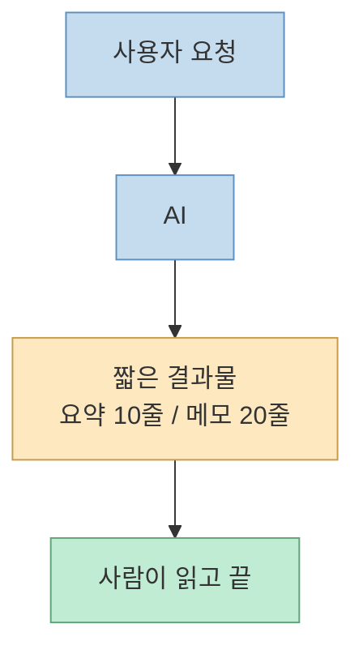
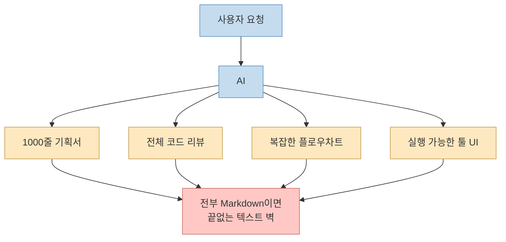
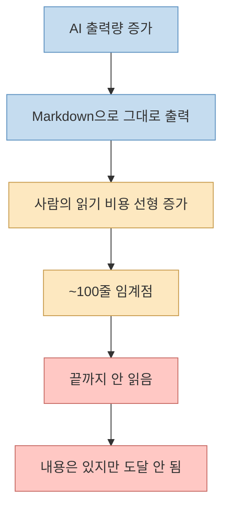
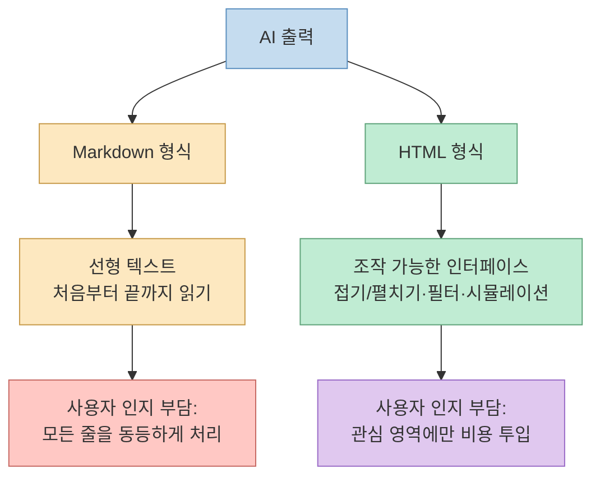
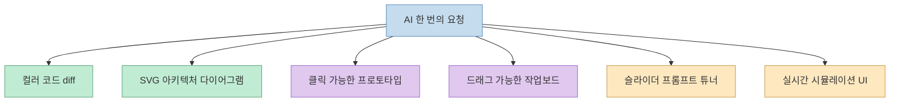
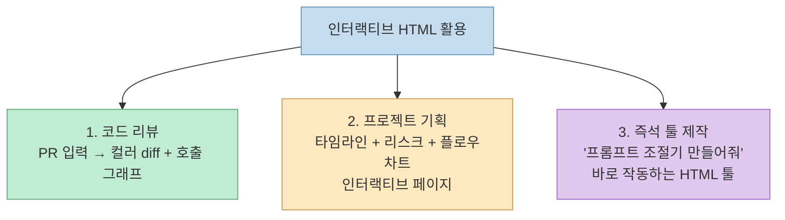
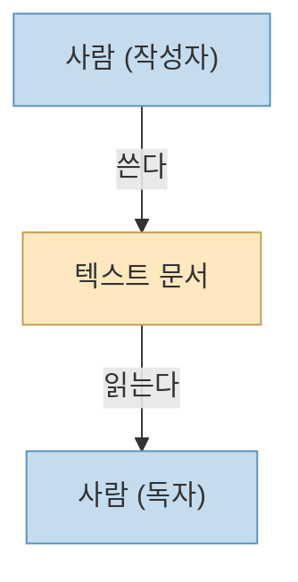
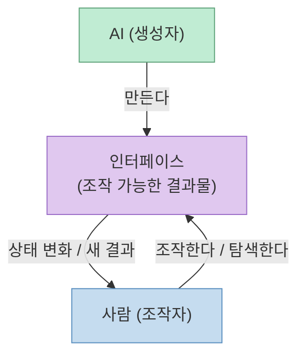
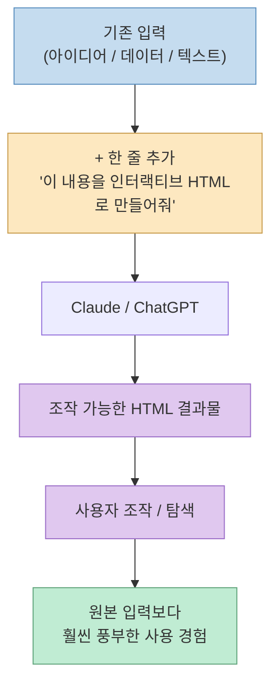

`Markdown`이 나빠서가 아니다. **AI가 너무 강해져서** Markdown이 더 이상 안 맞는다는 이야기다.

Threads의 `@alex_ai_mcp` 가 공유한 짧은 포스트에서 단단한 한 줄을 뽑아낼 수 있다.

> "문서를 생성하는 것" → "인터페이스를 생성하는 것"

예전엔 AI가 10줄 요약, 20줄 메모를 써 줬다. 지금은 한 번에 1000줄짜리 기획서, 전체 코드 리뷰, 복잡한 플로우차트, **실행 가능한 툴 UI까지** 만든다. 이걸 전부 Markdown으로 받으면 결국 *끝없는 텍스트 벽* 이 된다 — 심지어 Claude 엔지니어조차 100줄 넘는 AI 생성 MD 파일은 끝까지 안 읽는다고 한다.

그래서 작업 방식이 바뀌고 있다. **AI가 만들고 사람은 조작한다.**

<!--more-->

## Sources

- Threads: <https://www.threads.com/@alex_ai_mcp/post/DYGpgjqGU_y>

## 1. AI 출력 스케일이 임계점을 넘었다

원본 포스트의 출발점은 *AI 출력의 양과 형태가 한 단계 점프했다* 는 관찰이다.

예전 AI는 텍스트 한 단락, 코드 몇 줄, 요약 한두 페이지를 돌려줬다. 지금은 한 번의 요청으로 다음과 같은 결과물이 한꺼번에 나온다.

- 1000줄짜리 기획서
- 전체 코드 리뷰
- 복잡한 플로우차트
- 실행 가능한 툴 UI

이 변화는 단순한 "결과물이 길어졌다"가 아니다. **결과물의 *종류* 자체가 달라졌다**. 길어진 것뿐이라면 뷰어/스크롤로 충분하다. 그런데 실행 가능한 UI, 인터랙티브 다이어그램, 조작 가능한 시뮬레이션 같은 것이 한 번에 나오기 시작하면, 그걸 담는 그릇이 평면 텍스트일 수 없다.

**과거: AI 출력이 한 페이지에 들어가던 시절**

**현재: AI 한 번에 다양한 형태의 대용량 결과물**

핵심은 두 번째 다이어그램에 있다. **여러 형태의 결과물이 같은 평면 텍스트로 압축되는 순간 정보 밀도와 가독성이 동시에 무너진다**.

## 2. "100줄 넘으면 안 읽는다" — 만든 사람조차 못 읽는다

원본 포스트의 가장 강력한 한 줄은 이거다.

> "심지어 Claude 엔지니어들조차 100줄 넘는 AI 생성 MD 파일은 끝까지 잘 안 읽는다고."

이 문장이 가지는 의미는 단순히 "AI 출력이 길다"가 아니다. **출력의 작성자(AI 운영자)와 출력의 수신자가 모두 사람일 때, 그 사람의 *읽기 한계* 가 시스템 병목이 된다**는 점이다.

Markdown은 본질적으로 *읽기를 전제로 한 형식* 이다. 글자 수가 늘어나는 만큼 인지 비용이 선형으로 늘어난다. 100줄을 넘는 순간 내용 자체의 가치와 무관하게 *끝까지 읽힐 확률* 이 급격히 떨어진다.

이 진단이 흥미로운 이유는, 결국 *Markdown 자체* 의 한계가 아니라 **사람의 인지 한계가 출력 형식에 끼어든다** 는 점이다. AI는 1000줄이든 1만 줄이든 만들 수 있다. 그러나 그걸 받는 사람의 두뇌 처리량은 동일하다. 이 비대칭이 누적되는 게 *지금 일어나고 있는 일* 이다.

## 3. 패러다임 전환: 문서 생성 → 인터페이스 생성

이 비대칭을 푸는 방법은 *읽는 양을 줄이는 것이 아니라 형식을 바꾸는 것* 이다.

원본 포스트의 핵심 주장은 이 한 줄로 응축된다.

> "문서를 생성하는 것" → "인터페이스를 생성하는 것"

`Markdown`은 *문서* 다. 처음부터 끝까지 읽으라는 형식. 
`HTML`은 *인터페이스* 다. **조작 가능한 결과물**.

조작 가능하다는 건 단순히 보기 좋다는 의미가 아니다. *사용자가 자기 관심사에 따라 결과물의 일부분만 펼쳐 보고, 비교하고, 시뮬레이션을 돌려 볼 수 있다* 는 뜻이다. 즉, **읽기 비용을 사용자가 자기 의지대로 최적화할 수 있다**.

여기서 강조할 부분은, 이 변화가 *Markdown vs HTML 우열 논쟁* 이 아니라는 점이다. 원본 포스트도 명시적으로 그렇게 말한다.

> "이건 단순히 'Markdown vs HTML' 논쟁이 아니라, AI 시대의 작업 방식 자체가 바뀌고 있다는 신호라는 것."

Markdown은 여전히 *AI에게 지시하는 입력* 이나, 로직 중심의 짧은 문서로서 가치가 분명하다. 변화는 *결과물 측* 에서 일어나고 있다 — 특히 사람이 *최종 소비자* 가 아니라 *조작자* 일 때.

## 4. 인터랙티브 결과물의 6가지 형태

원본 포스트가 구체적으로 나열한 *AI가 한 번에 만들 수 있는 인터랙티브 결과물* 은 다음 6가지다.

- 컬러 코드 diff
- SVG 아키텍처 다이어그램
- 클릭 가능한 프로토타입
- 드래그 가능한 작업보드
- 슬라이더 기반 프롬프트 튜너
- 실시간 시뮬레이션 UI

각각이 의미하는 바를 짚어 두면 이렇다.

- **컬러 코드 diff**: 단순한 변경 라인 표시가 아니라, 추가/삭제/수정/이동을 시각적 채널로 분리해 *변경의 형태* 자체를 한눈에 파악하게 한다.
- **SVG 아키텍처 다이어그램**: 정적 PNG가 아니라 SVG라는 점이 중요하다. 노드 클릭, 텍스트 검색, 라벨 수정이 모두 살아 있다.
- **클릭 가능한 프로토타입**: 페이지 흐름을 *글로 설명* 하지 않고 *눌러서 확인* 한다.
- **드래그 가능한 작업보드**: 칸반/타임라인 류. *결정 자체를 인터페이스 위에서 한다*.
- **슬라이더 기반 프롬프트 튜너**: 파라미터 변화에 따른 결과 변화를 *글로 비교* 하지 않고 *손으로 굴려서* 본다.
- **실시간 시뮬레이션 UI**: 변경에 따른 결과 흐름을 즉시 시각화.

공통점은 한 가지다. **모두 텍스트로도 표현은 가능하지만, 사용자가 *조작* 함으로써 비로소 의미를 갖는** 결과물이라는 점이다.

## 5. 체감 좋았던 활용 사례 3가지

원본 포스트는 *체감 좋았다* 고 명시한 구체적 활용 사례 3가지를 제시한다.

세 사례 모두 *동일한 정보를 텍스트로도 만들 수는 있지만, 인터페이스 형태가 압도적으로 효율적인* 영역이다.

- **코드 리뷰**: PR 텍스트만 보면 변경 영역을 따라가는 인지 비용이 크다. 호출 그래프와 컬러 diff가 같은 화면에 붙으면 *변경의 영향 범위* 가 시각으로 들어온다.
- **프로젝트 기획**: 타임라인/리스크/플로우 각각을 별도 텍스트 단락으로 나열하면 상호 관계가 묻힌다. 인터랙티브 페이지에서는 *서로 연결된 객체* 로 다뤄진다.
- **즉석 툴 제작**: "프롬프트 조절기"는 텍스트로 설명할 수 있는 게 아니다. *즉시 돌아가는 것* 이 핵심이다.

세 번째 사례는 특별히 흥미롭다. *AI가 만든 결과물이 곧바로 또 다른 AI 워크플로우의 도구가 된다* 는 의미이기 때문이다. 출력이 도구로 변형되는 메타 루프.

## 6. 작업 방식 자체의 전환: "AI가 만들고, 사람은 조작한다"

원본 포스트의 가장 깊은 메시지는 *작업 방식 자체* 의 전환이다.

> "예전: 사람이 쓰고 사람이 읽음" 
> "지금: AI가 만들고 사람은 조작함"

이 문장이 핵심을 찌르는 이유는 *역할 배분* 자체가 바뀌었다고 선언하기 때문이다. 예전에는 *생산자*도 사람, *소비자*도 사람이었다. 형식이 텍스트인 것은 자연스러운 결과였다. 지금은 *생산자가 AI* 이고, *소비자가 사람* 이다. 이 비대칭이 출력 형식의 요구를 바꾼다.

**과거 작업 방식: 사람이 쓰고 사람이 읽음**

**현재 작업 방식: AI가 만들고 사람은 조작함**

두 다이어그램의 결정적 차이는 *결과물에 대한 화살표 방향* 이다. 과거의 결과물(텍스트 문서)은 *읽기 전용* 이라 한 방향으로만 흐른다. 현재의 결과물(인터페이스)은 사람이 *조작하면 다시 새로운 상태가 만들어지는* 양방향 흐름이다.

이게 원본 포스트의 결론으로 이어진다.

> "그래서 앞으로는 '잘 정리된 텍스트'보다 '잘 설계된 인터페이스'가 훨씬 중요해질 가능성이 큽니다."

*잘 정리된 텍스트* 는 *잘 읽혀야* 가치가 있다. 그런데 사람의 읽기 한계가 이미 병목이다. 반면 *잘 설계된 인터페이스* 는 사용자가 자기 관심사로 결과물을 *다시 정리* 하게 만든다. 정리의 책임이 작성자에서 도구로 옮겨 간다.

## 7. 실전 한 줄: "이 내용을 인터랙티브 HTML로 만들어줘"

원본 포스트의 마지막은 굉장히 실용적이다. 거창한 워크플로우 변경 없이 *프롬프트 한 줄* 만으로 시작할 수 있다는 제안이다.

> "Claude나 ChatGPT에 '이 내용을 인터랙티브 HTML로 만들어줘'라고 입력하는 순간, AI 활용 체감이 완전히 달라집니다."

이 제안이 가지는 강점은 *기존 입력은 건드리지 않는다* 는 것이다. 이미 갖고 있는 데이터/아이디어/문서에 출력 형식 지시 한 줄만 더하면 된다. 진입 비용이 사실상 0에 가깝다.

## 핵심 요약

- **현상**: Claude 팀 엔지니어들이 AI 출력 결과물에서 Markdown을 떠나 HTML로 옮겨 가고 있다.
- **이유**: Markdown이 나빠서가 아니라, AI 출력 *양과 종류* 가 한 단계 점프해 사람의 *읽기 한계* 가 병목이 됐기 때문이다.
- **임계점**: 100줄을 넘는 AI 생성 MD 파일은 *만든 측 엔지니어조차* 끝까지 읽지 않는다.
- **전환 한 줄**: "**문서 생성** → **인터페이스 생성**".
- **HTML의 본질적 차별점**: 단순 문서가 아니라 *조작 가능한 결과물* 이다.
- **인터랙티브 결과물 6가지**: 컬러 diff, SVG 아키텍처, 클릭 프로토타입, 드래그 작업보드, 슬라이더 프롬프트 튜너, 실시간 시뮬레이션.
- **체감 좋은 사례 3가지**: 코드 리뷰, 프로젝트 기획, 즉석 툴 제작.
- **패러다임**: "사람이 쓰고 사람이 읽음" → "AI가 만들고 사람은 조작함".
- **앞으로의 가치**: *잘 정리된 텍스트* 보다 *잘 설계된 인터페이스* 가 더 중요해진다.
- **실전 시작점**: 기존 입력에 "이 내용을 인터랙티브 HTML로 만들어줘" 한 줄을 더하라.

## 결론

이 짧은 Threads 포스트가 던지는 메시지는 *형식 선호의 변화* 가 아니다. **AI 출력의 양과 종류가 사람의 인지 한계를 추월한 결과로 발생한 작업 방식 전환** 이다.

평면 텍스트는 *작성자와 독자 모두 사람* 이라는 전제 위에 만들어진 형식이다. 그 전제가 무너지면 — 즉, *작성자가 AI* 이고 *독자만 사람* 이 되면 — 형식의 무게중심도 *읽기 좋게* 에서 *조작하기 좋게* 로 옮겨가는 게 자연스럽다.

가장 인상적인 부분은 이 모든 변화가 거창한 도구 도입이 아니라 **프롬프트 한 줄** 로 시작될 수 있다는 점이다. *이 내용을 인터랙티브 HTML로 만들어 달라*. 한 줄의 추가가 출력 형식의 차원을 바꾼다.

Markdown은 여전히 살아남을 것이다 — 입력으로, 짧은 문서로, 로직 중심 문맥으로. 하지만 AI가 *길고 복합적이고 조작 가능한 무언가* 를 만들기 시작한 시대에는, *결과물 측의 디폴트* 가 인터페이스로 옮겨가고 있다는 신호를 무시하기 어렵다.
