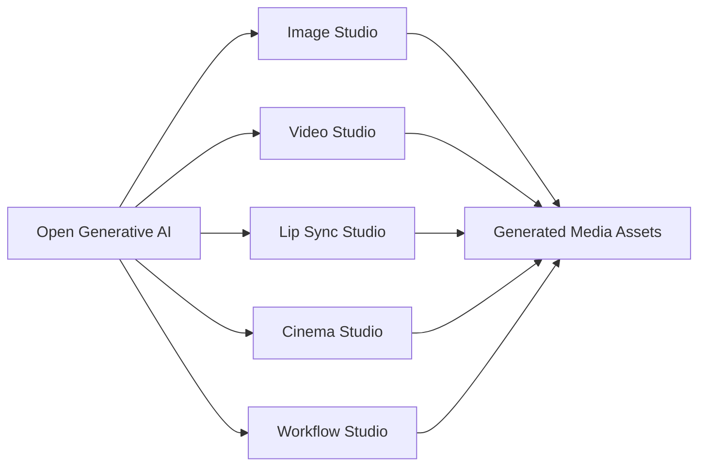
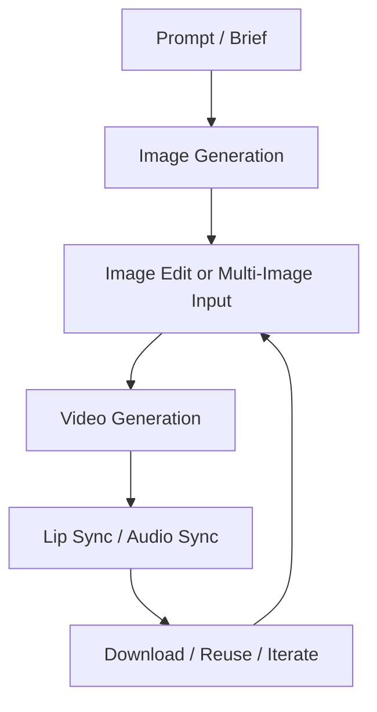

생성형 미디어 도구는 보통 각각 따로 쓴다.

- 이미지는 이미지 생성 툴
- 영상은 영상 생성 툴
- 립싱크는 또 다른 서비스
- 워크플로 자동화는 별도 노드 에디터
- 로컬 모델은 또 다른 실행기

`Open Generative AI`가 흥미로운 이유는 이 조각들을 하나의 스튜디오로 묶으려 하기 때문이다.  
단순히 “AI 이미지 생성 웹앱”이 아니라, **이미지·영상·립싱크·시네마·워크플로·로컬 추론을 한 화면에서 다루려는 오픈소스 미디어 생성 작업대**에 가깝다.

<!--more-->

## Sources

- GitHub: <https://github.com/Anil-matcha/Open-Generative-AI>
- Hosted version: <https://dev.muapi.ai/open-generative-ai>
- Muapi: <https://muapi.ai>

## 1. 이 프로젝트는 “모델 하나”가 아니라 “스튜디오 표면”을 만든다

README에서 가장 먼저 눈에 띄는 문구는 `200+ models`다.

하지만 이 프로젝트의 핵심은 모델 수보다 **작업 표면의 통합**에 있다.

Open Generative AI가 제공하는 주요 스튜디오는 다음과 같다.

- Image Studio
- Video Studio
- Lip Sync Studio
- Cinema Studio
- Workflow Studio

즉 사용자는 텍스트-이미지, 이미지-이미지, 텍스트-비디오, 이미지-비디오, 립싱크, 시네마틱 샷, 멀티스텝 워크플로를 한 UI 안에서 다룬다.

이 관점에서 보면 Open Generative AI는 “Midjourney 대체”나 “Higgsfield 대체” 하나로만 보기 어렵다.  
오히려 생성형 미디어 작업을 **스튜디오 단위로 묶는 shell**에 가깝다.

## 2. “오픈소스”라고 해서 모든 생성이 무료라는 뜻은 아니다

이 프로젝트를 볼 때 가장 먼저 구분해야 할 것이 있다.

오픈소스인 것은 **스튜디오 UI와 실행 환경**이다.  
하지만 클라우드 모델을 호출하려면 대체로 API 비용이 필요하다.

README 기준으로 앱은 Muapi.ai와 통신한다.

흐름은 단순하다.

1. 모델 endpoint로 generation request를 보낸다
2. `request_id`를 받는다
3. 완료될 때까지 polling한다
4. 결과 이미지나 비디오 URL을 받는다

인증은 `x-api-key` 헤더를 사용한다.

즉 Open Generative AI를 “완전 무료 생성기”로 읽으면 오해가 생긴다.  
정확히는:

- UI는 오픈소스
- self-host 가능
- desktop app 제공
- 일부 local inference 지원
- cloud 모델 사용에는 API key와 비용이 필요할 수 있음

이라는 구조다.

이 구분이 중요하다.  
셀프호스트는 SaaS 구독을 줄일 수 있지만, 모델 비용 자체를 마법처럼 없애지는 않는다.

## 3. Image / Video / Lip Sync가 한 UI 안에 있는 이유

생성형 미디어 작업은 점점 단일 생성이 아니라 **파이프라인**이 되고 있다.

예를 들어 광고 소재 하나를 만들 때도:

1. 제품 이미지 생성
2. 배경 교체
3. 여러 reference image 적용
4. 짧은 영상화
5. 인물 립싱크
6. 결과물 다운로드
7. 다음 variation 생성

같은 흐름이 필요하다.

Open Generative AI는 이 작업을 각각 다른 서비스로 보내지 않고,  
Image Studio / Video Studio / Lip Sync Studio / Workflow Studio로 연결하려 한다.

특히 README가 강조하는 부분은 다음이다.

- 50+ text-to-image models
- 55+ image-to-image models
- 40+ text-to-video models
- 60+ image-to-video models
- 9 lip sync models
- 최대 14개 reference image input

이건 단순 모델 카탈로그보다 더 중요하다.

생성 작업에서 진짜 비용은 한 번의 생성이 아니라 **반복, 변형, 조합, 회수**에서 발생하기 때문이다.

## 4. Workflow Studio는 이 프로젝트의 방향을 가장 잘 보여 준다

README에서 특히 눈에 띄는 기능은 `Workflow Studio`다.

이건 단일 prompt box가 아니라,  
이미지·영상·오디오 모델을 node 기반 pipeline으로 이어 붙이는 방향이다.

즉 사용자는:

- 이미지 생성
- 이미지 편집
- 영상화
- 립싱크
- 후처리

를 하나의 흐름으로 설계할 수 있다.

이 지점에서 Open Generative AI는 단순 웹앱보다 **미디어 자동화 런타임**에 가까워진다.

Claude Code, Codex 같은 에이전트가 프롬프트를 만들고,  
Open Generative AI나 Muapi 계층이 실제 생성 작업을 실행하고,  
Workflow Studio가 반복 가능한 파이프라인을 맡는 식으로 확장할 여지가 생긴다.

## 5. Desktop App이 중요한 이유는 로컬 추론과 파일 기반 작업 때문이다

Open Generative AI는 hosted web version만 있는 프로젝트가 아니다.

README 기준으로:

- macOS Apple Silicon
- macOS Intel
- Windows
- Linux

용 desktop installer를 제공한다.

Desktop app이 중요한 이유는 `Local Model Inference` 때문이다.

현재 README는 두 가지 local engine을 설명한다.

### sd.cpp

`stable-diffusion.cpp` 기반의 C++ engine이다.

- SD 1.5
- SDXL
- Z-Image

같은 image model을 로컬에서 돌리는 쪽에 맞다.

Apple Silicon에서는 Metal GPU, Linux/Windows에서는 CUDA/Vulkan/ROCm 경로를 언급한다.

### Wan2GP

Wan2GP는 desktop app 안에 Python과 모델을 번들하는 방식이 아니다.  
별도 GPU 서버에서 Wan2GP를 띄우고, desktop app이 HTTP로 붙는 구조다.

이 방식은 꽤 현실적이다.

Mac 사용자는 desktop UI를 그대로 쓰고,  
무거운 video model은 LAN의 GPU PC나 rented GPU box로 넘길 수 있다.

즉 Open Generative AI의 desktop app은 단순 포장지가 아니라:

- cloud API studio
- local image inference client
- remote GPU video inference client

를 겸하는 실행 표면이 된다.

## 6. Next.js monorepo + shared studio library 구조도 중요하다

README 기준 아키텍처는 Next.js monorepo다.

핵심은 `packages/studio`다.

이 패키지 안에:

- model definitions
- Muapi client
- ImageStudio
- VideoStudio
- LipSyncStudio
- CinemaStudio
- WorkflowStudio

가 들어간다.

이 구조는 단순히 UI를 예쁘게 나눈 것이 아니다.

모델 정의와 studio component를 공유 라이브러리로 두면:

- self-hosted app
- hosted version
- desktop app
- 향후 agent-driven pipeline

이 같은 model catalog와 UI primitive를 공유할 수 있다.

다만 문서와 package metadata가 항상 완전히 같은 속도로 갱신되지는 않는다.  
README의 tech stack 표기와 `package.json`의 실제 dependency version은 시점에 따라 다를 수 있으므로, 개발자는 실행 전 `package.json`과 release note를 함께 확인하는 편이 안전하다.

## 7. “Unrestricted”를 읽을 때는 자유와 책임을 같이 봐야 한다

README는 이 프로젝트를 `unrestricted`라고 강하게 표현한다.

여기에는 두 가지 의미가 섞여 있다.

하나는 창작자의 통제권이다.

- prompt rejection이 적고
- self-host 가능하고
- 모델과 UI를 바꿀 수 있고
- 플랫폼 lock-in이 약하다

다른 하나는 책임의 이동이다.

폐쇄형 플랫폼이 하던 정책 판단과 필터링 일부가  
운영자와 사용자 쪽으로 넘어온다.

그래서 이 프로젝트를 실무에 쓰려면:

- 저작권
- 초상권
- 음성/립싱크 동의
- 브랜드 안전성
- 민감 콘텐츠 정책
- 내부 검수 절차

를 별도로 둬야 한다.

오픈소스와 self-hosting은 통제권을 늘려 주지만,  
그만큼 운영 책임도 함께 가져온다.

## 8. 에이전트와 붙이면 더 흥미로워진다

README 상단에는 `Generative-Media-Skills`도 언급된다.

이건 중요한 방향이다.

생성형 미디어 UI를 사람이 직접 눌러 쓰는 것과,  
Claude Code나 Codex 같은 에이전트가 pipeline을 호출하는 것은 완전히 다르다.

예를 들어 에이전트는:

1. 제품 설명을 읽고
2. 광고 콘셉트를 만들고
3. 이미지 prompt를 생성하고
4. reference image를 조합하고
5. 영상 variant를 만들고
6. 결과물을 비교하고
7. 다음 iteration을 제안할 수 있다

이때 Open Generative AI는 사람이 보는 UI이면서 동시에  
에이전트가 호출할 수 있는 생성형 미디어 backend처럼 작동할 수 있다.

즉 이 프로젝트의 장기 가치는 “대체 UI”보다  
**agentic media pipeline의 실행 표면**에 있을 수 있다.

## 9. 최신 저장소 메타데이터

GitHub API 기준 현재 저장소 정보는 다음과 같다.

- 저장소: `Anil-matcha/Open-Generative-AI`
- 기본 브랜치: `main`
- 주 언어: `JavaScript`
- stars: `12,522`
- forks: `2,236`
- 최신 릴리스: `v1.0.10`
- 최신 릴리스 날짜: `2026-05-01`
- GitHub API license: `null`
- README 표기 license: `MIT`

라이선스는 README에는 MIT로 표기되어 있지만, GitHub API에서는 license가 감지되지 않았다.  
상업적 사용이나 재배포를 고려한다면 실제 `LICENSE` 파일과 릴리스 구성을 직접 확인하는 편이 좋다.

## 10. 결론: Open Generative AI는 “무료 영상 생성기”보다 “오픈 미디어 스튜디오 shell”로 보는 게 맞다

이 프로젝트를 가장 잘못 읽는 방식은  
“비싼 영상 AI를 공짜로 대체한다”라고 보는 것이다.

더 정확한 해석은 이렇다.

Open Generative AI는:

- 200+ 모델을 한 catalog로 묶고
- image / video / lipsync / cinema / workflow를 한 UI로 모으고
- hosted / self-hosted / desktop app 경로를 제공하고
- cloud API와 local inference를 섞고
- 에이전트 자동화로 확장될 수 있는

**오픈소스 생성형 미디어 스튜디오 shell**이다.

그래서 이 프로젝트의 진짜 가치는 모델 하나의 품질이 아니라,  
생성형 미디어 작업을 반복 가능한 파이프라인으로 바꾸는 데 있다.

이미지 한 장을 만드는 도구는 많다.  
하지만 이미지, 영상, 립싱크, 워크플로, 로컬/원격 추론을 한 작업 표면으로 묶는 도구는 훨씬 더 전략적이다.
