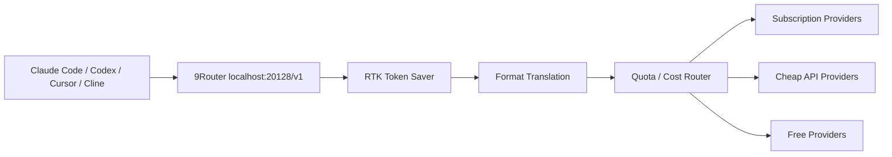
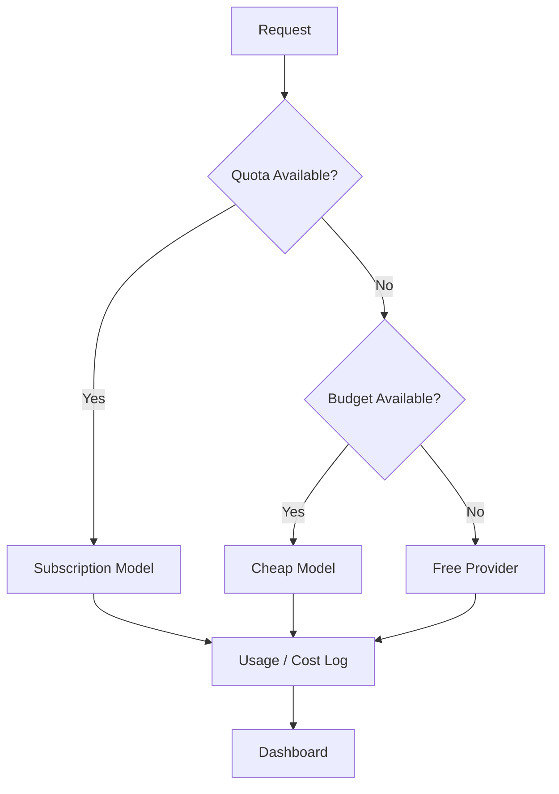

AI 코딩 도구를 오래 쓰면 병목은 모델 하나의 성능보다 **운영 비용과 중단 없는 연결**로 옮겨 간다.

- Claude Code quota가 먼저 닳고
- Codex나 Copilot 구독은 남아 있고
- free provider는 언제 막힐지 모르고
- `git diff`, `grep`, `tree` 같은 tool output이 토큰을 잡아먹고
- provider마다 API format이 다르다

`9Router`가 흥미로운 이유는 이 문제를 “더 좋은 모델 하나”로 풀지 않는다는 점이다.  
대신 코딩 에이전트 앞단에 **라우터, 토큰 절감기, 포맷 변환기, quota 추적기, fallback 엔진**을 하나로 둔다.

<!--more-->

## Sources

- GitHub: <https://github.com/decolua/9router>
- Website: <https://9router.com>
- RTK: <https://github.com/rtk-ai/rtk>

## 1. 9Router는 모델이 아니라 프록시 라우터다

9Router의 기본 구조는 간단하다.

Claude Code, Codex, Cursor, Cline 같은 코딩 도구는 9Router의 local endpoint를 바라본다.

```text
http://localhost:20128/v1
```

그러면 9Router가 뒤에서:

- provider 선택
- format translation
- token compression
- quota tracking
- fallback
- OAuth token refresh

를 처리한다.

즉 사용자는 코딩 도구의 endpoint만 9Router로 바꾸고,  
실제 요청은 subscription provider, cheap API, free provider 중 하나로 흘려보낸다.



이 관점에서 9Router는 “새 코딩 에이전트”가 아니다.  
기존 코딩 에이전트를 그대로 두고, **모델 연결 계층만 교체하는 router layer**다.

## 2. 핵심은 “무료”보다 3단 fallback 구조다

README는 무료 AI 코딩을 강하게 내세운다.  
하지만 실전에서 더 중요한 개념은 `Smart 3-Tier Fallback`이다.

9Router가 제안하는 기본 순서는 이렇다.

1. Subscription
2. Cheap
3. Free

예를 들어:

- 먼저 Claude Code, Codex, GitHub Copilot 같은 기존 구독을 쓴다
- quota가 닳거나 에러가 나면 GLM, MiniMax 같은 저렴한 API로 넘어간다
- 그래도 안 되면 Kiro, OpenCode Free, Vertex credit 같은 free/credit tier로 넘어간다

즉 “무조건 무료 모델만 쓰자”가 아니다.

더 정확한 전략은:

- 이미 돈 낸 구독을 먼저 다 쓰고
- 비싼 API는 아끼고
- 저렴한 fallback을 준비하고
- free tier는 중단 방지용으로 둔다

에 가깝다.

이 구조가 중요한 이유는 코딩 세션은 중간에 끊기는 순간 비용이 커지기 때문이다.  
작업 흐름이 끊기면 단순히 한 요청이 실패한 것이 아니라, 컨텍스트와 집중도까지 같이 깨진다.

## 3. RTK Token Saver는 9Router의 진짜 실무 포인트다

9Router에서 가장 실무적인 기능은 `RTK Token Saver`다.

AI 코딩 에이전트는 도구 출력을 많이 만든다.

- `git diff`
- `git status`
- `grep`
- `find`
- `ls`
- `tree`
- log dump

이런 출력은 사람이 보기엔 간단한 터미널 결과지만, LLM 입장에서는 입력 토큰을 크게 잡아먹는다.

9Router는 요청이 provider로 가기 전에 tool output을 압축한다.

README 기준 RTK는:

- git-diff
- git-status
- grep
- find
- ls
- tree
- dedup-log
- smart-truncate
- read-numbered
- search-list

같은 filter를 사용한다.

중요한 점은 이 압축이 모델 호출 전에 일어난다는 것이다.  
즉 Claude format, OpenAI format, Gemini format으로 변환되기 전에 공통으로 적용된다.

README는 예시로:

- RTK 없음: 47K tokens
- RTK 있음: 28K tokens
- 약 40% 절감

을 제시한다.

토큰 절감은 단순 비용 문제가 아니다.  
입력 토큰을 줄이면 같은 컨텍스트 창 안에서 더 많은 작업 이력을 유지할 수 있다.

## 4. Format Translation은 여러 코딩 도구를 같은 endpoint로 묶는다

9Router의 또 다른 핵심은 format translation이다.

README는 다음 포맷 간 변환을 언급한다.

- OpenAI
- Claude
- Gemini
- Cursor
- Kiro
- Vertex
- Antigravity
- Ollama
- OpenAI Responses

이 기능 덕분에 사용자는 코딩 도구가 기대하는 endpoint 형식을 유지하면서,  
뒤쪽 provider는 다르게 선택할 수 있다.

예를 들어:

- Claude Code 계열 도구
- Codex
- Cursor
- Cline
- OpenCode
- OpenClaw
- Copilot

등이 모두 9Router를 `OpenAI-compatible endpoint`처럼 바라볼 수 있다.

이건 단순 편의 기능이 아니다.

AI 코딩 환경에서 진짜 lock-in은 모델만이 아니라:

- 인증 방식
- endpoint 형식
- streaming format
- tool call format
- quota 정책

에서도 발생한다.

9Router는 이 차이를 중간에서 흡수하려는 시도다.

## 5. Dashboard가 필요한 이유는 “라우팅은 관측 없이는 위험하기” 때문이다

모델 라우팅은 편하지만, 잘못 쓰면 어디로 요청이 갔는지 모르게 된다.

그래서 9Router의 dashboard는 단순 UI가 아니라 운영 계층에 가깝다.

README 기준 dashboard에서 다루는 것은:

- provider 연결
- API key 관리
- quota tracking
- reset countdown
- token usage
- cost estimation
- endpoint settings
- debug logs
- custom combo

이다.

즉 9Router를 제대로 쓰려면 “무료 모델 연결기”로만 보지 말고,  
**내 AI 코딩 트래픽이 어디로 가고 얼마나 쓰이는지 보는 관측면**으로 봐야 한다.



## 6. Multi-account는 편법이라기보다 redundancy 기능으로 읽어야 한다

9Router는 multi-account support도 제공한다.

여러 계정을 provider별로 붙이고:

- round-robin
- priority-based routing
- quota exhausted fallback

을 할 수 있다.

이 기능은 “제한을 우회한다”는 식으로 과하게 읽으면 위험하다.  
각 provider의 약관과 조직 정책을 지키는 범위 안에서 사용해야 한다.

하지만 운영 관점에서는 의미가 있다.

팀에서 여러 합법적 계정과 구독을 쓰고 있다면:

- 특정 계정 quota 소진
- provider 장애
- OAuth token 만료
- 모델 temporary error

에 대한 redundancy 계층을 만들 수 있기 때문이다.

## 7. 무료 provider는 전략적으로 써야 한다

README는 Kiro AI, OpenCode Free, Vertex credit 같은 free provider를 언급한다.

다만 free provider는 언제든 조건이 바뀔 수 있다.

README에도 iFlow, Qwen, Gemini CLI free tier가 2026년에 중단되었다는 note가 있다.  
이 문장 하나만 봐도 free tier를 production backbone으로 두는 것은 위험하다.

따라서 실전 전략은 다음이 더 안전하다.

- 중요한 작업: subscription 또는 paid cheap provider
- 실험/초안: free provider
- quota 소진 시: fallback
- 장기 운영: dashboard로 실제 사용량 추적

즉 9Router의 “free”는 비용 절감의 한 축이지, 안정성의 전부가 아니다.

## 8. 기존 모델 라우터들과 다른 점은 코딩 에이전트의 tool output을 정면으로 다룬다는 것이다

모델 라우터는 이미 많다.

하지만 9Router가 코딩 에이전트용으로 흥미로운 이유는 tool output 문제를 직접 겨냥한다는 점이다.

일반 채팅에서는 사람이 직접 쓴 프롬프트가 대부분이다.

반면 코딩 에이전트에서는:

- 파일 읽기 결과
- grep 결과
- diff 결과
- test log
- error stack
- directory tree

가 입력의 큰 비중을 차지한다.

그래서 코딩 에이전트의 비용 최적화는 모델 가격표만 봐서는 부족하다.  
`tool_result` 자체를 줄이는 계층이 필요하다.

이 지점에서 9Router는 단순 OpenAI-compatible proxy가 아니라  
**agent tool traffic optimizer**에 가까워진다.

## 9. 최신 저장소 메타데이터

GitHub API 기준 현재 정보는 다음과 같다.

- 저장소: `decolua/9router`
- 설명: Claude Code, Codex, Cursor, Cline, Copilot, Antigravity 등을 40+ provider와 100+ model에 연결하는 AI router
- 기본 브랜치: `master`
- stars: `7,886`
- forks: `1,287`
- 주 언어: `JavaScript`
- 라이선스: `MIT`
- 최근 push: `2026-05-11`

설치 경로는 npm global install이 가장 단순하다.

```bash
npm install -g 9router
9router
```

기본 dashboard는:

```text
http://localhost:20128
```

OpenAI-compatible API endpoint는:

```text
http://localhost:20128/v1
```

이다.

## 10. 결론: 9Router는 무료 모델 찾기가 아니라 AI 코딩 트래픽 운영 문제를 푸는 도구다

9Router를 가장 얕게 읽으면 “무료 Claude/GPT/Gemini를 코딩 도구에 연결한다”가 된다.

하지만 더 중요한 해석은 따로 있다.

9Router는:

- 코딩 도구 앞단에 놓이는 router
- provider format translator
- token saver
- quota tracker
- subscription maximizer
- cheap/free fallback manager

이다.

즉 이 프로젝트의 핵심은 “모델 하나를 공짜로 쓰는 법”보다  
**AI 코딩 트래픽을 중단 없이, 더 싸게, 더 관측 가능하게 운영하는 법**에 있다.

무료 provider는 바뀔 수 있고, quota 정책도 바뀐다.  
하지만 코딩 에이전트 앞단에 라우팅·압축·관측 계층을 둔다는 패턴은 계속 중요해질 가능성이 높다.

AI 코딩이 장난감에서 일상 업무로 넘어갈수록,  
좋은 모델을 고르는 일만큼 중요한 것은 **모델 사용을 운영하는 계층**을 갖추는 일이다.
