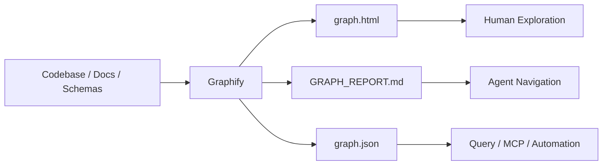
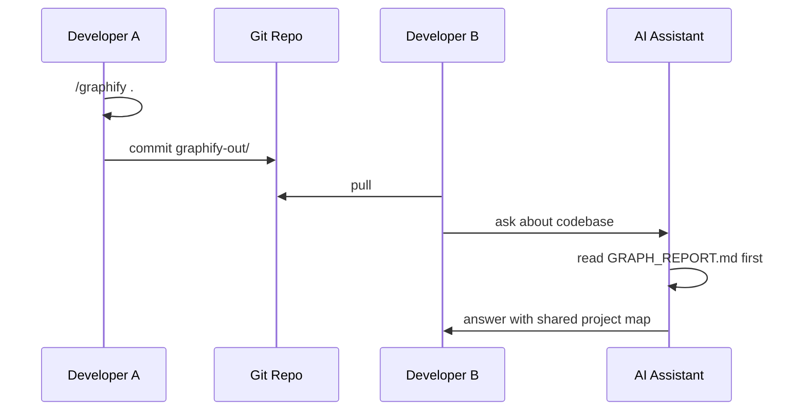

AI 코딩 도구를 쓸 때 가장 자주 하는 일은 결국 “맥락 전달”이다.

- 이 파일을 읽어라
- 저 폴더를 봐라
- 이 함수와 저 모듈의 관계를 이해해라
- DB schema와 API route가 어떻게 이어지는지 봐라

문제는 코드베이스가 커질수록 파일을 하나씩 던져 주는 방식이 금방 한계에 부딪힌다는 점이다.  
`Graphify`가 흥미로운 이유는 이 문제를 “더 많이 읽히기”가 아니라 **코드베이스를 쿼리 가능한 지식 그래프로 바꾸기**로 풀기 때문이다.

<!--more-->

## Sources

- Threads: <https://www.threads.com/@feelfree_ai/post/DYMUzLoE158>
- GitHub: <https://github.com/safishamsi/graphify>

## 1. 이번 Graphify 글의 초점은 토큰 절감보다 “팀 공유 산출물”이다

Graphify는 이미 여러 번 다룰 만큼 흥미로운 도구다.

기존에는 주로:

- 71.5배 토큰 절감
- always-on knowledge graph
- OpenCode / Claude Code / Codex와의 연결

같은 관점이 중요했다.

이번 Threads 글에서 새롭게 강조되는 지점은 조금 다르다.

**분석 결과물 자체를 Git에 커밋해 팀 전체가 같은 코드 맥락을 공유할 수 있다**는 점이다.

즉 Graphify를 개인용 탐색 도구로만 보면 절반만 보는 것이다.  
더 중요한 운영 방식은 `graphify-out/`을 팀의 shared artifact로 다루는 것이다.

## 2. Graphify가 만들어 주는 핵심 산출물 3개

현재 README 기준 Graphify를 실행하면 기본적으로 다음 세 가지가 중요하다.

```text
graphify-out/
├── graph.html
├── GRAPH_REPORT.md
└── graph.json
```

각 파일의 역할은 다르다.

### graph.html

브라우저에서 여는 시각화 파일이다.

- node 클릭
- search
- filter
- community 탐색

같은 작업에 좋다.

사람이 “이 코드베이스가 어떻게 생겼는지” 빠르게 감을 잡는 데 유리하다.

### GRAPH_REPORT.md

AI 에이전트가 먼저 읽기 좋은 요약 진입점이다.

여기에는:

- god nodes
- surprising connections
- suggested questions
- inline rationale
- confidence tags

같은 정보가 들어간다.

즉 `GRAPH_REPORT.md`는 단순 리포트가 아니라 **에이전트용 지도 첫 페이지**에 가깝다.

### graph.json

전체 그래프 원본이다.

나중에:

- query
- shortest path
- node neighbor 탐색
- MCP server

로 다시 사용할 수 있다.

즉 `graph.json`은 “예쁜 결과물”이 아니라 **지속 재사용 가능한 구조화된 memory artifact**다.



## 3. “코드를 전부 읽히는 것”과 “관계를 먼저 주는 것”은 다르다

AI 에이전트에게 파일을 통째로 많이 넣으면 더 잘할 것 같지만, 실제로는 그렇지 않을 때가 많다.

문제가 되는 것은 파일 수가 아니라:

- 어떤 모듈이 중심인지
- 어떤 함수가 어디서 호출되는지
- DB schema가 어느 API와 이어지는지
- 문서의 설계 의도가 어느 코드에 반영됐는지
- 어떤 연결이 추론이고 어떤 연결이 실제 추출인지

같은 **관계 정보**다.

Graphify는 이 관계를 먼저 만든다.

README 기준으로 code는 tree-sitter 기반 AST와 call-graph pass로 분석하고,  
문서·PDF·이미지·영상 같은 비정형 입력은 모델을 통해 개념과 관계를 추출한다.

즉 Graphify의 가치는 “검색”보다  
**코드베이스를 relationship-first representation으로 바꾸는 것**에 있다.

## 4. Threads의 “100% 로컬” 표현은 코드 분석에 대해서는 맞지만, 전체 입력에는 예외가 있다

Threads 원문은 “코드는 100% 로컬에서 분석”된다고 설명한다.  
이 부분은 Graphify README의 privacy 설명과도 맞다.

공식 README 기준:

- code files는 tree-sitter로 로컬 처리
- video / audio는 faster-whisper로 로컬 전사
- telemetry 없음

다만 중요한 예외가 있다.

Docs, PDFs, images는 semantic extraction을 위해 사용 중인 AI assistant의 model API로 전달될 수 있다.  
Headless extraction도 Gemini, Kimi, Claude, OpenAI, Ollama, Bedrock 같은 backend 설정을 요구한다.

따라서 정확히는 이렇게 이해해야 한다.

- **코드 구조 분석은 로컬**
- **문서/PDF/이미지 의미 추출은 설정한 모델 backend에 따라 외부 API를 쓸 수 있음**
- **민감한 문서까지 넣을 때는 `.graphifyignore`와 backend 정책을 확인해야 함**

이 뉘앙스는 실무에서 중요하다.  
“코드 유출 방지”는 강점이지만, 모든 입력이 항상 완전 로컬이라고 생각하면 위험하다.

## 5. 팀에서 쓰려면 `graphify-out/`을 커밋 가능한 artifact로 봐야 한다

Graphify README는 `graphify-out/`을 Git에 커밋하는 팀 워크플로를 명시한다.

흐름은 이렇다.

1. 한 사람이 `/graphify .`를 실행한다
2. 생성된 `graphify-out/`을 commit한다
3. 팀원이 pull한다
4. 각자의 AI assistant가 즉시 같은 graph를 읽는다
5. 이후 commit hook으로 graph를 갱신한다

여기서 핵심은 “모두가 같은 지도에서 출발한다”는 점이다.

보통 AI 코딩 작업은 사람마다:

- 다른 세션
- 다른 컨텍스트
- 다른 요약
- 다른 파일 탐색 경로

를 갖는다.

Graphify를 팀 artifact로 커밋하면 최소한 코드베이스의 구조 지도는 공유된다.



## 6. hook이 붙으면 그래프는 문서가 아니라 살아 있는 map이 된다

Graphify는 `graphify hook install`을 제공한다.

README 기준 이 hook은:

- commit 후 graph를 rebuild하고
- AST 기반 업데이트는 API 비용 없이 처리하고
- `graph.json` merge driver도 설정해 conflict marker 문제를 줄인다

즉 팀에서 중요한 것은 “한 번 예쁜 그래프를 만드는 것”이 아니다.

중요한 것은 코드가 바뀔 때마다 그래프도 따라 움직이게 하는 것이다.

이 지점에서 Graphify는 문서 생성 도구가 아니라  
**코드베이스의 구조 index를 유지하는 개발 인프라**가 된다.

## 7. 다양한 AI 도구 지원은 “도구별 지식 단절”을 줄인다

현재 v7 README 기준 Graphify는 굉장히 많은 플랫폼을 지원한다.

- Claude Code
- Codex
- OpenCode
- Cursor
- Gemini CLI
- GitHub Copilot CLI
- VS Code Copilot Chat
- Aider
- OpenClaw
- Factory Droid
- Trae
- Hermes
- Kimi Code
- Kiro
- Pi coding agent
- Google Antigravity

이 목록이 중요한 이유는 단순 호환성 자랑이 아니다.

팀 안에서 사람마다 쓰는 AI 도구가 달라도,  
`GRAPH_REPORT.md`와 `graph.json`이라는 공통 산출물을 기준으로 같은 프로젝트 지도를 공유할 수 있다는 뜻이다.

즉 Graphify는 특정 AI coding assistant의 plugin이라기보다,  
**AI 코딩 도구들 사이의 공통 codebase map layer**에 가까워지고 있다.

## 8. `GRAPH_REPORT.md`를 먼저 읽게 만드는 것이 핵심 운영 패턴이다

Graphify README는 각 플랫폼별 install 명령을 제공한다.

예를 들어:

- `graphify claude install`
- `graphify codex install`
- `graphify opencode install`
- `graphify cursor install`
- `graphify pi install`

이 설정의 핵심은 AI assistant가 코드 질문에 답하기 전에 `GRAPH_REPORT.md`를 먼저 읽게 만드는 것이다.

이게 중요한 이유는 간단하다.

AI가 처음부터 grep으로 헤매는 대신:

- god nodes
- surprising connections
- suggested questions
- confidence tags

를 먼저 보고 시작한다.

결국 Graphify의 실전 가치는 `graph.html`의 시각화보다,  
에이전트의 첫 탐색 경로를 바꾸는 데 있다.

## 9. 최신 저장소 메타데이터

GitHub API 기준 현재 정보는 다음과 같다.

- 저장소: `safishamsi/graphify`
- 설명: 코드, SQL schema, R script, shell script, docs, papers, images, videos를 queryable knowledge graph로 변환
- 기본 브랜치: `v7`
- stars: `46,384`
- forks: `5,031`
- 주 언어: `Python`
- 라이선스: `MIT`
- 최근 push: `2026-05-09`

README 기준 설치 패키지는 `graphifyy`이고, CLI 명령은 `graphify`다.  
PyPI의 다른 `graphify*` 패키지와 혼동하지 말라는 안내도 포함되어 있다.

## 10. 결론: Graphify는 코드 읽기 도구가 아니라 팀의 shared context artifact다

Graphify를 개인이 “코드 이해 도우미”로 쓰는 것도 충분히 가치 있다.

하지만 이번 Threads 글이 짚은 더 중요한 포인트는 따로 있다.

**코드베이스의 관계 지도를 파일로 만들고, 그 파일을 팀과 에이전트가 함께 쓰는 것.**

이 관점에서 Graphify는:

- RAG보다 구조적이고
- 단순 요약보다 재사용 가능하고
- 문서보다 최신성을 유지하기 쉽고
- 에이전트별 세션 기억보다 공유 가능하다

물론 모든 입력이 항상 완전 로컬이라는 식으로 과장해서는 안 된다.  
코드 분석은 로컬이지만, 문서·이미지·PDF 의미 추출은 사용하는 모델 backend에 따라 외부 API를 탈 수 있다.

그럼에도 Graphify가 던지는 방향은 분명하다.

앞으로 AI 코딩의 핵심은 “파일을 얼마나 많이 넣느냐”가 아니라,  
**코드베이스의 관계와 설계 의도를 얼마나 좋은 공유 artifact로 만들어 두느냐**가 될 가능성이 크다.
