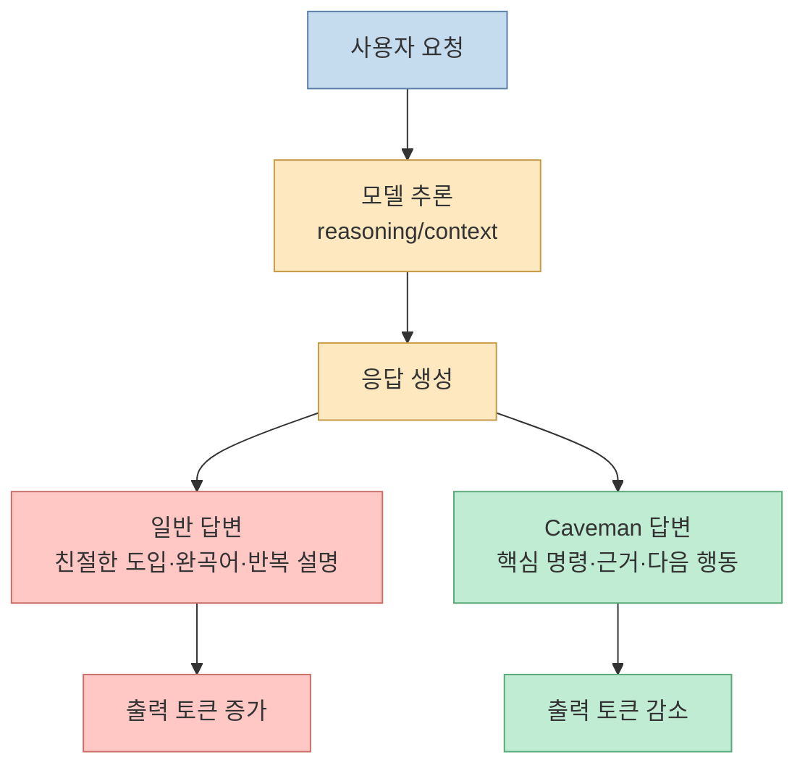
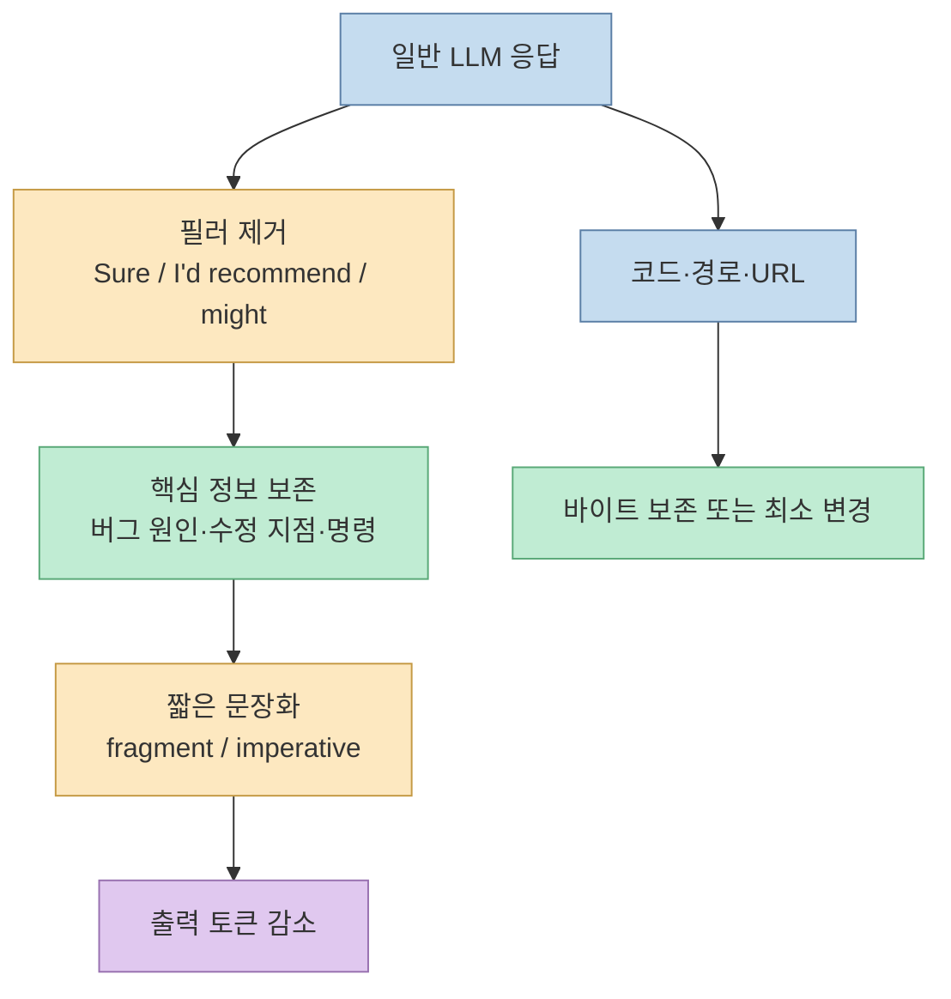
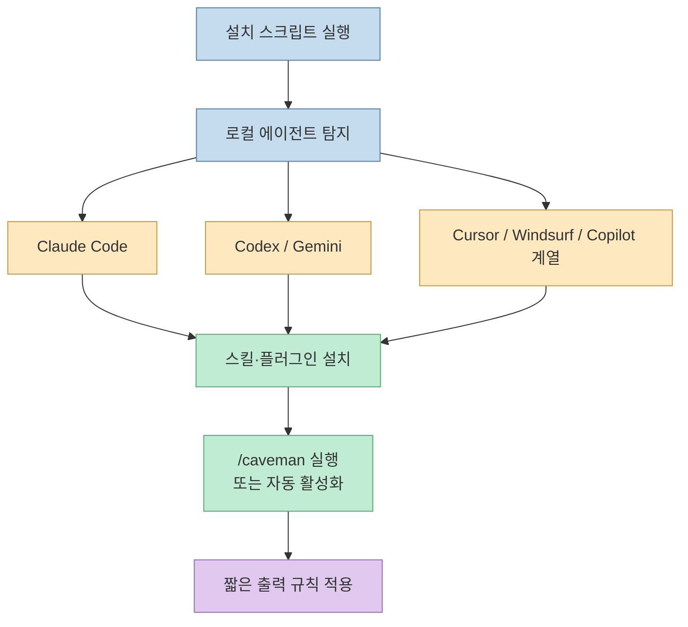
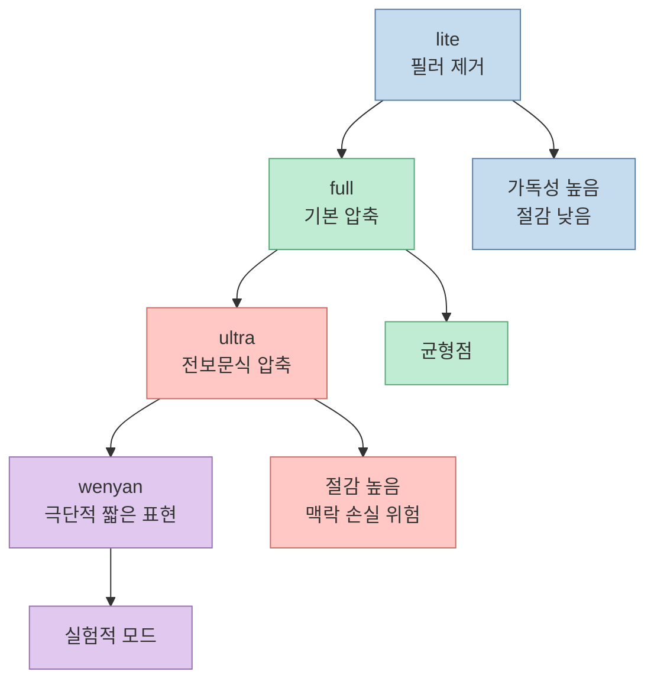
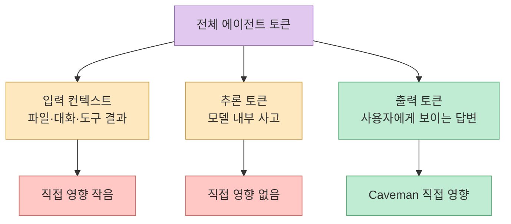
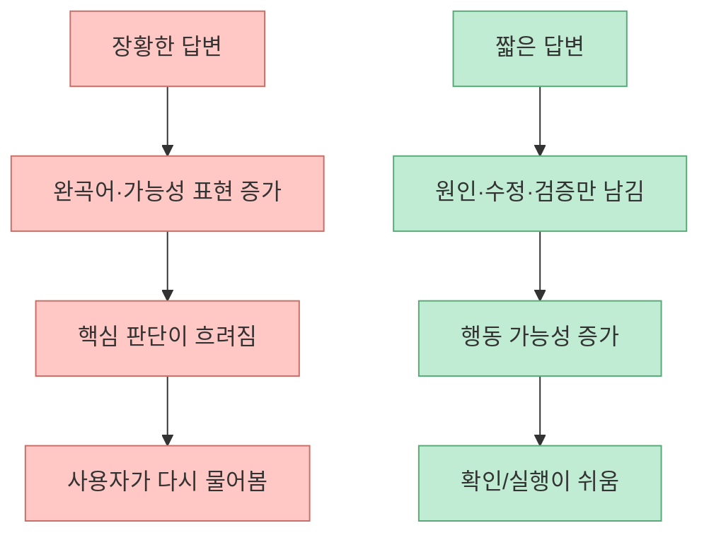
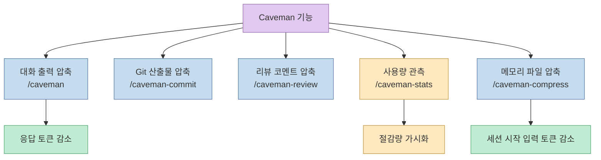
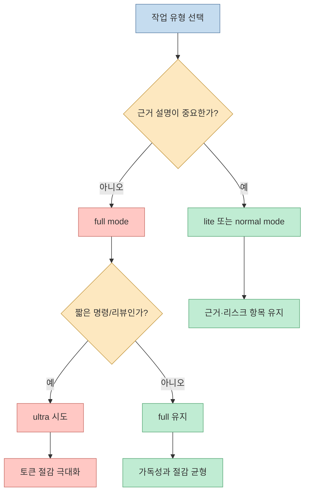

`Caveman`의 핵심은 장난처럼 보이지만 꽤 실용적입니다. Claude Code가 매번 친절한 도입부, 완곡한 표현, 반복 설명을 붙이는 대신 "필요한 기술 정보만 짧게 말하라"는 규칙을 스킬로 고정합니다. 영상은 이 방식을 "우가우가"라고 표현하며, 특정 사례에서 `1214 → 294 tokens`, 즉 `87%` 수준의 절감을 소개합니다. [2:43](https://youtu.be/iEScgjg_eR4?t=163)

<!--more-->

## Sources

- <https://youtu.be/iEScgjg_eR4?si=Q48YIIhT5iPGzq0p>
- Caveman GitHub README: <https://github.com/JuliusBrussee/caveman>
- Caveman 공식 페이지: <https://juliusbrussee.github.io/caveman/>

> 참고: 이 영상은 한국어 자동 자막만 제공되었고, 현재 환경에서는 YouTube 자막 API가 IP 차단으로 실패했습니다. 따라서 영상 내용은 공개 설명란의 타임스탬프와 제목/설명 메타데이터를 기준으로 삼고, 수치와 기능 설명은 Caveman 원본 README 및 공식 페이지로 교차 확인했습니다.

## 문제는 모델이 똑똑하지 않은 게 아니라, 너무 많이 말한다는 점이다

영상의 출발점은 "AI 답변이 길다"는 불편입니다. Claude Code 같은 코딩 에이전트는 실제 수정 내용보다 주변 설명을 더 길게 붙일 때가 있습니다. 예를 들어 "좋은 질문입니다", "제가 보기에는", "다음과 같이 접근할 수 있습니다" 같은 문장은 사람에게는 부드럽지만, 반복 작업에서는 출력 토큰과 대기 시간을 늘립니다. 영상은 이 문제를 초반부에서 "길게 답하는 AI의 문제점"으로 잡고 들어갑니다. [0:20](https://youtu.be/iEScgjg_eR4?t=20)

중요한 구분이 있습니다. Caveman은 모델의 추론을 압축하는 도구가 아닙니다. 원본 README도 "thinking/reasoning tokens"는 건드리지 않고 출력 토큰만 줄인다고 설명합니다. 즉 모델이 내부적으로 문제를 덜 생각하게 만드는 것이 아니라, 최종 응답의 말투와 포맷을 짧게 만드는 쪽에 가깝습니다. [Caveman README](https://github.com/JuliusBrussee/caveman)

이 관점으로 보면 Caveman은 "품질 향상 플러그인"이라기보다 **출력 인터페이스를 바꾸는 비용 제어 장치** 에 가깝습니다. 코드는 그대로 쓰고, 기술 용어는 유지하고, 불필요한 말만 줄이는 것이 목표입니다.

## Caveman의 작동 원리: 원시인 말투가 아니라 출력 규칙이다

영상은 `Caveman`의 정체와 작동 원리를 약 1분대에서 소개합니다. [1:13](https://youtu.be/iEScgjg_eR4?t=73) 겉으로는 "원시인처럼 말하기"지만, 실제로는 다음 규칙을 에이전트에게 주입하는 스킬입니다.

- 인사말과 완곡어 제거
- 핵심 판단을 먼저 제시
- 기술 용어와 코드 블록은 보존
- 설명은 짧은 단문 또는 파편적 문장으로 압축
- 커밋 메시지, 리뷰 코멘트, 메모리 파일 압축 같은 반복 산출물을 짧게 생성

Caveman 공식 페이지도 "technical imperatives"는 유지하고 "conversational padding"을 제거한다고 설명합니다. 또한 "Code Preservation"을 별도 항목으로 두어 코드 블록, Git commit, PR description은 정상적으로 보존한다는 점을 강조합니다. [Caveman 공식 페이지](https://juliusbrussee.github.io/caveman/)

따라서 "우가우가"는 말투가 목적이 아니라 압축 프레임입니다. 사람이 읽기에는 조금 웃기지만, 매일 수십 번 반복되는 코드 리뷰, 디버깅, 커밋 작성, 상태 보고에서는 오히려 원하는 답에 더 빨리 도달하게 해 줍니다.

## 설치와 적용 범위: 한 줄 설치, 여러 에이전트 자동 인식

영상은 설치가 한 줄이고 30개 이상의 에이전트를 자동 인식한다고 설명합니다. [1:58](https://youtu.be/iEScgjg_eR4?t=118) README 기준 설치 명령은 macOS/Linux/WSL/Git Bash에서 `install.sh`를 실행하는 방식이고, Windows에서는 PowerShell 설치 스크립트를 제공합니다. Caveman README는 Claude Code뿐 아니라 Codex, Gemini, Cursor, Windsurf, Cline, Copilot 등 다양한 에이전트에 적용된다고 소개합니다. [Caveman README](https://github.com/JuliusBrussee/caveman)

사용 흐름은 단순합니다. 설치 후 `/caveman`을 실행하거나, "talk like caveman" 같은 자연어로 모드를 켭니다. 정상 말투로 돌아가려면 "normal mode"라고 지시합니다. Claude Code에서는 세션마다 자동 활성화되도록 훅과 상태 파일을 사용하는 흐름도 README에 설명되어 있습니다.

설치가 쉽다는 점은 장점이지만, 팀 환경에서는 바로 전역 적용하기보다 개인 세션 또는 특정 작업 유형부터 적용하는 것이 안전합니다. 특히 신규 팀원 온보딩 문서, 장애 보고서, 아키텍처 의사결정 기록처럼 문장 맥락이 중요한 산출물에는 지나친 압축이 오히려 손실이 될 수 있습니다.

## 4단계 모드: 짧게, 더 짧게, 매우 짧게

영상은 4단계 모드를 별도 구간으로 다룹니다. [2:21](https://youtu.be/iEScgjg_eR4?t=141) README에는 `/caveman [lite|full|ultra|wenyan]` 형태가 소개되어 있습니다. 의미를 실무 관점으로 풀면 다음과 같습니다.

- `lite`: 인사말과 군더더기만 줄이는 수준
- `full`: 기본 Caveman 말투, 짧은 단문 중심
- `ultra`: 전보문처럼 더 압축된 응답
- `wenyan`: 고전 한문식으로 더 짧은 표현을 노리는 모드

실무에서는 `lite`나 `full`이 가장 무난합니다. `ultra`는 빠르지만, 요구사항 해석이나 리스크 설명이 필요한 작업에서는 사람이 재질문하게 될 수 있습니다. 재질문이 늘어나면 단일 응답의 출력 토큰은 줄어도 전체 대화 토큰은 다시 늘어납니다.

따라서 모드는 "얼마나 웃기게 말할 것인가"가 아니라 **압축률과 설명력 사이의 다이얼** 로 보는 편이 정확합니다.

## 벤치마크 해석: 87%는 가능하지만, 모든 비용이 87% 줄지는 않는다

영상 설명란은 벤치마크 구간에서 `1214 → 294 토큰` 사례를 제시합니다. [2:43](https://youtu.be/iEScgjg_eR4?t=163) Caveman README의 벤치마크도 평균 `65%` 출력 감소, 범위 `22~87%`를 제시합니다. 예시에는 React re-render 설명, auth middleware 수정, PostgreSQL race condition 디버깅, Docker multi-stage build 등이 포함됩니다. [Caveman README](https://github.com/JuliusBrussee/caveman)

하지만 여기서 가장 중요한 단어는 "출력"입니다. 에이전트 비용은 크게 입력 컨텍스트, 도구 호출 결과, 추론 토큰, 출력 토큰으로 나뉩니다. Caveman이 직접 줄이는 것은 주로 마지막입니다. README도 이 점을 "reasoning tokens remain unaffected"라고 명확히 선을 긋습니다. [Caveman 공식 페이지](https://juliusbrussee.github.io/caveman/)

그래서 "87% 절감"은 특정 출력 응답의 절감률로 이해해야 합니다. 전체 월간 청구액이나 Claude 사용 한도가 똑같이 87% 줄어든다고 해석하면 과장입니다. 반대로 말하면, 짧은 질의응답·리뷰·요약·디버깅 설명처럼 출력 비중이 큰 작업에서는 체감 효과가 크고, 대규모 코드베이스를 읽고 도구 출력을 많이 주고받는 작업에서는 절감률이 낮아질 수 있습니다.

## 왜 짧을수록 정확도가 오를 수도 있는가

영상은 "짧을수록 정확도 오르는 이유"를 별도 구간으로 다룹니다. [3:26](https://youtu.be/iEScgjg_eR4?t=206) 이 주장은 조심해서 읽어야 합니다. 짧은 답변이 항상 더 정확하다는 뜻은 아닙니다. 다만 불필요한 수사와 자신감 있는 장황함이 줄어들면, 답변이 더 검증 가능한 형태가 됩니다.

예를 들어 코드 리뷰에서 긴 설명보다 `L42: null guard 없음. user 없으면 crash.` 같은 한 줄은 확인하기 쉽습니다. 디버깅에서도 "가능성이 있습니다"라는 문단보다 "원인: token expiry 비교 연산. `<`를 `<=`로 수정" 같은 형태가 더 바로 실행됩니다. Caveman README도 기술 용어는 유지하고, 문장만 줄인다는 방향을 강조합니다. [Caveman README](https://github.com/JuliusBrussee/caveman)

다만 설계 리뷰, 보안 판단, 장애 회고처럼 맥락과 근거가 중요한 작업에서는 "짧음"만으로 충분하지 않습니다. 이때는 Caveman을 끄거나 `lite`로 낮추고, "판단 근거는 항목별로 유지하라" 같은 추가 규칙을 함께 쓰는 편이 낫습니다.

## 부가 기능: commit, review, stats, compress

영상은 후반부에서 부가 기능을 다룹니다. [3:59](https://youtu.be/iEScgjg_eR4?t=239) README 기준 주요 기능은 다음 네 갈래입니다.

- `/caveman-commit`: 50자 이하 subject를 지향하는 짧은 Conventional Commit 메시지
- `/caveman-review`: 한 줄 PR 리뷰 코멘트
- `/caveman-stats`: Claude Code 세션 로그를 읽어 토큰 절감량과 추정 금액을 보여주는 통계
- `/caveman-compress <file>`: `CLAUDE.md` 같은 메모리 파일을 짧게 다시 써서 세션 시작 입력 토큰을 줄이는 기능

특히 `/caveman-compress`는 출력 압축과 성격이 다릅니다. 일반 Caveman 모드가 "지금 답변"을 줄인다면, compress는 매 세션마다 읽히는 메모리 파일 자체를 줄입니다. README는 실제 메모리 파일 샘플에서 평균 `46%` 입력 토큰 절감을 제시합니다. [Caveman README](https://github.com/JuliusBrussee/caveman)

실전에서는 `stats`와 `compress`가 중요합니다. 말투를 짧게 만드는 것만으로는 효과를 과장하기 쉽습니다. 반면 통계로 실제 절감량을 보고, 자주 로드되는 지침 파일을 압축하면 "기분상 빨라졌다"가 아니라 "어느 구간에서 토큰이 줄었는지"를 확인할 수 있습니다.

## 실전 적용 포인트

첫째, Caveman은 디버깅 질의, 코드 리뷰, 커밋 메시지, 짧은 설계 비교처럼 **반복적이고 출력이 긴 작업** 에 먼저 적용하는 것이 좋습니다. 영상도 설치와 사용법을 후반부에서 다시 정리합니다. [4:46](https://youtu.be/iEScgjg_eR4?t=286)

둘째, 아키텍처 의사결정 문서나 장애 회고처럼 설명의 맥락이 중요한 작업에서는 기본 모드를 낮추거나 끄는 편이 안전합니다. 짧은 답은 빠르지만, 독자가 나중에 왜 그런 결론이 나왔는지 복원해야 하는 문서에는 충분한 근거가 필요합니다.

셋째, `/caveman-compress`로 `CLAUDE.md`, 프로젝트 메모, 개인 작업 규칙을 줄일 때는 반드시 백업과 diff 확인을 해야 합니다. README는 코드/URL/경로 보존을 강조하지만, 팀 규칙이나 정책 문장은 너무 과하게 줄이면 해석 여지가 생길 수 있습니다. [Caveman README](https://github.com/JuliusBrussee/caveman)

## 핵심 요약

- 영상의 주제는 Claude Code 답변을 "우가우가"식으로 짧게 만들어 출력 토큰을 줄이는 Caveman 도구입니다. [0:00](https://youtu.be/iEScgjg_eR4?t=0)
- Caveman은 추론 토큰을 줄이는 도구가 아니라, 최종 응답의 말투와 포맷을 압축하는 출력 제어 스킬입니다.
- 원본 README는 평균 `65%` 출력 감소, 벤치마크 범위 `22~87%`, 평균 `1214 → 294 tokens`를 제시합니다. [Caveman README](https://github.com/JuliusBrussee/caveman)
- 효과가 큰 영역은 짧은 질의응답, PR 리뷰, 커밋 메시지, 디버깅 설명처럼 출력 낭비가 많은 작업입니다.
- 전체 에이전트 비용은 입력 컨텍스트와 도구 결과의 비중이 크므로, "출력 87% 절감"을 "전체 비용 87% 절감"으로 해석하면 안 됩니다.
- 실전에서는 `lite/full`을 기본으로 두고, 문서화나 중요한 판단에는 근거 설명을 유지하는 방식이 안전합니다.

## 결론

Caveman은 농담 같은 이름과 달리, 코딩 에이전트 사용에서 꽤 현실적인 문제를 건드립니다. 모델이 똑똑해질수록 답변은 친절해지고, 친절함은 종종 토큰 비용과 대기 시간으로 돌아옵니다. Caveman은 그 친절함을 전부 없애자는 것이 아니라, 반복 작업에서는 **친절한 문장보다 실행 가능한 압축 정보가 더 가치 있을 수 있다** 는 선택지를 제공합니다.

다만 이것은 만능 절감기가 아닙니다. 긴 컨텍스트를 읽는 비용, 도구 호출 결과, reasoning 토큰은 그대로 남습니다. 그래서 Caveman은 "에이전트 비용 최적화" 전체 전략의 한 조각으로 보는 편이 좋습니다. 출력은 Caveman으로 줄이고, 입력 컨텍스트는 메모리/문서/도구 결과 정리로 줄이며, 중요한 판단은 여전히 충분한 근거를 남기는 균형이 필요합니다.
