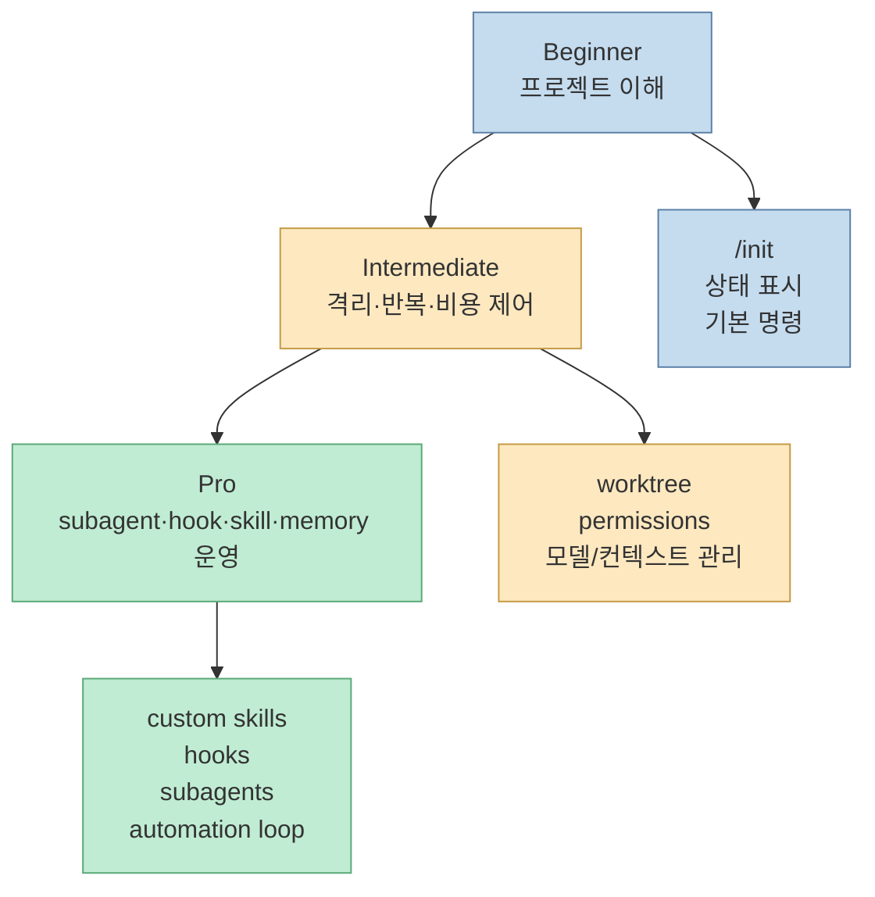
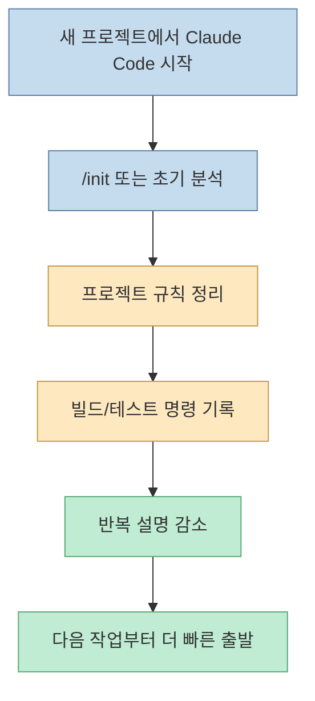
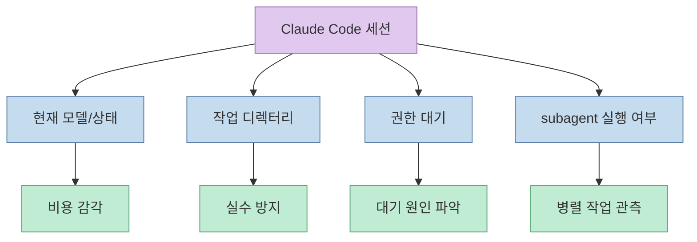
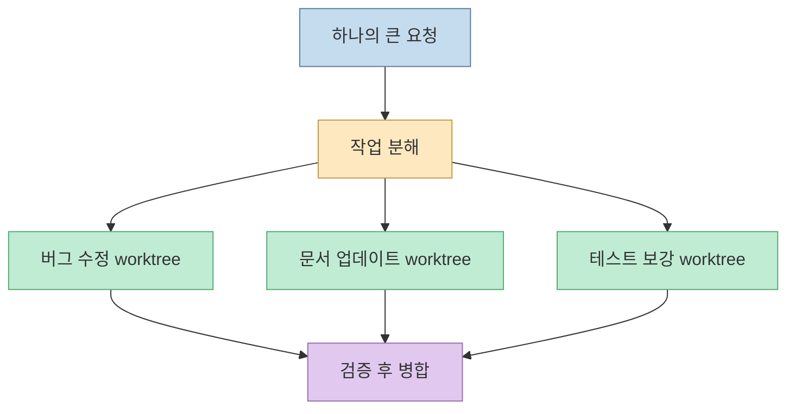
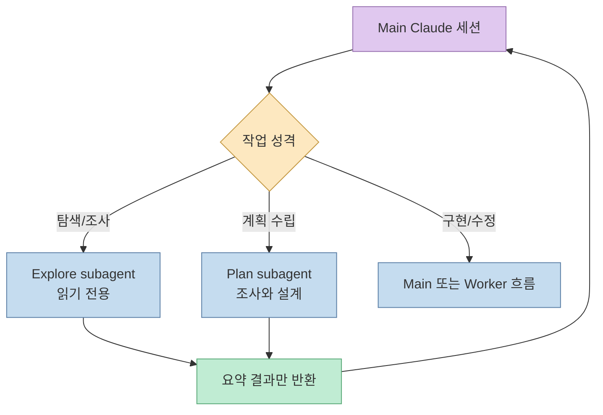
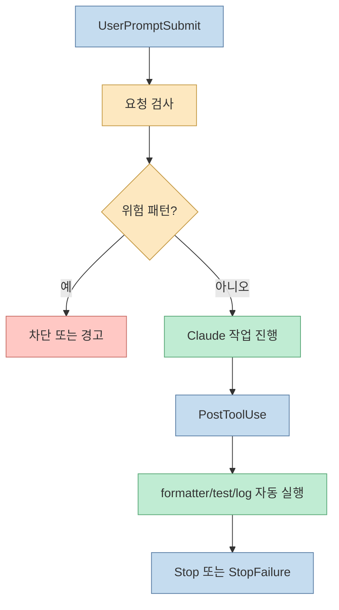
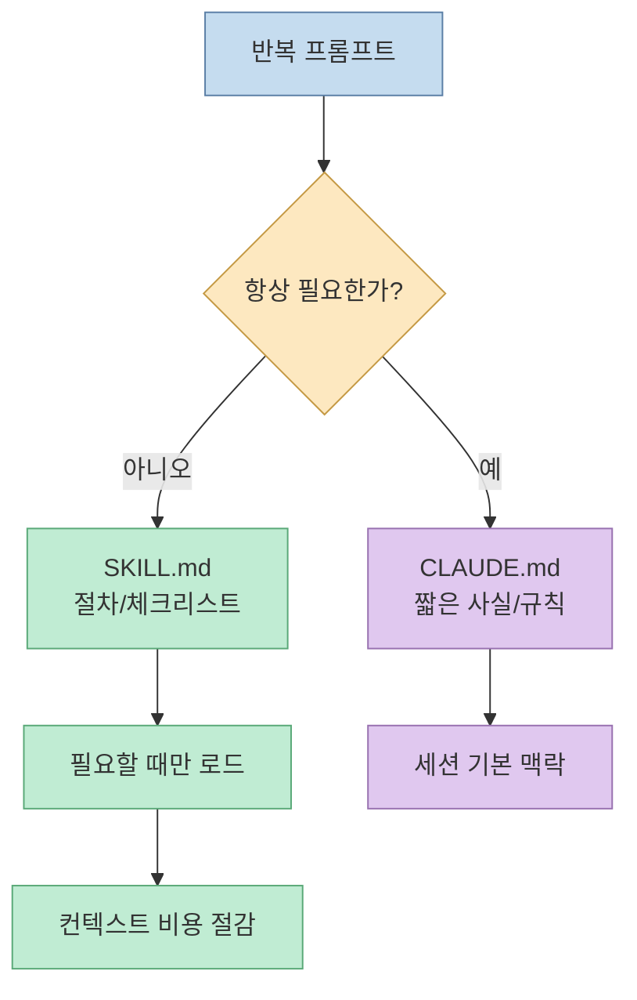
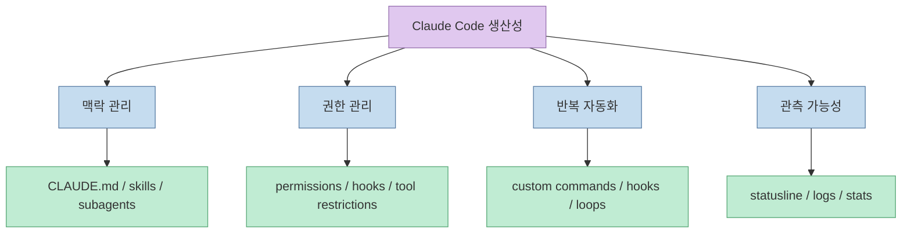

Nate Herk의 `32 Tricks to Level Up Claude Code in 16 Mins`는 표면적으로는 Claude Code 팁 모음입니다. 하지만 핵심은 "명령어를 32개 외운다"가 아닙니다. 초급에서는 프로젝트 맥락을 빨리 만들고, 중급에서는 작업을 격리하고 반복을 줄이며, 프로 단계에서는 subagent·hook·skill·memory로 Claude Code를 **개인용 개발 운영체제** 처럼 다루는 방향으로 올라갑니다. [0:00](https://youtu.be/jqoFP9QapXI?t=0)

<!--more-->

## Sources

- <https://youtu.be/jqoFP9QapXI?si=IXG5pODZAMIoQ31s>
- Video summary page: <https://chatyt.io/trending/32-tricks-to-level-up-claude-code-in-16-mins-summary-key-takeaways-faq>
- Claude Code skills docs: <https://code.claude.com/docs/en/slash-commands>
- Claude Code subagents docs: <https://code.claude.com/docs/en/subagents>
- Claude Code hooks docs: <https://code.claude.com/docs/en/hooks>

> 참고: 이 영상은 영어 자동 자막만 제공되었지만, 현재 환경에서는 YouTube timedtext/API가 429 및 IP 차단으로 실패했습니다. 따라서 본문은 영상 설명란의 큰 타임스탬프, 공개 요약 페이지, Claude Code 공식 문서를 근거로 작성했습니다. 32개 세부 팁 전체를 transcript처럼 재현하지 않고, 확인 가능한 흐름과 기능 중심으로 재구성했습니다.

## 전체 구조: 초급 → 중급 → 프로는 기능 난이도가 아니라 운영 난이도다

영상 설명란은 구간을 세 덩어리로 나눕니다. `Beginner Hacks`는 0:14부터, `Intermediate Hacks`는 4:53부터, `Pro Hacks`는 10:29부터 시작합니다. [0:14](https://youtu.be/jqoFP9QapXI?t=14) [4:53](https://youtu.be/jqoFP9QapXI?t=293) [10:29](https://youtu.be/jqoFP9QapXI?t=629)

이 구조를 Claude Code 실전 관점으로 읽으면 다음과 같습니다. 초급은 "Claude에게 프로젝트를 이해시키는 법"입니다. 중급은 "작업을 안전하게 나누고 반복을 줄이는 법"입니다. 프로는 "Claude가 매번 같은 방식으로 일하도록 환경 자체를 설계하는 법"입니다.

따라서 이 영상은 "Claude Code의 숨겨진 기능 모음"이라기보다, **Claude Code를 채팅창에서 개발 시스템으로 승격시키는 단계별 체크리스트** 에 가깝습니다.

## 초급 팁: 먼저 프로젝트 맥락을 고정한다

공개 요약 페이지는 초급 구간의 대표 팁으로 `/init`을 언급합니다. 이 명령은 프로젝트를 스캔하고 Claude가 참고할 메모리 파일, 즉 `CLAUDE.md` 계열의 프로젝트 컨텍스트를 만드는 출발점으로 이해할 수 있습니다. [0:14](https://youtu.be/jqoFP9QapXI?t=14) 요약 페이지는 이를 프로젝트 치트시트처럼 설명합니다. [ChatYT 요약](https://chatyt.io/trending/32-tricks-to-level-up-claude-code-in-16-mins-summary-key-takeaways-faq)

초급 단계에서 중요한 것은 "Claude에게 더 많은 것을 읽혀라"가 아닙니다. 오히려 매번 같은 배경 설명을 반복하지 않도록 프로젝트의 기본 규칙, 실행 명령, 폴더 구조, 테스트 방법을 짧고 안정적인 형태로 남기는 것입니다.

여기서 조심할 점도 있습니다. `CLAUDE.md`가 너무 길어지면 매 세션마다 읽히는 고정 비용이 됩니다. Claude Code 공식 skills 문서는 절차성 지침이나 긴 체크리스트가 `CLAUDE.md`에 커졌다면 skill로 분리하라고 설명합니다. skill은 필요할 때만 로드되므로, 긴 절차를 항상 컨텍스트에 싣는 비용을 줄일 수 있습니다. [Claude Code skills docs](https://code.claude.com/docs/en/slash-commands)

## 상태 표시와 관측: Claude가 지금 무엇을 하는지 보여야 한다

공개 요약 페이지는 초급 구간에서 `/st`를 상태 표시 설정으로 언급합니다. 공식 문서 기준으로는 status line 설정이 Claude Code 기능군에 포함되며, subagent 문서에서도 `statusline-setup`이 `/statusline` 실행 시 쓰이는 built-in agent로 등장합니다. [Claude Code subagents docs](https://code.claude.com/docs/en/subagents)

이런 상태 표시의 가치는 단순한 꾸미기가 아닙니다. Claude Code는 긴 작업에서 파일을 읽고, 명령을 실행하고, subagent를 호출하고, 사용자의 허가를 기다립니다. 이 상태가 보이지 않으면 사용자는 "멈췄나?", "비싼 모델이 계속 도는 중인가?", "어느 폴더에서 작업 중인가?"를 알기 어렵습니다.

초급자가 가장 먼저 얻어야 하는 습관은 "명령어를 많이 아는 것"보다 **Claude Code의 현재 상태를 읽는 것** 입니다. 상태를 읽을 수 있어야 다음 단계인 병렬화와 자동화에서도 통제가 가능합니다.

## 중급 팁: 격리된 작업 공간으로 병렬 처리한다

중급 구간의 핵심으로 공개 요약 페이지는 "isolated workspaces for parallel processing"을 언급합니다. [4:53](https://youtu.be/jqoFP9QapXI?t=293) 이는 실무적으로 Git worktree나 별도 브랜치/작업 디렉터리를 활용해 여러 작업을 동시에 진행하는 패턴과 맞닿아 있습니다.

한 세션 안에서 모든 일을 시키면 컨텍스트가 섞입니다. 리팩터링, 버그 수정, 문서 업데이트, 테스트 보강이 한 대화에 뒤엉키면 Claude도 사람도 현재 목표를 잃기 쉽습니다. 중급자는 작업을 독립 단위로 나누고, 각 단위가 서로의 파일을 덮어쓰지 않도록 격리합니다.

이 패턴의 장점은 속도만이 아닙니다. 실패 범위가 줄어듭니다. 한 에이전트가 잘못된 방향으로 수정해도 해당 worktree나 브랜치만 버리면 됩니다. 반대로 격리 없이 한 작업 공간에서 여러 실험을 섞으면 되돌리기와 원인 추적이 어려워집니다.

## 중급 팁: subagent는 비용 절감보다 컨텍스트 분리가 먼저다

공개 요약 페이지는 더 저렴한 모델을 sub-agent에 쓰는 전략도 언급합니다. [4:53](https://youtu.be/jqoFP9QapXI?t=293) Claude Code 공식 문서는 subagent가 독립적인 컨텍스트 창, 별도 system prompt, 특정 tool access, 독립 permission을 가진 전문 assistant라고 설명합니다. 또한 subagent의 장점으로 main conversation의 컨텍스트 보존, 도구 제한, 프로젝트 간 재사용, 특정 도메인 특화, 더 빠르고 저렴한 모델 라우팅을 제시합니다. [Claude Code subagents docs](https://code.claude.com/docs/en/subagents)

즉 subagent의 1차 목적은 "싼 모델 쓰기"가 아니라 **메인 대화의 오염을 막는 것** 입니다. 코드베이스 탐색, 문서 조사, 테스트 실패 원인 후보 수집 같은 작업은 main thread에 모든 로그를 쌓지 않아도 됩니다. subagent에게 맡기고 요약 결과만 돌려받으면 메인 컨텍스트가 더 오래 깨끗하게 유지됩니다.

이렇게 보면 subagent는 "Claude를 여러 명으로 늘리는 기능"이라기보다, **컨텍스트와 권한을 분리하는 운영 단위** 입니다.

## 프로 팁: hook으로 반복 확인을 자동화한다

프로 구간은 10:29부터 시작합니다. [10:29](https://youtu.be/jqoFP9QapXI?t=629) 공개 요약 페이지는 task automation through loops and hooks를 언급합니다. Claude Code 공식 hooks 문서는 hook을 특정 lifecycle 지점에서 자동 실행되는 shell command, HTTP endpoint, LLM prompt로 설명합니다. 이벤트는 세션 시작/종료, 사용자 프롬프트 제출, 도구 호출 전후, permission request, subagent start/stop 등으로 나뉩니다. [Claude Code hooks docs](https://code.claude.com/docs/en/hooks)

hook의 실전 가치는 "Claude에게 잘해 달라고 부탁"하지 않아도 된다는 점입니다. 예를 들어 파일 수정 후 formatter를 실행하거나, 위험한 명령을 block하거나, PR 생성 전 테스트를 강제하거나, 작업 완료 시 Slack/Telegram 알림을 보내는 식입니다.

다만 hooks는 자동으로 실행되므로 보안 면에서 조심해야 합니다. 공식 hook guide도 hook이 현재 환경의 credential과 함께 실행될 수 있으므로 보안 영향을 고려해야 한다고 설명합니다. 자동화가 강력해질수록, 어떤 이벤트에서 어떤 명령이 실행되는지 버전 관리하고 리뷰해야 합니다.

## 프로 팁: skill은 긴 프롬프트를 제품화하는 방법이다

Claude Code 공식 문서는 skill을 `SKILL.md` 파일에 담긴 지침으로 설명합니다. 반복해서 붙여 넣는 instruction, checklist, multi-step procedure가 있다면 skill로 만들 수 있습니다. 중요한 차이는 로딩 방식입니다. `CLAUDE.md`는 세션 맥락으로 계속 들어오지만, skill body는 관련될 때만 로드됩니다. [Claude Code skills docs](https://code.claude.com/docs/en/slash-commands)

이 차이가 프로 단계에서 매우 중요합니다. 초급자는 `CLAUDE.md`에 모든 것을 넣고 싶어 합니다. 중급자는 그것이 고정 컨텍스트 비용이라는 사실을 깨닫습니다. 프로는 절차를 skill로 빼고, 프로젝트 사실만 메모리에 남깁니다.

예를 들어 "PR 리뷰 체크리스트", "릴리즈 노트 작성법", "테스트 실패 디버깅 절차", "블로그 포스팅 작성 규칙"은 skill에 더 잘 맞습니다. 반대로 "이 프로젝트는 Hugo 블로그이고 deploy는 `task deploy`다" 같은 안정적 사실은 `CLAUDE.md`에 남기는 편이 좋습니다.

## 프로 팁의 공통점: Claude에게 맡기는 게 아니라, Claude가 일할 레일을 깐다

영상의 후반부가 강한 이유는 고급 팁들이 모두 같은 방향을 가리키기 때문입니다. Claude에게 "잘해줘"라고 말하는 대신, Claude가 일할 레일을 만듭니다.

- subagent: 작업 단위와 컨텍스트를 분리한다.
- hook: 반복 검증과 안전장치를 자동화한다.
- skill: 반복 절차를 재사용 가능한 명령으로 만든다.
- memory: 프로젝트 사실과 개인 선호를 세션 시작점에 둔다.
- status line: 현재 상태를 관측 가능하게 만든다.

이 프레임으로 보면 32개 팁을 모두 외우지 않아도 됩니다. 새 팁을 봤을 때 "이것은 맥락 관리인가, 권한 관리인가, 반복 자동화인가, 관측 가능성인가?"로 분류하면 됩니다. 분류가 되면 자기 프로젝트에 적용할지 말지도 훨씬 쉽게 결정할 수 있습니다.

## 실전 적용 포인트

첫째, 오늘 바로 할 일은 `/init`류 초기화와 프로젝트 메모리 정리입니다. 단, `CLAUDE.md`를 길게 만드는 것이 목표가 아닙니다. 항상 필요한 사실만 남기고, 절차는 skill로 분리할 후보로 표시합니다.

둘째, 긴 작업 하나를 Claude에게 통째로 주지 말고, 탐색·계획·구현·검증으로 쪼갭니다. 탐색과 계획은 subagent나 별도 세션에 맡기고, 구현은 좁은 범위에서 진행하는 것이 안전합니다.

셋째, 반복되는 검증은 hook 후보입니다. 매번 "테스트 돌려", "포맷 확인해", "위험 명령 쓰지 마"라고 말하고 있다면 그것은 프롬프트가 아니라 자동화 규칙으로 옮길 수 있습니다.

넷째, status line이나 로그를 통해 Claude Code가 지금 무엇을 하고 있는지 보여야 합니다. 생산성 도구는 빨라지는 것만큼이나 멈춤·대기·권한 요청·비용 상태를 관측할 수 있어야 합니다.

## 핵심 요약

- 영상은 Claude Code 팁 32개를 초급, 중급, 프로 단계로 나누어 소개합니다. [0:14](https://youtu.be/jqoFP9QapXI?t=14)
- 초급의 핵심은 `/init`과 상태 표시처럼 프로젝트 맥락과 현재 상태를 빠르게 잡는 것입니다.
- 중급의 핵심은 격리된 작업 공간과 subagent로 작업을 분리하는 것입니다. [4:53](https://youtu.be/jqoFP9QapXI?t=293)
- 프로의 핵심은 hook, skill, memory, permission을 조합해 Claude가 매번 같은 품질 기준으로 일하도록 레일을 까는 것입니다. [10:29](https://youtu.be/jqoFP9QapXI?t=629)
- 공식 문서 기준으로 skill은 반복 절차를 필요할 때만 로드하게 해 `CLAUDE.md` 비대화를 줄이는 데 유용합니다.
- subagent는 비용 절감 수단이기도 하지만, 더 본질적으로는 main conversation의 컨텍스트를 보존하는 분리 장치입니다.

## 결론

`32 Tricks`를 그대로 체크리스트처럼 따라 하는 것도 도움이 됩니다. 하지만 더 중요한 것은 각 팁이 해결하는 운영 문제를 보는 것입니다. Claude Code의 생산성은 단일 명령어에서 나오지 않습니다. 프로젝트 맥락, 작업 격리, 권한, 반복 검증, 상태 관측이 맞물릴 때 비로소 안정적인 개발 루프가 됩니다.

초급자는 Claude에게 프로젝트를 설명하는 시간을 줄이고, 중급자는 작업을 안전하게 나누며, 프로는 반복되는 판단과 검증을 시스템으로 만듭니다. 이 관점에서 영상의 32개 팁은 "Claude Code 기능 모음"이 아니라, **AI 코딩 에이전트를 운영 가능한 개발 시스템으로 만드는 단계별 설계도** 로 읽는 것이 가장 유용합니다.
