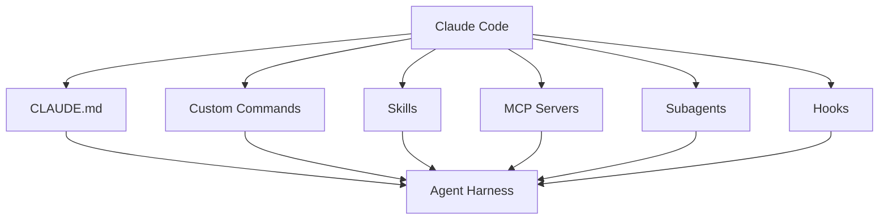

Claude Code를 처음 쓰면 대부분 “어떻게 명령해야 코드를 잘 짜나?”부터 묻는다.

하지만 오래 쓰면 질문이 바뀐다.

- 어떻게 프로젝트 기억을 유지할까
- 언제 멈추고 다시 시킬까
- 언제 `/clear`할까
- 어떤 것은 `CLAUDE.md`에 넣고, 어떤 것은 skill로 뺄까
- 검증 명령어는 어떻게 고정할까
- 위험한 권한은 어디서 막을까
- 혼자 쓰는 도구에서 팀이 쓰는 운영체계로 어떻게 바꿀까

메이커 에반의 영상 `클로드코드 10개월… 매일 12시간 쓰며 알게 된 50가지`가 흥미로운 이유는 단순 단축키 모음이 아니라, Claude Code를 **신입 직원처럼 부리고 검수하고 다시 가르치는 운영법**으로 설명한다는 점이다.

<!--more-->

## Sources

- YouTube: <https://www.youtube.com/watch?v=MYEYID9Euzs>
- Claude Code slash commands docs: <https://docs.claude.com/en/docs/claude-code/slash-commands>
- Claude Code cheatsheet: <https://support.claude.com/en/articles/14553413-claude-code-cheatsheet>
- Claude Code hooks docs: <https://code.claude.com/docs/en/hooks>
- Claude Code subagents docs: <https://code.claude.com/docs/en/sub-agents>

## 1. 핵심 비유: Claude Code는 “치매 걸린 아인슈타인 신입 직원”에 가깝다

영상 설명에서 가장 인상적인 비유는 `신입직원`이다.

Claude Code는 똑똑하지만, 그냥 두면:

- 방금 한 말을 잊고
- 프로젝트 규칙을 매번 다시 배워야 하고
- 검증 없이 자신 있게 완료했다고 말하고
- 범위를 넘겨 수정하고
- 때로는 멈춰야 할 때 계속 달린다

그래서 Claude Code를 잘 쓴다는 것은 “천재에게 한 번에 맡기는 것”이 아니다.

오히려:

- 업무 매뉴얼을 주고
- 중간에 멈추게 하고
- 검증 기준을 정하고
- 실패하면 다시 가르치고
- 위험한 행동은 권한으로 막고
- 반복 업무는 skill과 command로 빼는 것

에 가깝다.

즉 Claude Code의 핵심은 모델 지능보다 **작업 운영 방식**이다.

## 2. 첫 번째 레이어: 프로젝트 폴더와 `CLAUDE.md`

영상의 초반 팁은 프로젝트 폴더에서 Claude Code를 켜고, `/init`으로 `CLAUDE.md`를 만드는 흐름이다.

이건 매우 중요하다.

Claude Code는 현재 작업 디렉터리와 프로젝트 memory를 기준으로 움직인다.  
아무 폴더에서 켜면 아무 맥락으로 일한다.

`CLAUDE.md`는 프로젝트의 매뉴얼이다.

여기에 넣을 것은 거창한 철학이 아니다.

- 프로젝트 구조
- 실행 명령어
- 테스트 명령어
- 금지 사항
- 코드 스타일
- PR 규칙
- 배포 전 검증 절차

같은 것들이다.

영상 설명에서 특히 중요한 포인트는 `매뉴얼 3요소` 중 **검증법이 핵심**이라는 점이다.

좋은 `CLAUDE.md`는 “이렇게 코딩해”보다  
“완료라고 말하기 전에 무엇을 실행해야 하는가”를 더 분명히 한다.

```mermaid
flowchart LR
    A[Project Folder] --> B[/init]
    B --> C[CLAUDE.md]
    C --> D[Rules]
    C --> E[Commands]
    C --> F[Verification]
    F --> G[More Reliable Claude Code]
```

## 3. 두 번째 레이어: 멈추기와 컨텍스트 관리

오래 쓰는 사람에게 가장 중요한 습관 중 하나는 “잘 시키는 것”보다 “잘 멈추는 것”이다.

영상 타임스탬프에는 다음이 나온다.

- Shift+Tab 모드
- ESC 멈추기
- ESC 두 번
- `/clear`
- `/context`
- `/model`
- `/resume`

이 명령들은 단순 편의 기능이 아니다.

Claude Code를 장시간 쓰면 context가 점점 오염된다.

- 이전 작업의 가정이 남고
- 이미 끝난 목표가 섞이고
- 실패한 접근이 계속 영향을 주고
- 모델이 “지금 무엇을 하는지” 흐려진다

그래서 컨텍스트 관리는 실력이다.

- `/context`로 현재 토큰과 문맥 상태를 본다
- `/clear`로 작업 전환 시 맥락을 끊는다
- `/resume`으로 필요한 세션만 되살린다
- `/model`로 작업 성격에 맞는 모델을 고른다
- ESC로 잘못 달리는 작업을 빨리 끊는다

Claude Code를 잘 쓰는 사람은 프롬프트를 길게 쓰는 사람이 아니라,  
**언제 끊고 언제 이어갈지 아는 사람**이다.

## 4. 세 번째 레이어: 시각 입력과 스크린샷

영상 타임스탬프에는 스크린샷 drag & drop, 스크린샷 설명이 포함되어 있다.

이건 프론트엔드나 디자인 작업에서 특히 강력하다.

텍스트로:

> 이 버튼이 좀 이상하고, 카드 간격이 답답하고, 모바일에서 헤더가 어긋나요

라고 설명하는 것보다,  
스크린샷을 넣고:

> 이 화면에서 레이아웃 문제를 찾아 수정 계획을 세워라

라고 하는 편이 훨씬 빠르다.

AI 코딩 도구의 입력은 더 이상 코드와 텍스트만이 아니다.

- 스크린샷
- 에러 화면
- 디자인 시안
- 콘솔 캡처
- 테스트 실패 화면

도 중요한 context다.

즉 Claude Code를 실무에서 잘 쓰려면,  
**시각적 증거를 텍스트 설명보다 먼저 주는 습관**이 필요하다.

## 5. 네 번째 레이어: Git 안전망과 절대 룰

영상의 중반부에는 Git 안전망, 절대 룰, dangerous skip, `/permissions`가 나온다.

이 부분은 매우 중요하다.

AI 코딩의 가장 큰 위험은 “잘못된 코드를 생성한다”가 아니다.  
그보다 더 위험한 것은 **되돌릴 수 없는 변경을 너무 자신 있게 한다**는 점이다.

그래서 Claude Code를 쓰기 전 최소 안전망은 다음이다.

- Git clean 상태에서 시작
- 작은 단위로 commit
- 위험 작업 전 diff 확인
- 권한은 `/permissions`로 제한
- dangerous 계열 옵션은 기본값으로 쓰지 않기
- “삭제”, “마이그레이션”, “secret 접근” 같은 작업은 절대 룰로 막기

Claude Code는 매우 강력한 도구라서,  
안전장치 없이 쓰면 생산성도 높지만 사고 반경도 커진다.

즉 고급 사용자의 핵심은 과감함이 아니라 **되돌릴 수 있는 구조**를 먼저 만드는 것이다.

## 6. 다섯 번째 레이어: 계획 모드와 신선한 컨텍스트

영상 설명에는 `계획 모드`, `신선한 컨텍스트`, `노트`, `검증 명령어`가 한 묶음으로 나온다.

이 묶음은 Claude Code 실전에서 핵심이다.

바로 구현시키기보다 먼저:

1. 현재 목표를 정리하게 하고
2. 관련 파일을 읽게 하고
3. 계획을 쓰게 하고
4. 사람이 범위를 줄이고
5. 검증 명령어를 고정하고
6. 그다음 구현하게 한다

이 흐름이 훨씬 안정적이다.

특히 신선한 컨텍스트가 중요하다.

긴 세션에서 계속 이어 가면 Claude는 이전 작업의 찌꺼기를 끌고 온다.  
새로운 기능, 새로운 버그, 새로운 리팩터링은 종종 fresh context에서 시작하는 편이 낫다.

그래서 실전 패턴은 이렇다.

- 긴 세션에서 문제를 파악한다
- 요약 노트를 남긴다
- `/clear` 또는 새 세션으로 전환한다
- 요약 노트와 목표만 다시 넣는다
- 구현을 시작한다

이 방식은 context rot를 줄인다.

## 7. 여섯 번째 레이어: skill, custom command, MCP, subagent

영상 후반부의 고급 기능은 다음 네 가지다.

- skills
- custom commands
- MCP
- subagents

이 네 가지는 비슷해 보이지만 역할이 다르다.

### Custom command

자주 쓰는 프롬프트를 명령어로 만든다.

예:

- `/commit`
- `/review`
- `/plan`
- `/fix-test`

반복 입력을 줄이는 데 좋다.

### Skill

특정 작업 방식을 문서와 스크립트, 예시로 묶는다.

예:

- 디자인 리뷰 skill
- PR 리뷰 skill
- 문서 변환 skill
- 테스트 작성 skill

단순 프롬프트보다 재사용성이 높다.

### MCP

외부 시스템을 도구로 연결한다.

예:

- GitHub
- Notion
- Linear
- Slack
- database
- browser

Claude가 실제 업무 표면에 접근하게 만든다.

### Subagent

특정 역할을 독립 context로 분리한다.

예:

- code reviewer
- security reviewer
- UX reviewer
- test engineer

이 네 가지를 섞으면 Claude Code는 단순 터미널 챗봇이 아니라 **작업 운영체계**가 된다.



## 8. 일곱 번째 레이어: hooks, plugins, browser

마지막 팁 묶음에는 `/chrome`, hooks 자동화, 위험 차단, plugin이 나온다.

이건 Claude Code가 단순 대화형 도구에서 **자동화 가능한 런타임**으로 넘어가는 지점이다.

공식 hooks 문서 기준으로 Claude Code는 여러 lifecycle event에 hook을 붙일 수 있다.

예를 들어:

- 파일 수정 후 formatter 실행
- 특정 Bash 명령 차단
- 테스트 실행 강제
- session start 시 context 주입
- compact 전후 처리
- subagent 완료 후 검증

같은 일이 가능하다.

Plugin은 여기에 commands, agents, skills, hooks, MCP를 묶어서 배포할 수 있게 한다.

즉 개인 설정이 아니라 팀 단위 운영 규칙으로 확장될 수 있다.

이 지점에서 Claude Code 사용법은 단순 프롬프트 기술이 아니라  
**개발 환경 설계**에 가까워진다.

## 9. 지시 과부하와 멀티 신입 문제

영상 후반부에는 `지시 과부하`, `멀티 신입`, `worktree` 같은 주제가 나온다.

이건 고급 사용자들이 자주 겪는 문제다.

Claude Code가 좋아졌다고 해서 모든 일을 한 세션에 몰아넣으면:

- 지시가 서로 충돌하고
- 컨텍스트가 무거워지고
- 목표가 흐려지고
- 검증이 어려워진다

그래서 오히려 일을 쪼개야 한다.

- 작은 목표
- 분리된 세션
- 별도 worktree
- 역할별 subagent
- 명확한 검증 명령어

가 필요하다.

“멀티 신입” 비유도 여기서 중요하다.

여러 신입에게 일을 나눠 맡길 때는:

- 각자 역할이 분명해야 하고
- 같은 파일을 동시에 만지지 않게 해야 하고
- 중간 결과를 통합할 사람이 있어야 하고
- 검수 기준이 있어야 한다

AI subagent도 마찬가지다.

## 10. 50가지 팁을 관통하는 결론: Claude Code는 도구가 아니라 직원 운영 시스템이다

영상 제목은 `50가지`지만, 진짜 메시지는 목록보다 구조에 있다.

Claude Code를 오래 쓰면 결국 다음 7개 레이어가 남는다.

1. 프로젝트 메모리: `CLAUDE.md`
2. 컨텍스트 관리: `/clear`, `/context`, `/resume`
3. 입력 확장: 스크린샷, 파일, 시각 증거
4. 안전망: Git, permissions, 위험 차단
5. 계획과 검증: plan mode, verification command
6. 재사용 계층: skills, custom commands, MCP, subagents
7. 자동화 계층: hooks, plugins, browser

즉 Claude Code를 잘 쓴다는 것은 명령어를 많이 외우는 것이 아니다.

**똑똑하지만 잘 잊고, 가끔 과감한 신입 직원을 어떻게 가르치고 검수하고 자동화할지 설계하는 것**이다.

이 관점이 잡히면 Claude Code는 단순 코딩 도구가 아니라,  
프로젝트 안에 들어온 작은 개발팀처럼 보이기 시작한다.

그리고 그때부터 중요한 질문은 “무슨 프롬프트를 쓸까?”가 아니라  
“이 팀이 안전하게 일하도록 어떤 매뉴얼, 권한, 검증, 자동화를 둘까?”가 된다.
