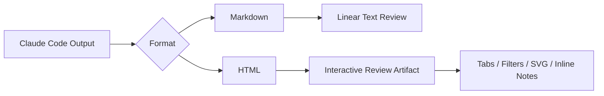
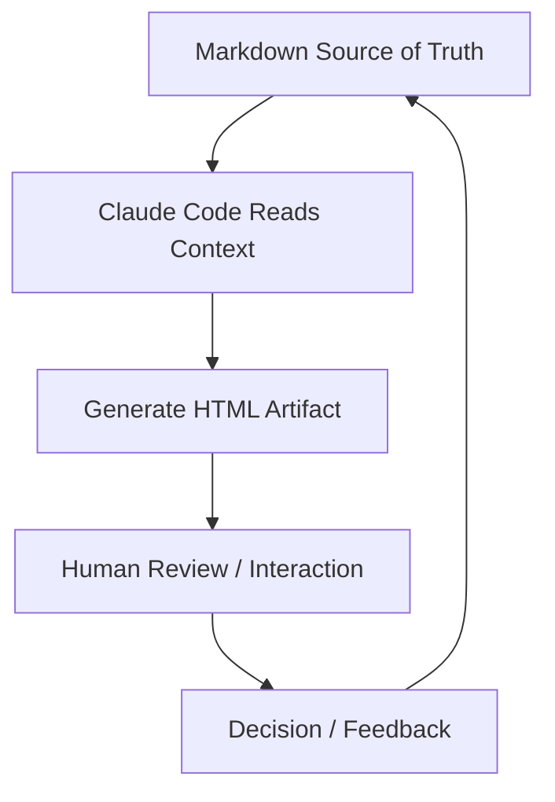

AI에게 “마크다운으로 정리해줘”라고 말하는 습관은 오래됐다.

그럴 만한 이유가 있었다.

Markdown은 짧고, 토큰을 덜 쓰고, diff가 쉽고, 어디에나 붙여 넣을 수 있다.  
GPT-4 초기처럼 context window가 작던 시절에는 거의 당연한 선택이었다.

그런데 Claude Code 팀 내부에서는 이 기본값을 다시 보고 있다고 한다.  
핵심은 단순하다.

**AI가 만드는 산출물이 너무 커졌고, 이제는 읽는 문서보다 조작 가능한 결과물이 더 중요해졌다.**

<!--more-->

## Sources

- AI Sparkup: <https://aisparkup.com/posts/12443>
- Simon Willison: <https://simonwillison.net/2026/May/8/unreasonable-effectiveness-of-html/>
- Thariq Shihipar thread: <https://twitter.com/trq212/status/2052809885763747935>

## 1. Markdown이 기본값이 된 이유는 토큰 효율이었다

Markdown은 AI 시대 초기에 매우 합리적인 포맷이었다.

- 문법이 단순하다
- 사람이 직접 편집하기 쉽다
- Git diff가 읽기 쉽다
- 토큰이 HTML보다 적게 든다
- README, 문서, 이슈, PR에 바로 붙일 수 있다

특히 GPT-4 초기의 작은 context window에서는 토큰 효율이 매우 중요했다.  
긴 HTML을 생성하는 것은 사치에 가까웠고, Markdown은 정보 전달에 가장 비용 효율적인 포맷이었다.

하지만 지금은 조건이 바뀌었다.

Claude Code 같은 에이전트는:

- 코드베이스를 읽고
- git history를 보고
- MCP로 Slack, Linear 같은 외부 맥락을 가져오고
- 브라우저까지 사용할 수 있다

그리고 산출물도 더 커졌다.

- 구현 계획
- PR 리뷰
- 리서치 리포트
- UI 프로토타입
- 코드 설명 문서
- 임시 대시보드

이 정도 규모가 되면, Markdown의 장점인 단순함이 오히려 한계가 된다.

## 2. 문제는 Markdown이 못생겨서가 아니라, 긴 AI 문서를 사람이 안 읽는다는 것이다

AI Sparkup 글이 짚은 가장 현실적인 문제는 이것이다.

AI가 만들어 준 100줄 넘는 Markdown 문서를 실제로 끝까지 읽는가?

대부분은 아니다.

Markdown에도 heading, list, table, code block이 있다.  
하지만 긴 문서가 되면 결국 텍스트 벽이 된다.

특히 AI가 만든 문서는:

- 내용이 많고
- 구조가 촘촘하고
- 빠르게 생성되며
- 사람이 검토해야 할 포인트가 섞여 있다

그래서 문서가 길어질수록 “정보가 있다”와 “읽힌다”가 분리된다.

HTML은 이 문제를 다른 방식으로 푼다.

- 탭 내비게이션
- 색상 코딩
- 접을 수 있는 섹션
- SVG 다이어그램
- sticky sidebar
- severity badge
- interactive control
- filter / search

같은 표현이 가능하다.

즉 HTML의 장점은 예쁨이 아니라 **검토 가능성**이다.

## 3. HTML은 문서가 아니라 작은 앱이 될 수 있다

Markdown은 기본적으로 읽는 문서다.

반면 HTML은:

- CSS로 시각 구조를 만들고
- SVG로 다이어그램을 그리고
- JavaScript로 상호작용을 넣고
- form, slider, checkbox, drag/drop을 붙일 수 있다

즉 HTML은 단순 문서가 아니라 **작은 앱**이 될 수 있다.

이 차이는 AI 산출물에서 매우 크다.

예를 들어 Claude에게 PR 리뷰를 맡긴다고 하자.

Markdown이라면:

- 요약
- 변경 파일 목록
- 위험도
- 코멘트 후보

를 텍스트로 받는다.

HTML이라면:

- diff를 inline annotation으로 보여 주고
- severity별 색상 코딩을 하고
- 파일별 탭을 만들고
- critical issue만 filter할 수 있고
- 변경 흐름을 SVG로 표현할 수 있다

같은 정보라도 사람이 훨씬 빨리 검토할 수 있다.



## 4. Claude Code에서 HTML이 특히 강한 이유

HTML 출력은 일반 챗봇에서도 가능하다.

하지만 Claude Code에서 더 강한 이유는 작업 맥락 때문이다.

Claude Code는:

- 파일 시스템
- git diff
- git history
- 코드베이스 구조
- MCP로 연결된 Slack / Linear / Notion
- 브라우저

를 다룰 수 있다.

즉 Claude Code는 단순히 “예쁜 HTML”을 만드는 것이 아니라,  
실제 프로젝트 맥락을 읽고 **검토 가능한 HTML artifact**를 만들 수 있다.

예를 들어:

- 코드베이스의 HTML 파일을 유형별로 분류
- PR diff를 위험도별로 설명
- Linear ticket과 구현 파일을 연결
- Slack 논의와 구현 변경점을 매핑
- 디자인 decision을 interactive prototype으로 표현

같은 일이 가능하다.

이건 단순 문서 생성이 아니라  
**프로젝트 맥락을 시각적·상호작용적 산출물로 변환하는 작업**이다.

## 5. 활용 패턴 5가지

AI Sparkup 글은 원문에 다섯 가지 사용 패턴이 있다고 정리한다.

이 다섯 가지는 Claude Code에서 HTML을 요청할 때 특히 잘 맞는다.

### 5-1. Planning

긴 구현 계획을 Markdown으로 받으면 읽기 어렵다.

HTML로 만들면:

- phase별 탭
- dependency graph
- risk badge
- checklist
- timeline

을 붙일 수 있다.

계획 문서가 “읽는 문서”에서 “검토하는 화면”이 된다.

### 5-2. Code Review

PR 리뷰는 HTML과 특히 잘 맞는다.

- 파일별 탭
- diff inline annotation
- severity별 색상
- test impact
- migration risk
- reviewer action item

을 한 화면에 담을 수 있기 때문이다.

GitHub 기본 diff view보다 특정 리뷰 목적에는 더 읽기 쉬울 수 있다.

### 5-3. Design Prototyping

UI 아이디어는 Markdown으로 설명하는 순간 손실이 크다.

HTML로 받으면:

- layout
- spacing
- color
- interaction
- responsive behavior

를 바로 확인할 수 있다.

React 앱 전체를 만들 필요 없이, 단일 HTML artifact로 빠르게 탐색할 수 있다.

### 5-4. Reports

리서치 보고서, 장애 분석, 경쟁사 분석 같은 문서는 길어지기 쉽다.

HTML report는:

- executive summary
- drill-down section
- charts
- table filters
- source links
- collapsible evidence

를 붙일 수 있다.

특히 “팀원에게 읽혀야 하는 문서”라면 Markdown보다 유리할 수 있다.

### 5-5. Temporary Editors

HTML은 임시 도구를 만들기에도 좋다.

예를 들어:

- 우선순위 정렬 UI
- 설정값 조정 slider
- JSON 편집 도구
- prompt 비교 화면
- ticket triage board

같은 것을 단일 HTML로 만들 수 있다.

이건 문서라기보다 “그 순간 필요한 작은 인터페이스”다.

## 6. HTML이 항상 정답은 아니다

HTML 전환의 단점도 분명하다.

AI Sparkup 글과 Simon Willison 정리에서 공통으로 나오는 trade-off는 다음이다.

- 생성 시간이 Markdown보다 느리다
- HTML diff는 시끄럽다
- Git 리뷰가 어렵다
- 사람이 직접 편집하기 불편하다
- 내용보다 스타일이 과해질 수 있다
- 장기 보관 문서에는 Markdown이 더 낫다

특히 source of truth로 남겨야 하는 문서는 여전히 Markdown이 강하다.

예를 들어:

- 규칙 문서
- `CLAUDE.md`
- architecture decision record
- API contract
- runbook
- memory policy

같은 것은 사람이 직접 읽고 고칠 수 있어야 한다.

따라서 좋은 기준은 이것이다.

- **장기 보관 / 공동 편집 / diff 중심**이면 Markdown
- **검토 / 탐색 / 발표 / 임시 UI / 시각화 중심**이면 HTML

둘 중 하나를 버리는 문제가 아니다.

## 7. 가장 좋은 패턴은 Markdown을 truth로 두고 HTML을 view로 만드는 것이다

현실적인 절충안은 다음이다.

1. 핵심 사실과 결정은 Markdown에 남긴다
2. Claude Code가 그 Markdown과 코드베이스를 읽는다
3. 검토나 공유가 필요한 순간 HTML artifact를 만든다
4. HTML에서 발견한 수정사항은 다시 Markdown source로 반영한다

즉 Markdown은 source of truth, HTML은 review artifact가 된다.



이 구조가 좋은 이유는 각 포맷의 장점을 살리기 때문이다.

Markdown은:

- diff
- edit
- storage
- search

에 강하다.

HTML은:

- navigation
- visual hierarchy
- interactivity
- shareability

에 강하다.

## 8. 그냥 “HTML 파일로 만들어줘”라고 말하면 된다

이 논의가 실용적인 이유는 복잡한 설정이 필요 없기 때문이다.

Claude Code에게 다음처럼 요청하면 된다.

```text
이 PR을 검토하기 쉽게 단일 HTML 파일로 만들어줘.
파일별 탭, 위험도 색상, inline annotation, 테스트 영향도를 포함해줘.
외부 dependency 없이 브라우저에서 바로 열 수 있게 작성해줘.
```

또는:

```text
이 구현 계획을 HTML artifact로 만들어줘.
phase별 섹션, dependency graph, risk checklist, human decision point를 포함해줘.
```

핵심은 `HTML`을 최종 출력 포맷으로 지정하는 것이다.

프레임워크를 요구할 필요도 없다.  
오히려 단일 self-contained HTML이 더 나을 때가 많다.

## 9. 이 변화의 본질은 “AI가 글을 쓰는 시대”에서 “AI가 인터페이스를 만드는 시대”로 이동한다는 점이다

Markdown은 AI가 사람에게 글을 전달하는 데 적합했다.

하지만 Claude Code 같은 에이전트는 이제:

- 코드 읽기
- 문서 읽기
- 외부 도구 호출
- 브라우저 실행
- 파일 생성
- 시각화 구성

까지 한다.

이때 최종 산출물이 글이어야 할 이유는 줄어든다.

오히려:

- 검토 화면
- 우선순위 조정 UI
- PR 설명 대시보드
- 설계 탐색 도구
- 리서치 브리핑 앱

이 더 자연스러운 출력이 된다.

그래서 “HTML이 Markdown보다 낫다”는 말은 단순 포맷 취향이 아니다.

**AI 산출물이 문서에서 인터페이스로 이동하고 있다**는 신호다.

## 10. 결론: Markdown은 사라지지 않는다. 다만 HTML artifact가 새로운 기본 옵션이 된다

Markdown은 여전히 강력하다.

특히:

- 규칙
- 기억
- 문서 원본
- 팀 편집
- Git 기반 리뷰

에는 Markdown이 맞다.

하지만 Claude Code에게 복잡한 결과를 설명하게 할 때,  
특히 사람이 실제로 읽고 판단해야 할 때는 HTML artifact가 훨씬 나을 수 있다.

중요한 것은 기본값을 바꾸는 것이다.

예전 기본값:

```text
Markdown으로 정리해줘.
```

새로운 선택지:

```text
검토하기 쉬운 단일 HTML artifact로 만들어줘.
```

이 작은 차이가 AI 결과물을 “긴 텍스트”에서 “조작 가능한 화면”으로 바꾼다.

앞으로 Claude Code를 쓸 때는 질문을 하나 더 해볼 만하다.

이 결과물은 읽기만 하면 되는가?  
아니면 사람이 실제로 탐색하고, 조작하고, 판단해야 하는가?

후자라면 Markdown보다 HTML이 더 좋은 답일 수 있다.
