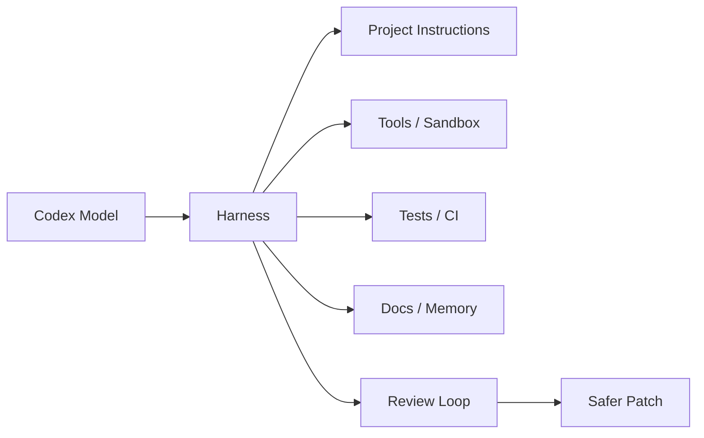
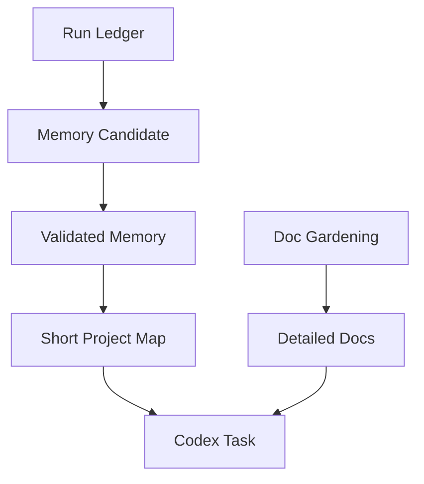

Codex를 잘 쓰는 방법은 “좋은 프롬프트 한 줄”이 아니다.

실제로 중요한 것은 Codex가 일할 수 있는 환경을 어떻게 짜느냐다.

- 어떤 파일을 먼저 읽게 할지
- 어떤 규칙을 따르게 할지
- 어느 범위를 건드리지 못하게 할지
- 언제 계획을 세우게 할지
- 완료 전에 무엇으로 검증할지
- 실패하면 어떤 로그를 남길지

이런 구조를 만드는 것이 하네스 엔지니어링이다.  
ZeroCho TV의 `OpenAI Codex로 하는 하네스 엔지니어링 실습 요약본` 영상은 바로 이 관점에서 Codex를 다룬다.

<!--more-->

## Sources

- YouTube: <https://www.youtube.com/watch?v=MpeuOAmctAg>
- OpenAI: <https://openai.com/index/harness-engineering/>
- Codex: <https://openai.com/ko-KR/codex/>
- Codex overview: <https://platform.openai.com/docs/codex/overview>

## 1. 하네스 엔지니어링은 Codex를 더 똑똑하게 만드는 기술이 아니다

하네스 엔지니어링을 처음 들으면 “에이전트를 더 강하게 만드는 프롬프트 기술”처럼 느껴질 수 있다.

하지만 더 정확히는 반대다.

하네스는 모델의 자유도를 무한히 늘리는 것이 아니라,  
**모델이 안전하게 일할 수 있는 작업장과 규칙을 만드는 것**이다.

OpenAI의 Harness Engineering 글도 같은 방향을 말한다.

Codex에게 1,000페이지짜리 매뉴얼을 던지는 것이 아니라,  
작업에 필요한 지도를 주고, 검증 루프와 문서 구조를 통해 행동을 안정화하는 쪽에 가깝다.

즉 핵심은:

- 모델 성능
- 프롬프트 문장
- 최신 기능

보다:

- 레포 구조
- 프로젝트 문서
- 검증 명령어
- CI
- 권한 정책
- 반복 가능한 작업 루프

에 있다.



## 2. Codex 실습의 핵심은 “바로 만들기”가 아니라 “먼저 작업 루프를 고정하기”다

영상 제목은 “프로그램을 뚝딱 만들어내는 모습”을 강조한다.

하지만 하네스 관점에서 보면 중요한 장면은 결과물이 아니라 과정이다.

좋은 Codex 작업 루프는 대략 이렇게 흘러간다.

1. 목표를 짧게 정의한다
2. 관련 파일과 문서를 읽게 한다
3. 작업 범위를 정한다
4. 계획을 먼저 세운다
5. 구현한다
6. 테스트와 lint를 실행한다
7. diff를 검토한다
8. 실패하면 원인을 기록하고 다시 반복한다

이 순서가 중요한 이유는 Codex가 코드를 빨리 만들 수 있기 때문이다.

빠른 도구일수록 더 강한 안전장치가 필요하다.  
그렇지 않으면 빠르게 잘못된 방향으로 간다.

## 3. Codex에게 필요한 것은 긴 설명서보다 “짧고 정확한 지도”다

OpenAI의 Harness Engineering 글에서 중요한 메시지는 “map”이다.

Codex에게 모든 배경지식을 한꺼번에 밀어 넣기보다,  
어디를 봐야 하고 무엇을 지켜야 하는지 알려 주는 지도가 필요하다.

예를 들면:

- 프로젝트 구조 요약
- 테스트 명령어
- formatting 규칙
- 금지 파일
- API contract 위치
- migration 주의사항
- 배포 전 체크리스트

이런 것들이 하네스의 기본 지도다.

Codex는 강한 코딩 능력을 갖고 있지만,  
레포의 숨은 규칙과 팀의 암묵지를 자동으로 아는 것은 아니다.

따라서 하네스의 첫 번째 역할은 **암묵지를 파일로 바꾸는 것**이다.

## 4. 계획 모드는 “느려지는 단계”가 아니라 비용을 줄이는 단계다

AI 코딩을 처음 쓰면 바로 구현부터 시키고 싶다.

하지만 하네스 엔지니어링에서는 planning 단계가 중요하다.

계획을 먼저 세우면:

- 구현 범위가 줄어든다
- 필요 없는 파일 수정을 막는다
- 테스트 전략이 먼저 정해진다
- 사람의 승인 지점이 생긴다
- 실패했을 때 원인을 추적하기 쉽다

즉 planning은 속도를 늦추는 의식이 아니라,  
뒤쪽 rework를 줄이는 비용 절감 장치다.

Codex가 강해질수록 planning은 더 중요해진다.

약한 모델은 못 해서 멈추지만,  
강한 모델은 잘못된 목표도 그럴듯하게 완성해 버릴 수 있기 때문이다.

## 5. 검증 명령어는 프롬프트보다 강하다

하네스의 핵심은 “완료 기준”이다.

Codex에게:

```text
잘 구현해줘.
```

라고 말하는 것보다:

```text
수정 후 npm test, npm run lint, 관련 E2E 테스트를 실행하고
실패가 있으면 원인을 설명한 뒤 다시 수정해.
```

라고 말하는 편이 훨씬 강하다.

검증 명령어는 모델의 자기평가보다 객관적이다.

- test pass
- lint pass
- typecheck pass
- build pass
- snapshot diff
- E2E result

같은 신호가 있어야 Codex의 작업을 믿을 수 있다.

하네스 엔지니어링에서 중요한 것은 Codex가 “완료했습니다”라고 말하는 순간이 아니라,  
**완료라고 말하기 전에 어떤 증거를 만들었는가**다.

## 6. 권한과 sandbox는 생산성을 떨어뜨리는 장치가 아니라 사고 반경을 줄이는 장치다

Codex는 파일을 읽고, 수정하고, 명령을 실행할 수 있다.

이 능력은 강력하지만 위험하다.

그래서 하네스에는 반드시 권한과 sandbox 사고가 들어가야 한다.

예를 들어:

- secret 파일 읽기 금지
- production DB 접근 금지
- migration 자동 실행 금지
- lockfile 수정 전 확인
- generated file 대량 수정 금지
- destructive command 제한

같은 규칙이 필요하다.

권한 제한은 Codex를 불신해서가 아니라,  
실수했을 때 피해 범위를 줄이기 위한 것이다.

좋은 하네스는 Codex가 실수하지 않게 만드는 것이 아니라,  
**실수해도 복구 가능한 경계 안에서 일하게 만든다**.

## 7. 문서와 메모리는 “많을수록 좋다”가 아니다

하네스 엔지니어링에서 자주 하는 실수가 있다.

모든 규칙, 모든 회의록, 모든 문서를 하나의 거대한 instruction file에 넣는 것이다.

하지만 OpenAI의 글도 지적하듯, 거대한 instruction은 오히려 문제를 만든다.

- task context를 밀어낸다
- 핵심 규칙이 묻힌다
- 오래된 문서가 새 작업을 오염시킨다
- 모델이 잘못된 우선순위를 따른다

따라서 좋은 하네스는 문서를 계층화한다.

- 항상 읽을 짧은 프로젝트 지도
- 필요할 때 읽을 세부 문서
- 작업 후 갱신할 run ledger
- 검증된 내용만 승격하는 memory
- 오래된 문서를 정리하는 doc-gardening 루프

즉 Codex에게 필요한 것은 거대한 기억이 아니라  
**필요할 때 찾아갈 수 있는 짧은 지도와 최신 문서 구조**다.



## 8. 하네스의 성패는 “반복 가능한가”로 판단해야 한다

한 번 성공한 데모는 충분하지 않다.

하네스가 좋다는 것은 같은 종류의 작업을 반복했을 때:

- 더 빨리 시작하고
- 덜 헤매고
- 덜 위험하게 수정하고
- 검증을 빼먹지 않고
- 실패 기록이 다음 작업에 반영되고
- 사람이 review하기 쉬운 patch가 나오는 것

이다.

즉 하네스는 데모용 prompt가 아니라 **반복 가능한 작업 시스템**이다.

Codex가 강력해질수록 이 반복성의 가치가 커진다.

## 9. Codex 하네스 실습에서 가져갈 운영 체크리스트

실제로 Codex를 하네스 안에서 쓰려면 최소한 다음을 정해야 한다.

### 작업 전

- 목표 한 문장
- 건드릴 수 있는 영역
- 건드리면 안 되는 영역
- 관련 문서 위치
- 실행해야 할 검증 명령어

### 작업 중

- 먼저 계획 작성
- 작은 patch 단위 유지
- 중간 diff 확인
- 위험한 명령은 승인 후 실행
- 실패 로그 남기기

### 작업 후

- test / lint / build 실행
- 사람이 diff review
- 배운 규칙은 문서나 memory 후보로 남김
- 오래된 지시는 제거

이 체크리스트가 없으면 Codex는 여전히 똑똑하지만, 결과는 매번 흔들린다.

## 10. 결론: Codex는 개발자를 대체하기보다 개발자의 작업장을 더 엄격하게 요구한다

Codex가 강력해질수록 “이제 그냥 시키면 되겠네”라고 생각하기 쉽다.

하지만 실제로는 반대다.

강한 모델일수록:

- 더 명확한 목표
- 더 좁은 작업 범위
- 더 강한 검증
- 더 안전한 권한
- 더 좋은 문서 구조
- 더 나은 review 루프

가 필요하다.

즉 Codex 시대의 핵심 역량은 프롬프트를 잘 쓰는 것에서 끝나지 않는다.

**Codex가 일할 작업장, 규칙, 검증, 기억, 권한을 설계하는 것.**

그게 하네스 엔지니어링이다.

영상이 보여 주는 실습의 의미도 여기에 있다.  
Codex가 프로그램을 “뚝딱” 만드는 장면보다 중요한 것은, 그 뚝딱이 우연이 아니라 반복 가능한 개발 루프가 되도록 통제하는 구조다.
