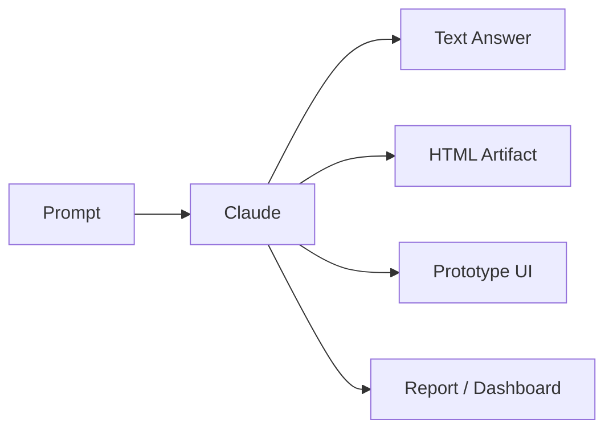

Claude를 잘 쓴다는 말은 너무 넓다.

어떤 사람은 Claude를 검색 보조로 쓰고,  
어떤 사람은 문서 작성 도구로 쓰고,  
어떤 사람은 Claude Code로 앱을 만들고,  
어떤 사람은 여러 세션을 병렬로 돌리며 밤새 작업을 맡긴다.

Nate Herk의 `Every Level of Claude Explained in 21 Minutes` 영상은 이 차이를 “레벨”로 설명한다.  
중요한 메시지는 단순하다.

**Claude 실력은 프롬프트를 잘 쓰는 능력에서 시작하지만, 결국에는 작업 시스템을 설계하는 능력으로 이동한다.**

<!--more-->

## Sources

- YouTube: <https://www.youtube.com/watch?v=ZRb7D6R64hM>

## 1. Level 1: Claude를 그냥 채팅창으로 쓴다

가장 낮은 단계는 Claude를 일반 챗봇처럼 쓰는 것이다.

- 질문한다
- 답변을 받는다
- 다시 질문한다
- 마음에 안 들면 다시 말한다

이 단계에서도 충분히 유용하다.

예를 들어:

- 이메일 초안
- 블로그 아이디어
- 코드 설명
- 짧은 요약
- 자료 조사

같은 작업은 바로 가능하다.

하지만 한계도 분명하다.

Claude가 실제 파일을 수정하지 않고,  
프로젝트 구조를 직접 보지 않고,  
외부 도구와 연결되지 않으면 모든 작업이 “대화” 안에 갇힌다.

즉 Level 1의 핵심 한계는 **실행이 사용자의 손에 남아 있다는 것**이다.

## 2. Level 2: Hidden artifacts를 만들기 시작한다

영상 설명에는 `Hidden artifacts`라는 구간이 나온다.

여기서 중요한 변화는 Claude가 단순 답변을 넘어서 **산출물**을 만들기 시작한다는 점이다.

예를 들면:

- HTML mockup
- 작은 계산기
- interactive report
- SVG diagram
- landing page draft
- prototype UI

같은 것이다.

이 단계에서 Claude는 더 이상 “글을 써 주는 도구”만이 아니다.  
사람이 바로 열어 보고 조작할 수 있는 artifact를 만든다.

특히 HTML artifact는 강력하다.

Markdown으로 긴 설명을 받는 대신:

- 탭
- 버튼
- 색상
- 레이아웃
- 차트
- 필터

가 있는 작은 화면을 받을 수 있기 때문이다.



Level 2의 핵심은 출력 형식의 변화다.

질문:

```text
설명해줘.
```

에서:

```text
브라우저에서 열 수 있는 단일 HTML artifact로 만들어줘.
```

로 바뀐다.

## 3. Level 2.5: Office takeover — 문서, 표, 발표자료를 맡긴다

영상 설명에는 `Office takeover`라는 구간도 있다.

이 단계는 Claude가 회사 업무 산출물을 대체하거나 보조하는 단계다.

- 회의록 정리
- 제안서 초안
- 리서치 요약
- 보고서 작성
- 표 정리
- 프레젠테이션 구조화
- 이메일/문서 리라이팅

같은 일이 여기에 들어간다.

이 단계에서 중요한 것은 “문장 작성”보다 “업무 형식”이다.

좋은 요청은:

```text
이 내용을 보고서로 정리해줘.
```

가 아니라:

```text
임원 보고용 1페이지 문서로 정리해줘.
상단에는 결론 3줄, 중간에는 근거, 하단에는 의사결정 옵션 3개를 넣어줘.
```

에 가깝다.

즉 Claude에게 내용을 맡기는 것이 아니라,  
**업무 양식과 판단 기준까지 같이 주는 것**이 Level 2.5의 핵심이다.

## 4. Level 3: Figma killer? — 디자인과 프로토타입까지 맡긴다

영상 설명의 `Figma killer?` 구간은 Claude가 디자인 작업까지 침투하는 흐름을 말한다.

여기서 중요한 것은 Claude가 전문 디자이너를 완전히 대체한다는 뜻이 아니다.

오히려 더 현실적인 해석은 이렇다.

Claude는:

- wireframe
- landing page prototype
- UI variation
- design system draft
- copy + layout 조합
- HTML/CSS prototype

을 빠르게 만든다.

이 단계에서 사용자는 “예쁜 화면 하나”보다:

- 어떤 사용자 흐름인가
- 어떤 정보 위계인가
- 어떤 CTA가 중요한가
- 어떤 상태가 필요한가
- 모바일에서는 어떻게 보일까

를 묻게 된다.

즉 Level 3은 디자인 툴 대체가 아니라  
**아이디어를 빠르게 시각화하고 비교하는 단계**다.

디자이너가 있다면 Claude는 초안 생성기와 variation generator가 된다.  
디자이너가 없다면 MVP 수준의 UI를 빠르게 탐색하는 보조 도구가 된다.

## 5. Level 4: Claude Code의 Plan Mode와 Rewind를 쓴다

영상 설명에서 Level 4 구간에는 `Shift tab twice`와 `Slash rewind`가 나온다.

이 두 기능은 Claude Code를 제대로 쓰기 시작했다는 신호다.

### Shift+Tab twice: Plan Mode

Plan Mode는 Claude가 바로 파일을 수정하지 않고, 먼저 계획을 세우게 하는 모드다.

이게 중요한 이유는 간단하다.

AI 코딩에서 가장 위험한 순간은 “무엇을 해야 하는지”가 흐릿한데도 곧장 코드를 쓰기 시작할 때다.

Plan Mode를 쓰면:

- 관련 파일을 먼저 읽고
- 접근 방법을 비교하고
- 변경 범위를 좁히고
- 테스트 전략을 먼저 정하고
- 사람이 승인한 뒤 구현한다

는 흐름을 만들 수 있다.

### /rewind: 잘못된 방향을 되돌린다

`/rewind` 또는 Esc 두 번은 Claude Code 작업에서 매우 중요하다.

AI가 잘못된 방향으로 갔을 때:

- 대화만 되돌리거나
- 코드만 되돌리거나
- 둘 다 되돌리거나
- 특정 지점 이후를 요약해 context를 줄일 수 있다

이건 단순 undo가 아니다.

Claude Code를 실험 도구로 쓸 수 있게 해 주는 안전장치다.

```mermaid
flowchart TD
    A[Task] --> B[Plan Mode]
    B --> C[Human Review]
    C --> D[Implementation]
    D --> E{Wrong Direction?}
    E -- Yes --> F[/rewind]
    F --> B
    E -- No --> G[Test / Commit]
```

Level 4의 핵심은 “잘 시키기”가 아니라  
**계획하고, 멈추고, 되돌리고, 다시 시도하는 루프**를 갖추는 것이다.

## 6. Level 5: 여러 Claude 세션을 병렬로 운영한다

영상 설명의 마지막 레벨은 “running five parallel sessions while they sleep”에 가깝다.

이 단계부터 Claude는 더 이상 하나의 채팅창이 아니다.

작업을 나누어 병렬로 돌린다.

예를 들어:

- 한 세션은 버그 재현
- 한 세션은 UI 개선
- 한 세션은 테스트 작성
- 한 세션은 문서 정리
- 한 세션은 PR 리뷰

를 맡을 수 있다.

하지만 병렬 세션은 아무렇게나 늘리면 망한다.

필요한 것은:

- 작업 범위 분리
- 파일 충돌 방지
- branch / worktree 전략
- 명확한 완료 기준
- 결과 통합자
- 검증 명령어

다.

Level 5는 “AI를 많이 켜는 단계”가 아니라  
**AI 작업을 분산 시스템처럼 운영하는 단계**다.

## 7. 레벨이 올라갈수록 중요한 것은 프롬프트가 아니라 운영이다

각 레벨을 다시 보면 변화가 보인다.

### Level 1

좋은 질문을 한다.

### Level 2

좋은 산출물 형식을 요구한다.

### Level 3

아이디어를 시각화하고 비교한다.

### Level 4

Claude Code를 계획·실행·되돌리기 루프로 운영한다.

### Level 5

여러 세션을 병렬 작업자로 다룬다.

즉 레벨이 올라갈수록 “프롬프트 문장”보다 “작업 구조”가 중요해진다.

고급 사용자는 Claude에게 더 긴 프롬프트를 쓰는 사람이 아니다.  
Claude가 안전하게 일할 수 있는 구조를 만드는 사람이다.

## 8. 각 레벨에서 다음 단계로 넘어가는 신호

실제로 자신이 어느 단계에 있는지 보려면 이런 질문을 해볼 수 있다.

### Level 1 → Level 2

텍스트 답변만 받는가, 아니면 HTML/표/대시보드 같은 artifact를 요구하는가?

### Level 2 → Level 3

문서만 만드는가, 아니면 실제 사용자 흐름과 UI variation을 비교하는가?

### Level 3 → Level 4

Claude가 바로 코드를 쓰게 하는가, 아니면 Plan Mode로 먼저 설계하게 하는가?

### Level 4 → Level 5

한 세션에 모든 걸 맡기는가, 아니면 독립 작업을 여러 세션으로 나누는가?

이 질문들이 실력의 기준이다.

## 9. “Level 5”가 항상 좋은 것은 아니다

중요한 주의점도 있다.

모든 사람이 Level 5로 가야 하는 것은 아니다.

간단한 업무라면 Level 1이나 Level 2면 충분하다.  
작은 개인 프로젝트라면 Level 4 정도가 가장 효율적일 수 있다.  
Level 5는 병렬 작업과 통합 비용을 감당할 수 있을 때만 의미가 있다.

AI 도구 숙련도는 무조건 복잡한 시스템을 만드는 것이 아니다.

**작업 규모에 맞는 레벨을 고르는 것**이 진짜 숙련도다.

## 10. 결론: Claude의 레벨은 기능 목록이 아니라 책임 이전의 단계다

이 영상이 말하는 “Claude의 레벨”은 기능을 많이 아느냐가 아니다.

더 정확히는 책임을 어디까지 넘기는가의 문제다.

- Level 1: 답변 책임 일부
- Level 2: 산출물 초안 책임
- Level 3: 시각화와 prototype 책임
- Level 4: 구현 계획과 수정 루프 책임
- Level 5: 여러 작업 흐름의 실행 책임

하지만 최종 책임은 여전히 사람에게 있다.

사람은:

- 목표를 정하고
- 범위를 나누고
- 검증 기준을 세우고
- 결과를 통합하고
- 위험한 결정을 승인해야 한다

Claude를 잘 쓰는 사람은 AI에게 모든 것을 맡기는 사람이 아니다.  
**어디까지 맡기고, 어디서 다시 사람이 개입할지 설계하는 사람**이다.

그게 채팅형 사용자를 넘어 Claude Code 파워유저로 가는 핵심 차이다.
