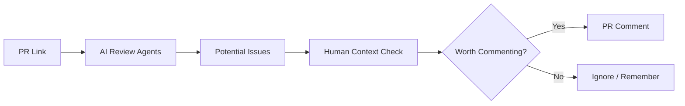
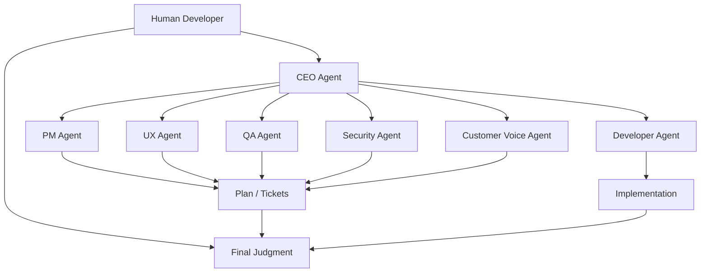

AI 코딩 도구를 이야기할 때 우리는 보통 “코드를 얼마나 잘 짜나”부터 본다.

하지만 실제 개발자의 하루를 보면 AI의 쓰임은 훨씬 넓다.

- PR을 먼저 훑고
- 기획 문서를 정리하고
- Linear, Slack, Notion의 맥락을 읽고
- 역할별 에이전트를 나눠 회의시키고
- 사람이 마지막 판단을 한다

Claude Bloom의 `AI슬쩍 EP.01`이 흥미로운 이유는 이 지점을 잘 보여 주기 때문이다.  
영상의 핵심은 “AI가 프론트엔드 코드를 대신 짠다”가 아니라, **프론트엔드 개발자가 AI를 업무 운영 레이어로 쓰는 방식**에 있다.

<!--more-->

## Sources

- YouTube: <https://www.youtube.com/watch?v=KtYs5W2yzjg>

## 1. 첫 업무는 코딩이 아니라 PR 리뷰다

영상에서 가장 먼저 나오는 업무는 구현이 아니라 PR 리뷰다.

여기서 중요한 포인트는 개발자가 모든 변경 파일을 처음부터 직접 훑지 않는다는 점이다.

흐름은 대략 이렇다.

1. GitHub PR 링크를 가져온다
2. GitHub MCP를 통해 AI에게 PR 맥락을 읽게 한다
3. 역할별 에이전트에게 1차 검토를 맡긴다
4. 사람이 PR 설명과 코드 변경을 같이 읽는다
5. AI 코멘트를 그대로 달지 않고, 프로젝트 맥락에 맞는지 판단한다

즉 AI는 reviewer를 대체하는 것이 아니라 **1차 스크리닝 레이어**가 된다.

이게 중요한 이유는 PR 리뷰에서 시간이 많이 드는 부분이 단순 코드 읽기만은 아니기 때문이다.

- 이 변경이 티켓 의도와 맞는가
- 지금 PR 범위에 필요한 지적인가
- 보안상 우려가 실제로 중요한가
- 팀 관례상 그냥 넘어가도 되는가
- 삭제된 테스트가 정말 필요 없는 테스트인가

이런 판단은 AI가 제안할 수는 있어도, 최종 결정은 사람이 해야 한다.

영상에서도 AI가 지적한 내용 중 일부는 사람이 확인한 뒤 “굳이 코멘트 달 필요 없음”으로 판단한다.

이 지점이 현실적이다.

## 2. AI 리뷰의 핵심은 “코멘트 생성”이 아니라 “코멘트 필터링”이다

많은 팀이 AI PR 리뷰를 도입할 때 실수하는 부분이 있다.

AI가 지적한 것을 그대로 PR comment로 남기는 것이다.

영상에서는 반대로 한다.

AI가:

- E2E 테스트 삭제 문제
- 외부 파일 복사 옵션 문제
- Linear ticket link 누락
- 보완하면 좋을 점

같은 것을 찾아내면, 개발자는 다시 프로젝트 맥락으로 걸러낸다.

예를 들어:

- 삭제된 E2E 테스트가 실제로 안 쓰는 테스트라면 문제 아님
- 외부 파일 복사 옵션이 내부 공유 환경에서 큰 위험이 아니라면 comment 불필요
- Linear 링크 누락이 팀 내부에서 이미 아는 맥락이라면 굳이 PR block 아님

즉 AI 리뷰의 가치는 “자동 comment bot”이 아니라  
**놓칠 수 있는 후보를 넓게 뽑아 주고, 사람이 맥락으로 줄이는 것**에 있다.

## 3. 역할별 에이전트는 마크다운 파일로 키운다

영상에서 반복해서 나오는 표현이 있다.

각 에이전트를 “마크다운 파일로 키웠다”는 말이다.

예를 들어:

- Linear 전문 에이전트
- Slack 전문 에이전트
- refactoring 전문가
- UX 에이전트
- QA 에이전트
- customer voice 에이전트
- security 에이전트

가 각자 다른 문서와 역할 설명을 갖는다.

이 구조가 중요한 이유는 한 에이전트에게 모든 것을 몰아넣지 않기 때문이다.

하나의 거대한 에이전트에게:

- Linear
- Slack
- codebase
- UX
- QA
- customer context
- security

를 모두 넣으면 context가 비대해지고 판단 기준도 섞인다.

반대로 역할별로 나누면:

- Linear 에이전트는 티켓 맥락만 깊게 본다
- Slack 에이전트는 팀 대화 맥락만 본다
- UX 에이전트는 사용자 편의성을 본다
- QA 에이전트는 테스트와 품질을 본다
- customer voice는 실제 사용자의 불편함을 상상한다

즉 멀티에이전트의 핵심은 에이전트 수가 아니라 **맥락의 분리**다.

## 4. Notion, Linear, Slack은 AI의 출력물이 아니라 업무 표면이다

영상에서는 Claude Code 화면만 계속 보는 것이 아니라 Notion, Linear, Slack이 함께 등장한다.

이게 중요하다.

AI 도구가 실제 업무에 들어오면 “채팅창 안에서 답을 받는 것”만으로는 부족하다.

업무 산출물은 결국 팀이 쓰는 시스템에 남아야 한다.

- PR 리뷰 결과는 GitHub에 남아야 한다
- 기획 플랜은 Notion에 정리되어야 한다
- task와 dependency는 Linear에 있어야 한다
- 공유할 내용은 Slack draft로 준비되어야 한다

영상 속 개발자는 Claude Code에 Notion MCP를 붙여 AI 리뷰 결과를 Notion에 정리하게 한다.  
또 Linear에서 에이전트들이 task를 만들고 label과 dependency를 붙이게 한다.

즉 AI의 역할은 “답변 생성”이 아니라  
**기존 업무 도구에 맞는 형태로 결과를 남기는 것**까지 확장된다.

## 5. 구현 전에 기획을 탄탄하게 만드는 데 AI를 쓴다

영상 중반부에서 개발자는 본인 작업을 설명한다.

구현할 기능이 있고, 그 전에 Notion에 `phase 3 plan` 같은 플랜을 정리해 둔다.

이 플랜은:

- 기존 기획 내용
- Slack 대화
- 관련 자료
- Claude Code가 정리한 초안
- 사람이 수정한 판단

을 바탕으로 만들어진다.

핵심은 바로 구현으로 들어가지 않는다는 점이다.

먼저:

1. 자료를 모으고
2. AI에게 plan을 만들게 하고
3. 사람이 수정하고
4. 여러 에이전트가 회의하고
5. 최종적으로 구현에 들어간다

이 흐름은 최근 자주 말하는 agent harness engineering과도 맞닿아 있다.

코딩을 빠르게 하는 것보다 더 중요한 것은  
**무엇을 만들지, 왜 만들지, 어느 범위까지 만들지 먼저 안정화하는 것**이다.

## 6. tmux 기반 멀티에이전트 하네스는 “작은 회사”처럼 동작한다

영상에서 가장 인상적인 장면은 tmux 화면이다.

여러 Claude Code 세션을 띄워 놓고, 각각을 역할별 에이전트처럼 운영한다.

구조는 일종의 작은 회사다.

- CEO
- PM
- QA
- UX
- security
- developer
- customer voice
- PR reviewer

이 에이전트들이 서로 회의하고, task를 만들고, 담당자를 정하고, 결정 내용을 기록한다.

중요한 것은 완전 자율 방치가 아니다.

개발자는:

- 필요한 에이전트만 고르고
- 고장난 에이전트는 제거하고
- 새 에이전트를 뽑고
- 최종 회의록을 확인하고
- 구현 전 방향을 승인한다

즉 멀티에이전트 하네스의 핵심은 “AI가 알아서 다 한다”가 아니라  
**역할을 나눠 생각하게 하고, 사람이 지휘와 승인 역할을 맡는 것**이다.

## 7. 모든 에이전트에 비싼 모델을 쓰지 않는다

영상에서 매우 현실적인 포인트가 나온다.

모든 에이전트에 가장 비싼 모델을 쓰지 않는다는 점이다.

역할별로 모델을 다르게 둔다.

- 중요한 판단을 하는 에이전트는 더 강한 모델
- 단순 정리나 보조 역할은 더 저렴한 모델
- 빠르게 초안을 만드는 역할은 가벼운 모델

이건 멀티에이전트 구조에서 특히 중요하다.

에이전트 수가 늘어나면 token 비용은 선형보다 더 빠르게 불어날 수 있다.  
서로 회의하고, 회의록을 만들고, 다시 검토하는 과정이 반복되기 때문이다.

그래서 영상 속 개발자는:

- 필요한 에이전트만 부르고
- 상황에 맞지 않는 에이전트는 빼고
- 역할 중요도에 따라 모델을 다르게 둔다

이렇게 운영한다.

멀티에이전트의 실전 병목은 지능이 아니라 **비용과 관측 가능성**이다.

## 8. AI가 도는 동안 사람은 놀지 않는다

영상 초반 PR 리뷰 장면에서 중요한 말이 나온다.

AI가 리뷰하는 동안 사람은 노는 게 아니라, PR 작성자가 적은 설명과 맥락을 읽는다는 것이다.

후반부에서도 비슷하다.

멀티에이전트가 회의하고 구현하는 동안 개발자는 다른 Slack 요청이나 다른 업무를 처리한다.  
여러 AI 세션을 켜 둔 이유도, 하나가 처리되는 동안 다른 일을 하기 위해서다.

이건 AI 협업에서 중요한 태도다.

AI가 오래 걸리는 작업을 맡는 동안 사람은:

- 요구사항을 읽고
- 다른 PR을 보고
- Slack 요청을 처리하고
- 결과가 나오면 다시 판단하고
- 필요한 방향 전환을 준다

즉 사람의 역할은 사라지는 것이 아니라  
**동기식 작업자에서 비동기식 감독자와 판단자로 바뀐다**.

## 9. 프론트엔드 개발에서 AI의 가치는 UI 생성보다 업무 맥락 통합에 있다

프론트엔드 개발자와 AI를 연결하면 보통 이런 장면을 떠올린다.

- React component 생성
- CSS 수정
- UI 구현
- Storybook 작성

물론 이것도 중요하다.

하지만 영상에서 더 인상적인 것은 코드 생성 자체가 아니다.

진짜 가치는:

- PR 맥락
- Linear ticket
- Slack 대화
- Notion plan
- UX 판단
- QA 관점
- customer voice

를 한 작업 흐름 안에 모으는 데 있다.

프론트엔드는 제품 요구사항, 디자인, 사용자 경험, QA, 릴리스 맥락이 강하게 얽힌 영역이다.  
그래서 단순히 코드만 잘 짜는 AI보다, **업무 맥락을 함께 읽고 정리하는 AI 운영 방식**이 더 중요해진다.

## 10. 결론: AI를 잘 쓰는 프론트엔드 개발자는 코드를 덜 보는 사람이 아니라 판단 기준을 더 잘 운영하는 사람이다

이 영상의 메시지를 한 문장으로 줄이면 이렇다.

AI를 잘 쓰는 개발자는 AI에게 일을 던지고 끝내는 사람이 아니다.  
**AI가 만든 후보, 리뷰, 플랜, 회의록을 사람의 판단 기준으로 걸러내는 사람**이다.

영상 속 흐름은 꽤 현실적이다.

- AI가 PR을 먼저 본다
- 사람은 맥락을 읽고 필터링한다
- 기획은 Notion과 Slack 맥락으로 만든다
- 역할별 에이전트가 회의한다
- Linear에 task와 dependency를 남긴다
- 모델과 에이전트 수는 비용에 맞게 제한한다
- 최종 결정은 사람이 한다

결국 AI 시대의 프론트엔드 개발자는 “코드를 안 보는 사람”이 아니라,  
**코드, 기획, 사용자 경험, 팀 도구, 에이전트 출력을 연결해 제품 판단을 내리는 사람**에 가까워진다.

이게 단순한 바이브코딩과 실무형 AI 활용의 가장 큰 차이다.
