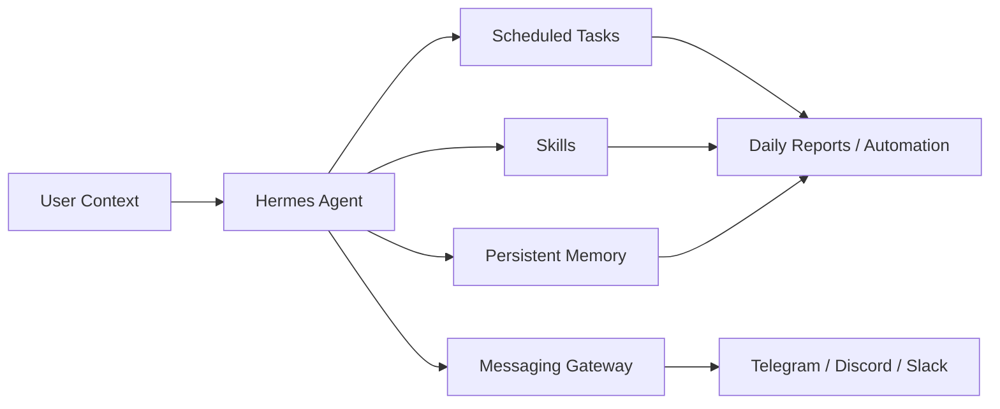
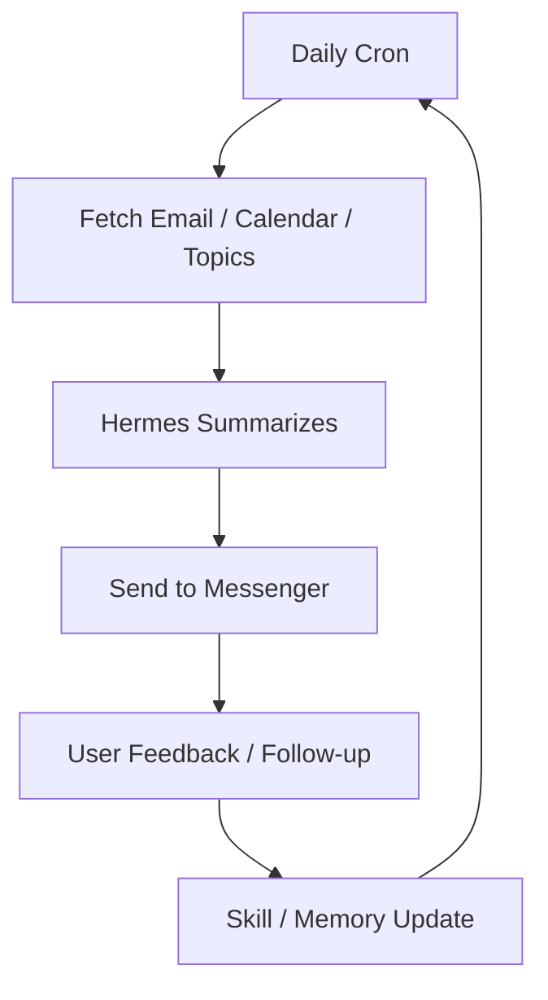

Hermes Agent를 처음 보면 “또 하나의 AI 챗봇인가?”라고 생각하기 쉽다.

하지만 영상의 핵심은 정반대다.

Hermes는 GPT나 Claude처럼 질문에 답하는 채팅 도구가 아니라,  
**서버 위에서 24시간 돌며 내 생활과 업무의 병목을 자동화하는 맞춤형 에이전트 시스템**에 가깝다.

이 차이를 이해하지 못하면 Hermes를 설치해 놓고도 그냥 채팅창처럼 쓰다가 끝난다.  
반대로 제대로 이해하면, Hermes는 브리핑·모니터링·리서치·스케줄링·반복 업무를 맡는 장기 운영 레이어가 된다.

<!--more-->

## Sources

- YouTube: <https://www.youtube.com/watch?v=WXka6bp1aYw>
- Hermes Agent GitHub: <https://github.com/NousResearch/hermes-agent>
- Hermes Agent docs: <https://hermes-agent.nousresearch.com/docs>

## 1. Hermes는 챗봇이 아니라 “계속 돌아가는 에이전트”다

영상은 Hermes를 한 문장으로 이렇게 설명한다.

서버 위에서 24시간 돌아가는 맞춤형 자동화 에이전트.

여기서 중요한 단어는 두 개다.

- 서버 위에서
- 24시간

일반 챗봇은 내가 물어볼 때만 답한다.  
Hermes는 다르다.

- 정해진 시간에 작업을 실행하고
- 메신저로 결과를 보내고
- 반복 업무를 기억하고
- 이전 작업에서 배운 패턴을 skill로 축적하고
- 다음 작업에서 더 나은 방식으로 응답한다

즉 Hermes는 `prompt → answer` 도구라기보다  
**schedule → execute → learn → report** 시스템이다.

## 2. OpenClaw, Claude Code와 비교하면 역할이 다르다

영상에서 중요한 비교가 나온다.

Hermes는 OpenClaw나 Claude Code의 단순 대체재가 아니다.

### OpenClaw와의 차이

OpenClaw는 여러 채널과 에이전트를 관리하는 **중앙 게이트웨이 / 컨트롤 센터** 성격이 강하다.

반면 Hermes는 에이전트 자체의:

- 실행
- 기억
- 학습
- skill 생성
- 장기 개선

에 초점이 있다.

즉 OpenClaw가 “여러 곳을 연결하고 관리하는 허브”라면,  
Hermes는 “한 에이전트가 오래 쓰면서 성장하는 개인 자동화 시스템”에 가깝다.

### Claude Code / Codex와의 차이

Claude Code나 Codex는 코드 저장소 안에서 강하다.

- 파일 수정
- 테스트 실행
- PR 대응
- 코드 리뷰
- 리팩터링

반면 Hermes는 서버에 상주하면서:

- 리서치
- 브리핑
- 이메일/캘린더 요약
- 반복 업무
- 메신저 알림
- 웹 모니터링

을 담당한다.

그래서 실전 조합은 이렇게 보는 편이 좋다.

- 코드 작업: Claude Code / Codex
- 생활·업무 자동화: Hermes
- 멀티 채널 운영: OpenClaw 계열

## 3. 어디에 설치할 것인가: 메인 PC보다 VPS가 현실적이다

영상은 Hermes를 어디서 돌릴지 세 가지 선택지를 제시한다.

- 집에 있는 PC
- 전용 PC / Mac mini
- VPS

여기서 핵심은 Hermes가 “상시 실행”을 전제로 한다는 점이다.

메인 PC에 설치하면:

- 보안 리스크가 있고
- 계속 켜 둬야 하며
- 개인 작업 환경과 섞인다

전용 PC는 좋지만 비용이 든다.

그래서 영상은 VPS를 현실적인 선택지로 본다.

VPS의 장점은:

- 24시간 실행
- 개인 PC와 분리
- 비용 예측 가능
- 메신저/cron/자동화에 적합

이라는 점이다.

다만 영상은 Hostinger 지원을 받은 콘텐츠이므로, 특정 업체 추천은 광고 맥락을 감안해 읽는 것이 좋다.  
중요한 결론은 특정 VPS 브랜드가 아니라, **Hermes는 로컬 채팅앱보다 상시 실행 서버에 더 잘 맞는다**는 점이다.

## 4. 모델 선택이 Hermes 품질을 크게 좌우한다

영상에서 꽤 현실적인 조언이 나온다.

Hermes가 별로라고 느껴지는 가장 큰 이유 중 하나는 모델 선택이라는 것이다.

에이전트는:

- 계획하고
- 도구를 쓰고
- 메모리를 갱신하고
- 반복 업무를 해석하고
- 실수를 줄여야 한다

그래서 너무 약한 모델을 쓰면 전체 경험이 무너진다.

영상에서는 frontier model을 추천하고, 비용 관점에서 Codex 또는 OpenAI OAuth, OpenRouter 같은 경로도 언급한다.

여기서 실전적으로 중요한 점은 이것이다.

- 간단한 알림/정리: 저렴한 모델 가능
- 복잡한 workflow: 강한 모델 필요
- 장기 자동화: 비용과 품질 균형 필요
- 운영 초기: 좋은 모델로 baseline을 잡는 편이 안전

Hermes는 단순 Q&A보다 더 많은 판단을 하기 때문에, 모델 품질 차이가 체감된다.

## 5. 메신저 연결은 Hermes의 핵심 인터페이스다

Hermes는 터미널에서만 쓰는 도구가 아니다.

영상에서는 Telegram과 Discord를 언급하고, 특히 Discord 연결 과정을 자세히 보여 준다.

Discord를 쓰는 이유는 단순히 채팅이 편해서가 아니다.

- 일반 채널
- 리서치 채널
- 유튜브 채널
- 업무 알림 채널
- 실험 결과 채널

처럼 목적별 채널을 나눌 수 있기 때문이다.

즉 메신저는 Hermes의 단순 알림창이 아니라  
**자동화 결과가 흘러오는 운영 인터페이스**가 된다.

이 구조가 붙으면 Hermes는 내 컴퓨터 안의 CLI가 아니라,  
언제든 휴대폰으로 부르고 결과를 받는 상시 비서가 된다.

## 6. 처음부터 완벽한 답을 기대하면 안 된다

영상에서 가장 중요한 태도는 이것이다.

Hermes는 처음부터 마법처럼 나를 이해하지 않는다.

사용자가:

- 본인의 생활 패턴
- 자주 보는 정보
- 선호하는 결과 형식
- 중요한 사람과 일정
- 반복 업무
- 피하고 싶은 방식

을 넣어 줘야 한다.

그리고 시간이 지나면서 Hermes는:

- 어떤 브리핑을 좋아하는지
- 어떤 회의를 준비해야 하는지
- 어떤 주제에 후속 질문을 하는지
- 어떤 형식의 결과물을 선호하는지

를 학습한다.

즉 Hermes는 설치 당일 평가하는 도구가 아니라,  
**한 달 정도 반복 업무를 맡겨 보고 평가해야 하는 도구**에 가깝다.

## 7. Slash command와 skill은 Hermes를 “내 방식”으로 바꾸는 장치다

영상에서는 몇 가지 slash command가 소개된다.

- `/skin`
- `/insights`
- `/steal`
- `/bytheway`

특히 `/bytheway`가 흥미롭다.

질문은 하지만 Hermes memory에 저장하지 않는 방식이다.  
장기 memory가 강점인 도구일수록, 반대로 **기억하지 말아야 할 것**도 분리할 필요가 있다.

또 Hermes는 다양한 skill을 갖고 있고, 필요하면 skill을 추가하거나 새로 만들 수 있다.

영상에서 언급된 예시는:

- Claude Code / Codex 실행
- ASCII image
- Excalidraw
- GitHub
- Spotify / YouTube
- LLM Wiki
- GStack
- Superpowers
- 논문/위키 기반 skill 생성

등이다.

여기서 중요한 건 skill 수가 아니다.  
내 반복 업무를 하면서 **정말 필요한 skill을 만들어 가는 것**이 핵심이다.

## 8. 가장 실용적인 첫 사용 사례는 cron briefing이다

Hermes를 처음 쓸 때 가장 좋은 진입점은 거창한 자율 에이전트가 아니다.

영상이 추천하는 실전 사례는 cron scheduling이다.

예를 들어:

- 매일 아침 7시에 이메일과 캘린더 요약
- 매주 수요일 뉴스레터 요약
- 매일 특정 분야 트렌드 3줄 요약
- SNS에 올릴 만한 포스팅 후보 생성
- 관심 키워드 모니터링

같은 작업이다.

이런 자동화가 좋은 이유는 결과가 매일 쌓이기 때문이다.

처음에는 평범한 요약이지만, 2주~1개월이 지나면:

- 내가 자주 답장하는 사람
- 내가 중요하게 보는 회의
- 내가 자주 물어보는 주제
- 내가 선호하는 문장 스타일

이 반영되기 시작한다.

## 9. 모니터링과 브라우저 자동화가 붙으면 업무 자동화 범위가 넓어진다

영상 후반부는 모니터링 사례가 많다.

예를 들어:

- Sentry error log 감지
- GitHub issue 감지
- 경쟁사 가격 페이지 모니터링
- 경쟁사 디자인 변경 감지
- 경쟁사 SNS 게시물 분석
- YouTube 채널/키워드 모니터링
- Product Hunt / App Store 리뷰 분석

이건 단순 정보 수집이 아니다.

Hermes가:

- 변화를 감지하고
- 의미를 요약하고
- 수정 제안을 만들고
- 경우에 따라 직접 수정까지 시도하고
- 결과를 메신저로 보고

하는 구조가 된다.

여기서 브라우저 자동화가 붙으면 범위가 더 넓어진다.  
단순 API 기반 자동화가 아니라 실제 웹 화면을 조작하는 workflow까지 가능해지기 때문이다.

## 10. 통합 memory의 장점과 위험

영상에서 중요한 말이 나온다.

모닝 브리핑, 마케팅, 일정 관리, 코드베이스 담당 memory가 서로 연결되면 복리 효과가 생긴다는 것이다.

예를 들어:

- 일정 맥락이 브리핑 품질을 높이고
- 브리핑 맥락이 콘텐츠 아이디어를 만들고
- 콘텐츠 반응이 다음 실험을 바꾸고
- 코드베이스 맥락이 제품 개선 제안으로 이어진다

이런 통합 memory는 분리된 도구에서는 만들기 어렵다.

하지만 위험도 있다.

프로젝트가 커지면:

- 기억이 섞이고
- 정체성이 흐려지고
- 업무별 정책이 충돌하고
- 민감한 맥락이 다른 작업에 새어 들어갈 수 있다

그래서 어느 시점부터는 여러 Hermes profile이나 별도 agent로 분리하는 편이 낫다.

즉 통합 memory는 강력하지만, 항상 하나로 합치는 것이 정답은 아니다.

## 11. Hermes는 자동 실험 루프와 잘 맞는다

영상은 자동 실험 패턴도 언급한다.

예를 들어:

- 이메일 오픈율
- 랜딩 페이지 전환율
- SNS post 반응
- 광고 소재 성과

같은 지표를 두고 Hermes가:

1. 작은 변경을 시도하고
2. 결과를 측정하고
3. 좋은 결과를 유지하고
4. 다음 실험을 설계한다

는 구조다.

이건 Hermes가 단순 자동화 도구에서 한 단계 더 나아가는 부분이다.

단순 cron은 “정해진 일을 반복”한다.  
실험 루프는 “결과를 보고 다음 행동을 바꾼다.”

Hermes의 memory와 skill system은 이 반복 개선 루프와 잘 맞는다.

## 12. 최신 저장소 메타데이터

GitHub API 기준 공식 저장소 정보는 다음과 같다.

- 저장소: `NousResearch/hermes-agent`
- 설명: `The agent that grows with you`
- stars: `144,638`
- forks: `22,613`
- 기본 브랜치: `main`
- 주 언어: `Python`
- 라이선스: `MIT`
- 최근 push: `2026-05-11`

이 수치만 봐도 Hermes가 단순 실험 프로젝트가 아니라, 현재 AI agent 생태계에서 상당한 관심을 받는 프로젝트라는 점을 알 수 있다.

## 13. 결론: Hermes는 설치보다 “반복 업무 하나를 한 달 맡겨 보는 것”이 중요하다

영상의 마지막 조언이 가장 현실적이다.

Hermes를 설치하고 바로 평가하지 말고,  
반복 업무 하나를 맡긴 뒤 한 달 정도 돌려 보라는 것이다.

좋은 첫 과제는 이런 것들이다.

- 매일 아침 브리핑
- 뉴스레터 요약
- 경쟁사 모니터링
- Sentry/GitHub issue 감시
- SNS 포스팅 후보 생성
- 생활 알림
- LLM Wiki 정리

이런 작업은 하루 만에 감동을 주기보다,  
반복되면서 점점 내 방식에 맞춰지는 데 가치가 있다.

Hermes의 핵심은 “설치했다”가 아니다.

**내 생활과 업무의 반복 병목을 하나씩 넘겨 주고, 그 결과를 memory와 skill로 축적하게 만드는 것.**

이 관점으로 보면 Hermes는 챗봇이 아니라  
24시간 돌아가는 개인 자동화 운영체계에 가깝다.
