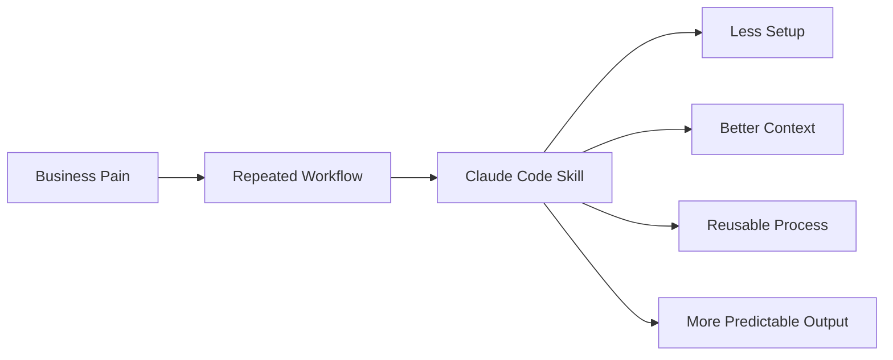
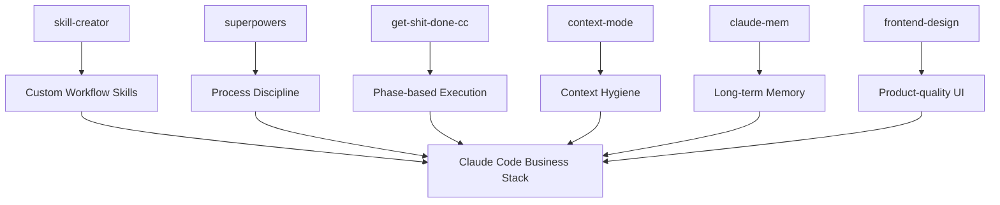

Claude Code 스킬은 점점 많아지고 있다.

그런데 실제로 기업이 돈을 내는 스킬은 생각보다 화려하지 않다.

Nate Herk의 영상 `I Tried 100+ Claude Code Skills. These 6 Are The Best`에서 흥미로운 점도 바로 이 부분이다.  
100개 넘는 스킬을 써 본 뒤 남는 것은 멋진 데모용 스킬이 아니라, **반복되는 업무 병목을 줄이는 단순하고 지루한 스킬**이라는 것이다.

<!--more-->

## Sources

- YouTube: <https://www.youtube.com/watch?v=eRS3CmvrOvA>
- Context Mode: <https://github.com/mksglu/context-mode>
- claude-mem: <https://github.com/taylorwilsdon/claude-mem>

## 1. 좋은 스킬은 “멋진 기능”보다 “반복 비용을 줄이는 장치”다

영상 설명에서 가장 중요한 문장은 이것이다.

기업들은 계속 같은 여섯 종류의 스킬에 비용을 지불한다.

이 말은 Claude Code 스킬 시장을 보는 기준을 바꾼다.

잘 팔리는 스킬은 꼭:

- 가장 창의적이거나
- 가장 복잡하거나
- 가장 많은 API를 연결하거나
- 가장 멋진 데모를 보여 주는 것

이 아니다.

오히려 실제 고객은:

- 매번 같은 설정을 반복하지 않게 해 주는 것
- AI가 작업 순서를 지키게 해 주는 것
- 컨텍스트를 덜 낭비하게 해 주는 것
- 기억을 유지하게 해 주는 것
- 디자인 결과물을 더 실무적으로 만들어 주는 것
- 스킬 자체를 더 빨리 만들게 해 주는 것

에 돈을 낸다.

즉 Claude Code 스킬의 본질은 “기능 추가”보다 **작업 습관의 제품화**다.



## 2. Skill #1: `skill-creator` — 스킬을 만드는 스킬

설치 명령:

```bash
/plugin install skill-creator@claude-plugins-official
```

첫 번째로 소개된 것은 `skill-creator`다.

이 스킬이 중요한 이유는 명확하다.

Claude Code를 오래 쓰면 결국 “내 업무에 맞는 스킬”이 필요해진다.

처음에는 남이 만든 스킬을 쓰지만, 시간이 지나면:

- 우리 회사 PR 리뷰 방식
- 우리 팀 배포 체크리스트
- 우리 제품 디자인 규칙
- 우리 고객 지원 응답 방식
- 우리 문서화 포맷

같은 내부 workflow를 스킬로 만들고 싶어진다.

`skill-creator`는 이 과정을 도와준다.

즉 이 스킬은 단일 작업을 해결하는 것이 아니라,  
**조직이 자기 workflow를 Claude Code 스킬로 포장하는 능력**을 준다.

이게 기업에게 중요한 이유는 스킬이 결국 반복 업무의 표준화 수단이기 때문이다.

## 3. Skill #2: `superpowers` — 실행 품질을 지키는 프로세스 스킬

설치 명령:

```bash
/plugin install superpowers@claude-plugins-official
```

`superpowers`는 단일 기능 스킬이라기보다 작업 방법론 묶음에 가깝다.

핵심은:

- brainstorming
- planning
- test-driven development
- systematic debugging
- verification before completion
- code review

같은 절차를 Claude Code 안에서 강제하는 것이다.

이 스킬이 잘 팔리는 이유는 명확하다.

기업은 “AI가 코드를 빨리 써 주는 것”보다  
“AI가 검증 없이 완료했다고 말하지 않는 것”을 더 중요하게 본다.

즉 `superpowers`의 가치는 속도가 아니라 **작업 품질과 검증 습관**에 있다.

## 4. Skill #3: `get-shit-done-cc` — GSD 계열의 실행 루프

설치 명령:

```bash
npx get-shit-done-cc --claude --global
```

세 번째는 `get-shit-done-cc`, 즉 GSD 계열이다.

이름은 거칠지만, 문제의식은 실무적이다.

Claude Code를 오래 쓰면 자주 겪는 문제가 있다.

- 중간에 context가 무거워진다
- 목표가 흐려진다
- 구현과 검증이 섞인다
- 세션이 길어질수록 품질이 떨어진다

GSD 계열 스킬은 작업을 phase로 나누고,  
각 phase를 더 작고 관리 가능한 단위로 진행하게 만든다.

즉 이 스킬의 가치는 “더 똑똑한 에이전트”가 아니라  
**긴 작업을 망가지지 않게 쪼개는 실행 구조**다.

## 5. Skill #4: `context-mode` — 컨텍스트 낭비를 줄이는 런타임 위생 계층

설치 명령:

```bash
/plugin marketplace add mksglu/context-mode
/plugin install context-mode@context-mode
```

`context-mode`는 이미 별도 글로도 다룰 만큼 중요한 스킬이다.

핵심은 tool output을 그대로 context에 밀어 넣지 않는 것이다.

AI 코딩 에이전트는:

- `git diff`
- `grep`
- `ls`
- `tree`
- test log
- build output

을 자주 읽는다.

그런데 이런 출력은 금방 context window를 오염시킨다.

`context-mode`는 이런 도구 출력을 sandboxing하고, 필요한 정보만 회수하게 만들어 context hygiene을 개선한다.

기업이 여기에 돈을 낼 이유는 분명하다.

컨텍스트가 깨끗하면:

- 더 긴 세션을 유지하고
- 모델 비용을 줄이고
- 헛읽기를 줄이고
- 실수 가능성을 낮춘다

즉 이 스킬은 화려하지 않지만, 대규모 코드베이스에서 체감이 크다.

## 6. Skill #5: `claude-mem` — 세션을 넘어 기억을 유지한다

설치 명령:

```bash
/plugin marketplace add thedotmack/claude-mem
/plugin install claude-mem
```

Claude Code의 가장 큰 약점 중 하나는 세션이 바뀌면 맥락이 사라진다는 점이다.

물론 `CLAUDE.md` 같은 프로젝트 메모리가 있지만, 이것만으로는 부족할 때가 많다.

필요한 것은:

- 반복되는 프로젝트 규칙
- 이전 실패
- 사용자 선호
- 특정 모듈 주의사항
- 자주 쓰는 명령어
- 과거 결정

을 다음 세션으로 넘기는 구조다.

`claude-mem`은 이런 장기 기억 계층을 보강하는 스킬로 볼 수 있다.

다만 memory 스킬은 조심해야 한다.

모든 것을 기억하면 좋은 것이 아니라,  
**검증된 반복 지식만 기억해야** 한다.

잘못된 기억은 없는 기억보다 더 위험하다.

그래서 기업 환경에서 memory 스킬은 반드시:

- 출처
- 검증일
- scope
- 만료 기준
- 삭제 방법

을 함께 운영해야 한다.

## 7. Skill #6: `frontend-design` — AI가 만든 UI를 “실무 화면”에 가깝게 만든다

설치 명령:

```bash
/plugin install frontend-design@claude-plugins-official
```

마지막은 `frontend-design`이다.

AI가 UI를 만들 때 가장 흔한 문제는 “작동은 하지만 제품 같지 않다”는 것이다.

- spacing이 어색하고
- hierarchy가 약하고
- 색상과 typography가 generic하고
- 모바일 대응이 빈약하고
- 상태별 UI가 빠지고
- 실제 사용자 흐름이 약하다

`frontend-design` 계열 스킬은 이 문제를 줄인다.

기업이 이 스킬에 관심을 갖는 이유는 명확하다.

AI가 만든 화면이 단순 prototype을 넘어:

- 고객에게 보여 줄 수 있고
- 팀 리뷰에 올릴 수 있고
- 실제 제품 디자인과 가까워지고
- 프론트엔드 개발자의 수정 비용을 줄이면

바로 비용 절감으로 이어지기 때문이다.

## 8. 이 6개 스킬을 레이어로 보면 더 잘 이해된다

영상의 6개 스킬을 하나의 stack으로 보면 다음과 같다.



각 스킬은 서로 다른 병목을 줄인다.

- `skill-creator`: 스킬 제작 병목
- `superpowers`: 절차와 검증 병목
- `get-shit-done-cc`: 긴 작업 실행 병목
- `context-mode`: 컨텍스트 낭비 병목
- `claude-mem`: 세션 기억 병목
- `frontend-design`: generic UI 병목

즉 이 목록은 “좋은 스킬 6개”가 아니라  
**Claude Code를 업무용 개발 환경으로 만드는 6개 레이어**에 가깝다.

## 9. 기업이 돈 내는 스킬은 대부분 boring하다

영상 설명에서 가장 좋은 표현은 “simple, boring skills are the ones that actually sell”이다.

이 말은 중요하다.

클라이언트는 보통:

- AI가 멋진 그림을 그리는지
- 기발한 데모를 하는지
- 새로운 모델을 쓰는지

보다:

- 내 팀의 반복 업무가 줄어드는지
- 결과 품질이 일정해지는지
- 검증이 빠지지 않는지
- 맥락이 유지되는지
- 산출물이 바로 쓸 만한지

를 본다.

즉 팔리는 스킬은 신기한 스킬이 아니라  
**조직의 반복 비용을 줄이는 스킬**이다.

## 10. 결론: Claude Code 스킬 시장은 “기능”보다 “운영 습관”을 판다

이 영상의 메시지를 한 문장으로 줄이면 이렇다.

Claude Code 스킬에서 진짜 가치 있는 것은 멋진 명령어가 아니라,  
팀이 매일 반복하는 일을 더 안정적으로 하게 만드는 운영 습관이다.

그래서 처음 배울 만한 스킬도 화려한 것보다:

- 스킬을 만드는 스킬
- 절차를 강제하는 스킬
- 긴 작업을 쪼개는 스킬
- 컨텍스트를 아끼는 스킬
- 기억을 유지하는 스킬
- UI 품질을 끌어올리는 스킬

이다.

AI 자동화 비즈니스를 하든, 내부 개발 생산성을 높이든,  
결국 돈을 내는 쪽은 “신기함”보다 “반복 병목 제거”에 반응한다.

이 6개 스킬이 좋은 이유도 바로 그 때문이다.  
Claude Code를 더 멋지게 만드는 것이 아니라, **더 오래, 더 안정적으로, 더 팀답게 쓰게 만든다.**
