세 영상은 같은 문제를 단계별로 풉니다. 1편은 Antigravity에 Claude Code를 연결하고 `taste-skill`, GPT Image, Higgsfield Seedance 2.0으로 모던 웹사이트를 만드는 흐름입니다. 2편은 VS Code와 Claude Code 확장, 자체 스킬 3종으로 영상 흐름에 맞춰 카드가 등장하는 인터랙티브 웹사이트를 만듭니다. 3편은 여기서 한 단계 더 나아가 영상 프롬프트와 웹사이트 프롬프트를 1대1로 짝지은 32개 프롬프트 팩을 제시합니다. [1편 0:18](https://youtu.be/azQgRMcZvbo?t=18) [2편 0:35](https://youtu.be/szEpRsgeZOA?t=35) [3편 0:00](https://youtu.be/pie4QdBUkgs?t=0)

<!--more-->

## Sources

- <https://youtu.be/azQgRMcZvbo?si=wfvHeG8-mvIih55a>
- <https://youtu.be/szEpRsgeZOA?si=iIYGxZvcm0mHtIyz>
- <https://youtu.be/pie4QdBUkgs?si=561Z2pv29R9ZSK7N>
- Claude Code VS Code integration docs: <https://code.claude.com/docs/en/ide-integrations>
- Claude Code for VS Code Marketplace: <https://marketplace.visualstudio.com/items?itemName=anthropic.claude-code>
- design-taste-frontend skill reference: <https://claudskills.com/skills/taste-skill/>
- Seedance 2.0 public reference: <https://seedance2.app/>

> 참고: 세 영상 모두 한국어 자동 자막만 제공되었고, 현재 환경에서는 YouTube 자막 API가 IP 차단으로 실패했습니다. 따라서 본문은 영상 설명란의 상세 타임라인과 설명 문구를 기준으로 작성했고, VS Code 확장·skill·Seedance 관련 일반 정보는 공개 문서로 교차 확인했습니다.

## 두 영상의 공통 메시지: 웹사이트 제작은 이제 하나의 도구가 아니라 조립 파이프라인이다

첫 번째 영상은 "천만원짜리 웹사이트를 만원 이하에 만든다"는 강한 표현으로 시작합니다. 핵심은 Claude Code 하나가 모든 것을 마법처럼 해결한다는 뜻이 아닙니다. 디자인 골격은 Claude Code와 `taste-skill`이 만들고, 비주얼 레퍼런스는 GPT Image가 만들며, 3D 영상은 Higgsfield Seedance 2.0이 만들고, 마지막 인터랙션은 Claude Code가 웹사이트에 조립합니다. [1편 0:18](https://youtu.be/azQgRMcZvbo?t=18)

두 번째 영상은 같은 결과를 VS Code 환경에서 재현합니다. Antigravity가 아니라 VS Code에 Claude Code 확장을 붙이고, 자체 제작 스킬 3종을 등록해 "영상에 맞춰 카드가 자동으로 뜨는" 웹사이트를 만듭니다. [2편 1:13](https://youtu.be/szEpRsgeZOA?t=73)

세 번째 영상은 시리즈를 템플릿화합니다. 영상 프롬프트와 웹사이트 프롬프트를 1대1 페어로 묶은 32세트를 제공하고, 장면별 시간이 프롬프트 안에 인코딩되어 웹사이트 스크롤 타임라인과 오버레이 타이밍이 자동으로 맞춰진다는 점을 강조합니다. [3편 1:43](https://youtu.be/pie4QdBUkgs?t=103) [3편 2:55](https://youtu.be/pie4QdBUkgs?t=175)

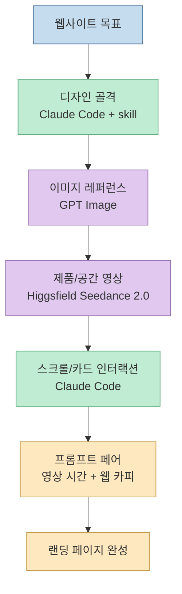

이 구조가 중요한 이유는 각 도구의 역할이 분리되어 있기 때문입니다. Claude Code에게 "예쁜 사이트 만들어줘"라고만 하면 결과가 흔한 템플릿처럼 나올 수 있습니다. 반대로 영상·이미지·디자인 규칙·스크롤 효과를 각각 명확히 나누면, Claude Code는 창작자라기보다 조립자이자 구현자로 작동합니다.

## 1편 루트: Antigravity + Claude Code + taste-skill + Higgsfield

첫 번째 영상의 4단계 흐름은 명확합니다. 먼저 Claude Code 설치와 Antigravity 연동으로 웹사이트 뼈대를 만들고, `taste-skill` GitHub 레포를 활용해 디자인 퀄리티를 끌어올립니다. 그다음 GPT Image 2.0으로 레퍼런스 이미지를 만들고, Higgsfield Seedance 2.0으로 3D 회전 애니메이션을 생성합니다. 마지막으로 영상을 웹사이트에 삽입하고, 프레임 추출 기반 스크롤 애니메이션을 적용합니다. [1편 2:03](https://youtu.be/azQgRMcZvbo?t=123) [1편 3:00](https://youtu.be/azQgRMcZvbo?t=180) [1편 3:39](https://youtu.be/azQgRMcZvbo?t=219) [1편 6:36](https://youtu.be/azQgRMcZvbo?t=396)

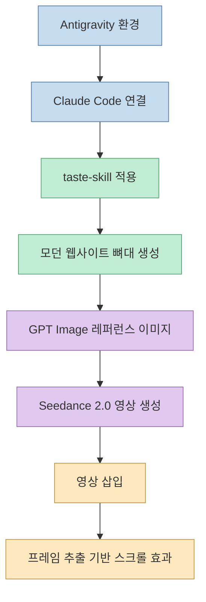

여기서 `taste-skill`의 역할은 디자인 취향을 외부 지침으로 분리하는 것입니다. 공개 skill 레퍼런스는 `design-taste-frontend`가 LLM의 기본적인 인터페이스 편향을 줄이고, 지표 기반 규칙, 컴포넌트 아키텍처, CSS 하드웨어 가속, 균형 잡힌 디자인 엔지니어링을 강제하는 frontend skill이라고 설명합니다. [design-taste-frontend reference](https://claudskills.com/skills/taste-skill/)

즉 1편의 핵심은 "Claude Code가 디자인 감각을 자동으로 가진다"가 아니라, **Claude Code에게 디자인 판단 기준을 skill로 주입한다** 입니다. 영상이 말하는 "아마추어 디자인 한계 돌파"는 모델 교체보다 지침 체계화에 가깝습니다. [1편 3:00](https://youtu.be/azQgRMcZvbo?t=180)

## 이미지 먼저, 영상 나중: 레퍼런스가 품질을 고정한다

1편은 GPT Image 2.0으로 레퍼런스 이미지를 먼저 만들고, 그 이미지를 기반으로 Higgsfield Seedance 2.0 영상을 만드는 흐름을 강조합니다. [1편 3:39](https://youtu.be/azQgRMcZvbo?t=219) 이 전략은 AI 영상 생성에서 중요합니다. 텍스트만으로 영상 생성기를 호출하면 스타일·구도·제품 형태가 흔들릴 수 있습니다. 반면 정지 이미지를 먼저 만들면 첫 프레임, 피사체, 색감, 구도 기준이 생깁니다.

Seedance 2.0 공개 레퍼런스도 image-to-video에서 단일 reference image를 시작 프레임처럼 사용해 subject, framing, art direction을 고정할 수 있다고 설명합니다. 또한 현재 공개 웹 앱 기준으로 Seedance 2.0은 최대 15초, 최대 1080p 범위의 짧은 클립 생성에 초점이 맞춰져 있습니다. [Seedance 2.0 reference](https://seedance2.app/)

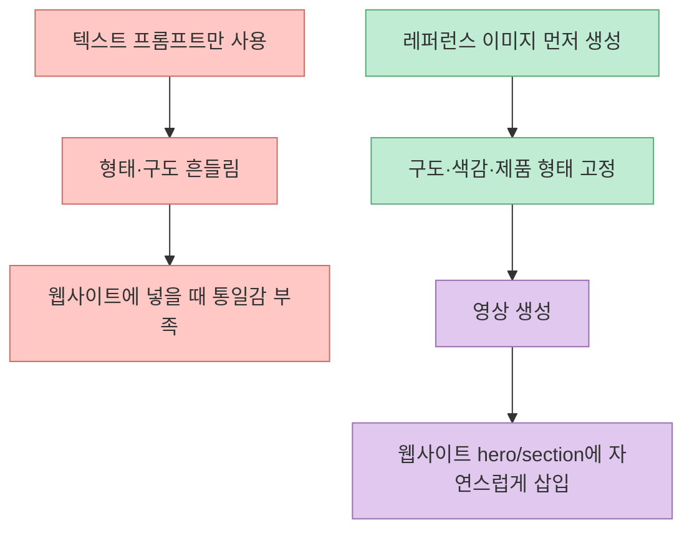

따라서 영상 생성은 "멋진 클립 하나 뽑기"가 아니라, 웹사이트 디자인 시스템에 들어갈 시각 자산을 만드는 과정입니다. 웹페이지에 넣을 영상이라면 프레임 비율, 배경, 피사체 위치, 스크롤 구간에서 보여 줄 장면 전환까지 처음부터 고려해야 합니다.

## 스크롤 연동 프레임 추출: 영상 파일을 인터랙션 상태로 바꾸는 기술

1편의 흥미로운 지점은 완성된 영상을 단순히 `<video>` 태그로 재생하는 데서 끝내지 않는다는 점입니다. 설명란은 "스크롤 연동 프레임 추출 효과"와 "인터랙티브 웹사이트 구현"을 언급합니다. [1편 6:36](https://youtu.be/azQgRMcZvbo?t=396)

이 방식은 영상을 시간 기반 미디어로 보지 않고, 스크롤 위치에 따라 선택되는 프레임 묶음으로 보는 접근입니다. 사용자가 아래로 스크롤하면 영상의 특정 시간 또는 프레임이 표시되고, 카드·텍스트·섹션 전환이 그 위치와 동기화됩니다.

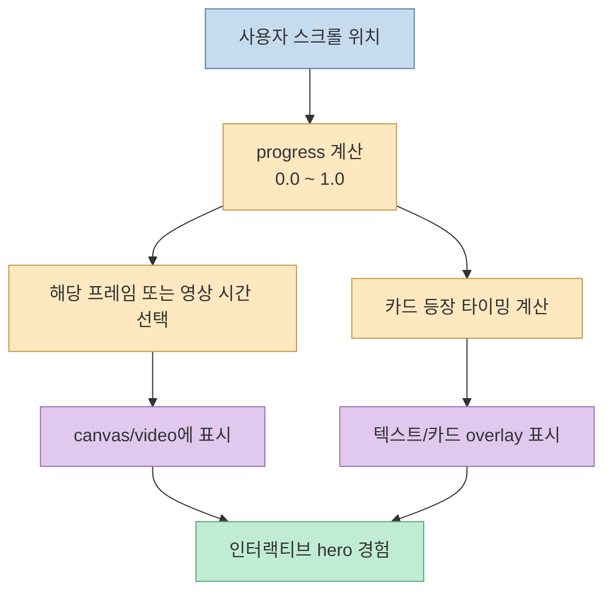

이 부분이 "비싼 외주 사이트"처럼 보이는 핵심입니다. 디자인이 비싸 보이는 이유는 이미지 자체보다도 사용자의 입력에 따라 콘텐츠가 반응하기 때문입니다. Claude Code는 여기서 scroll listener, frame extraction, canvas rendering, overlay timing, responsive layout을 조합하는 구현자 역할을 합니다.

## 2편 루트: Antigravity 대신 VS Code + Claude Code 확장

두 번째 영상은 환경을 바꿉니다. Antigravity 대신 VS Code에 Claude Code 확장을 설치하고 새 세션을 열어 같은 결과를 만드는 흐름입니다. [2편 1:13](https://youtu.be/szEpRsgeZOA?t=73) [2편 3:43](https://youtu.be/szEpRsgeZOA?t=223)

공식 Claude Code 문서는 VS Code 1.98.0 이상과 Anthropic 계정이 필요하며, VS Code 확장을 설치하면 Claude Code panel, Activity Bar, Command Palette, Status Bar 등에서 세션을 열 수 있다고 설명합니다. 또한 확장은 CLI를 포함하고, integrated terminal에서도 advanced feature를 사용할 수 있습니다. [Claude Code VS Code docs](https://code.claude.com/docs/en/ide-integrations)

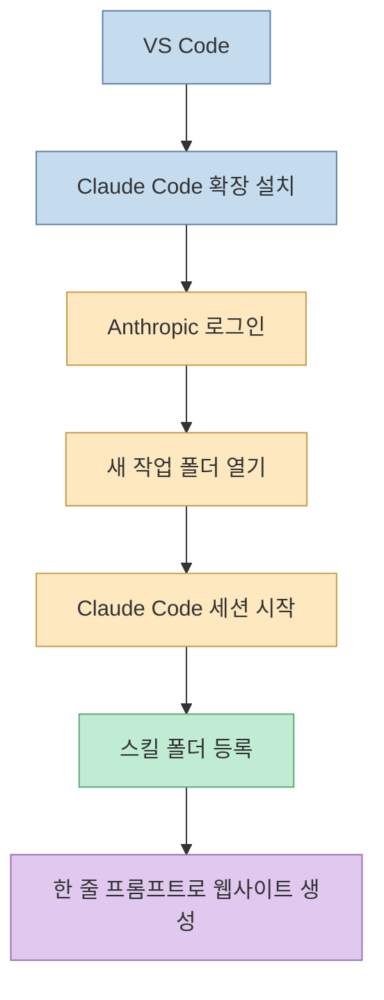

Visual Studio Marketplace의 Claude Code for VS Code 설명도 editor integration, current file/selection 인식, 직접 코드 제안, subagents, custom slash commands, MCP 지원을 언급합니다. 다만 일부 기능은 CLI에서만 설정 가능하다고 명시합니다. [VS Code Marketplace](https://marketplace.visualstudio.com/items?itemName=anthropic.claude-code)

2편의 실전 의미는 큽니다. Antigravity에 의존하지 않고, 이미 많은 개발자가 쓰는 VS Code 환경에서 Claude Code와 skill 기반 웹 제작 루프를 재현할 수 있다는 뜻입니다.

## 자체 스킬 3종: 디자인, 스크롤, 오버레이를 분리한다

두 번째 영상은 `시네마틱 스크롤 엔진`, `프론트엔드 디자인`, `씬 오버레이 엔진` 세 가지 스킬을 소개합니다. [2편 1:50](https://youtu.be/szEpRsgeZOA?t=110) 설명란에 따르면 이 스킬들은 서로 cross reference로 묶여 있어 한 줄 프롬프트에서도 함께 작동합니다.

이 설계가 좋은 이유는 웹사이트 제작 문제를 세 가지 독립 책임으로 나누기 때문입니다.

- 프론트엔드 디자인: 레이아웃, 타이포그래피, 컬러, 카드 구조
- 시네마틱 스크롤 엔진: 스크롤 진행률, 영상 프레임, 섹션 전환
- 씬 오버레이 엔진: 영상 흐름에 맞춘 카드 등장, 텍스트 배치, 타이밍 판단

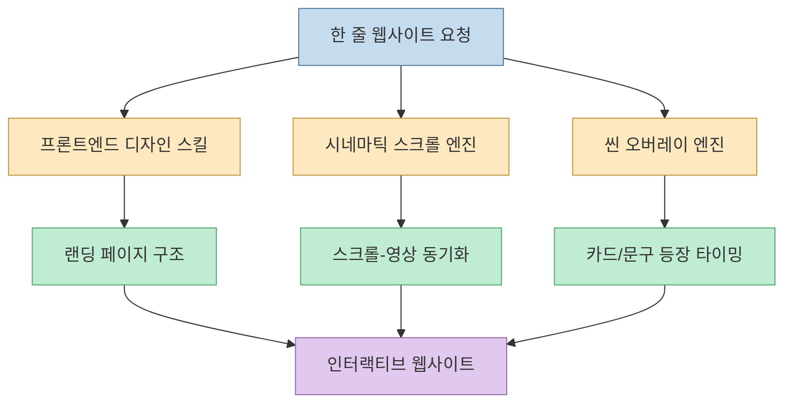

Claude Code에게 이 세 책임을 한 번에 맡기면 결과가 불안정할 수 있습니다. 하지만 skill로 분리하면 각 스킬이 자기 관점의 체크리스트를 갖고 작동합니다. 이것이 단순 프롬프트와 skill 기반 제작의 차이입니다.

## 15초 영상과 카드 자동 등장: AI가 타이밍 코드를 대신 판단한다

2편의 핵심 데모는 15초 동안 끊김 없이 이어지는 카페라떼 시연 영상에 맞춰 카드가 자동으로 등장하는 웹사이트입니다. [2편 6:11](https://youtu.be/szEpRsgeZOA?t=371) [2편 8:18](https://youtu.be/szEpRsgeZOA?t=498) 영상 설명란은 Claude Code가 영상 흐름에 맞춰 카드 등장 타이밍까지 자동 판단하기 때문에 사용자가 타이밍 코드를 직접 만질 필요가 없다고 설명합니다.

이것은 단순한 "동영상 배경 + 카드"가 아닙니다. 영상의 장면 흐름을 정보 구조와 연결합니다. 예를 들어 라떼가 추출되는 장면에는 원두/추출 카드, 우유가 섞이는 장면에는 텍스처/풍미 카드, 완성 컷에는 CTA 카드가 뜨는 식입니다.

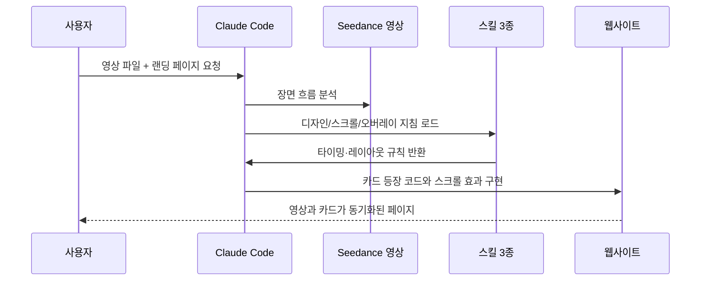

이 접근의 진짜 장점은 타이밍 조정 비용을 줄인다는 점입니다. 전통적으로 이런 인터랙션은 디자이너가 영상 타임라인을 보고, 프론트엔드 개발자가 scroll progress와 animation trigger를 직접 맞추며, QA가 화면별 어긋남을 잡아야 합니다. 여기서는 그 초안을 Claude Code가 skill 지침을 기반으로 한 번에 생성합니다.

## 3편 루트: 32개 프롬프트 팩은 결과물이 아니라 시간표를 배포하는 방식이다

세 번째 영상은 시리즈 3편으로, 1편과 2편에서 만든 제작 방식을 "복붙 가능한 프롬프트 팩"으로 바꿉니다. 설명란에 따르면 영상 프롬프트와 웹사이트 프롬프트가 1대1로 짝지어진 32세트로 구성되어 있고, 한 쌍만 가져가도 인터랙티브 웹사이트 하나를 만들 수 있습니다. [3편 0:00](https://youtu.be/pie4QdBUkgs?t=0) [3편 2:55](https://youtu.be/pie4QdBUkgs?t=175)

여기서 핵심은 프롬프트 안에 "장면별 시간"이 들어 있다는 점입니다. 영상 프롬프트가 `0~3초`, `3~7초`, `7~11초`처럼 장면 흐름을 가진다면, 웹사이트 프롬프트도 같은 시간표를 참조해 오버레이 카드와 스크롤 타임라인을 맞출 수 있습니다. 영상 설명란은 이를 "영상 시간과 웹사이트 타임라인이 자동 일치"한다고 설명합니다. [3편 1:43](https://youtu.be/pie4QdBUkgs?t=103)

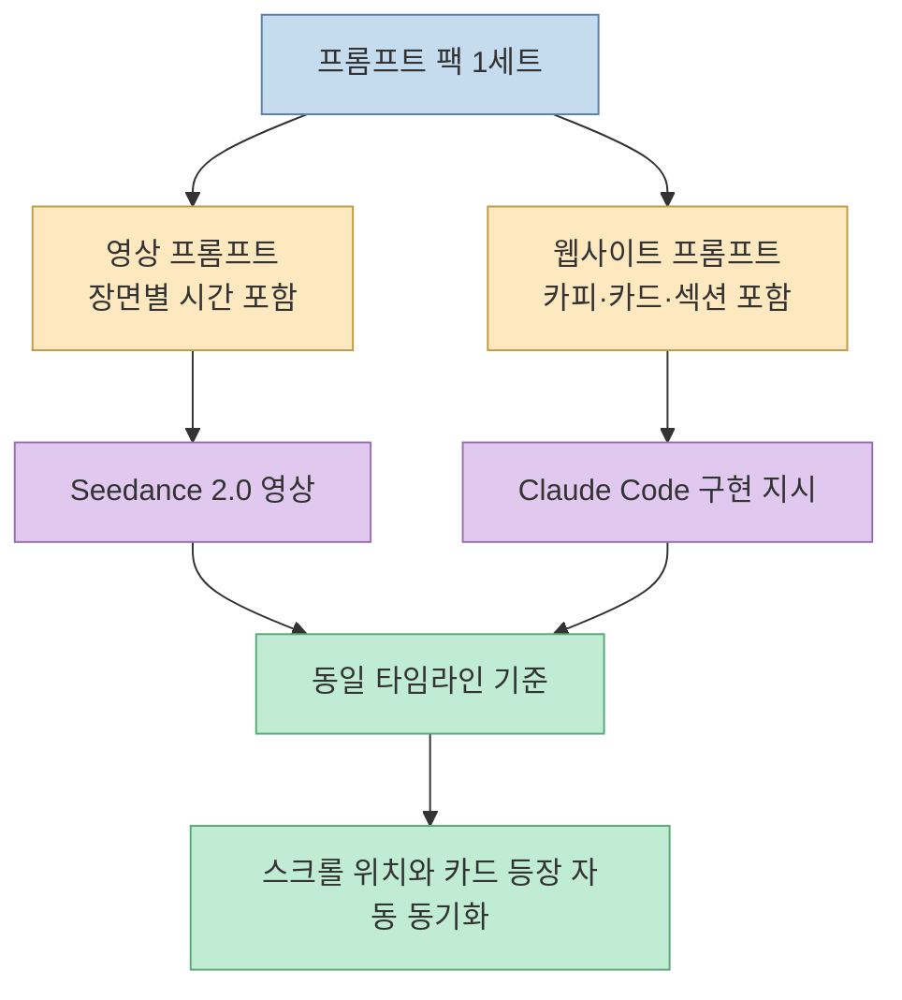

이 방식은 단순히 "예쁜 프롬프트 32개"를 나눠주는 것보다 더 실용적입니다. 프롬프트 팩은 창작물보다 **제작 프로토콜** 에 가깝습니다. 지하철 문, 크리스탈 케이브 마사지룸, 라떼 드랍 커피숍, 종이접기 빌딩, 크루즈 랜딩 같은 서로 다른 예시가 가능한 이유도 장면 구성과 웹 오버레이 구조가 같은 형식으로 맞춰져 있기 때문입니다. [3편 0:52](https://youtu.be/pie4QdBUkgs?t=52) [3편 2:10](https://youtu.be/pie4QdBUkgs?t=130) [3편 3:23](https://youtu.be/pie4QdBUkgs?t=203) [3편 4:41](https://youtu.be/pie4QdBUkgs?t=281)

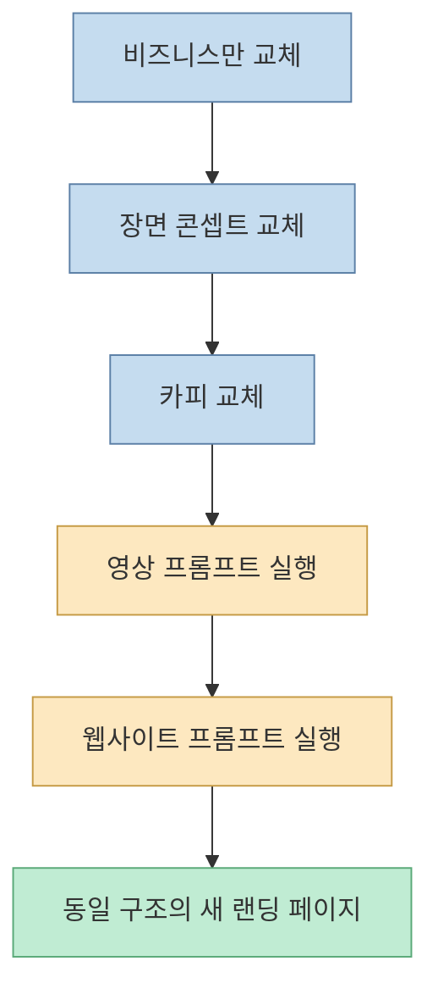

실전 관점에서 3편은 "작업을 더 쉽게 한다"보다 "재사용 단위를 더 작게 만든다"에 가깝습니다. 1편에서는 전체 파이프라인을 사람이 이해해야 하고, 2편에서는 스킬 3종을 등록해야 합니다. 3편에서는 영상 프롬프트와 웹사이트 프롬프트가 이미 한 쌍으로 맞춰져 있으므로, 사용자는 비즈니스 장면과 카피만 바꾸는 수준까지 내려옵니다.

## 비용 주장은 강하지만, 해석은 조심해야 한다

1편은 8초 3D 애니메이션을 약 5천원에 생성 가능하다고 설명하고, 전체 웹사이트 제작 비용을 만원 이하로 제시합니다. [1편 6:58](https://youtu.be/azQgRMcZvbo?t=418) 2편은 15초 Seedance 2.0 영상을 약 4.45달러로 확보할 수 있다고 설명합니다. [2편 6:58](https://youtu.be/szEpRsgeZOA?t=418) 3편도 15초 영상 한 편을 약 4~5달러대로 제시합니다. [3편 5:07](https://youtu.be/pie4QdBUkgs?t=307)

이 수치는 영상 제작자의 특정 실행 조건에서 나온 비용으로 보는 것이 안전합니다. 계정 플랜, 크레딧 가격, 실패한 생성 횟수, 재시도 횟수, 상업 이용 조건, 배포 비용은 별도로 달라질 수 있습니다. Seedance 2.0 공개 레퍼런스도 credit-based rendering, paid access, 최대 15초 출력 같은 현재 공개 조건을 설명하지만, 실제 플랫폼별 가격과 제한은 바뀔 수 있습니다. [Seedance 2.0 reference](https://seedance2.app/)

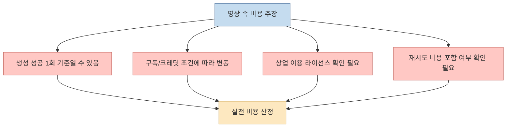

그래도 방향성은 분명합니다. 예전에는 전문 스튜디오가 맡던 "3D 느낌의 제품 영상 + 인터랙티브 랜딩" 초안을 개인이 짧은 시간 안에 만들 수 있게 되었습니다. 비용 절감보다 더 중요한 변화는 **초안 생산 속도** 입니다. 여러 컨셉을 빠르게 만들고, 그중 하나를 디자이너·개발자가 다듬는 흐름이 현실적입니다.

## 세 단계 비교: 빠른 실험, 재현 가능한 스킬, 복붙 가능한 프롬프트 팩

첫 번째 단계는 Antigravity 환경에서 Claude Code를 연결하고, 기존 `taste-skill`과 영상 생성 도구를 조합해 빠르게 결과물을 만드는 데 초점이 있습니다. 두 번째 단계는 VS Code라는 범용 개발 환경에서 Claude Code 확장과 자체 스킬 3종을 등록해 재현성을 높이는 데 초점이 있습니다. 세 번째 단계는 영상 프롬프트와 웹사이트 프롬프트를 1대1로 묶어 재사용 가능한 팩으로 만든다는 점이 다릅니다.

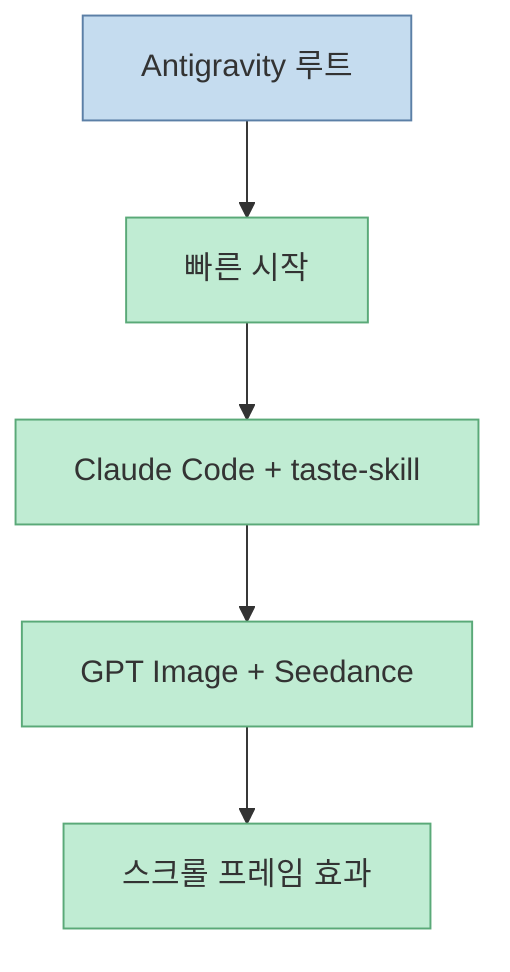

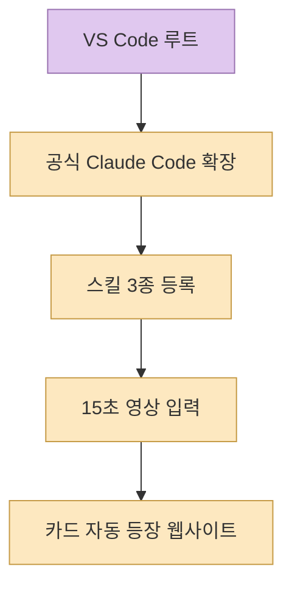

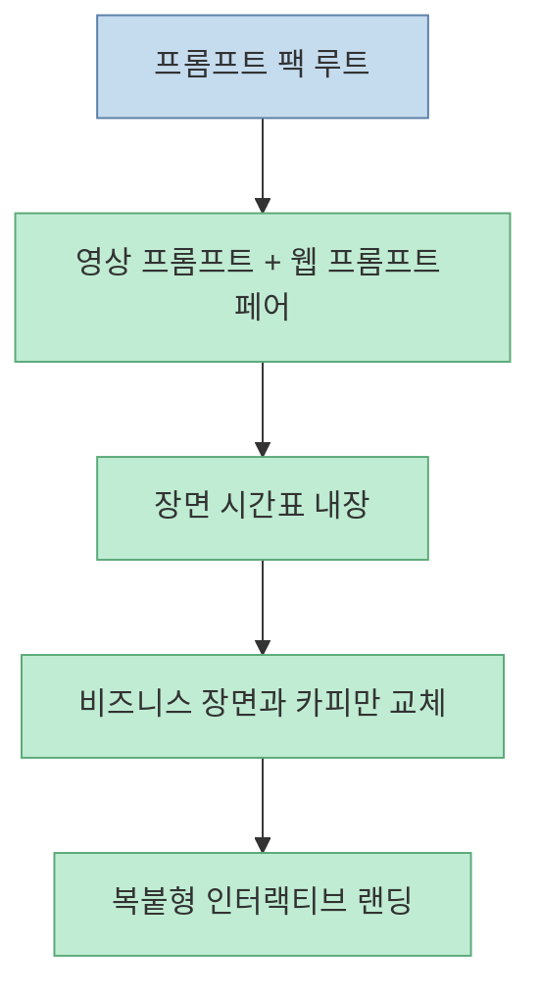

처음 실험한다면 1편 루트가 빠릅니다. 이미 만들어진 skill과 프롬프트를 따라 하며 결과를 확인하기 좋습니다. 반복 제작하거나 팀 작업으로 옮기려면 2편 루트가 더 낫습니다. VS Code, 명시적 skill 폴더, 재사용 가능한 엔진 구조는 이후 프로젝트에 복제하기 쉽기 때문입니다. 특정 업종 랜딩을 빠르게 여러 개 찍어내야 한다면 3편의 프롬프트 팩 방식이 가장 낮은 진입장벽을 제공합니다.

## 실전 적용 포인트

첫째, 바로 "완성형 웹사이트"를 만들려고 하지 말고 파이프라인을 나누어야 합니다. 디자인 골격, 이미지 레퍼런스, 영상 생성, 스크롤 인터랙션, 배포를 각각 독립 단계로 둬야 실패 지점을 찾기 쉽습니다.

둘째, Claude Code에는 단순히 결과물을 요청하지 말고 skill을 줘야 합니다. `taste-skill`이든 자체 스킬 3종이든, 좋은 결과는 "좋은 프롬프트 한 줄"보다 반복 가능한 판단 기준에서 나옵니다.

셋째, 영상 생성은 여러 번 실패할 수 있음을 전제로 비용을 잡아야 합니다. 영상에서 언급한 5천원, 4.45달러는 유용한 기준점이지만, 실제 프로젝트 견적에는 재시도와 후처리 시간을 포함해야 합니다.

넷째, 3편의 프롬프트 팩을 쓸 때는 "시간표"를 망가뜨리지 않는 것이 중요합니다. 비즈니스 카피와 장면 콘셉트는 바꿔도 되지만, 장면별 시간 구조를 바꾸면 웹사이트 오버레이 타이밍도 함께 조정해야 합니다.

다섯째, scroll-linked animation은 성능 관리가 중요합니다. 프레임을 많이 쓰거나 고해상도 영상을 그대로 쓰면 모바일에서 버벅일 수 있습니다. Claude Code에게 구현을 맡기더라도 lazy loading, reduced motion, image/video optimization, mobile fallback을 명시해야 합니다.

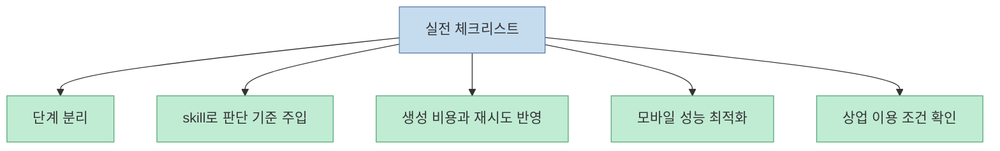

## 핵심 요약

- 1편은 Antigravity + Claude Code + taste-skill + GPT Image + Higgsfield Seedance 2.0 조합으로 모던 웹사이트를 만드는 흐름입니다. [1편 0:18](https://youtu.be/azQgRMcZvbo?t=18)
- 2편은 VS Code + Claude Code 확장 + 자체 스킬 3종으로 같은 유형의 인터랙티브 웹사이트를 재현하는 흐름입니다. [2편 0:35](https://youtu.be/szEpRsgeZOA?t=35)
- 3편은 영상 프롬프트와 웹사이트 프롬프트를 1대1로 짝지은 32개 프롬프트 팩으로, 제작 루프를 복붙 가능한 단위까지 낮춥니다. [3편 2:55](https://youtu.be/pie4QdBUkgs?t=175)
- 레퍼런스 이미지를 먼저 만들고 영상으로 전환하면 피사체, 구도, 색감 일관성을 높일 수 있습니다. [1편 3:39](https://youtu.be/azQgRMcZvbo?t=219)
- 스크롤 연동 프레임 추출은 영상 파일을 단순 배경이 아니라 사용자 입력에 반응하는 인터랙션 상태로 바꿉니다. [1편 6:36](https://youtu.be/azQgRMcZvbo?t=396)
- 자체 스킬 3종은 디자인, 스크롤 엔진, 오버레이 타이밍을 분리해 Claude Code가 한 줄 요청에도 구조적으로 작업하게 만듭니다. [2편 1:50](https://youtu.be/szEpRsgeZOA?t=110)
- 3편의 핵심은 영상 장면 시간과 웹 오버레이 시간을 같은 프롬프트 구조로 맞춰 두는 것입니다. [3편 1:43](https://youtu.be/pie4QdBUkgs?t=103)
- 비용 수치는 참고값으로 보고, 재시도·플랜·라이선스·상업 이용 조건을 별도로 확인해야 합니다.

## 결론

세 영상이 보여주는 변화는 "웹사이트 외주가 완전히 필요 없어졌다"보다 조금 더 정확하게 말해야 합니다. 이제 개인도 Claude Code와 AI 영상 도구를 조합해, 예전에는 비싼 외주 초안처럼 보이던 인터랙티브 랜딩 페이지를 빠르게 만들 수 있습니다. 그러나 그 결과가 안정적이고 재사용 가능하려면 단순 프롬프트가 아니라 skill, design rule, media pipeline, interaction engine, 그리고 시간표가 맞춰진 prompt pair가 필요합니다.

결국 핵심은 도구 가격이 아닙니다. **디자인·영상·인터랙션을 분리하고, Claude Code가 그 사이를 조립하게 만드는 제작 시스템** 입니다. Antigravity 루트는 빠른 실험에 좋고, VS Code 루트는 반복 제작과 팀 워크플로우에 더 잘 맞으며, 32개 프롬프트 팩은 같은 구조를 여러 업종 랜딩으로 복제하는 데 유리합니다. 이 셋을 구분해 쓰면 AI 웹사이트 제작은 일회성 데모가 아니라 실제 프로토타이핑 파이프라인이 됩니다.
