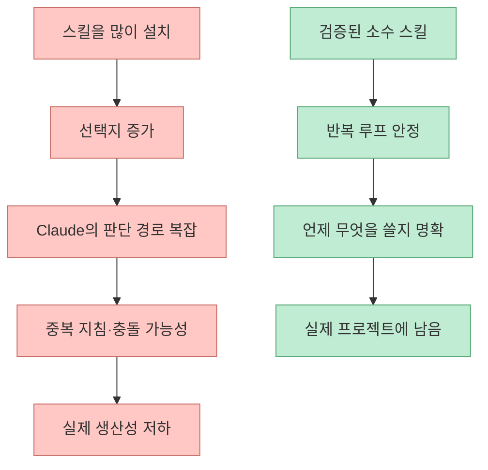
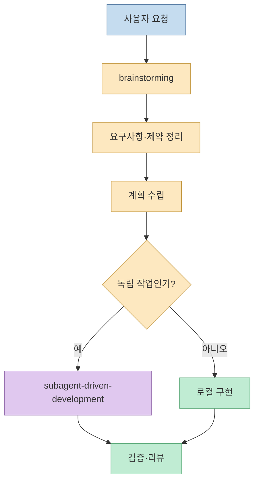
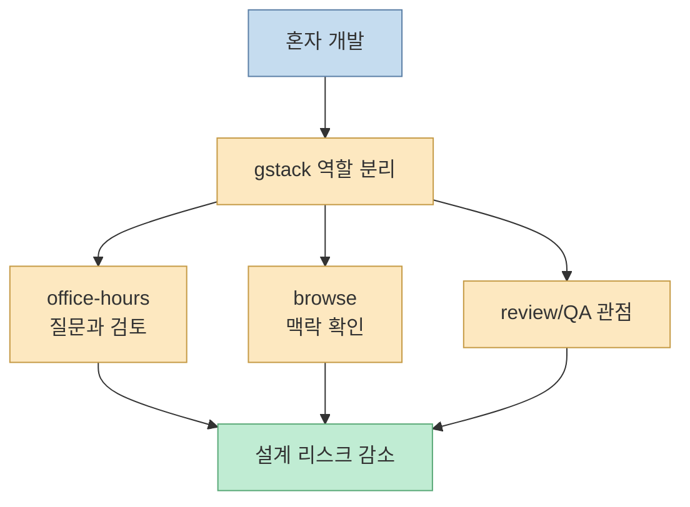
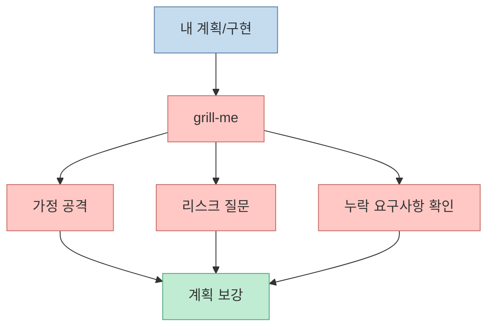
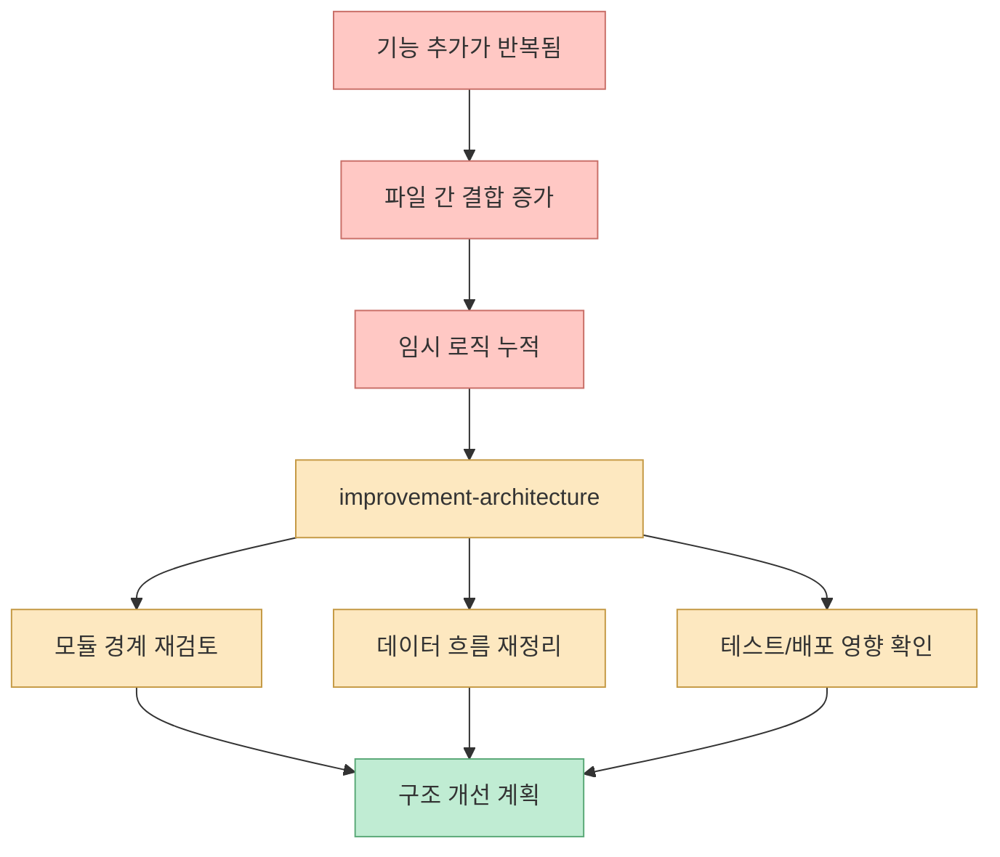
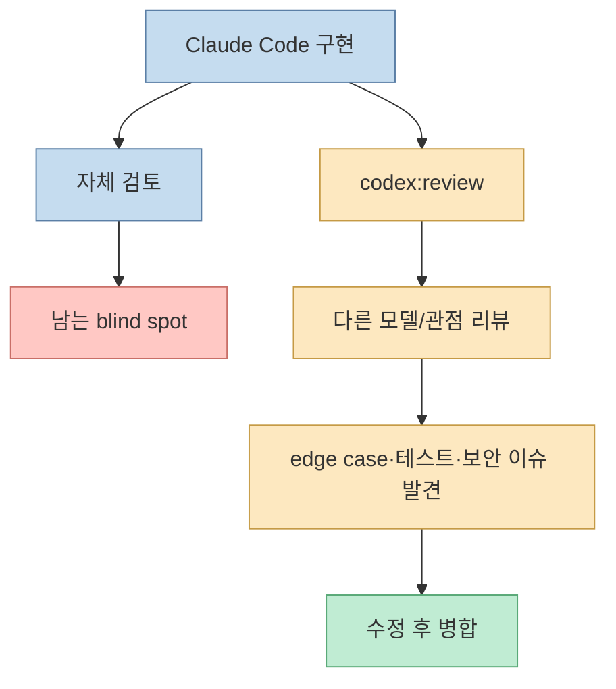
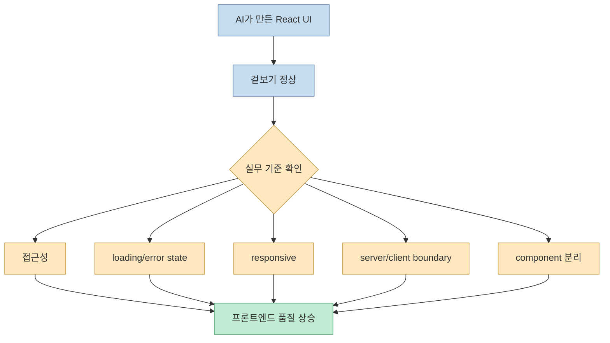
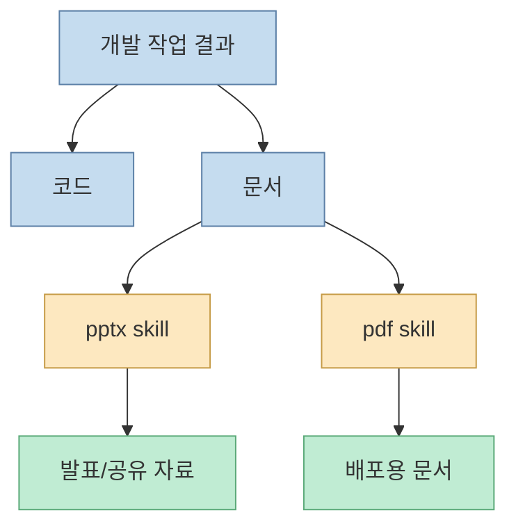
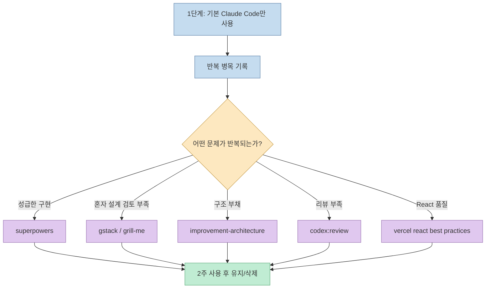

Claude Code를 오래 쓰면 결국 질문이 바뀝니다. "무슨 스킬을 더 깔까?"가 아니라 "어떤 스킬만 남겨도 실제 일이 되나?"입니다. Maker Evan은 Claude Code를 약 10개월, 400시간가량 사용한 뒤 화려한 플러그인보다 실제 프로젝트에서 계속 남은 도구 6개를 소개합니다. [0:00](https://youtu.be/BZPaZzjLIOY?t=0)

<!--more-->

## Sources

- <https://youtu.be/BZPaZzjLIOY?si=usEfZBYaPwonwsfm>
- skills.ag: <https://www.skills.ag/>
- Superpowers plugin page: <https://claude.com/plugins/superpowers>
- Claude Code skills docs: <https://docs.claude.com/en/docs/claude-code/skills>
- Claude Code subagents docs: <https://code.claude.com/docs/en/subagents>

## 문제는 스킬 부족이 아니라 스킬 과잉이다

영상의 첫 메시지는 직설적입니다. 유튜브에는 멋져 보이는 Claude Code 스킬과 플러그인이 많지만, 상당수는 영상용이거나 바이럴용이고 실제로 오래 쓰는 도구는 따로 있다는 것입니다. [0:00](https://youtu.be/BZPaZzjLIOY?t=0) 이어서 GitHub stars가 많다고 해서 실제 가치가 보장되는 것은 아니며, star 조작과 prompt injection 같은 함정도 조심해야 한다고 말합니다. [0:25](https://youtu.be/BZPaZzjLIOY?t=25)

이 지적은 중요합니다. Claude Code의 확장성은 plugins, skills, hooks, subagents, MCP처럼 다양합니다. 하지만 많이 깔수록 좋은 것이 아닙니다. 도구가 많아지면 Claude가 어떤 절차를 따라야 할지 애매해지고, 서로 다른 스킬이 충돌하거나, 사용자가 매번 "이번에는 이걸 써"라고 지시해야 하는 상황이 생깁니다.

따라서 이 영상은 "베스트 스킬 모음"이라기보다 **Claude Code 스킬을 거르는 기준** 에 가깝습니다. 실제로 남는 스킬은 화려한 데모보다, 반복 작업에서 Claude를 차분하게 만들고, 검증과 설계를 강제하며, 혼자 일할 때 부족한 동료 역할을 보완합니다.

## 도구 1: superpowers — 막 코딩하기 전에 생각하게 만드는 프레임

첫 번째 도구는 `superpowers`입니다. 영상은 특히 `brainstorming`과 `subagent-driven-development`를 언급합니다. [1:00](https://youtu.be/BZPaZzjLIOY?t=60) Superpowers 공식 플러그인 페이지도 이를 TDD, systematic debugging, brainstorming, subagent-driven development, code review, skill authoring까지 포함하는 structured software development methodology로 설명합니다. [Superpowers plugin page](https://claude.com/plugins/superpowers)

`superpowers`의 가치는 Claude에게 더 많은 능력을 붙이는 데 있지 않습니다. 반대로 Claude가 바로 구현으로 뛰어들지 못하게 멈추는 데 있습니다. 요구사항을 먼저 물어보고, 설계를 나누고, 테스트와 검증을 거치고, subagent를 써야 할지 판단하게 만듭니다.

실전에서 Claude Code가 위험해지는 순간은 "사용자 의도를 대충 추정하고 바로 파일을 고칠 때"입니다. Superpowers는 이 성급함을 줄이는 도구입니다. 그래서 단순 생산성 도구라기보다, 에이전트의 작업 태도를 바꾸는 운영 레이어로 보는 편이 맞습니다.

## 도구 2: gstack — 혼자 일할 때도 팀처럼 검토하게 만드는 스택

두 번째 도구는 `gstack`입니다. 영상은 `office-hours`와 `browse`를 언급하며, Garry Tan setup이라는 맥락으로 소개합니다. [2:00](https://youtu.be/BZPaZzjLIOY?t=120)

`gstack`의 포인트는 Claude를 한 명의 코더로만 쓰지 않는 것입니다. 혼자 개발할 때도 PM, 아키텍트, 리뷰어, QA 같은 역할을 분리해 질문하게 만듭니다. 특히 `office-hours`류의 도구는 답을 내기 전에 설계, 리스크, 우선순위를 따져보게 만드는 데 유용합니다.

영상은 3분 지점에서 두 도구의 공통점으로 "차분함의 가치"를 짚습니다. [3:00](https://youtu.be/BZPaZzjLIOY?t=180) Claude Code에서 좋은 도구는 더 빨리 코딩하게 하는 도구가 아니라, 잘못된 방향으로 빠르게 달리는 것을 막는 도구입니다.

## 도구 3: grill-me — 1인 개발자의 시니어 동료

세 번째 도구는 `grill-me`입니다. 영상은 이를 "1인 개발자의 시니어 동료"처럼 소개합니다. [3:15](https://youtu.be/BZPaZzjLIOY?t=195)

혼자 개발하면 가장 부족한 것은 구현 능력보다 반대 질문입니다. "왜 이 구조가 맞는가?", "장애가 나면 어디가 터지는가?", "이 요구사항은 정말 필요한가?", "사용자가 이 흐름을 이해할까?" 같은 질문은 혼자서는 놓치기 쉽습니다. `grill-me` 계열 스킬은 계획이나 구현 결과를 일부러 공격적으로 검토해 빈틈을 찾게 만드는 역할을 합니다.

이런 스킬은 기분 좋게 칭찬해 주는 assistant와 반대입니다. 그래서 더 가치 있습니다. Claude Code를 실무에 쓰려면 "좋아요, 구현하겠습니다"보다 "이 요구사항은 모순입니다"라고 말해 주는 도구가 필요합니다.

## 도구 4: improvement-architecture — 구조를 통째로 다시 보는 렌즈

네 번째 도구는 `improvement-architecture`입니다. 영상은 이를 "구조 통째로 다시 보기"라고 설명합니다. [4:00](https://youtu.be/BZPaZzjLIOY?t=240)

개별 파일 수정은 Claude Code가 잘합니다. 문제는 작은 수정이 쌓이면서 전체 구조가 흐려지는 경우입니다. 이때 필요한 것은 또 다른 패치가 아니라, 모듈 경계, 데이터 흐름, 책임 분리, 테스트 가능성, 배포 영향도를 다시 보는 아키텍처 리뷰입니다.

이 도구는 매번 쓸 필요는 없습니다. 하지만 기능이 어느 정도 쌓인 뒤 "이 구조가 앞으로도 버틸까?"를 확인할 때 유용합니다. 특히 AI가 만든 코드는 단기적으로는 잘 돌아가지만, 장기 구조가 흐려지기 쉽기 때문에 이런 아키텍처 점검이 필요합니다.

## 도구 5: codex:review — 다른 모델로 한 번 더 굽기

다섯 번째 도구는 `codex:review`입니다. 영상은 이를 "다른 모델로 한 번 더 굽기"라고 표현합니다. [4:45](https://youtu.be/BZPaZzjLIOY?t=285)

같은 모델이 작성한 코드를 같은 대화에서 다시 검토하면 blind spot이 남을 수 있습니다. 다른 모델 또는 다른 검토 프레임으로 리뷰하면, Claude가 놓친 edge case, 타입 문제, 보안 문제, 테스트 누락이 드러날 가능성이 커집니다. 이것은 단순한 "더 똑똑한 모델" 문제가 아니라 관점 다양성의 문제입니다.

실무에서는 이 흐름을 PR 전 게이트처럼 쓰는 것이 좋습니다. "구현 → 테스트 → 다른 모델 리뷰 → 수정"의 루프를 만들면, AI 코딩의 빠른 속도를 유지하면서도 검증 밀도를 높일 수 있습니다.

## 도구 6: vercel react best practices — 프론트엔드 기본기를 강제한다

여섯 번째 도구는 `vercel react best practices`입니다. 영상은 이를 프론트엔드 필수 도구로 소개합니다. [5:30](https://youtu.be/BZPaZzjLIOY?t=330)

프론트엔드에서 AI가 자주 만드는 문제는 "보이기는 하는데 실무 품질이 부족한 UI"입니다. 예를 들어 접근성, loading/error state, responsive layout, server/client boundary, component 분리, hydration 이슈, 성능 최적화가 빠질 수 있습니다. React/Next.js 계열에서는 이런 기준이 특히 중요합니다.

프론트엔드 작업은 "디자인을 예쁘게"보다 "상태가 모두 정의되어 있는가"가 중요합니다. 이 스킬은 Claude Code가 시각 결과물만 보고 끝내지 않도록 기본 체크리스트를 붙이는 역할을 합니다.

## 보너스: pptx, pdf 스킬은 산출물 자동화에 강하다

영상은 보너스로 `pptx`, `pdf` 스킬도 언급합니다. [6:15](https://youtu.be/BZPaZzjLIOY?t=375) 이는 코드 작성과는 다르지만, 개발자가 실제로 자주 하는 문서 산출물을 자동화하는 데 유용합니다.

예를 들어 기능 설명 자료, 고객 전달용 슬라이드, 내부 회의용 요약 PDF, 기술 검토 문서 등을 Claude Code workflow 안에서 만들 수 있습니다. 중요한 점은 이런 스킬을 "항상 켜두는 기본 도구"로 보기보다, 필요할 때 꺼내 쓰는 산출물 도구로 분리하는 것입니다.

## 시작 팁: 한 번에 다 깔지 마라

영상은 시작할 때 한 번에 다 깔지 말라고 조언합니다. [7:00](https://youtu.be/BZPaZzjLIOY?t=420) 이 말이 이 영상의 핵심입니다. Claude Code 스킬은 앱처럼 많이 설치해서 나열하는 것이 아닙니다. 작업 루프에 실제로 들어와 반복해서 쓰이는 것만 남기는 것이 좋습니다.

실전 도입 순서는 다음이 안전합니다.

이 기준으로 보면 좋은 스킬은 "신기한 기능"이 아니라 **반복되는 실패를 줄이는 장치** 입니다. 성급하게 구현하는 실패, 혼자 검토하지 못하는 실패, 구조가 무너지는 실패, 리뷰 없이 병합하는 실패, 프론트엔드 기본기를 놓치는 실패를 줄여야 살아남습니다.

## 핵심 요약

- 영상의 핵심은 Claude Code 스킬을 많이 설치하지 말고 실제 프로젝트에서 검증된 소수만 남기라는 것입니다. [0:00](https://youtu.be/BZPaZzjLIOY?t=0)
- GitHub stars나 바이럴 데모만 보고 설치하면 star 조작, prompt injection, 미검증 도구 위험에 노출될 수 있습니다. [0:25](https://youtu.be/BZPaZzjLIOY?t=25)
- `superpowers`는 brainstorming과 subagent-driven-development로 성급한 구현을 막습니다. [1:00](https://youtu.be/BZPaZzjLIOY?t=60)
- `gstack`과 `grill-me`는 혼자 개발할 때 부족한 동료/시니어 리뷰 역할을 보완합니다. [2:00](https://youtu.be/BZPaZzjLIOY?t=120) [3:15](https://youtu.be/BZPaZzjLIOY?t=195)
- `improvement-architecture`와 `codex:review`는 구조 검토와 다른 모델 기반 리뷰로 blind spot을 줄입니다. [4:00](https://youtu.be/BZPaZzjLIOY?t=240) [4:45](https://youtu.be/BZPaZzjLIOY?t=285)
- `vercel react best practices`는 프론트엔드 작업에서 기본 품질 기준을 강제합니다. [5:30](https://youtu.be/BZPaZzjLIOY?t=330)
- 시작할 때는 한 번에 다 깔지 말고, 반복되는 병목 하나에 스킬 하나씩 붙여 검증하는 것이 좋습니다. [7:00](https://youtu.be/BZPaZzjLIOY?t=420)

## 결론

Claude Code의 생산성은 설치한 스킬 수에 비례하지 않습니다. 오히려 너무 많은 스킬은 Claude의 판단 경로를 흐리고, 사용자의 작업 루프를 복잡하게 만듭니다. 오래 남는 도구는 화려한 기능보다 반복 실패를 줄이는 도구입니다.

이 영상의 6개 도구를 하나의 원칙으로 묶으면 간단합니다. 구현 전에는 생각하게 만들고, 혼자 일할 때는 질문하게 만들고, 구조가 쌓이면 다시 보게 만들고, 병합 전에는 다른 관점으로 리뷰하게 만들며, 프론트엔드에서는 기본기를 놓치지 않게 만드는 것입니다. Claude Code를 오래 쓸수록 필요한 것은 더 많은 도구가 아니라, **일하는 방식을 안정시키는 적은 수의 검증된 도구** 입니다.
