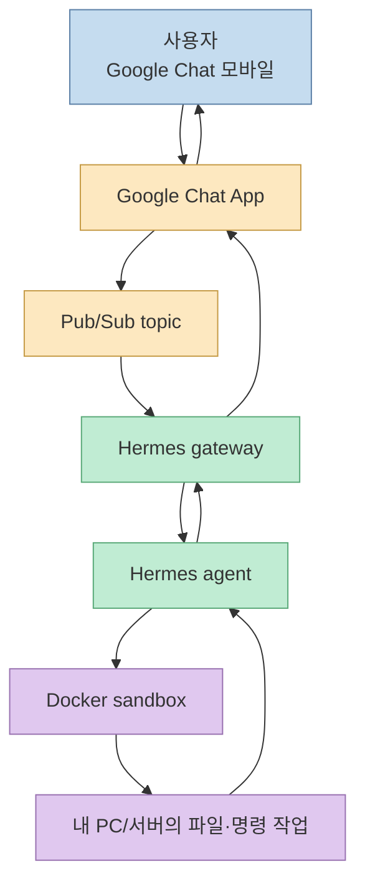
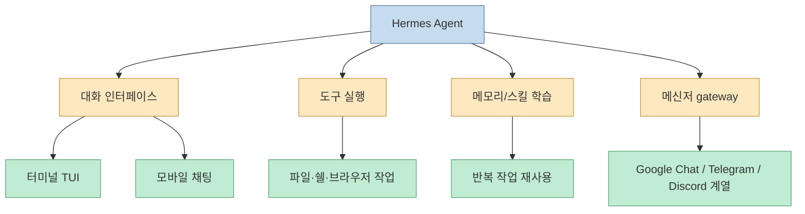
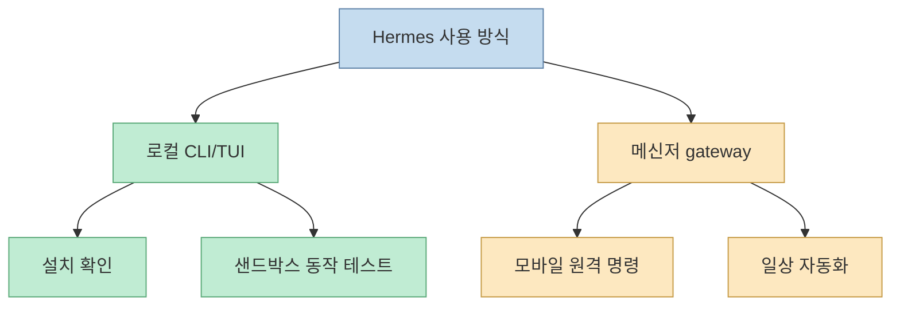
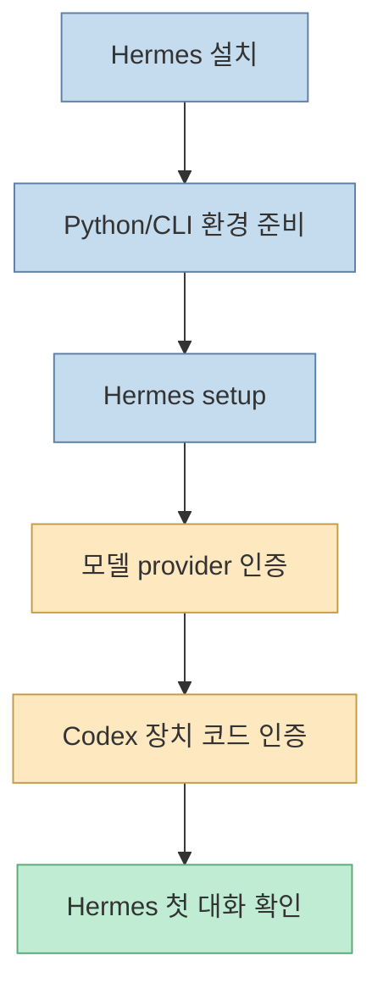
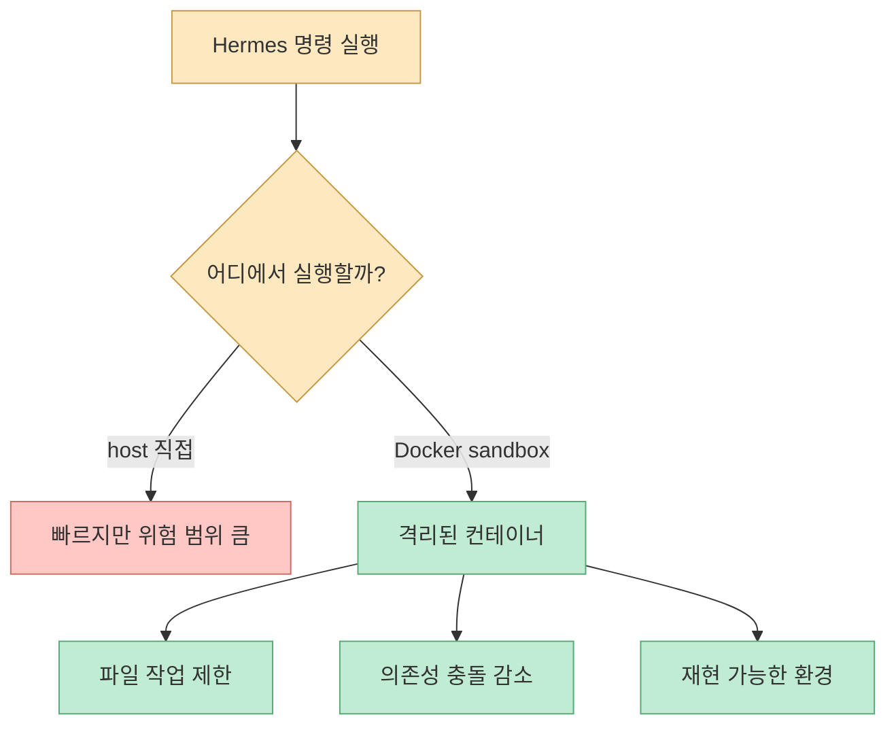
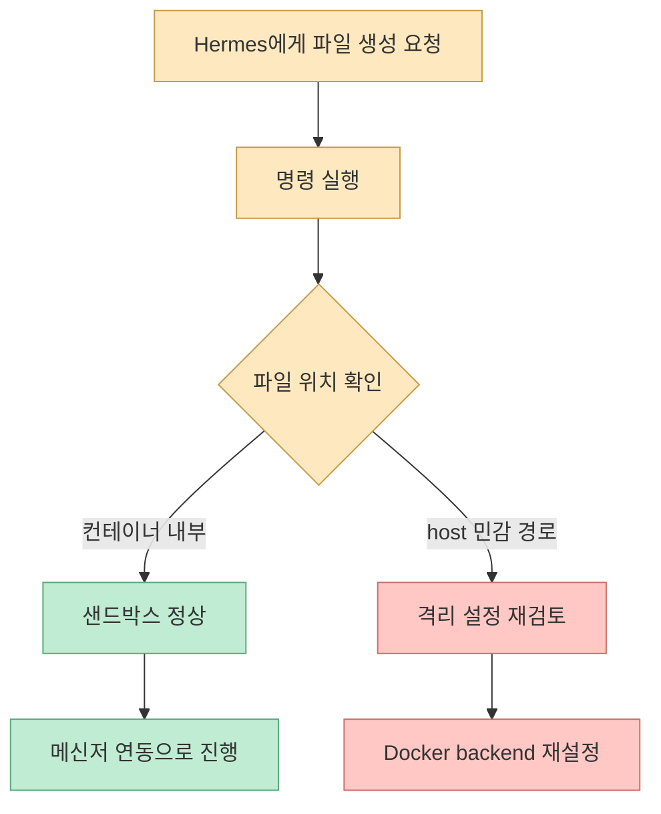
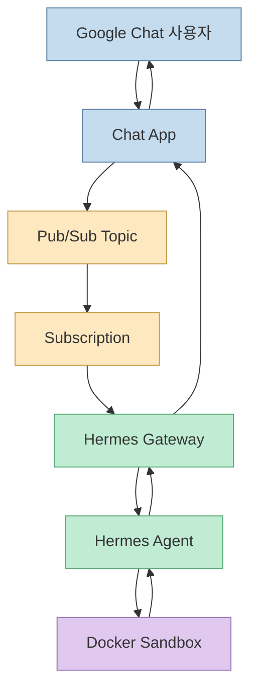
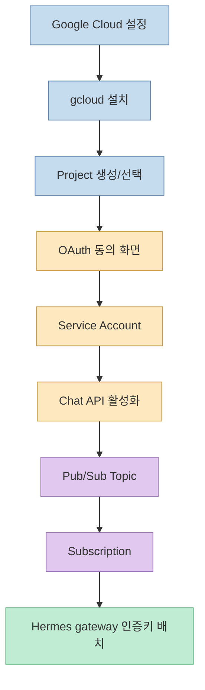
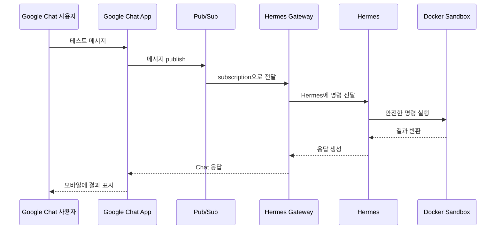
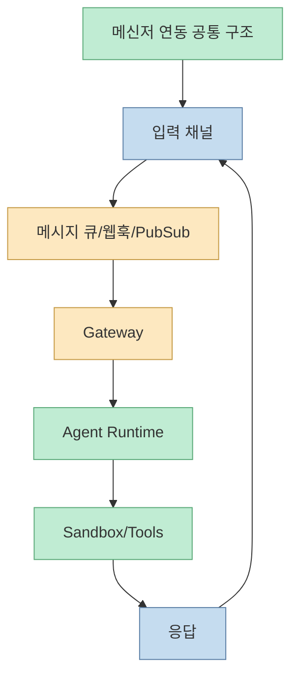

Hermes 설치는 단순히 CLI 하나를 까는 문제가 아닙니다. 편집자P의 영상은 Hermes를 설치하고, Docker 샌드박스로 실행을 격리한 뒤, Google Chat과 Pub/Sub까지 연결해 모바일 메신저에서 내 PC의 에이전트에게 명령을 보내는 전체 구조를 보여줍니다. [0:00](https://youtu.be/wj_C0Vhyepw?t=0)

<!--more-->

## Sources

- <https://youtu.be/wj_C0Vhyepw?si=whUipV9fS-IrXZay>
- Hermes Agent GitHub: <https://github.com/NousResearch/hermes-agent>
- Hermes installation docs: <https://hermes-ai.net/en/docs/installation/>
- Hermes Docker docs: <https://github.com/NousResearch/hermes-agent/blob/main/website/docs/user-guide/docker.md>
- Google Chat Pub/Sub guide: <https://developers.google.com/chat/api/guides/firewall/pub-sub>
- Google Cloud Pub/Sub docs: <https://cloud.google.com/pubsub/docs>

## Hermes 설치 가이드의 목표: 메신저에서 내 에이전트를 호출한다

영상의 목표는 명확합니다. Hermes를 설치하고 Docker로 안전하게 격리한 뒤 Google Chat까지 연결합니다. 그러면 사용자는 PC 앞에 있지 않아도 모바일 메신저에서 에이전트에게 명령을 보낼 수 있습니다. [0:00](https://youtu.be/wj_C0Vhyepw?t=0)

Hermes Agent 공식 저장소도 Hermes를 self-improving AI agent로 소개하며, Telegram 같은 메신저에서 클라우드 VM의 에이전트와 대화할 수 있다고 설명합니다. 또한 model provider를 바꿀 수 있고, terminal interface, gateway, platform integration, Docker 실행을 지원합니다. [Hermes GitHub](https://github.com/NousResearch/hermes-agent)

이 구조를 이해하면 Discord, Telegram, Slack 같은 다른 메신저 연동도 같은 패턴으로 볼 수 있습니다. 메신저는 입력 UI이고, gateway는 메시지를 agent로 넘기는 다리이며, Docker는 agent가 명령을 실행하는 안전 구역입니다.

## Hermes의 특징: 로컬 CLI가 아니라 항상 부를 수 있는 에이전트

영상은 Hermes의 특징과 메신저 연동이 주는 강점을 1분대에서 설명합니다. [1:10](https://youtu.be/wj_C0Vhyepw?t=70) Hermes는 IDE에 붙은 coding copilot만이 아니라, 사용자와 세션을 기억하고, 도구를 실행하고, 플랫폼을 통해 호출될 수 있는 personal agent에 가깝습니다.

공식 소개에서도 Hermes는 경험에서 skill을 만들고, 사용 중 개선하며, 지식을 지속적으로 저장하고, 과거 대화를 검색하는 learning loop를 가진다고 설명합니다. [Hermes GitHub](https://github.com/NousResearch/hermes-agent)

따라서 Hermes 설치는 "AI 채팅 프로그램 설치"보다 넓은 의미를 가집니다. 내 컴퓨터나 서버에 지속적으로 존재하는 agent를 만들고, 그 agent를 메신저로 호출할 수 있게 하는 작업입니다.

## 사용 방식 두 갈래: 로컬 작업과 모바일 원격 명령

영상은 Hermes 사용 방식을 두 갈래로 설명합니다. [2:51](https://youtu.be/wj_C0Vhyepw?t=171) 첫 번째는 로컬에서 Hermes를 직접 실행해 대화하는 방식입니다. 두 번째는 gateway를 열고 메신저를 붙여, 모바일에서 명령을 보내는 방식입니다.

로컬 방식은 설치와 테스트에 좋습니다. 명령이 어떻게 실행되는지, 파일이 어디에 만들어지는지, Docker 격리가 제대로 되는지 확인하기 쉽습니다. 반면 모바일 방식은 일상 자동화에 강합니다. 외부에서 "오늘 아침 주식 브리핑 만들어 줘", "서버 로그 확인해 줘", "특정 파일 정리해 줘" 같은 명령을 보낼 수 있습니다. 영상 후반에도 매일 아침 주식 브리핑 같은 활용 예시가 나옵니다. [42:24](https://youtu.be/wj_C0Vhyepw?t=2544)

실전에서는 로컬 방식으로 먼저 안정화한 다음, Google Chat 같은 메신저를 연결하는 순서가 좋습니다. gateway부터 붙이면 문제 발생 시 Hermes 자체 문제인지, Docker 문제인지, Google Cloud 설정 문제인지 분리하기 어렵습니다.

## 설치와 Codex 장치 코드 인증: 먼저 에이전트가 말할 수 있어야 한다

영상은 4분대에서 Hermes 설치와 Codex 장치 코드 인증 사전 세팅을 다룹니다. [4:12](https://youtu.be/wj_C0Vhyepw?t=252) 공식 설치 문서도 Linux, macOS, WSL2, Termux에서 install script로 Hermes를 설치할 수 있다고 안내합니다. [Hermes installation docs](https://hermes-ai.net/en/docs/installation/)

여기서 Codex 인증이 필요한 이유는 Hermes가 모델과 도구를 사용해 작업하기 위해 provider 인증을 가져야 하기 때문입니다. 영상은 Codex 구독과 gcloud를 활용해 어려워 보이는 설정을 최대한 자동으로 처리하는 흐름을 보여줍니다.

인증 단계는 설치보다 더 중요합니다. agent는 명령을 실행하는 프로그램이므로, 어떤 계정 권한으로 모델을 호출하고 어떤 파일에 접근하는지 명확히 알아야 합니다.

## Docker가 필요한 이유: agent에게 안전한 작업실을 준다

영상은 5분대에서 Docker가 필요한 이유를 "샌드박스 컨테이너" 비유로 설명합니다. [5:30](https://youtu.be/wj_C0Vhyepw?t=330) Hermes Docker 문서도 Docker가 두 방식으로 쓰인다고 설명합니다. 하나는 Hermes 자체를 Docker 안에서 실행하는 방식이고, 다른 하나는 Hermes는 host에서 돌리되 모든 명령 실행을 persistent Docker sandbox container 안에서 수행하게 하는 terminal backend 방식입니다. [Hermes Docker docs](https://github.com/NousResearch/hermes-agent/blob/main/website/docs/user-guide/docker.md)

이 차이는 중요합니다. agent에게 shell 권한을 주면 파일을 만들고, 패키지를 설치하고, 명령을 실행할 수 있습니다. 이때 host 환경 전체를 그대로 노출하면 실수나 악성 명령의 피해가 커질 수 있습니다. Docker sandbox는 agent가 작업할 공간을 제한하고, 실험을 격리하며, 재현 가능한 실행 환경을 제공합니다.

영상은 퀵 셋업과 Docker 모드 첫 실행, 그리고 Codex로 Docker를 자동 설치하고 Hermes 재실행을 검증하는 흐름을 보여줍니다. [8:46](https://youtu.be/wj_C0Vhyepw?t=526) [12:58](https://youtu.be/wj_C0Vhyepw?t=778)

## 샌드박스 검증: 컨테이너 안에 파일이 만들어지는지 확인한다

설정이 끝났다면 반드시 검증해야 합니다. 영상은 컨테이너 내 파일 생성으로 샌드박스 동작을 확인합니다. [17:42](https://youtu.be/wj_C0Vhyepw?t=1062) 이는 단순한 데모가 아니라 매우 중요한 체크입니다.

agent가 파일을 만들 때 그 파일이 host의 민감한 위치에 생기는지, Docker container 안에 생기는지 확인해야 합니다. 또한 `/new`, subagent, 여러 tool call 사이에서도 같은 sandbox가 유지되는지 확인해야 합니다. Hermes Docker 문서는 Docker terminal backend가 Hermes process 생명주기 동안 persistent Docker sandbox container를 사용한다고 설명합니다. [Hermes Docker docs](https://github.com/NousResearch/hermes-agent/blob/main/website/docs/user-guide/docker.md)

이 검증을 건너뛰면 나중에 Google Chat으로 원격 명령을 보낼 때 훨씬 위험해집니다. 모바일에서 던진 명령이 어디서 실행되는지 모르면 agent 운영은 안전하지 않습니다.

## Google Chat 연동 구조: 게이트웨이와 Pub/Sub 우체통

영상은 Google Chat 연동 구조를 "게이트웨이와 Pub/Sub 우체통"으로 설명합니다. [18:55](https://youtu.be/wj_C0Vhyepw?t=1135) Google Chat 공식 문서도 Pub/Sub를 사용해 firewall 뒤에 있는 Chat app을 만들 수 있다고 설명합니다. 이 방식에서는 application server가 Pub/Sub topic을 구독하고, Chat app logic을 포함한 서버가 메시지를 받아 처리합니다. [Google Chat Pub/Sub guide](https://developers.google.com/chat/api/guides/firewall/pub-sub)

Pub/Sub의 기본 개념은 topic과 subscription입니다. Google Cloud Pub/Sub 문서는 publisher가 message를 topic에 보내고, subscriber가 subscription을 통해 message를 받는 구조를 설명합니다. [Google Cloud Pub/Sub docs](https://cloud.google.com/pubsub/docs)

이 구조를 우체통에 비유하면 이해하기 쉽습니다. Google Chat은 편지를 넣는 창구이고, Pub/Sub topic은 우체통이며, subscription은 그 우체통을 확인하는 배달 경로입니다. Hermes gateway는 편지를 꺼내 agent에게 넘기고, agent는 작업 결과를 다시 Chat으로 돌려보냅니다.

## gcloud, 프로젝트, OAuth, 서비스 계정, Pub/Sub

영상의 중반 이후는 Google Cloud 설정입니다. gcloud 설치, 프로젝트 생성, OAuth 동의 화면, 서비스 계정 생성이 이어지고, 결제 계정 연결, Pub/Sub topic/subscription, Chat API 구성이 이어집니다. [22:25](https://youtu.be/wj_C0Vhyepw?t=1345) [30:30](https://youtu.be/wj_C0Vhyepw?t=1830)

이 단계가 복잡해 보이는 이유는 Google Chat app이 단순 webhook이 아니기 때문입니다. 사용자의 Chat 메시지를 안전하게 받아 처리하려면 Google Cloud project, API enable, Pub/Sub resource, service account, credential file이 필요합니다.

여기서 주의할 점은 인증키입니다. 서비스 계정 키 파일은 agent gateway가 Google Cloud 자원에 접근하는 권한을 갖습니다. 따라서 저장 위치, 권한, repository commit 여부를 반드시 확인해야 합니다. 절대 공개 저장소에 올리면 안 됩니다.

## 게이트웨이 오픈과 첫 채팅 테스트

영상은 가상환경 패키지 설치, 서비스 계정 인증키 배치 후 gateway를 열고 Google Chat에서 첫 채팅 테스트를 진행합니다. [36:39](https://youtu.be/wj_C0Vhyepw?t=2199) [39:05](https://youtu.be/wj_C0Vhyepw?t=2345)

첫 테스트에서는 복잡한 명령을 보내면 안 됩니다. "hello", "현재 상태 알려줘", "샌드박스 안에 test.txt 만들어 줘" 같은 낮은 위험 명령으로 시작해야 합니다. 이후 컨테이너 파일 작업까지 확인하면 mobile → Chat → Pub/Sub → gateway → agent → Docker → response 흐름이 완성됩니다. [42:24](https://youtu.be/wj_C0Vhyepw?t=2544)

이 테스트가 성공하면 이후 자동화 범위가 넓어집니다. 매일 아침 주식 브리핑, 파일 정리, 보고서 초안, 서버 상태 확인 같은 명령을 메신저에서 보낼 수 있습니다.

## 왜 Telegram이나 Discord가 아니라 Google Chat인가

영상은 왜 Discord나 Telegram 대신 Google Chat을 다루는지 초반에 설명합니다. [0:00](https://youtu.be/wj_C0Vhyepw?t=0) 핵심은 Google Chat이 특별히 가장 쉽기 때문이라기보다, Pub/Sub와 gateway 구조를 한 번 이해하면 다른 메신저 연동도 같은 패턴으로 풀 수 있기 때문입니다.

Telegram은 bot token과 webhook/polling이 중심이고, Discord는 bot application과 gateway/event model이 중심입니다. Google Chat은 Google Cloud project, Chat API, Pub/Sub가 중심입니다. 겉모습은 다르지만 핵심은 "메시지를 받아 agent runtime으로 전달하고, 결과를 다시 채팅으로 돌려보내는 것"입니다.

## 실전 적용 포인트

첫째, 설치와 메신저 연동을 한 번에 하지 말고 단계별로 검증해야 합니다. Hermes CLI 실행, 모델 인증, Docker backend, 파일 생성 테스트, gateway, Google Chat 순서로 나누면 문제를 찾기 쉽습니다.

둘째, Docker sandbox를 반드시 확인해야 합니다. 모바일에서 원격 명령을 보낼 수 있게 되면 위험도도 커집니다. agent가 host 파일 시스템 전체를 마음대로 만지지 않도록 격리 경계를 먼저 확인해야 합니다.

셋째, Google Cloud 서비스 계정 키는 비밀 정보입니다. 로컬에 두더라도 권한을 제한하고, 저장소에 커밋되지 않게 해야 합니다.

넷째, Pub/Sub topic과 subscription 이름, project id, service account 권한은 문서화해야 합니다. 나중에 gateway가 메시지를 못 받는 문제가 생기면 이 설정을 추적해야 합니다.

다섯째, 첫 자동화는 위험이 낮은 읽기 작업부터 시작합니다. 주식 브리핑, 캘린더 요약, 파일 목록 확인처럼 삭제나 배포를 하지 않는 작업으로 신뢰도를 쌓은 뒤 점진적으로 권한을 늘리는 것이 안전합니다.

## 핵심 요약

- 영상의 목표는 Hermes 설치, Docker 샌드박스, Google Chat 연동까지 한 번에 구성하는 것입니다. [0:00](https://youtu.be/wj_C0Vhyepw?t=0)
- Hermes는 로컬 CLI뿐 아니라 메신저 gateway를 통해 모바일에서 호출할 수 있는 agent입니다. [1:10](https://youtu.be/wj_C0Vhyepw?t=70)
- Docker는 agent 명령 실행을 격리하는 안전한 작업실 역할을 합니다. [5:30](https://youtu.be/wj_C0Vhyepw?t=330)
- 컨테이너 안에 파일이 생성되는지 확인해 sandbox가 실제로 동작하는지 검증해야 합니다. [17:42](https://youtu.be/wj_C0Vhyepw?t=1062)
- Google Chat 연동은 Chat App, Pub/Sub topic/subscription, Hermes gateway, agent runtime이 이어지는 구조입니다. [18:55](https://youtu.be/wj_C0Vhyepw?t=1135)
- gcloud, OAuth, service account, Chat API, Pub/Sub 설정은 복잡하지만 한 번 이해하면 다른 메신저 연동도 같은 패턴으로 해석할 수 있습니다.

## 결론

Hermes 설치의 핵심은 "에이전트 하나 실행하기"가 아닙니다. 어디서 명령을 받고, 어떤 모델로 생각하며, 어떤 공간에서 명령을 실행하고, 결과를 어디로 돌려보낼지 정하는 운영 구조를 만드는 것입니다.

이 영상의 좋은 점은 그 구조를 Hermes + Docker + Google Chat + Pub/Sub로 끝까지 연결한다는 데 있습니다. 로컬에서는 Docker sandbox로 안전성을 확보하고, 외부에서는 Google Chat으로 접근성을 확보합니다. 이 조합을 이해하면 Hermes는 단순한 터미널 AI가 아니라, 모바일에서 부를 수 있는 개인 자동화 에이전트가 됩니다.
