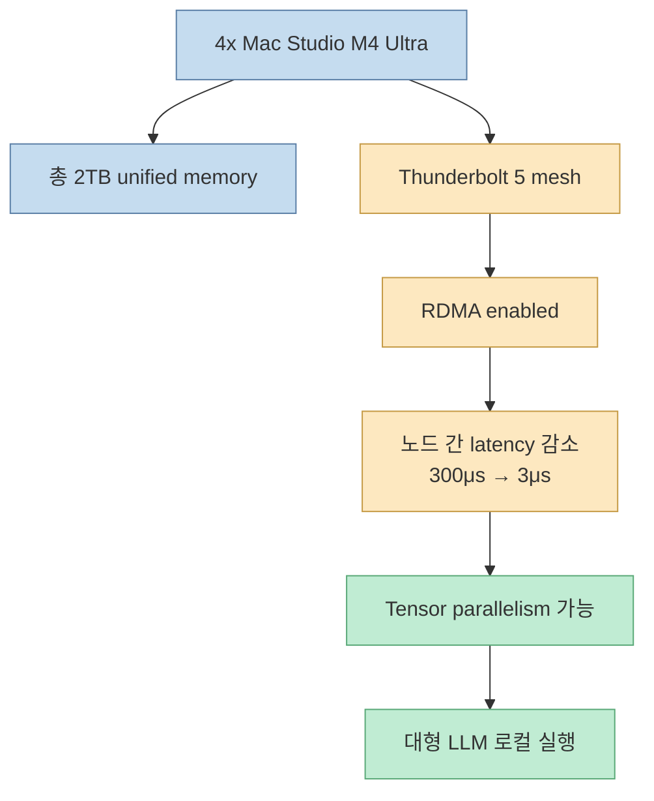
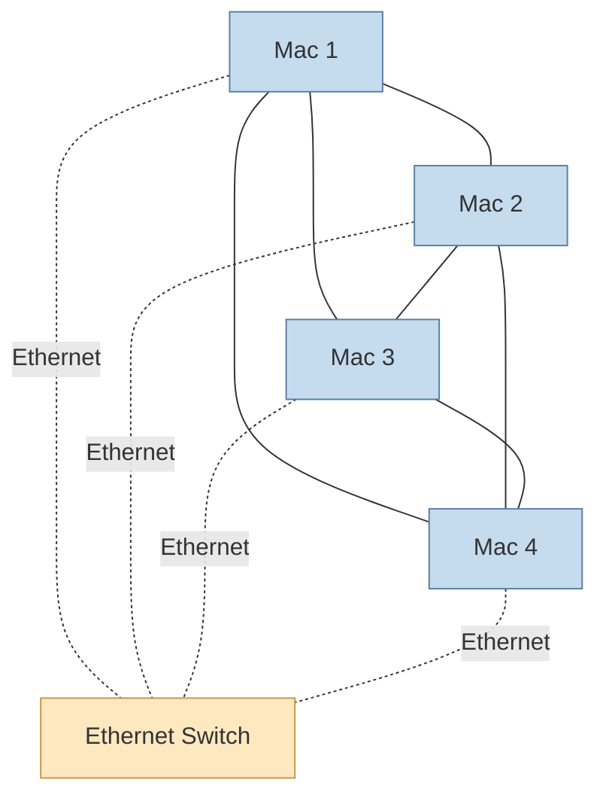
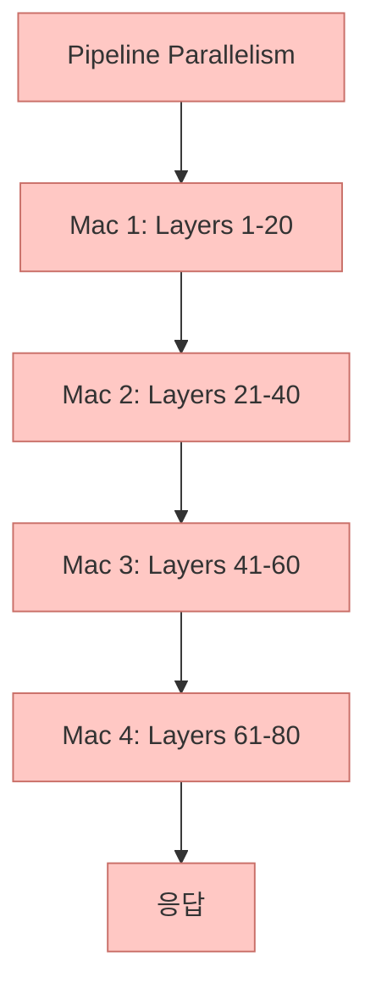
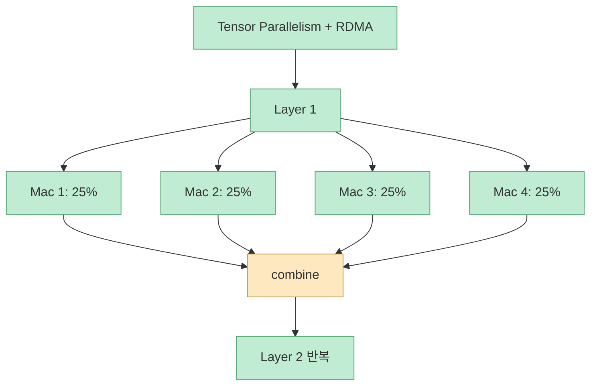
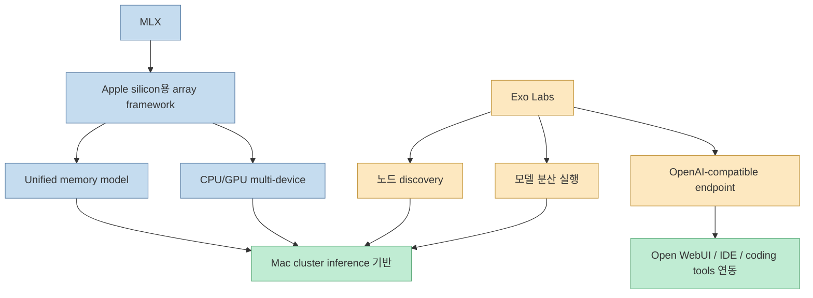
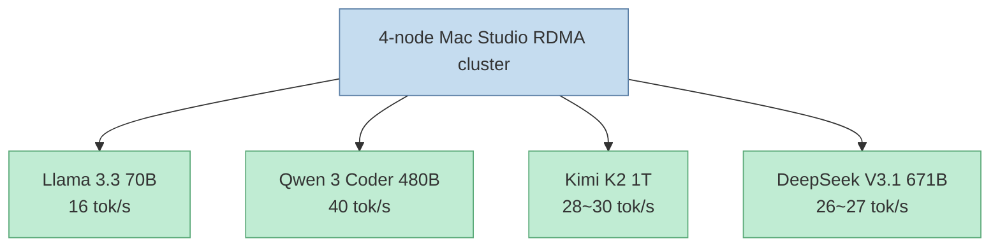
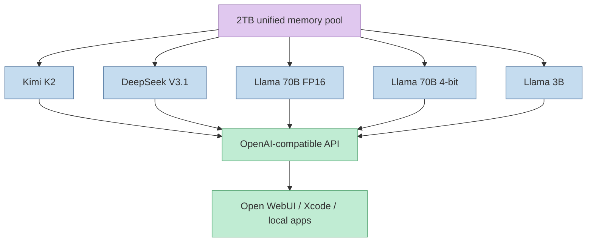
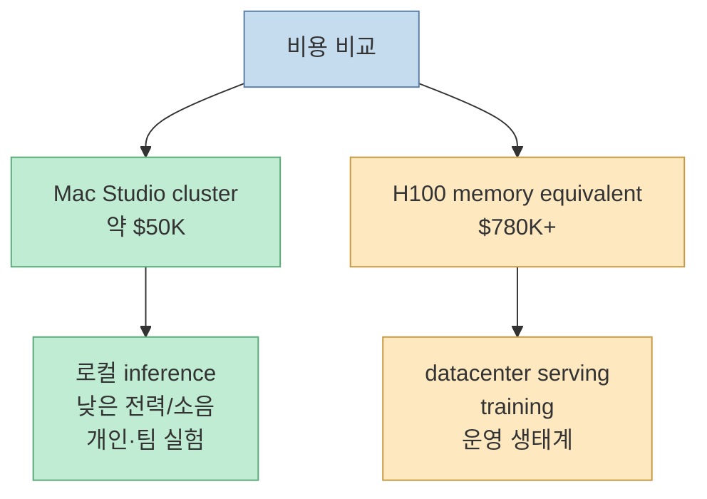

NetworkChuck는 4대의 Mac Studio M4 Ultra를 묶어 총 2TB unified memory, 320 GPU cores, 32TB storage를 가진 로컬 AI 클러스터를 만들었습니다. 이전 시도에서는 5대의 Mac Studio를 묶고도 오히려 91% 느려졌지만, 이번에는 Apple의 RDMA over Thunderbolt 5 업데이트와 Exo Labs 조합으로 1T급 모델을 현실적인 속도로 실행합니다. [0:00](https://youtu.be/bFgTxr5yst0?t=0) [0:53](https://youtu.be/bFgTxr5yst0?t=53)

<!--more-->

## Sources

- <https://youtu.be/bFgTxr5yst0?si=z3-VWdFbeLWFuuEl>
- NetworkChuck companion repo: <https://github.com/theNetworkChuck/mac-studio-cluster>
- Exo Labs: <https://github.com/exo-explore/exo>
- MLX: <https://github.com/ml-explore/mlx>

## 핵심은 Mac Studio 4대가 아니라 interconnect다

영상 초반의 하드웨어 스펙은 화려합니다. 4대의 Mac Studio, 각 512GB RAM, 총 2TB unified memory입니다. [0:00](https://youtu.be/bFgTxr5yst0?t=0) companion repo도 같은 구성을 `4x Mac Studio M4 Ultra`, `2TB GPU-accessible unified memory`, `320 GPU cores`, `32TB storage`로 정리합니다. [NetworkChuck repo](https://github.com/theNetworkChuck/mac-studio-cluster)

하지만 이 프로젝트의 핵심은 RAM 총량보다 노드 사이의 지연 시간입니다. 이전 방식처럼 각 노드가 순서대로 layer를 처리하면, 한 노드가 끝날 때까지 다음 노드가 기다립니다. 노드를 많이 붙여도 통신 지연이 크면 GPU가 놀게 됩니다. 영상은 Apple이 RDMA over Thunderbolt 5를 가능하게 하면서 latency가 300 microseconds에서 3 microseconds로 내려갔다고 설명합니다. [7:52](https://youtu.be/bFgTxr5yst0?t=472)

즉 "Ethernet is dead?"라는 제목은 과장된 표현이지만, AI inference 클러스터 관점에서는 메시지가 분명합니다. 노드 discovery, 모델 다운로드, API 접근에는 Ethernet이 여전히 필요합니다. 그러나 대형 모델을 여러 Mac에 나눠 돌리는 핵심 경로에서는 Thunderbolt 5 + RDMA가 병목을 깬 것입니다.

## 구성: Thunderbolt mesh + Ethernet 보조망

영상은 4대의 Mac Studio를 연결하는 장면을 보여줍니다. [3:05](https://youtu.be/bFgTxr5yst0?t=185) companion repo 기준으로 4대 full mesh에는 Thunderbolt 5 케이블 6개가 필요합니다. Mac 1은 Mac 2, 3, 4와 연결되고, 나머지 Mac들도 서로 연결됩니다. Ethernet은 모든 노드를 같은 switch에 연결해 discovery, 모델 다운로드, API access에 사용합니다. [NetworkChuck repo](https://github.com/theNetworkChuck/mac-studio-cluster)

이 구조는 일반적인 "네트워크로 묶은 여러 컴퓨터"와 다릅니다. Ethernet만으로는 대형 텐서 연산 중간값을 자주 주고받기 어렵습니다. Thunderbolt mesh는 inference 중 노드 간 직접 통신 경로를 줄이고, RDMA는 TCP/IP stack을 우회해 메모리 접근 지연을 낮춥니다. companion repo도 RDMA가 latency를 300μs에서 3μs로 줄이며, Thunderbolt를 통한 direct GPU-to-GPU memory access를 가능하게 한다고 설명합니다. [NetworkChuck repo](https://github.com/theNetworkChuck/mac-studio-cluster)

## Pipeline parallelism vs tensor parallelism

영상의 중요한 설명은 pipeline parallelism과 tensor parallelism 차이입니다. [4:17](https://youtu.be/bFgTxr5yst0?t=257)

pipeline 방식에서는 모델 layer를 여러 Mac에 나눕니다. 예를 들어 Mac 1이 앞쪽 layer를 처리하고, Mac 2가 다음 layer를 처리하는 식입니다. 이 방식은 이해하기 쉽지만 순차 대기가 생깁니다. 한 노드가 끝나야 다음 노드가 시작하므로, 클러스터 전체가 동시에 바쁘게 일하지 못합니다.

tensor 방식에서는 모든 Mac이 같은 layer의 일부를 함께 계산합니다. 각 노드가 25%씩 계산하고 결과를 합친 뒤 다음 layer로 넘어갑니다. 이 방식은 진짜 병렬화에 가깝지만, 노드 간 통신이 훨씬 자주 발생합니다. 그래서 RDMA 없이 tensor parallelism을 켜면 오히려 느려질 수 있습니다.

companion repo의 benchmark도 이 차이를 보여줍니다. Llama 70B 기준 pipeline은 5 tok/s, tensor만 켰을 때는 3 tok/s로 더 느렸지만, tensor + RDMA에서는 16 tok/s로 올라갑니다. [NetworkChuck repo](https://github.com/theNetworkChuck/mac-studio-cluster)

## Exo Labs와 MLX가 하는 일

영상은 Exo Labs가 돌아왔다고 말하며, 이 클러스터가 실제로 동작하는 데 Exo가 중요한 역할을 한다고 설명합니다. [11:39](https://youtu.be/bFgTxr5yst0?t=699) Exo Labs repository는 자신들을 "Run frontier AI locally"라는 문구로 소개합니다. 즉 여러 장치를 묶어 로컬 AI 실행 환경을 만드는 쪽에 초점이 있습니다. [Exo Labs](https://github.com/exo-explore/exo)

MLX는 Apple silicon에서 machine learning을 위한 array framework입니다. MLX README는 Python API가 NumPy와 유사하고, C++/C/Swift API도 제공하며, multi-device와 unified memory model을 지원한다고 설명합니다. 특히 MLX arrays는 shared memory에 존재하고, CPU/GPU 같은 지원 device에서 데이터 전송 없이 연산할 수 있다는 점을 강조합니다. [MLX README](https://github.com/ml-explore/mlx)

결국 이 프로젝트는 하드웨어만으로 되는 것이 아닙니다. Apple silicon의 unified memory, MLX의 framework, Exo의 distributed runtime, Thunderbolt RDMA가 함께 맞물려야 합니다.

## 성능 결과: 1T 모델을 로컬에서 돌린다는 의미

영상 설명란의 결과는 인상적입니다.

- Llama 3.3 70B: 16 tok/s
- Kimi K2 1T: 28 tok/s
- DeepSeek V3.1 671B: 27 tok/s
- Qwen 3 Coder 480B: 40 tok/s

영상은 Qwen 3 Coder 480B 테스트를 17:58부터, Kimi K2 1T 테스트를 19:03부터 보여줍니다. [17:58](https://youtu.be/bFgTxr5yst0?t=1078) [19:03](https://youtu.be/bFgTxr5yst0?t=1143) companion repo도 4-node RDMA cluster benchmark로 Qwen 3 Coder 480B 40 tok/s, Kimi K2 28~30 tok/s, DeepSeek V3.1 26~27 tok/s를 기록합니다. [NetworkChuck repo](https://github.com/theNetworkChuck/mac-studio-cluster)

여기서 중요한 것은 "클라우드 GPU를 완전히 대체한다"가 아닙니다. fine-tuning, multi-user serving, SLA, 운영 자동화까지 고려하면 클라우드 GPU와 직접 비교하기 어렵습니다. 그러나 거대한 모델을 로컬에서 interactive하게 실행할 수 있다는 점은 분명히 의미가 있습니다. 특히 보안상 데이터를 외부로 보내기 어렵거나, 실험 비용을 예측 가능하게 만들고 싶은 조직에는 매력적입니다.

## 여러 모델을 동시에 올리는 로컬 AI 서버

영상 후반에는 여러 모델을 동시에 올리는 장면이 나옵니다. [21:09](https://youtu.be/bFgTxr5yst0?t=1269) companion repo도 Kimi K2, DeepSeek V3.1, Llama 3.3 70B FP16, Llama 3.3 70B 4-bit, Llama 3.2 3B 등 5개 모델을 동시에 로드하고 responsive하게 유지한 예시를 보여줍니다. [NetworkChuck repo](https://github.com/theNetworkChuck/mac-studio-cluster)

이것이 가능한 이유는 총 2TB unified memory 때문입니다. GPU VRAM이 별도로 고정된 전통적인 구조와 달리 Apple silicon unified memory는 CPU/GPU가 같은 메모리 풀을 공유합니다. MLX도 unified memory model을 핵심 차별점으로 설명합니다. [MLX README](https://github.com/ml-explore/mlx)

실전에서는 이 클러스터를 단순한 benchmark 장비가 아니라 사내 로컬 모델 endpoint처럼 사용할 수 있습니다. companion repo도 Exo Labs가 OpenAI-compatible API를 노출하며 Open WebUI, Xcode, Claude Code, Cursor, Continue 같은 도구가 endpoint를 바라보게 할 수 있다고 설명합니다. [NetworkChuck repo](https://github.com/theNetworkChuck/mac-studio-cluster)

## 비용 비교: $50K vs H100 $780K+는 어떻게 읽어야 하나

영상 설명란과 companion repo는 이 Mac cluster를 약 5만 달러, 같은 2TB memory를 NVIDIA H100으로 맞추면 78만 달러 이상으로 비교합니다. [NetworkChuck repo](https://github.com/theNetworkChuck/mac-studio-cluster)

이 비교는 memory capacity 관점에서는 강력합니다. 2TB급 GPU-accessible memory를 단일 로컬 장비 묶음으로 확보할 수 있기 때문입니다. 그러나 H100 cluster와 Mac Studio cluster는 목적이 다릅니다. H100은 training, high-throughput serving, mature datacenter networking, multi-tenant 운영에 강합니다. Mac Studio cluster는 로컬 inference, private lab, predictable capex, Apple ecosystem integration에 강합니다.

따라서 이 구성은 "H100을 이겼다"보다 "대형 모델 로컬 inference를 현실적인 가격대로 끌어내렸다"에 가깝습니다.

## 실전 적용 포인트

첫째, 이 구성은 네트워크가 핵심입니다. Mac을 여러 대 샀다고 자동으로 빠른 클러스터가 되지 않습니다. Thunderbolt mesh, RDMA enable, Exo discovery, parallelism mode가 모두 맞아야 합니다. [3:05](https://youtu.be/bFgTxr5yst0?t=185)

둘째, pipeline parallelism이 아니라 tensor + RDMA 구성이 성능의 핵심입니다. companion repo benchmark에서도 tensor만 켜면 느려지고, RDMA가 붙어야 70B 모델에서 16 tok/s로 올라갑니다. [NetworkChuck repo](https://github.com/theNetworkChuck/mac-studio-cluster)

셋째, 이 구성은 inference 중심으로 봐야 합니다. companion repo FAQ도 fine-tuning workflow는 아직 evolving 단계라고 설명합니다. [NetworkChuck repo](https://github.com/theNetworkChuck/mac-studio-cluster)

넷째, 운영 난이도를 과소평가하면 안 됩니다. beta macOS, RDMA 설정, mesh cable, node discovery, 모델 배포, cluster restart script까지 관리해야 합니다. 개인 프로젝트로는 멋지지만, 팀 운영에는 관측·재시작·업데이트 절차가 필요합니다.

## 핵심 요약

- 4대의 Mac Studio M4 Ultra를 묶어 총 2TB unified memory 로컬 AI 클러스터를 구성합니다. [0:00](https://youtu.be/bFgTxr5yst0?t=0)
- 이전 Mac cluster 시도는 느렸지만, 이번에는 Apple의 RDMA over Thunderbolt 5와 Exo Labs로 병목을 크게 줄였습니다. [0:53](https://youtu.be/bFgTxr5yst0?t=53)
- RDMA는 latency를 300μs에서 3μs로 줄여 tensor parallelism이 현실적으로 작동하게 합니다. [7:52](https://youtu.be/bFgTxr5yst0?t=472)
- Qwen 3 Coder 480B, Kimi K2 1T, DeepSeek V3.1 671B 같은 대형 모델을 로컬에서 실행한 결과가 제시됩니다. [17:58](https://youtu.be/bFgTxr5yst0?t=1078) [19:03](https://youtu.be/bFgTxr5yst0?t=1143)
- Exo Labs는 distributed local AI runtime 역할을 하고, MLX는 Apple silicon의 unified memory와 multi-device 연산 기반을 제공합니다.
- 이 구성은 H100 cluster를 모든 면에서 대체한다기보다, private local inference lab을 현실적인 비용으로 만드는 선택지입니다.

## 결론

이 영상의 핵심은 "Ethernet이 죽었다"가 아닙니다. Ethernet은 여전히 discovery, 다운로드, API 접근에 필요합니다. 다만 대형 모델 inference에서 병목이 되는 노드 간 텐서 통신은 Ethernet이 아니라 Thunderbolt 5 + RDMA가 맡아야 한다는 점을 보여줍니다.

4대의 Mac Studio가 가진 2TB unified memory는 대형 모델을 로컬에 올릴 수 있는 물리적 기반을 제공합니다. 그러나 그것만으로는 충분하지 않습니다. MLX, Exo, tensor parallelism, RDMA, mesh topology가 함께 맞물릴 때 비로소 1T급 모델을 interactive하게 돌리는 로컬 AI 클러스터가 됩니다. 이 조합은 로컬 AI의 방향을 "작은 모델을 노트북에서 돌리기"에서 "대형 모델을 개인/팀 클러스터에서 운영하기"로 확장합니다.
