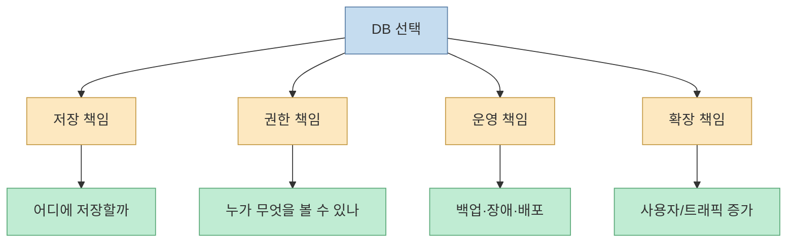
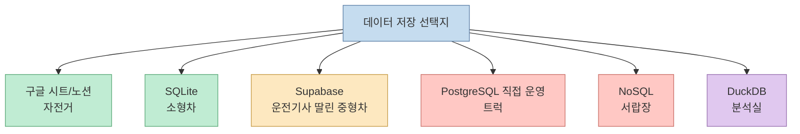
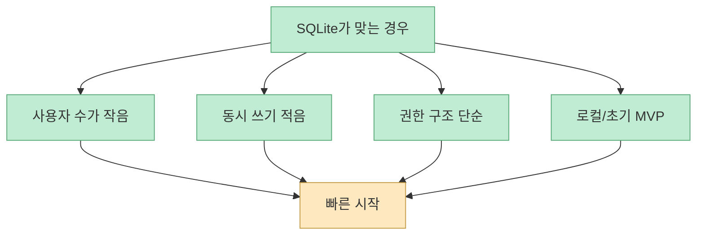
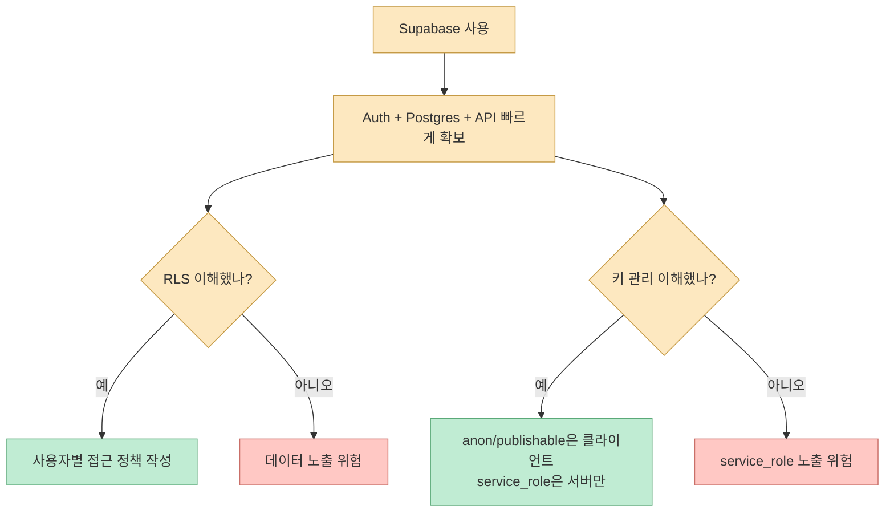
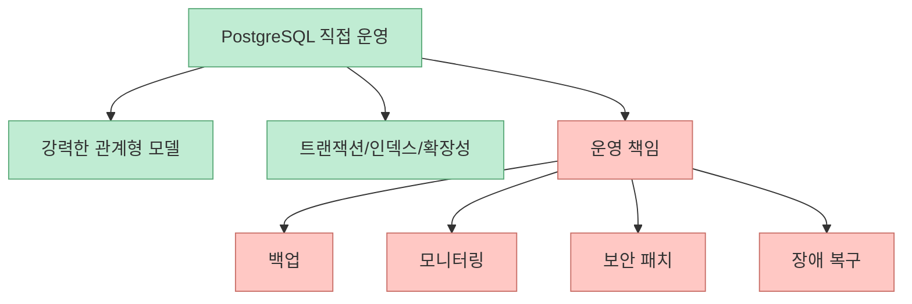
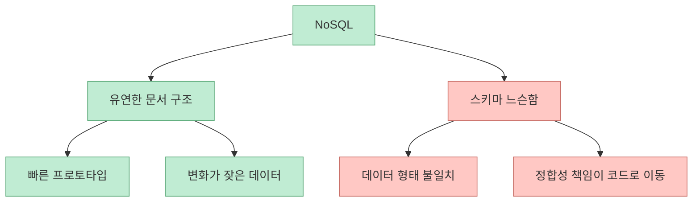
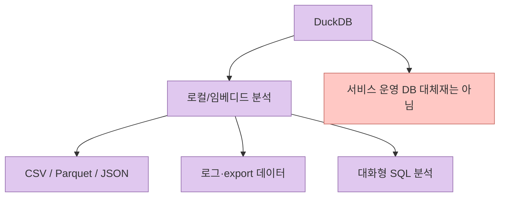
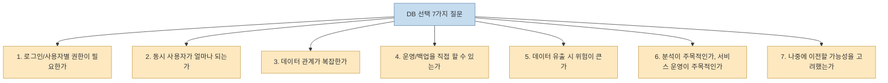
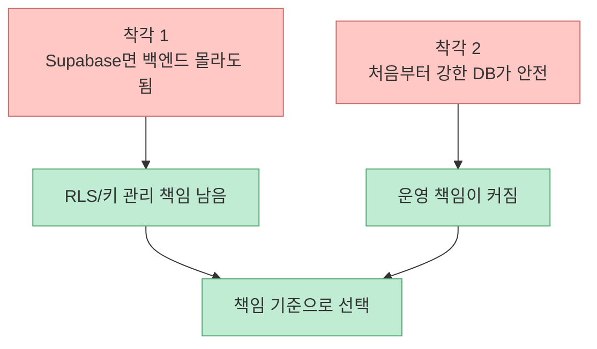

바이브 코딩으로 앱을 만들면 처음에는 화면이 빠르게 나옵니다. 그런데 어느 순간 질문이 바뀝니다. "이 데이터는 어디에 저장하지?" 바이브랩스 영상은 이 지점에서 SQLite, Supabase, PostgreSQL, NoSQL 같은 이름을 외우기보다, **내 서비스가 감당해야 할 책임** 을 기준으로 데이터베이스를 고르라고 말합니다. [0:00](https://youtu.be/GxhMuz7N6T4?t=0)

<!--more-->

## Sources

- <https://youtu.be/GxhMuz7N6T4?si=r0Xb6XXDqzuFQEQ5>
- Supabase Row Level Security docs: <https://supabase.com/docs/guides/database/postgres/row-level-security>
- Supabase API keys docs: <https://supabase.com/docs/guides/api/api-keys>
- SQLite serverless docs: <https://sqlite.org/serverless.html>
- DuckDB docs: <https://duckdb.org/>

## DB 선택은 기술이 아니라 책임의 선택이다

영상은 초반에 "DB 선택은 기술이 아니라 책임의 선택"이라고 정리합니다. [1:39](https://youtu.be/GxhMuz7N6T4?t=99) 이 말은 초보자에게 특히 중요합니다. 데이터베이스를 고른다는 것은 단순히 저장소를 고르는 것이 아닙니다. 인증, 권한, 백업, 동시접속, 배포, 장애 대응, 데이터 이전 가능성까지 어느 정도까지 직접 책임질지 정하는 일입니다.

예를 들어 구글 시트나 노션은 시작이 쉽지만 서비스의 핵심 DB로 쓰기에는 한계가 있습니다. SQLite는 작고 단순한 앱에는 강력하지만 여러 사용자가 동시에 쓰고 권한을 나눠야 하는 SaaS에는 별도 설계가 필요합니다. Supabase는 많은 책임을 대신 맡아 주지만, Row Level Security와 키 관리를 이해하지 못하면 보안 사고로 이어질 수 있습니다.

따라서 좋은 질문은 "요즘은 Supabase가 좋나요?"가 아닙니다. "내 서비스는 로그인과 권한이 필요한가?", "동시 사용자가 몇 명인가?", "운영을 내가 할 수 있는가?", "데이터가 유출되면 얼마나 치명적인가?"입니다.

## 자전거, 소형차, 운전기사 딸린 중형차, 트럭, 서랍장, 분석실

영상은 데이터베이스를 차와 공간에 비유합니다. 구글 시트/노션은 자전거, SQLite는 소형차, Supabase는 운전기사 딸린 중형차, PostgreSQL 직접 운영은 트럭, MongoDB 같은 NoSQL은 서랍장, DuckDB는 분석실에 가깝습니다. [2:46](https://youtu.be/GxhMuz7N6T4?t=166)

이 비유의 장점은 "좋고 나쁨"이 아니라 "맞는 상황"을 보게 한다는 점입니다.

처음에는 자전거나 소형차가 빠릅니다. 하지만 유료 고객이 생기고 권한이 복잡해지면 중형차나 트럭이 필요해집니다. 반대로 분석용 데이터만 빠르게 훑어야 하는데 운영 DB를 무겁게 붙이는 것도 낭비입니다.

## SQLite: 의외로 좋은 출발점

영상은 SQLite를 의외로 좋은 출발점으로 봅니다. [3:32](https://youtu.be/GxhMuz7N6T4?t=212) SQLite 공식 문서도 SQLite를 별도 서버 프로세스 없이 애플리케이션이 직접 데이터베이스 파일을 읽고 쓰는 serverless 구조로 설명합니다. [SQLite serverless docs](https://sqlite.org/serverless.html)

SQLite가 좋은 이유는 단순합니다. 설치가 쉽고, 로컬 개발이 빠르고, 작은 앱에서는 운영 부담이 낮습니다. 개인 도구, 내부 관리자 페이지, 작은 데스크톱 앱, 초기 프로토타입처럼 사용자가 적고 권한 구조가 단순한 경우에는 충분히 좋은 선택입니다.

다만 SQLite가 만능은 아닙니다. 여러 사용자가 동시에 쓰고, 사용자별 권한을 엄격히 나누고, 서버 여러 대에서 같은 DB를 안정적으로 쓰는 구조라면 별도 설계가 필요합니다. 그래서 SQLite는 "작아서 나쁜 DB"가 아니라, 책임 범위가 작을 때 아주 좋은 DB라고 보는 편이 정확합니다.

## Supabase: 빠른 중형차지만 RLS와 키 관리를 이해해야 한다

영상은 Supabase의 매력과 함께 RLS, anon key, service role key 같은 함정을 짚습니다. [4:26](https://youtu.be/GxhMuz7N6T4?t=266) Supabase는 PostgreSQL 기반 DB, Auth, Storage, Realtime, API를 빠르게 붙일 수 있어 바이브 코딩에서 매우 매력적입니다. 하지만 "무료고 편하다"는 이유만으로 붙이면 보안 책임을 놓치기 쉽습니다.

Supabase 공식 RLS 문서는 public schema의 테이블에서 RLS를 반드시 활성화해야 한다고 설명합니다. API를 통해 만든 테이블은 기본으로 RLS가 활성화되지만, SQL editor나 raw SQL로 만든 테이블은 직접 활성화해야 합니다. [Supabase RLS docs](https://supabase.com/docs/guides/database/postgres/row-level-security)

또한 API keys 문서는 `anon`/publishable key와 `service_role`/secret key의 차이를 설명합니다. 특히 `service_role` 키는 프로젝트 데이터에 높은 권한으로 접근할 수 있으므로 클라이언트에 노출하면 안 됩니다. [Supabase API keys docs](https://supabase.com/docs/guides/api/api-keys)

Supabase는 초보자에게 좋은 선택일 수 있습니다. 단, "백엔드를 안 만들어도 된다"가 아니라 "백엔드의 많은 부분을 Supabase에 위임한다"로 이해해야 합니다. 위임하더라도 권한 정책과 키 관리 책임은 여전히 사용자에게 남습니다.

## PostgreSQL 직접 운영: 트럭은 강하지만 운전할 줄 알아야 한다

영상은 PostgreSQL 직접 운영을 트럭에 비유합니다. [6:23](https://youtu.be/GxhMuz7N6T4?t=383) PostgreSQL은 강력하고 표준적이며 확장성도 높습니다. 복잡한 관계형 데이터, 트랜잭션, 인덱스, 쿼리 최적화, 안정적인 운영이 필요한 서비스에는 좋은 선택입니다.

하지만 직접 운영은 DB 엔진 선택 이상의 책임을 뜻합니다. 백업, 마이그레이션, 모니터링, connection pooling, 장애 복구, 권한 설정, 보안 패치까지 챙겨야 합니다. 개발자가 혼자 만드는 초기 앱에서 이 모든 것을 감당하려 하면 제품 검증보다 운영에 시간을 빼앗길 수 있습니다.

그래서 직접 운영 PostgreSQL은 "언젠가 가야 할 최종 목적지"가 아닙니다. 지금 서비스가 감당해야 하는 데이터 복잡도와 운영 역량이 맞을 때 선택하는 도구입니다. 많은 초기 서비스는 managed PostgreSQL이나 Supabase 같은 중간 단계를 거치는 편이 더 현실적입니다.

## NoSQL: 서랍장은 유연하지만 질서가 필요하다

영상은 MongoDB 같은 NoSQL을 서랍장에 비유합니다. [6:23](https://youtu.be/GxhMuz7N6T4?t=383) 서랍장은 형태가 다른 물건을 빨리 넣기에 좋습니다. JSON 문서처럼 구조가 자주 바뀌는 데이터, 이벤트 로그, 사용자별 설정, 중첩된 문서 구조에는 NoSQL이 자연스러울 수 있습니다.

하지만 유연함은 장점이자 위험입니다. 스키마가 느슨하면 초반에는 빠르지만, 시간이 지나면서 같은 필드가 여러 형태로 저장되고, 쿼리 기준이 흔들리고, 데이터 정합성이 애플리케이션 코드로 밀려납니다.

NoSQL은 "관계형을 몰라도 되게 해 주는 쉬운 DB"가 아닙니다. 오히려 데이터 모델링을 더 신중히 해야 합니다. 관계가 많고 정합성이 중요한 서비스라면 관계형 DB가 더 단순할 수 있습니다.

## DuckDB: 서비스 DB가 아니라 분석실

영상은 DuckDB를 분석실에 비유합니다. [2:46](https://youtu.be/GxhMuz7N6T4?t=166) DuckDB 공식 문서는 DuckDB를 어디서나 실행되는 SQL database로 소개하며, Parquet, JSON, S3, data lakes 같은 데이터 소스를 직접 쿼리할 수 있다고 설명합니다. [DuckDB docs](https://duckdb.org/)

DuckDB는 서비스의 주 운영 DB라기보다 분석용 도구에 가깝습니다. CSV, Parquet, 로그, export된 데이터를 빠르게 SQL로 분석하거나, 로컬 데이터 science workflow에서 쓰기 좋습니다. SQLite가 작은 OLTP 앱에 가깝다면, DuckDB는 embedded analytics에 초점이 있습니다.

바이브 코딩 앱에서 DuckDB는 "사용자 데이터를 저장하는 메인 DB"보다 "운영 데이터를 분석하는 보조 도구"로 생각하는 편이 안전합니다.

## DB를 고르기 위한 7가지 질문

영상은 DB를 고르기 위한 7가지 질문을 제시합니다. [7:50](https://youtu.be/GxhMuz7N6T4?t=470) 설명란에는 질문 전체가 그대로 나오지는 않지만, 영상의 흐름과 설명을 기준으로 보면 초보자가 최소한 아래 질문을 통과해야 합니다.

이 질문에 따라 선택은 달라집니다. 로그인 없는 작은 도구라면 SQLite가 적절할 수 있습니다. 로그인과 사용자별 데이터가 필요하고 빠르게 만들고 싶다면 Supabase가 현실적입니다. 데이터 관계와 운영 요구가 커지면 managed PostgreSQL이나 직접 운영 PostgreSQL을 검토해야 합니다. 분석이 목적이라면 DuckDB가 더 잘 맞을 수 있습니다.

## 초보가 자주 빠지는 두 가지 착각

영상은 초보가 자주 빠지는 착각도 짚습니다. [8:56](https://youtu.be/GxhMuz7N6T4?t=536)

첫 번째 착각은 "Supabase를 쓰면 백엔드를 몰라도 된다"입니다. Supabase는 많은 것을 대신 해 주지만, 권한 정책과 키 관리까지 자동으로 안전하게 해 주지는 않습니다. RLS를 이해하지 못하면 사용자가 다른 사용자의 데이터를 읽을 수 있는 구조를 만들 수 있습니다.

두 번째 착각은 "처음부터 가장 강한 DB를 쓰면 안전하다"입니다. PostgreSQL 직접 운영은 강하지만, 운영 능력이 없으면 오히려 위험합니다. 초보에게는 기술적으로 강한 선택보다 책임 범위가 맞는 선택이 더 안전합니다.

## 실전 적용 포인트

첫째, MVP라면 가장 작은 책임부터 시작합니다. 로그인도 없고 동시 쓰기도 적다면 SQLite나 간단한 저장소로 충분할 수 있습니다.

둘째, 로그인과 사용자별 데이터가 들어가면 권한 설계를 먼저 합니다. Supabase를 쓰더라도 RLS와 키 관리를 이해하지 못한 상태로 공개하면 안 됩니다.

셋째, PostgreSQL 직접 운영은 운영 역량이 있을 때 선택합니다. "언젠가 커질 서비스니까 처음부터 트럭"이 아니라, 실제로 트럭이 필요한 시점인지 판단해야 합니다.

넷째, 분석과 운영 DB를 구분합니다. DuckDB는 분석에 강하지만, 사용자 요청을 처리하는 서비스 메인 DB로 무조건 적합한 것은 아닙니다.

다섯째, AI에게 DB를 고르게 할 때도 질문을 먼저 던지게 해야 합니다. "내 앱에 DB 추천해 줘"보다 "사용자 수, 권한, 동시 쓰기, 운영 역량을 질문한 뒤 DB를 추천해 줘"가 더 안전합니다.

## 핵심 요약

- 바이브 코딩에서 DB 선택은 기술 이름 암기가 아니라 책임 범위 선택입니다. [1:39](https://youtu.be/GxhMuz7N6T4?t=99)
- SQLite는 작은 앱과 초기 MVP에 의외로 좋은 출발점입니다. [3:32](https://youtu.be/GxhMuz7N6T4?t=212)
- Supabase는 빠르게 앱을 만들 수 있지만 RLS, anon key, service role key를 이해해야 합니다. [4:26](https://youtu.be/GxhMuz7N6T4?t=266)
- PostgreSQL 직접 운영은 강력하지만 백업, 모니터링, 보안, 장애 대응 책임을 함께 가져옵니다. [6:23](https://youtu.be/GxhMuz7N6T4?t=383)
- NoSQL은 유연하지만 데이터 정합성과 스키마 질서가 애플리케이션 책임으로 이동할 수 있습니다.
- DuckDB는 운영 DB보다 로컬/임베디드 분석용 도구로 이해하는 편이 좋습니다.
- 좋은 DB 선택은 "무엇이 유행인가"가 아니라 "내 서비스가 어떤 책임을 감당해야 하는가"에서 출발합니다.

## 결론

앱은 화면에서 시작하지만 서비스는 데이터에서 버팁니다. 영상의 마지막 메시지도 이 방향입니다. [11:55](https://youtu.be/GxhMuz7N6T4?t=715) 바이브 코딩은 화면을 빠르게 만드는 데 강하지만, 데이터가 들어가는 순간부터는 저장, 권한, 보안, 백업, 확장이라는 현실적인 책임이 생깁니다.

처음부터 가장 강한 DB를 고르는 것이 정답은 아닙니다. 반대로 가장 쉬운 DB를 무조건 고르는 것도 정답이 아닙니다. 좋은 선택은 현재 서비스의 책임 범위와 운영 역량을 맞추는 것입니다. 그래서 DB 선택의 첫 질문은 "무슨 DB가 좋나요?"가 아니라, **"내가 지금 어디까지 책임질 수 있나요?"** 여야 합니다.
