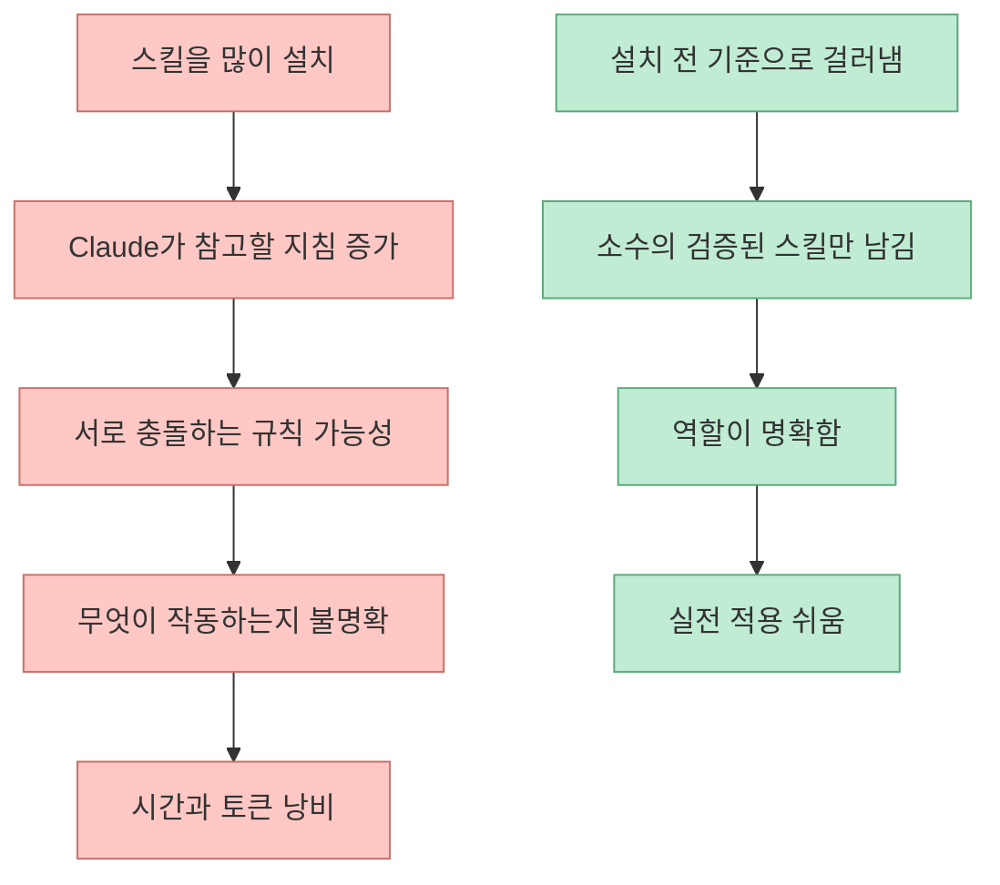
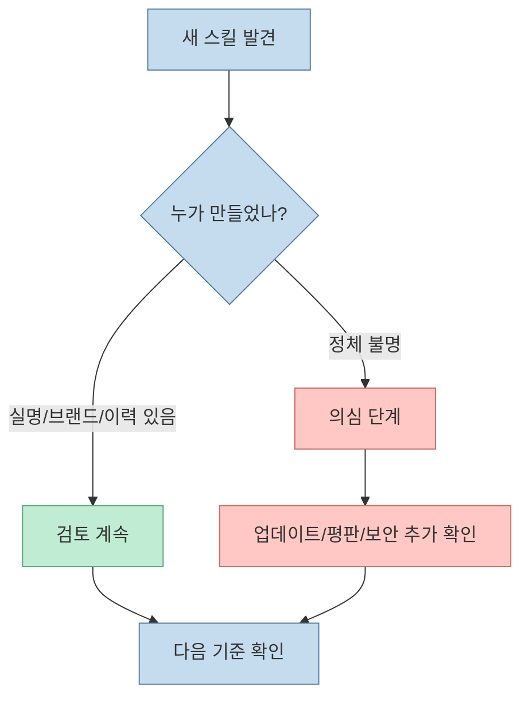
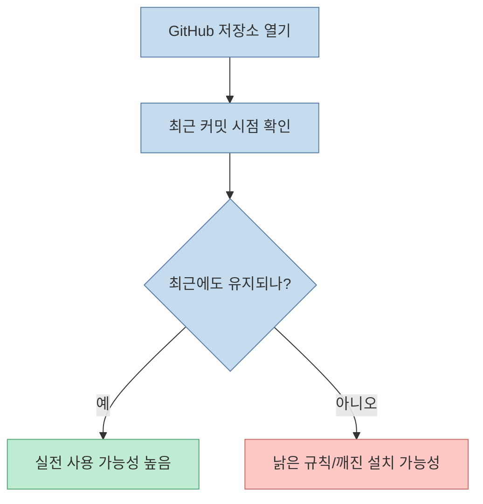
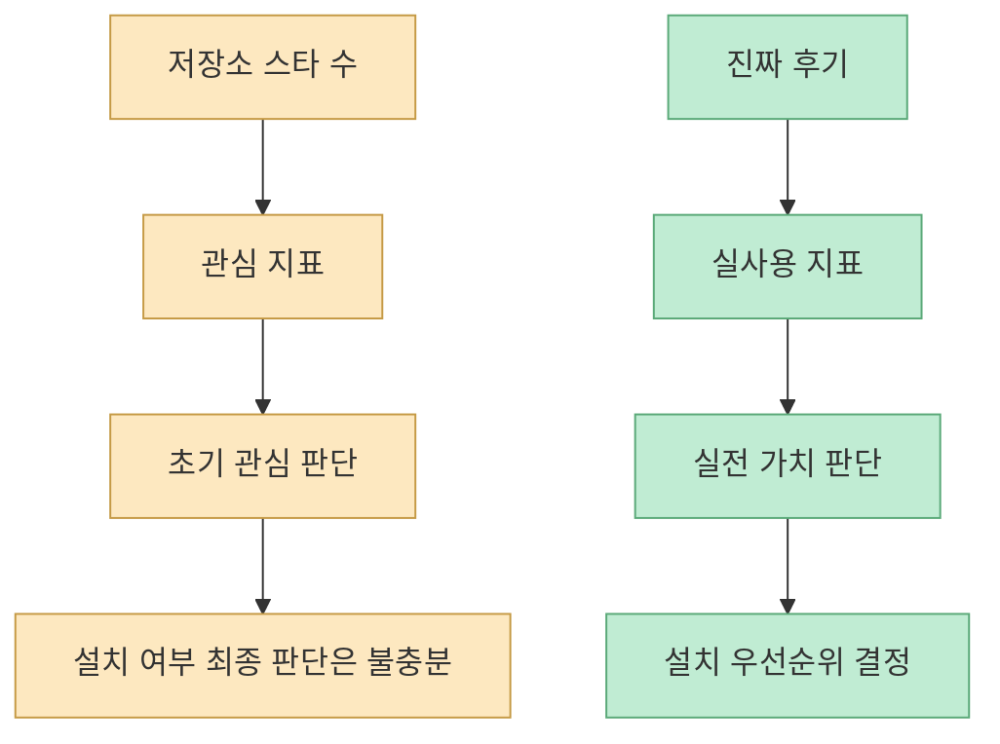
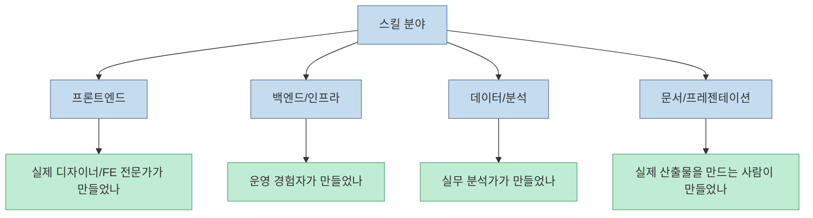
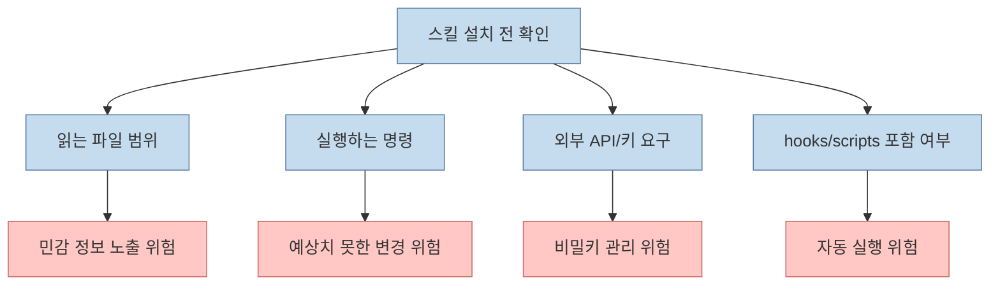
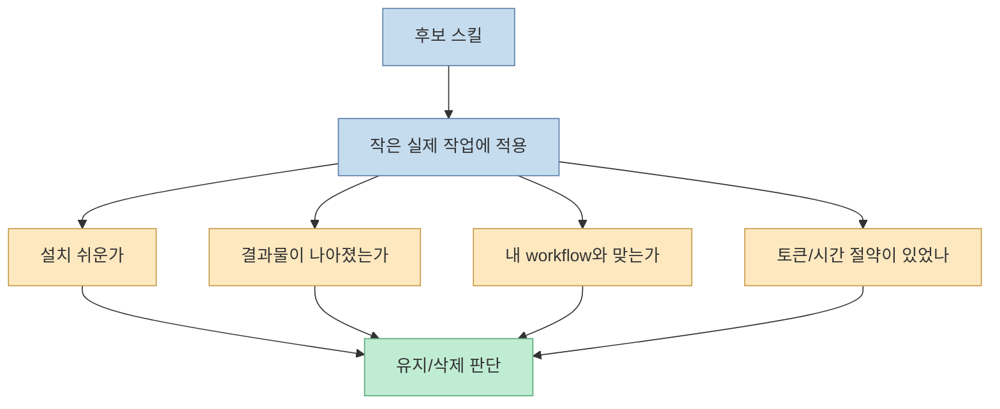
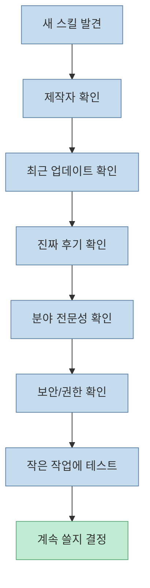

요즘 AI 스킬은 너무 많습니다. GitHub를 열어도, 커뮤니티를 들어가도, 누군가가 "이거 써 보세요" 하는 스킬이 쏟아집니다. 문제는 많다고 좋은 것이 아니라는 점입니다. 메이커 에반의 영상은 이 중 절반 이상은 안 써도 되며, 심하면 AI가 대충 찍어낸 `AI 슬롭`일 수도 있다고 말합니다. 핵심은 결과물을 본 뒤 후회하는 것이 아니라, **설치 전에 거를 수 있는 기준** 을 갖는 것입니다. [0:00](https://youtu.be/g69pTkBYOqM?t=0)

<!--more-->

## Sources

- <https://youtu.be/g69pTkBYOqM?si=XyUWKdi_ZLN6UIle>
- skills.ag: <https://www.skills.ag>
- GitHub Docs — repository insights: <https://docs.github.com/en/repositories/viewing-activity-and-data-for-your-repository>

## 왜 스킬은 “찾는 법”보다 “거르는 법”이 먼저인가

영상은 스킬이 다 그럴듯해 보이는 것이 함정이라고 말합니다. [0:21](https://youtu.be/g69pTkBYOqM?t=21) Claude Code나 AI agent 스킬은 이름만 보면 거의 다 유용해 보입니다. "super", "pro", "elite", "10x", "god mode" 같은 표현은 화려하지만, 실제로는 중복된 프롬프트 묶음이거나 유지보수되지 않는 규칙 집합일 수 있습니다.

스킬을 많이 설치하면 당장 선택지가 많아져 좋아 보이지만, 실제로는 다음 문제가 생깁니다.

결국 중요한 것은 많이 설치하는 능력이 아니라, **안 설치할 줄 아는 능력** 입니다.

## 기준 1: 누가 만들었나 — 검증된 프로바이더인가

첫 번째 기준은 제작자입니다. 영상은 "누가 만들었나"를 가장 먼저 보라고 말합니다. [0:59](https://youtu.be/g69pTkBYOqM?t=59)

여기서 말하는 검증은 유명세만 뜻하지 않습니다. 실제로 그 도메인에서 오래 글을 쓰거나, 코드를 공개하거나, 반복적으로 툴을 업데이트하거나, 자신의 이름을 걸고 배포하는지를 보는 것입니다. 이름이 없는 계정이 하루 만에 만든 화려한 스킬은 주의해야 합니다.

스킬은 결국 실행 습관과 규칙을 내 환경에 들이는 일입니다. 작성자를 모르면 그 규칙의 의도도, 품질도 파악하기 어렵습니다.

## 기준 2: 업데이트 빈도 — 마지막 커밋이 언제인가

두 번째 기준은 업데이트 빈도입니다. 영상은 마지막 커밋을 확인하라고 말합니다. [1:37](https://youtu.be/g69pTkBYOqM?t=97)

GitHub 저장소는 README가 좋아 보여도 오랫동안 관리되지 않았을 수 있습니다. agent 도구와 스킬은 특히 변화가 빠릅니다. Claude Code, plugin format, hooks, commands, provider API가 바뀌면 예전 스킬은 금방 낡습니다.

GitHub 자체도 저장소의 activity와 insights를 통해 최근 변경과 기여 흐름을 확인할 수 있게 합니다. [GitHub Docs](https://docs.github.com/en/repositories/viewing-activity-and-data-for-your-repository) 스킬은 코드만큼이나 유지보수가 중요합니다.

## 기준 3: 평판 — 스타 수보다 진짜 후기

세 번째 기준은 평판입니다. 영상은 스타 수만 보지 말고 진짜 후기를 보라고 말합니다. [2:10](https://youtu.be/g69pTkBYOqM?t=130)

별점은 참고는 되지만 충분하지 않습니다. 별점은 바이럴, 링크 공유, 호기심 클릭으로도 쉽게 올라갑니다. 반면 실제 후기는 어떤 프로젝트에서 어떻게 썼는지, 무엇이 좋았고 무엇이 불편했는지, 업데이트가 유지되는지, 설치가 쉬운지 같은 실전 정보를 줍니다.

좋은 평판은 보통 "멋있다"보다 "실제로 이 프로젝트에서 이 병목을 줄였다"는 식으로 나타납니다.

## 기준 4: 분야 전문가가 만든 것인가

영상은 2:57에서 "거르는 기준에서 찾는 기준으로" 전환한 뒤, 3:08부터 네 번째 기준으로 분야 전문가가 만든 것인지 보라고 말합니다. [2:57](https://youtu.be/g69pTkBYOqM?t=177) [3:08](https://youtu.be/g69pTkBYOqM?t=188)

예를 들어 프론트엔드 디자인 스킬이라면 실제로 좋은 UI를 만드는 사람이 만든 것인지, 인프라 스킬이라면 운영 경험이 있는 사람이 만든 것인지, 데이터 분석 스킬이라면 실제 분석 workflow를 아는 사람이 만든 것인지를 봐야 합니다.

범용 프롬프트 엔지니어가 만든 스킬보다, 특정 분야의 실무자가 만든 스킬이 실제 결과물 품질에 더 큰 차이를 줄 때가 많습니다.

## 기준 5: 보안과 권한 — 무엇을 읽고 무엇을 실행하는가

다섯 번째 기준은 보안과 권한입니다. 영상은 3:44에 이 기준을 짚습니다. [3:44](https://youtu.be/g69pTkBYOqM?t=224)

스킬은 단순한 텍스트 지침일 수도 있지만, scripts, hooks, CLI 호출, 외부 API, 파일 읽기/쓰기 권한을 포함할 수도 있습니다. 그러므로 "이 스킬이 무엇을 읽나", "무엇을 실행하나", "민감한 경로를 건드리나", "비밀키를 요구하나"를 먼저 봐야 합니다.

좋은 스킬은 무엇을 하는지뿐 아니라, 무엇을 하지 않는지도 분명합니다. 보안은 결과물이 아니라 설치 전 권한 설계에서 갈립니다.

## 기준 6: 작게 실제로 써보기

마지막 기준은 작게 실제로 써보는 것입니다. 영상은 4:03에 이 기준을 말합니다. [4:03](https://youtu.be/g69pTkBYOqM?t=243)

아무리 좋아 보여도 작은 작업 하나에 먼저 써봐야 합니다. README가 좋아도, 실제로는 지시가 너무 많거나, 내 프로젝트 스타일과 맞지 않거나, Claude를 지나치게 장황하게 만들 수도 있습니다. 반대로 설명이 수수해도 실제 병목을 크게 줄여 주는 경우도 있습니다.

이 단계가 중요한 이유는 결국 스킬의 품질은 내 실제 workflow 안에서만 검증되기 때문입니다.

## 고르는 순서: 거르기 → 확인하기 → 작게 쓰기

영상의 4:28 요약은 사실상 설치 순서를 제안합니다. [4:28](https://youtu.be/g69pTkBYOqM?t=268) 이를 실무 흐름으로 정리하면 다음과 같습니다.

이 순서를 따르면 "좋아 보여서 설치했다가 나중에 지운다"는 패턴을 줄일 수 있습니다.

## skills.ag 같은 큐레이션의 의미

영상은 5:00에 좋은 스킬만 모아 둔 곳으로 `skills.ag`를 소개합니다. [5:00](https://youtu.be/g69pTkBYOqM?t=300) 이런 큐레이션 사이트의 가치는 스킬을 대신 선택해 준다는 데 있지 않습니다. 오히려 이미 한 번 필터링된 후보군을 제공해 탐색 비용을 줄이는 데 있습니다.

하지만 큐레이션이 있다고 해서 검증을 생략하면 안 됩니다. 큐레이션은 출발점일 뿐이고, 최종 판단은 여전히 내 workflow와 권한 기준에서 해야 합니다.

## 실전 적용 포인트

첫째, 당장 설치할 스킬 수를 제한합니다. 새 프로젝트에서는 한 번에 1~2개만 도입하고, 실제 병목이 줄었는지 봅니다.

둘째, 스킬 README보다 마지막 커밋, issue 반응, 실제 사용 후기부터 확인합니다.

셋째, 내 도메인과 맞는 전문가가 만든 스킬을 우선합니다. 프론트엔드, 디자인, 데이터, 인프라처럼 분야별 기준이 다릅니다.

넷째, hooks나 scripts가 있는 스킬은 반드시 권한 범위를 먼저 봅니다. 작은 생산성 개선보다 보안 문제가 훨씬 큰 비용을 만듭니다.

다섯째, 스킬이 나를 더 빠르게 만드는지보다, 같은 실수를 덜 하게 만드는지를 봅니다. 진짜 좋은 스킬은 flashy한 데모보다 반복 실패를 줄여 줍니다.

## 핵심 요약

- AI 스킬은 많지만 절반 이상은 안 써도 되며, 일부는 AI 슬롭일 수 있습니다. [0:00](https://youtu.be/g69pTkBYOqM?t=0)
- 첫 번째 기준은 제작자, 두 번째는 업데이트 빈도, 세 번째는 진짜 평판입니다. [0:59](https://youtu.be/g69pTkBYOqM?t=59) [1:37](https://youtu.be/g69pTkBYOqM?t=97) [2:10](https://youtu.be/g69pTkBYOqM?t=130)
- 네 번째 기준은 분야 전문성, 다섯 번째는 보안과 권한, 여섯 번째는 작은 실사용 테스트입니다. [3:08](https://youtu.be/g69pTkBYOqM?t=188) [3:44](https://youtu.be/g69pTkBYOqM?t=224) [4:03](https://youtu.be/g69pTkBYOqM?t=243)
- 별점보다 중요한 것은 반복 업데이트와 실사용 후기입니다.
- 좋은 스킬은 기능이 많아서가 아니라, 내 workflow에서 반복 실수를 줄여 주는가로 판단해야 합니다.

## 결론

AI 스킬 시대에는 설치 능력보다 선별 능력이 더 중요합니다. "좋아 보이는 스킬"은 넘치지만, 실제로 남는 것은 검증된 제작자, 최근 업데이트, 분야 전문성, 안전한 권한, 그리고 작은 실사용 테스트를 통과한 것들입니다.

좋은 스킬을 고르는 사람은 결국 더 적은 스킬을 씁니다. 하지만 그 적은 스킬이 자신의 workflow를 더 안정적으로 만들고, 토큰과 시간을 아끼고, 반복 실수를 줄여 줍니다. 그래서 중요한 것은 새 스킬을 더 찾는 것이 아니라, **안 써도 될 절반을 먼저 버리는 기준** 을 갖는 것입니다.
