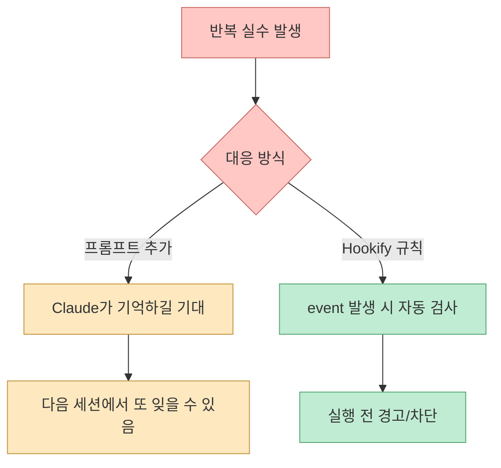
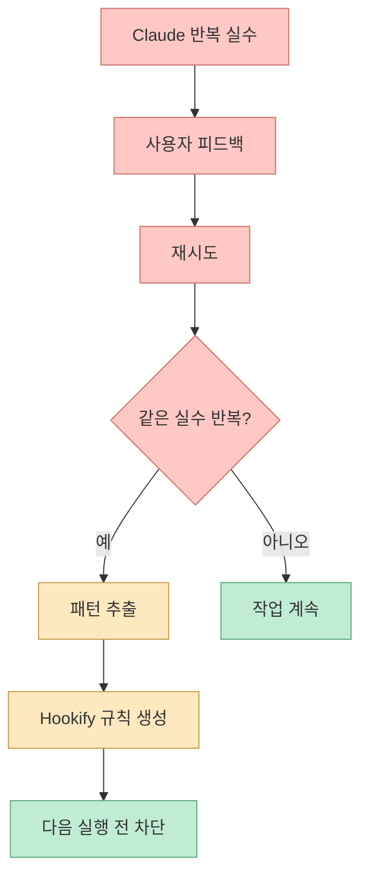
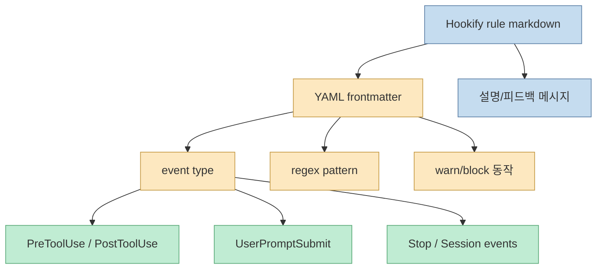
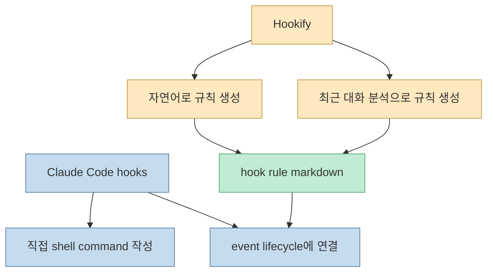
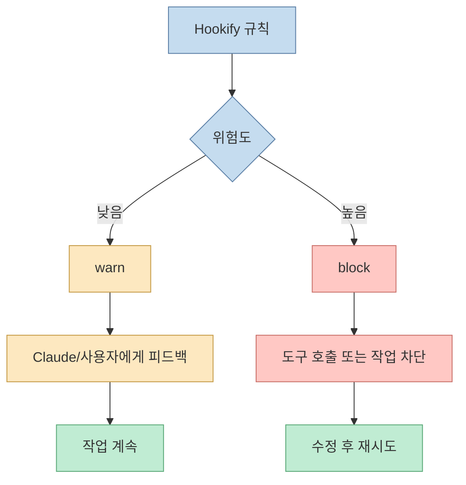
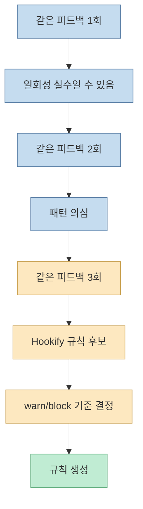
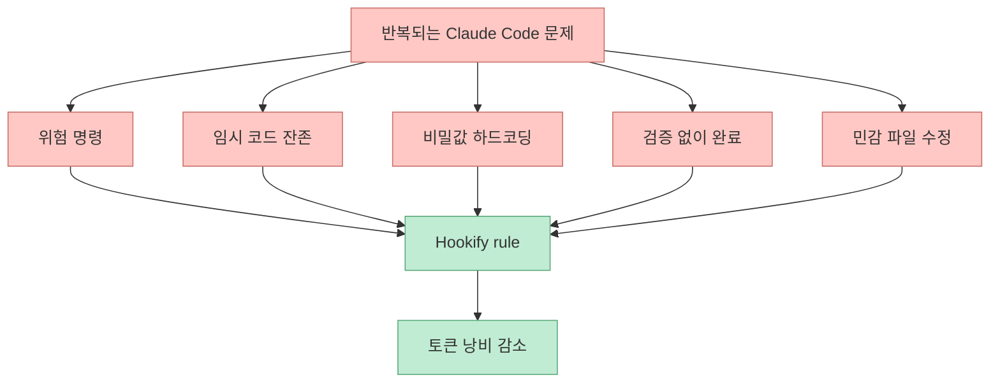

Claude Code가 같은 실수를 반복하면 보통 사용자는 더 길게 설명합니다. 하지만 하네스 엔지니어링 관점에서는 설명을 반복하는 대신, 그 실수가 다시 나오지 않도록 실행 환경을 바꿔야 합니다. 짐코딩 Shorts가 소개한 `Hookify`는 바로 이 문제를 다룹니다. Claude가 자주 하는 실수를 markdown 규칙과 hook으로 바꿔, 실수가 발생하기 전에 경고하거나 차단합니다. [0:00](https://youtu.be/96sPY1q7lMg?t=0)

<!--more-->

## Sources

- <https://youtube.com/shorts/96sPY1q7lMg?si=1oV1D4dQ5eUegftY>
- Hookify plugin page: <https://claude.com/plugins/hookify>
- Claude Code hooks guide: <https://docs.anthropic.com/en/docs/claude-code/hooks-guide>
- Claude Code hooks reference: <https://docs.anthropic.com/en/docs/claude-code/hooks>

## Hookify는 “프롬프트를 더 잘 쓰는 도구”가 아니다

영상은 Hookify를 "Claude가 자주 하는 실수를 사전에 막아주는 도구"라고 설명합니다. [0:05](https://youtu.be/96sPY1q7lMg?t=5) 공식 Hookify 페이지도 Hookify를 markdown 파일로 custom behavioral guardrails를 만들고, 위험한 bash command, production file의 debug code, hardcoded credentials 같은 원치 않는 행동을 경고하거나 차단하는 도구라고 설명합니다. [Hookify plugin page](https://claude.com/plugins/hookify)

중요한 점은 Hookify가 단순한 instruction이 아니라는 것입니다. "console.log 쓰지 마", "rm -rf 조심해", "비밀키 하드코딩하지 마"를 CLAUDE.md에 적어 두면 Claude가 기억하려고 노력합니다. 하지만 hook으로 만들면 특정 이벤트에서 deterministic하게 검사됩니다.

하네스 엔지니어링의 핵심은 여기 있습니다. AI에게 "다시는 실수하지 마"라고 부탁하는 대신, 실수가 통과할 수 없는 레일을 만듭니다.

## 하네스 엔지니어링: AI를 탓하지 말고 환경을 고친다

영상 설명란은 "AI가 실수하면 AI를 탓하지 말고, 그 실수가 다시 안 나오도록 환경을 고쳐라"는 문장을 인용합니다. 이 문장은 Hookify의 사용 이유를 잘 설명합니다. AI는 확률적으로 답을 생성하므로 같은 지시를 줘도 가끔 놓칠 수 있습니다. 그러면 사용자가 매번 같은 피드백을 반복하게 되고, 그만큼 토큰과 시간이 낭비됩니다.

영상도 같은 실수가 3번 반복되면 자동으로 패턴을 추출하고, 실수 발생 전 사전 차단해 토큰을 절약한다고 설명합니다. [0:25](https://youtu.be/96sPY1q7lMg?t=25)

이 흐름은 테스트 자동화와 비슷합니다. 버그를 한 번 발견하면 "다음부터 조심하자"가 아니라 regression test를 추가합니다. Hookify는 Claude Code 작업에서 이런 회귀 방지 규칙을 hooks로 바꾸는 도구입니다.

## Hookify가 만드는 규칙: markdown + YAML frontmatter + regex

공식 Hookify 페이지에 따르면 Hookify 규칙은 markdown 파일에 YAML frontmatter로 설정됩니다. regex pattern matching을 사용하고, bash commands, file edits, user prompts, session stops 같은 여러 event type에 걸 수 있습니다. 변경사항은 Claude를 재시작하지 않아도 즉시 적용됩니다. [Hookify plugin page](https://claude.com/plugins/hookify)

예를 들어 다음과 같은 행동을 규칙화할 수 있습니다.

- `rm -rf` 같은 위험한 shell command 경고
- production file에 `console.log` 남기기 차단
- `.env`, secret, API key를 코드에 직접 쓰는 행위 차단
- 특정 디렉터리 수정 전 확인 요구
- 세션 종료 전 테스트/빌드 실행 여부 확인

이 규칙들은 Claude의 기억에 의존하지 않습니다. event가 발생하면 hook이 검사합니다.

## Claude Code hooks와 Hookify의 차이

Claude Code hooks 자체는 user-defined shell command를 lifecycle의 특정 지점에서 실행하는 기능입니다. 공식 hooks guide는 hooks가 특정 행동을 항상 실행하게 만들어 LLM이 선택적으로 실행하기를 기대하지 않아도 된다고 설명합니다. 예시는 notification, automatic formatting, logging, automated feedback, custom permissions 등입니다. [Claude Code hooks guide](https://docs.anthropic.com/en/docs/claude-code/hooks-guide)

Hookify는 이 hooks 시스템을 더 쉽게 쓰게 해 줍니다. 사용자가 직접 hook script를 작성하지 않아도, 자연어로 규칙을 만들거나 최근 대화를 분석해 반복된 unwanted behavior를 hook rule로 바꿀 수 있습니다. 공식 페이지는 `/hookify Warn me when I use rm -rf commands`, `/hookify Don't use console.log in TypeScript files` 같은 사용 예를 제시합니다. [Hookify plugin page](https://claude.com/plugins/hookify)

즉 hooks는 엔진이고, Hookify는 반복 실수를 규칙으로 바꾸는 작성 도구입니다.

## warn과 block을 구분해야 한다

반복 실수를 모두 block하면 오히려 작업이 막힐 수 있습니다. 어떤 규칙은 경고만 하는 것이 좋고, 어떤 규칙은 반드시 차단해야 합니다.

Claude Code hooks reference는 hook output이 exit code나 JSON으로 Claude Code에 영향을 줄 수 있다고 설명합니다. 특히 exit code 2는 blocking error로 동작하며, `PreToolUse`에서는 tool call을 막고 stderr를 Claude에게 보여줍니다. [Claude Code hooks reference](https://docs.anthropic.com/en/docs/claude-code/hooks)

예를 들어 "commit message에 issue number가 빠졌다"는 warn이 적절할 수 있습니다. 반면 "production secret을 코드에 하드코딩하려 한다"는 block이 맞습니다. 좋은 하네스는 모든 행동을 막는 것이 아니라, 위험도에 따라 개입 강도를 조절합니다.

## 반복 실수 3번은 하네스 후보 신호다

영상 설명란은 "같은 실수 3번 반복되면 자동 패턴 추출"을 Hookify의 핵심 가치로 소개합니다. 실무에서도 이 기준은 유용합니다. 같은 피드백을 세 번 했다면, 그것은 더 이상 사람의 피드백으로 해결할 문제가 아니라 시스템 규칙으로 옮길 문제입니다.

이 기준을 쓰면 CLAUDE.md가 불필요하게 커지는 것도 막을 수 있습니다. 모든 주의사항을 memory file에 적는 대신, 실제로 반복된 문제만 hook rule로 승격합니다.

## Hookify가 특히 유용한 상황

Hookify는 모든 지침을 대체하지 않습니다. 하지만 다음 상황에서는 특히 강력합니다.

- Claude가 같은 금지 명령을 반복 실행하려는 경우
- debug code나 임시 코드를 production 파일에 남기는 경우
- secret, token, key를 코드에 직접 넣으려는 경우
- 테스트 없이 "완료"라고 말하는 경우
- 특정 파일/폴더는 수정 전 확인이 필요한 경우
- 팀 convention을 매번 다시 설명해야 하는 경우

이런 문제는 프롬프트로도 줄일 수 있지만, 프롬프트는 잊힐 수 있고 문맥에 묻힐 수 있습니다. hook은 이벤트에 붙어 있으므로 훨씬 더 안정적인 guardrail이 됩니다.

## 실전 적용 포인트

첫째, 처음부터 많은 규칙을 만들지 말아야 합니다. 너무 많은 hook은 작업 속도를 떨어뜨리고, Claude가 계속 차단되어 대화가 복잡해질 수 있습니다.

둘째, 실제로 반복된 실수만 규칙으로 만듭니다. 아직 발생하지 않은 가상의 위험을 모두 hook으로 만들면 하네스가 아니라 족쇄가 됩니다.

셋째, warn으로 시작하고 필요할 때 block으로 올립니다. 보안, 삭제, production 변경처럼 피해가 큰 행동은 처음부터 block이 맞지만, 스타일이나 convention은 warn이 더 적절할 수 있습니다.

넷째, 규칙 파일도 버전 관리해야 합니다. Hookify 규칙은 프로젝트의 개발 안전장치이므로 코드처럼 리뷰하고 변경 이력을 남기는 것이 좋습니다.

다섯째, Hookify를 CLAUDE.md와 함께 쓰되 역할을 나눕니다. CLAUDE.md는 "무엇을 해야 하는가"를 설명하고, Hookify는 "반드시 하지 말아야 할 행동"을 이벤트에서 잡습니다.

## 핵심 요약

- Hookify는 Claude Code의 반복 실수를 markdown rule과 hook으로 바꿔 사전에 경고하거나 차단하는 Anthropic verified 플러그인입니다. [Hookify plugin page](https://claude.com/plugins/hookify)
- 영상은 Hookify를 하네스 엔지니어링의 핵심 도구로 소개하며, Claude가 자주 하는 실수를 사전에 막는 도구라고 설명합니다. [0:05](https://youtu.be/96sPY1q7lMg?t=5)
- 같은 실수를 3번 반복하면 프롬프트를 더 쓰는 대신 패턴을 추출해 규칙으로 만들 후보입니다. [0:25](https://youtu.be/96sPY1q7lMg?t=25)
- Claude Code hooks는 deterministic lifecycle hook이고, Hookify는 이를 자연어/대화 분석 기반으로 쉽게 만들게 해 주는 작성 도구에 가깝습니다.
- 위험도에 따라 warn과 block을 구분해야 하며, 보안·삭제·production 변경은 block 후보입니다.
- 좋은 하네스는 AI를 탓하지 않고, 반복 실수가 다시 통과하지 못하도록 환경을 고칩니다.

## 결론

Claude Code의 반복 실수는 모델 성능 문제일 수도 있지만, 더 자주 볼 것은 환경 문제입니다. 같은 피드백을 계속 하고 있다면 그 피드백은 프롬프트가 아니라 하네스가 되어야 합니다.

Hookify는 이 전환을 쉽게 만듭니다. 대화에서 반복된 실수를 규칙으로 만들고, hook lifecycle에 연결해, 위험한 행동을 실행 전에 잡습니다. Claude에게 "다음부터 조심해"라고 말하는 대신, 다음부터 같은 실수가 지나갈 수 없도록 만드는 것. 그것이 Hookify가 하네스 엔지니어링 도구로 중요한 이유입니다.
