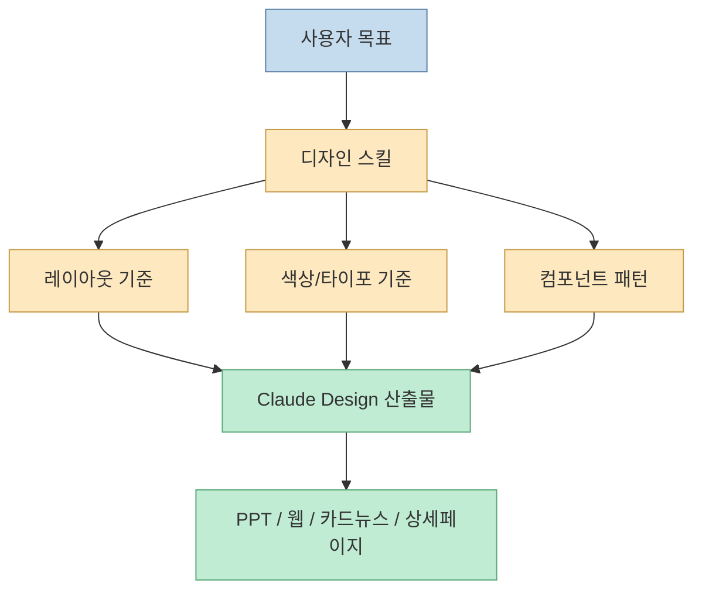
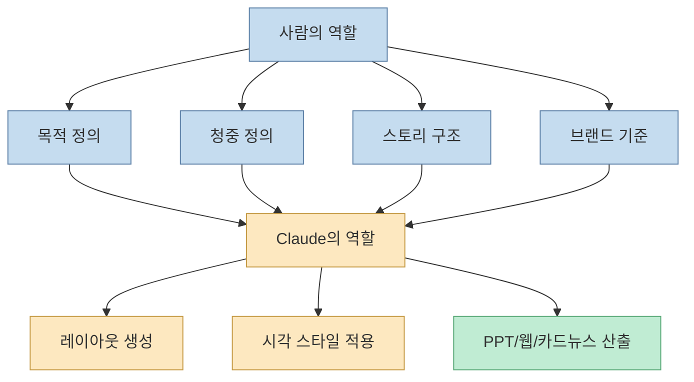
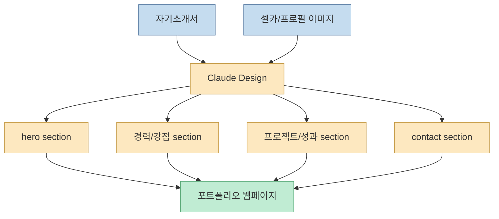
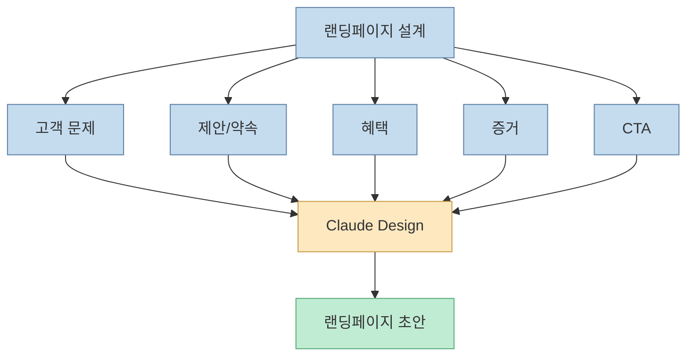
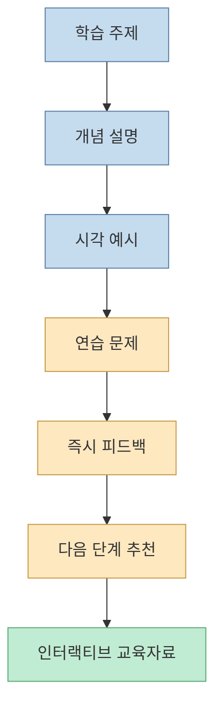
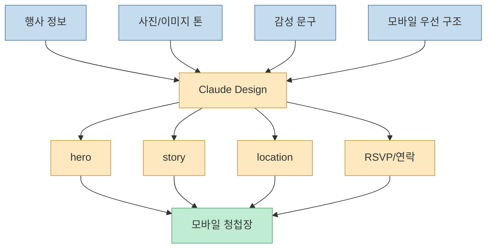
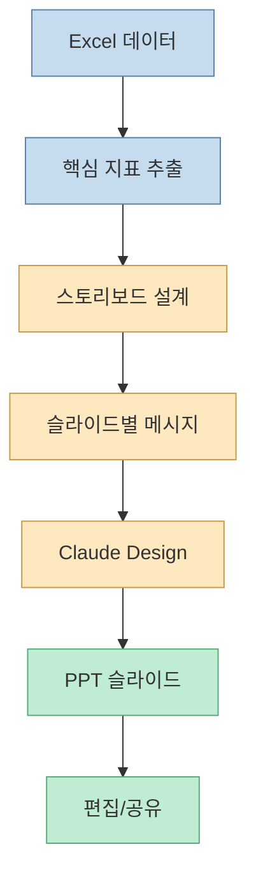
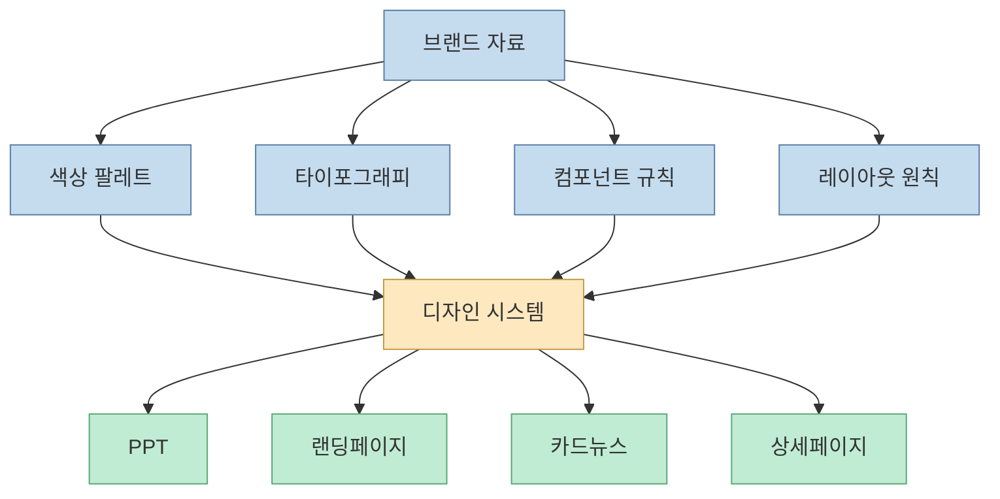
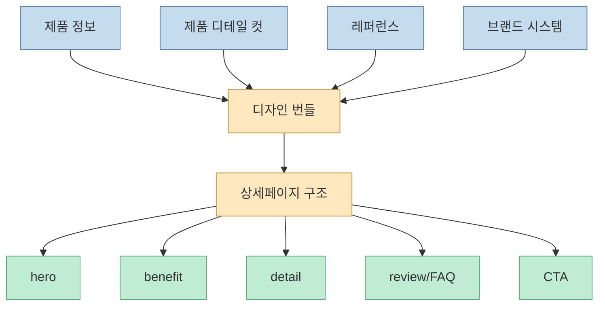

Claude Design의 실무 가치는 "예쁜 이미지 한 장"이 아닙니다. 오빠두엑셀 영상은 PPT 슬라이드, 웹사이트, 카드뉴스, 상세페이지, 모션 그래픽까지 Claude로 만들 수 있음을 보여주면서도, 핵심은 사람이 디자인 툴을 덜 만지는 대신 **목적, 구조, 브랜드 시스템을 더 잘 설계해야 한다** 는 점을 강조합니다. [0:00](https://youtu.be/VnMAgSd0BUg?t=0)

<!--more-->

## Sources

- <https://youtu.be/VnMAgSd0BUg?si=xESnr4ZIaTa78RjL>
- Claude official site: <https://claude.ai/>
- Anthropic Claude Code skills docs: <https://docs.claude.com/en/docs/claude-code/skills>
- Figma templates: <https://www.figma.com/templates/>

## Claude Design의 핵심: “스킬”과 “디자인”만 기억한다

영상은 Claude Design 공개와 구성요소를 소개한 뒤, 핵심을 "`스킬` + `디자인`"으로 정리합니다. [1:18](https://youtu.be/VnMAgSd0BUg?t=78) [4:12](https://youtu.be/VnMAgSd0BUg?t=252) [6:03](https://youtu.be/VnMAgSd0BUg?t=363)

여기서 스킬은 Claude가 특정 작업을 반복 가능하게 수행하도록 돕는 지침 묶음입니다. Anthropic 문서도 skills를 Claude가 특정 작업을 더 잘 수행하도록 하는 instruction, script, resource bundle로 설명합니다. 즉 Claude Design은 "Claude가 알아서 감각적으로 디자인한다"가 아니라, 디자인 작업을 위한 절차와 기준을 Claude에게 주입하는 방식에 가깝습니다. [Claude Code skills docs](https://docs.claude.com/en/docs/claude-code/skills)

따라서 실무자는 디자인 툴 조작보다 "무엇을 만들 것인지", "누구에게 보여 줄 것인지", "어떤 구조로 설득할 것인지"를 더 명확히 써야 합니다.

## 디자인은 AI에게 맡기고, 사람은 설계에 집중한다

영상은 8분대에서 "디자인은 AI에게 맡기고 설계에 집중하라"는 메시지를 제시합니다. [8:12](https://youtu.be/VnMAgSd0BUg?t=492) 이 말은 디자인이 중요하지 않다는 뜻이 아닙니다. 오히려 디자인 결과물을 만들기 위한 입력 설계가 더 중요해졌다는 뜻입니다.

PPT를 예로 들면, 사람이 해야 할 일은 슬라이드 박스 위치를 손으로 맞추는 것이 아닙니다. 발표 목적, 청중, 핵심 메시지, 슬라이드 흐름, 강조할 숫자, 브랜드 톤을 정해야 합니다. Claude는 그 설계를 바탕으로 시각 결과물을 만듭니다.

이 프레임으로 보면 Claude Design은 디자이너를 대체하는 버튼이 아니라, 디자인 작업의 병목을 "픽셀 조작"에서 "설계 품질"로 옮기는 도구입니다.

## 예제 1: 자기소개서와 셀카 1장으로 포트폴리오 페이지 만들기

영상은 자기소개서와 셀카 1장으로 포트폴리오 페이지를 만드는 예제를 보여줍니다. [11:33](https://youtu.be/VnMAgSd0BUg?t=693) 완성 결과물을 수정하는 4가지 방법과 무료 웹사이트로 만드는 흐름도 이어집니다. [15:54](https://youtu.be/VnMAgSd0BUg?t=954) [19:13](https://youtu.be/VnMAgSd0BUg?t=1153)

이 예제의 핵심은 Claude가 자기소개서의 내용 구조를 읽고, 인물 이미지와 함께 포트폴리오 페이지로 재구성한다는 점입니다. 사용자는 페이지 목적, 강조할 경력, 톤앤매너, 공개 범위를 정하고, Claude는 섹션과 시각 구성을 제안합니다.

실무에서는 이 흐름을 개인 브랜딩 페이지, 강사 소개 페이지, 프리랜서 제안 페이지로 확장할 수 있습니다.

## 예제 2: 실제 랜딩페이지 제작

영상은 Claude Design을 활용한 실제 랜딩페이지 제작 사례도 다룹니다. [22:01](https://youtu.be/VnMAgSd0BUg?t=1321) 랜딩페이지는 디자인보다 전환 구조가 중요합니다. 즉 "예쁜 페이지"보다 "누가, 왜, 무엇을 클릭하게 할 것인가"가 먼저입니다.

Claude에게 랜딩페이지를 맡길 때는 다음 요소를 입력해야 합니다.

- 타깃 고객
- 고객의 문제
- 제품/서비스의 약속
- 핵심 혜택 3개
- 사회적 증거
- CTA
- 브랜드 톤

이 흐름은 마케팅 팀, 1인 사업자, 강의/서비스 판매 페이지 제작에 특히 유용합니다.

## 예제 3: 인터랙티브 교육자료 만들기

영상은 중고등학생 학습에 쓰는 인터랙티브 교육자료 예제도 보여줍니다. [23:47](https://youtu.be/VnMAgSd0BUg?t=1427)

교육자료는 정보 전달보다 상호작용이 중요합니다. 개념 설명, 예제, 퀴즈, 피드백, 시각화가 연결되어야 학습 효과가 납니다. Claude Design은 이 구조를 웹 기반 인터랙티브 자료로 바꿀 수 있습니다.

실무적으로는 사내 교육, 고객 온보딩, 강의 보조 자료, 퀴즈형 콘텐츠 제작에도 쓸 수 있습니다.

## 예제 4: 모바일 청첩장과 감성형 웹페이지

영상은 애플 감성의 고퀄리티 모바일 청첩장을 만드는 예제도 소개합니다. [26:26](https://youtu.be/VnMAgSd0BUg?t=1586) 여기서 핵심은 기능보다 감성입니다. 청첩장은 정보 페이지이면서 동시에 분위기와 스토리를 전달해야 합니다.

Claude에게 이런 작업을 맡길 때는 행사 정보만 주면 부족합니다. 원하는 분위기, 색감, 사진 톤, 문장 톤, 스크롤 흐름, 모바일 우선 레이아웃을 함께 줘야 합니다.

이 패턴은 초대장, 이벤트 페이지, 브랜드 스토리 페이지에도 그대로 응용할 수 있습니다.

## 예제 5: 엑셀에서 PPT로, 스토리보드부터 자동화한다

영상은 엑셀 데이터를 PPT로 자동 제작하는 스토리보드 설계를 다룹니다. [27:14](https://youtu.be/VnMAgSd0BUg?t=1634) 이후 모션 그래픽이 적용된 PPT 슬라이드, 편집과 공유 방법까지 이어집니다. [30:28](https://youtu.be/VnMAgSd0BUg?t=1828) [32:52](https://youtu.be/VnMAgSd0BUg?t=1972)

이 흐름의 핵심은 데이터를 바로 슬라이드로 바꾸지 않는 것입니다. 먼저 스토리보드를 설계합니다. 어떤 지표를 어떤 순서로 보여 줄지, 각 슬라이드의 메시지는 무엇인지, 어떤 차트를 써야 하는지 정한 뒤 Claude가 디자인을 입힙니다.

PPT 자동화에서 자주 하는 실수는 데이터를 모두 넣으려는 것입니다. 좋은 자동화는 데이터를 줄이고, 메시지를 명확히 한 뒤, 시각화를 붙입니다.

## 예제 6: 회사 고유 브랜드 디자인 시스템 만들기

영상은 회사 고유 브랜드를 담은 디자인 시스템을 만드는 부분을 길게 다룹니다. [33:58](https://youtu.be/VnMAgSd0BUg?t=2038) 이후 기존 PPT 슬라이드에 디자인 시스템을 적용하고, PPT로 받아 편집하는 흐름도 나옵니다. [39:52](https://youtu.be/VnMAgSd0BUg?t=2392) [41:20](https://youtu.be/VnMAgSd0BUg?t=2480)

디자인 시스템은 Claude Design 실무 활용의 핵심입니다. 한 번만 예쁘게 만드는 것이 아니라, 다음 산출물에도 같은 브랜드 톤이 유지되도록 색상, 폰트, 컴포넌트, 레이아웃 규칙을 정의합니다.

즉 Claude Design을 실무에 쓰려면 매번 "예쁘게 만들어줘"라고 하지 말고, 우리 회사의 디자인 시스템을 먼저 만들어야 합니다.

## 예제 7: 상세페이지와 카드뉴스 자동화

영상 후반은 상세페이지/카드뉴스 제작 레퍼런스를 준비하고, 디자인 번들 템플릿을 만들고, 제품 디테일 컷 이미지로 상세페이지를 완성하는 흐름을 다룹니다. [45:28](https://youtu.be/VnMAgSd0BUg?t=2728) [48:28](https://youtu.be/VnMAgSd0BUg?t=2908) [50:54](https://youtu.be/VnMAgSd0BUg?t=3054)

상세페이지 자동화의 핵심은 제품 이미지 하나가 아니라 디자인 번들입니다. 제품 정보, 타깃 고객, 구매 이유, 상세 컷, 비교표, FAQ, 리뷰, CTA, 브랜드 시스템이 함께 들어가야 합니다.

이 흐름은 쇼핑몰 상세페이지뿐 아니라 카드뉴스, 광고 소재, SNS 콘텐츠 묶음 제작에도 응용할 수 있습니다.

## 실전 적용 포인트

첫째, Claude에게 "PPT 만들어줘"라고 하지 말고 먼저 스토리보드를 요구합니다. 슬라이드 목적과 메시지가 없으면 디자인만 예쁘고 설득력이 약한 결과가 나옵니다.

둘째, 반복 산출물이 있다면 디자인 시스템부터 만듭니다. 회사 소개서, 제안서, 카드뉴스, 상세페이지가 모두 따로 놀지 않게 됩니다.

셋째, 이미지나 템플릿은 단순 첨부가 아니라 레퍼런스 역할로 설명해야 합니다. "이 느낌을 유지하되 우리 브랜드 색상으로 바꿔라"처럼 기준을 줘야 합니다.

넷째, 완성물을 그대로 쓰기보다 수정 루프를 준비합니다. 영상도 완성 결과물을 편리하게 수정하는 방법을 별도 구간으로 다룹니다. [15:54](https://youtu.be/VnMAgSd0BUg?t=954)

다섯째, AI가 만든 PPT나 웹페이지는 공유 전 사람이 검수해야 합니다. 문장 사실성, 저작권, 브랜드 일관성, 모바일 표시, 링크 동작, 개인정보 포함 여부를 확인해야 합니다.

## 핵심 요약

- Claude Design은 PPT, 웹사이트, 카드뉴스, 상세페이지, 모션 그래픽까지 실무 디자인 산출물 제작에 활용할 수 있습니다. [0:00](https://youtu.be/VnMAgSd0BUg?t=0)
- 핵심은 `스킬`과 `디자인`입니다. Claude에게 디자인 기준과 절차를 주입해야 반복 가능한 결과가 나옵니다. [6:03](https://youtu.be/VnMAgSd0BUg?t=363)
- 사람은 디자인 조작보다 목적, 청중, 구조, 브랜드 시스템 설계에 집중해야 합니다. [8:12](https://youtu.be/VnMAgSd0BUg?t=492)
- 자기소개서와 셀카로 포트폴리오 페이지를 만들고, 무료 웹사이트로 확장할 수 있습니다. [11:33](https://youtu.be/VnMAgSd0BUg?t=693) [19:13](https://youtu.be/VnMAgSd0BUg?t=1153)
- 엑셀 데이터를 바로 PPT로 바꾸지 말고 스토리보드부터 설계해야 합니다. [27:14](https://youtu.be/VnMAgSd0BUg?t=1634)
- 회사 고유 디자인 시스템을 만들면 PPT, 랜딩페이지, 카드뉴스, 상세페이지에 같은 브랜드 톤을 적용할 수 있습니다. [33:58](https://youtu.be/VnMAgSd0BUg?t=2038)

## 결론

Claude Design은 PPT와 Canva를 완전히 대체하는 버튼이라기보다, 실무 디자인 산출물의 제작 방식을 바꾸는 도구입니다. 사람이 직접 모든 요소를 배치하던 방식에서, 목적과 구조와 브랜드 기준을 설계하고 AI가 시각 결과물을 생성하는 방식으로 이동합니다.

그래서 실무자가 익혀야 할 것은 더 복잡한 디자인 툴 조작이 아닙니다. 좋은 스토리보드, 좋은 디자인 시스템, 좋은 레퍼런스 설명, 좋은 수정 피드백입니다. 이 네 가지가 있으면 Claude Design은 PPT, 웹사이트, 카드뉴스, 상세페이지 제작을 훨씬 빠르고 일관되게 만들어 줍니다.
