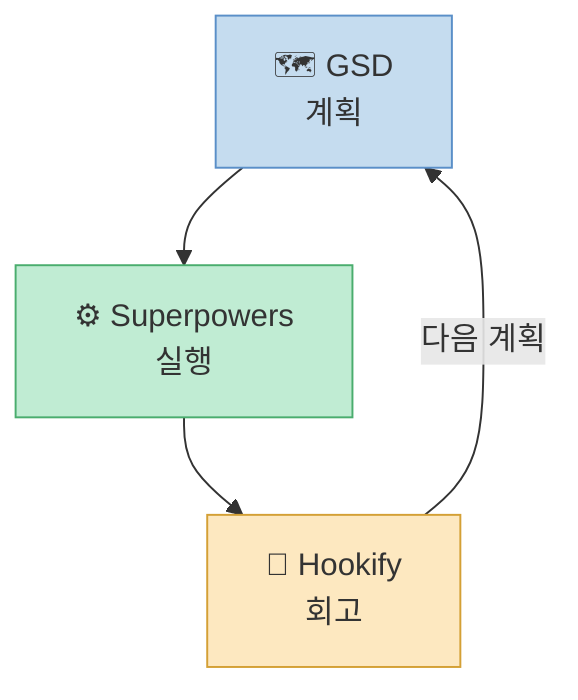
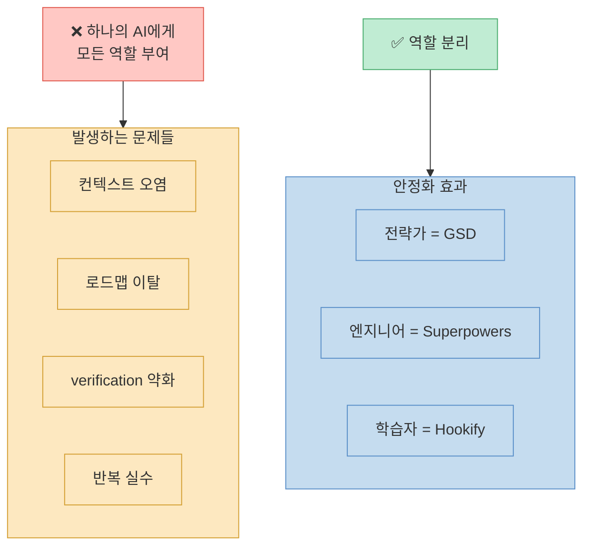
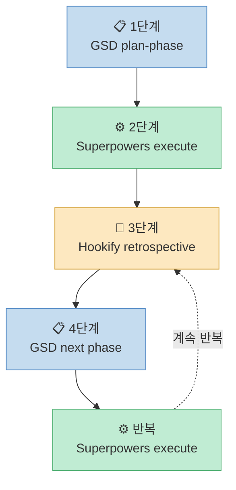
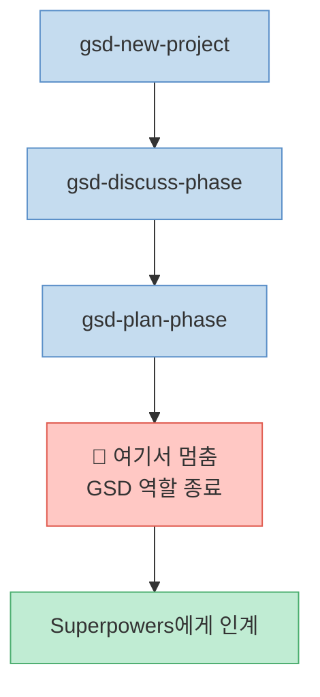
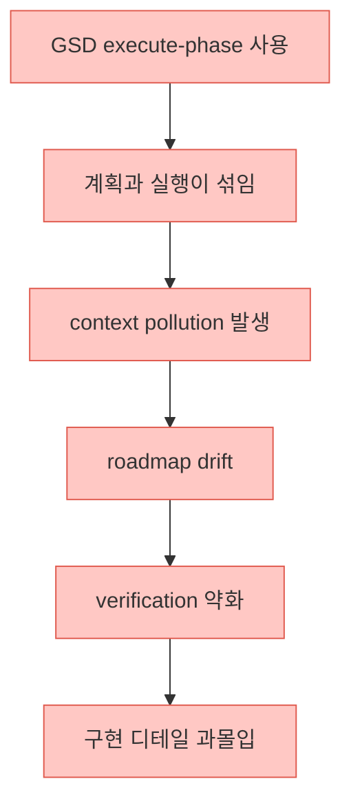
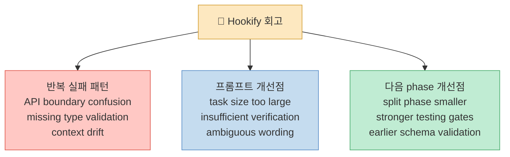
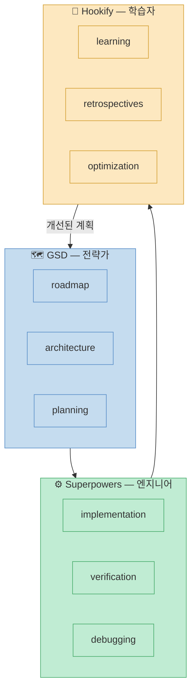

AI 코딩 도구를 오래 써 보면 결국 같은 문제를 만나게 됩니다.

- 계획은 잘 나오는데 실행이 불안정하다
- 구현은 빨리 되는데 방향이 흔들린다
- 같은 실수를 반복한다
- AI가 점점 프로젝트 컨텍스트를 잃는다
- 프롬프트가 길어질수록 품질이 무너진다

특히 Claude Code, Codex, Cursor 같은 AI 에이전트 기반 개발을 하다 보면 "계획", "실행", "회고"를 하나의 도구에게 모두 맡기는 순간 품질이 급격히 흔들리기 시작합니다.

그래서 최근에는 역할을 명확하게 분리한 워크플로우를 사용하고 있습니다.



이 구조가 장기 프로젝트에서 반복 실수를 크게 줄여줬습니다.

<!--more-->

## 왜 역할 분리가 중요한가?

AI 개발 도구는 각각 강점이 다릅니다.

GSD는 프로젝트 구조화와 phase 설계에 강합니다. 반면 실제 구현 단계에서는 테스트, verification, incremental commit, task execution discipline 같은 부분이 더 중요해집니다. 여기서는 Superpowers가 훨씬 안정적입니다.

그리고 대부분 사람들이 놓치는 부분이 있습니다. 바로 **회고(retrospective)** 입니다.

AI 워크플로우에서 가장 중요한 건 사실 **같은 실패를 반복하지 않는 것** 입니다. 이걸 담당하는 게 Hookify입니다.



---

## 각 도구의 역할

### 1. GSD — 프로젝트 설계 담당

GSD는 아래 역할만 맡깁니다.

- requirements
- architecture
- roadmap
- phase decomposition

즉 무엇을 만들지, 어떤 순서로 만들지, phase를 어떻게 나눌지까지만 담당합니다.

중요한 건 **실행권을 오래 주지 않는 것** 입니다.

### 2. Superpowers — 구현 및 검증 담당

Superpowers는 실행 discipline이 강합니다.

- 계획 비판 검토
- task 단위 실행
- verification
- incremental changes
- debugging discipline

**어떻게 안전하게 구현할 것인가** 를 담당합니다.

### 3. Hookify — 회고 및 메타 학습 담당

역할은:

- retrospective
- pattern extraction
- workflow optimization
- prompt improvement
- failure analysis

**이번 작업에서 무엇을 배웠는가** 를 담당합니다.

---

## 전체 워크플로우

핵심은 **계획 → 실행 → 학습 → 다음 계획** 루프를 만드는 것입니다.



---

## 실제 사용 흐름

### 1단계 — GSD로 계획 생성

먼저 코드베이스를 분석합니다.

```bash
/gsd-map-codebase
```

그 다음 프로젝트 생성:

```bash
/gsd-new-project
```

이후 phase별 논의:

```bash
/gsd-discuss-phase 1
```

그리고 실행 계획 생성:

```bash
/gsd-plan-phase 1
```

여기서 가장 중요합니다.

> **반드시 여기서 멈춥니다.**<br>
> `plan-phase` 완료 직후가 가장 좋은 절단점입니다.

많은 사람들이 여기서 실수합니다. `new-project` 이후 계속 진행하도록 놔두면 GSD가 실행까지 관여하면서:

- 컨텍스트가 길어지고
- 실행 품질이 흔들리고
- verification discipline이 약해지고
- 구조보다 구현 디테일에 빨려 들어가기 시작합니다.



### 2단계 — Superpowers로 실행

이제 GSD가 만든 phase plan을 기반으로 Superpowers에게 실행을 맡깁니다.

```text
Use superpowers:executing-plans.

Read the GSD phase 1 plan.

Before coding:
- critique the plan
- identify ambiguities
- identify architectural risks
- improve task ordering if necessary

Then:
- execute task-by-task
- verify each task
- run tests after every meaningful change
- commit incrementally

Do not use GSD execute-phase.
```

이 흐름의 장점은 GSD는 방향 유지, Superpowers는 실행 안정성 유지를 각각 담당하게 된다는 점입니다.

### 왜 GSD Execute를 쓰지 않는가?

물론 써도 됩니다. 하지만 장기 프로젝트에서는 보통 아래 문제가 생깁니다.



반면 역할을 분리하면 GSD는 전략가, Superpowers는 엔지니어 구조가 되면서 훨씬 안정적입니다.

### 3단계 — Hookify로 회고

Superpowers 실행이 끝나면 바로 Hookify 회고를 진행합니다.

```text
Use Hookify retrospective mode.

Analyze the completed implementation session.

Identify:
- what worked well
- what caused friction
- architectural mistakes
- unnecessary complexity
- repeated prompting patterns
- missing requirements from GSD
- verification gaps
- debugging bottlenecks

Then produce:
1. lessons learned
2. reusable workflow improvements
3. prompt improvements
4. coding standards updates
5. recommendations for the next phase
```

---

## Hookify에서 꼭 추출해야 하는 것

회고에서 특히 중요한 3가지입니다.



---

## 추천 디렉토리 구조

```text
.ai/
  gsd/
    roadmap.md
    phases/

  superpowers/
    execution-logs/
    verification/

  hookify/
    retrospectives/
    lessons/
    prompt-patterns/
```

이렇게 분리하면 컨텍스트 관리가 쉬워지고, 실패 패턴 재사용이 가능하며, 다음 프로젝트 품질도 계속 올라갑니다.

---

## 정리

이 워크플로우의 핵심은 **하나의 AI에게 모든 역할을 맡기지 않는 것** 입니다.



AI 개발 도구를 오래 쓰다 보면 결국 중요한 건 더 강한 모델이 아니라 **더 좋은 workflow** 라는 걸 느끼게 됩니다.

특히 장기 프로젝트에서는 계획, 실행, 회고를 분리하는 순간 품질이 급격히 안정되기 시작합니다.

만약 지금 AI가 점점 산으로 가고, 같은 버그를 반복하고, phase가 길어질수록 품질이 무너지는 문제를 겪고 있다면 한 번쯤 `GSD + Superpowers + Hookify` 구조를 시도해 보는 걸 추천합니다.
