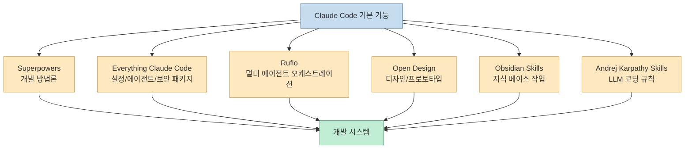
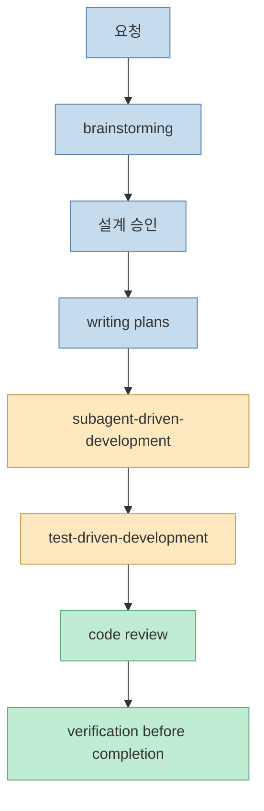
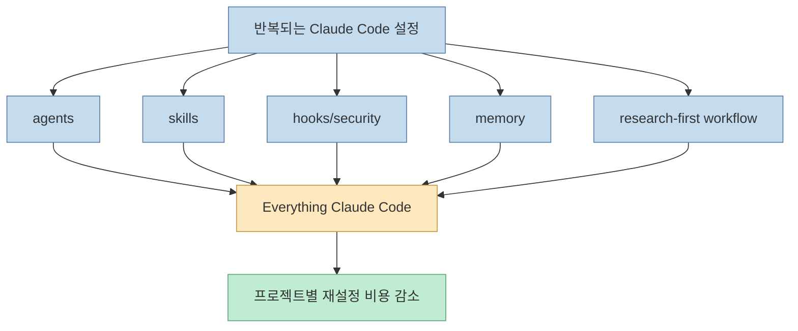
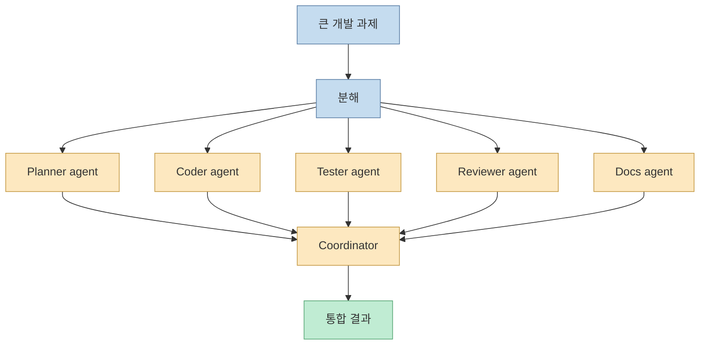
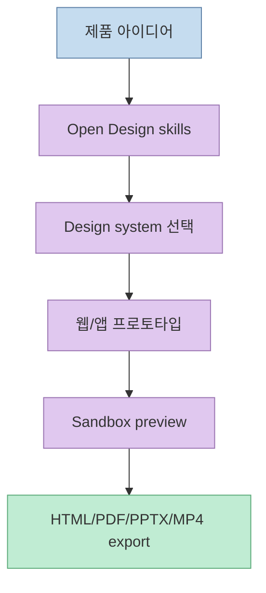
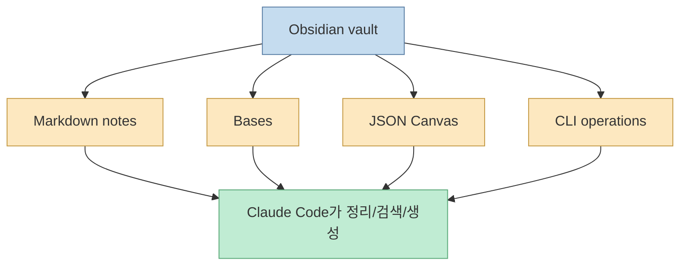
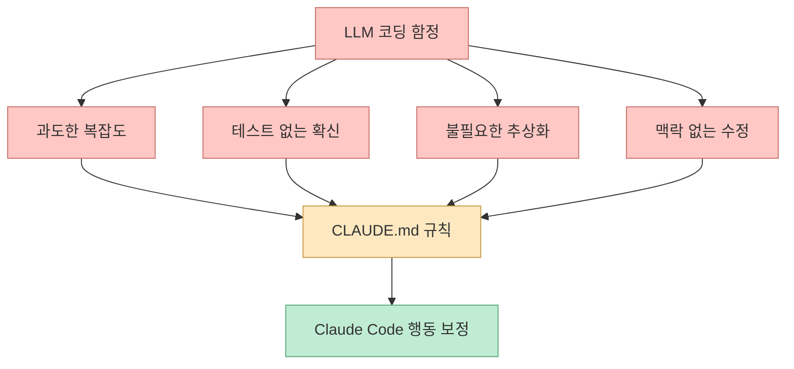
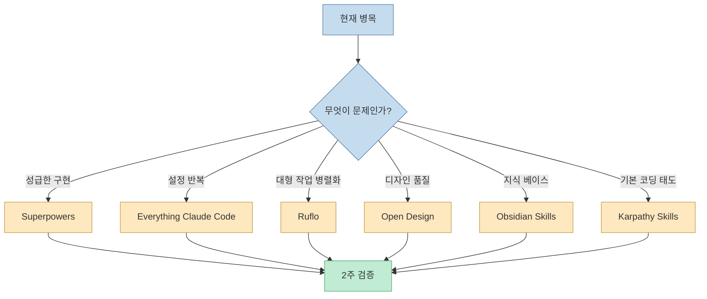
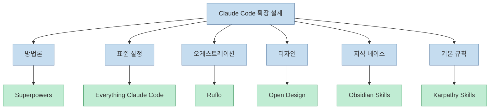

Claude Code는 기본 상태에서도 좋은 개발 도구입니다. 하지만 영상의 메시지는 명확합니다. 그냥 쓰면 "멋진 자동완성"에 머물 수 있고, 검증된 저장소와 플러그인 레이어를 쌓으면 계획·검증·메모리·디자인·멀티 에이전트까지 갖춘 개발 시스템이 됩니다. 영상 제목은 `Top 5`지만, 설명란과 본문 흐름은 실제로 6개 저장소를 다룹니다. [0:00](https://youtu.be/L2JKgj7WzU4?t=0)

<!--more-->

## Sources

- <https://youtu.be/L2JKgj7WzU4?si=oNpRCQtM3caMsVTE>
- Superpowers: <https://github.com/obra/superpowers>
- Everything Claude Code: <https://github.com/affaan-m/everything-claude-code>
- Ruflo: <https://github.com/ruvnet/ruflo>
- Open Design: <https://github.com/nexu-io/open-design>
- Obsidian Skills: <https://github.com/kepano/obsidian-skills>
- Andrej Karpathy Skills: <https://github.com/multica-ai/andrej-karpathy-skills>

## 전체 관점: Claude Code 위에 운영 레이어를 쌓는다

영상은 대부분의 사용자가 Claude Code를 "fancy autocomplete"처럼 쓰지만, 실제로 ship하는 사람들은 여섯 개 저장소를 얹어 쓴다고 말합니다. [0:00](https://youtu.be/L2JKgj7WzU4?t=0) 이 표현은 과장이 섞여 있지만 방향은 맞습니다. Claude Code의 진짜 생산성은 단일 프롬프트가 아니라, 반복 가능한 개발 루프에서 나옵니다.

여섯 저장소는 서로 다른 레이어를 맡습니다.

즉 이 목록은 "좋은 GitHub repo 모음"이 아니라, Claude Code에 빠진 운영 레이어를 보완하는 지도입니다.

## 1. Superpowers: 성급한 구현을 막는 개발 방법론

첫 번째 추천은 `Superpowers`입니다. 영상은 Superpowers를 첫 번째 저장소로 소개하고, 설치와 추천 이유를 길게 다룹니다. [0:33](https://youtu.be/L2JKgj7WzU4?t=33) [1:52](https://youtu.be/L2JKgj7WzU4?t=112) [3:26](https://youtu.be/L2JKgj7WzU4?t=206)

Superpowers README는 이를 "coding agents를 위한 complete software development methodology"라고 설명합니다. 핵심은 Claude가 바로 코드를 쓰지 않고, 먼저 요구사항을 질문하고, 설계를 나누어 보여주고, 구현 계획을 만들고, subagent-driven development와 TDD, 리뷰, 검증을 거치게 만드는 것입니다. [Superpowers GitHub](https://github.com/obra/superpowers)

Superpowers가 중요한 이유는 기능이 많아서가 아닙니다. Claude Code가 가장 자주 실패하는 지점, 즉 "요구사항을 대충 추정하고 바로 수정하는 습관"을 막기 때문입니다.

## 2. Everything Claude Code: 매번 새로 만드는 설정 레이어를 패키지화한다

두 번째 저장소는 `Everything Claude Code`입니다. 영상은 5:45부터 이 저장소를 소개하고, 7:39에 설치 흐름을 다룹니다. [5:45](https://youtu.be/L2JKgj7WzU4?t=345) [7:39](https://youtu.be/L2JKgj7WzU4?t=459)

Everything Claude Code README는 이 프로젝트를 Claude Code, Codex, OpenCode, Cursor를 위한 "agent harness performance optimization system"으로 설명합니다. skills, instincts, memory, security, research-first development를 묶어 제공하는 구성입니다. [Everything Claude Code GitHub](https://github.com/affaan-m/everything-claude-code)

이 저장소가 해결하는 문제는 표준화입니다. Claude Code를 여러 프로젝트에서 쓰다 보면 같은 hooks, memory, security rules, agent definitions를 반복해서 만들게 됩니다. Everything Claude Code는 그 반복 설정을 하나의 패키지 레이어로 모으려는 시도입니다.

## 3. Ruflo: 큰 프로젝트에서 멀티 에이전트 오케스트레이션을 쓴다

세 번째 저장소는 `Ruflo`입니다. 영상은 8:40부터 Ruflo를 소개하고, 10:50에서 advanced project에 적합한 상황을 설명합니다. [8:40](https://youtu.be/L2JKgj7WzU4?t=520) [10:50](https://youtu.be/L2JKgj7WzU4?t=650)

Ruflo GitHub 설명은 이를 Claude용 agent orchestration platform으로 소개합니다. multi-agent swarms, autonomous workflows, self-learning swarm intelligence, RAG integration, native Claude Code/Codex integration을 내세웁니다. [Ruflo GitHub](https://github.com/ruvnet/ruflo)

Ruflo는 모든 프로젝트에 필요한 도구는 아닙니다. 작은 수정이나 단일 파일 작업에는 오버킬입니다. 하지만 큰 리팩터링, 테스트 보강, 문서화, 보안 점검이 동시에 필요한 프로젝트에서는 역할을 나누는 멀티 에이전트 구조가 유리할 수 있습니다.

## 4. Open Design: Claude Code에 디자인 감각과 산출물 파이프라인을 붙인다

네 번째 저장소는 `Open Design`입니다. 영상은 11:35부터 이를 소개하고 14:07에 설치를 다룹니다. [11:35](https://youtu.be/L2JKgj7WzU4?t=695) [14:07](https://youtu.be/L2JKgj7WzU4?t=847)

Open Design README는 이 프로젝트를 Anthropic Claude Design의 local-first, open-source alternative로 소개합니다. 19 skills, 71 brand-grade design systems, web/desktop/mobile prototypes, slides, images, videos, HyperFrames, sandboxed preview, HTML/PDF/PPTX/MP4 export를 지원한다고 설명합니다. 또한 Claude Code, Codex, Cursor, Gemini, OpenCode, Qwen, Copilot, Hermes, Kimi CLI에서 동작한다고 소개합니다. [Open Design GitHub](https://github.com/nexu-io/open-design)

Claude Code의 기본 약점 중 하나는 "기능은 만들지만 제품처럼 보이지 않는다"는 점입니다. Open Design은 이 약점을 디자인 시스템, preview, export workflow로 보완합니다.

## 5. Obsidian Skills: Claude Code가 지식 베이스를 직접 다루게 한다

다섯 번째 저장소는 `Obsidian Skills`입니다. 영상은 16:08부터 소개하고, 17:49에서 Obsidian + Claude Code가 잘 맞는 이유를 설명합니다. [16:08](https://youtu.be/L2JKgj7WzU4?t=968) [17:49](https://youtu.be/L2JKgj7WzU4?t=1069)

Obsidian Skills README는 이 저장소를 "Agent skills for Obsidian"이라고 설명합니다. agent에게 Markdown, Bases, JSON Canvas, CLI 사용법을 가르쳐 Obsidian vault를 다루게 하는 스킬 모음입니다. [Obsidian Skills GitHub](https://github.com/kepano/obsidian-skills)

Claude Code가 코드만 다루는 도구라면 작업 맥락이 세션 밖으로 흩어집니다. Obsidian Skills는 프로젝트 메모, 의사결정, 연구 자료, 회의록 같은 지식 베이스를 agent workflow 안으로 끌어옵니다.

## 6. Andrej Karpathy Skills: LLM 코딩의 함정을 규칙으로 고정한다

여섯 번째 저장소는 `Andrej Karpathy Skills`입니다. 영상은 18:07부터 소개하고, 19:27에 설치를 다룹니다. [18:07](https://youtu.be/L2JKgj7WzU4?t=1087) [19:27](https://youtu.be/L2JKgj7WzU4?t=1167)

저장소 설명은 이를 Andrej Karpathy의 LLM coding pitfalls 관찰에서 파생된 단일 `CLAUDE.md` 파일이라고 소개합니다. Claude Code behavior를 개선하기 위한 guidelines 성격입니다. [Andrej Karpathy Skills GitHub](https://github.com/multica-ai/andrej-karpathy-skills)

이 저장소의 가치는 복잡한 플러그인보다 "좋은 기본 태도"에 있습니다. Claude가 구현 전에 생각하고, 단순한 해결책을 선호하고, 검증 없이 완료를 선언하지 않도록 기본 프롬프트 레이어를 제공합니다.

## 여섯 저장소를 한 번에 다 설치해야 할까?

영상은 20:21에 전체 요약을 합니다. [20:21](https://youtu.be/L2JKgj7WzU4?t=1221) 하지만 실전에서는 여섯 저장소를 한 번에 다 설치하는 것보다, 자신의 병목에 맞춰 하나씩 붙이는 편이 안전합니다.

기준은 단순합니다. Claude Code가 바로 코딩부터 해서 문제라면 Superpowers, 프로젝트마다 설정을 반복한다면 Everything Claude Code, 큰 작업을 병렬화해야 한다면 Ruflo, 디자인 품질이 부족하다면 Open Design, 지식 관리가 병목이라면 Obsidian Skills, 기본 코딩 규율이 부족하다면 Karpathy Skills를 먼저 봅니다.

## 조합의 핵심: 겹치는 기능보다 역할 분리

이런 저장소를 여러 개 쓰면 기능이 겹칠 수 있습니다. 예를 들어 Superpowers와 Everything Claude Code 모두 skills와 workflow를 다루고, Karpathy Skills도 Claude의 기본 행동을 바꾸려 합니다. 따라서 중요한 것은 많이 설치하는 것이 아니라 역할을 분리하는 것입니다.

역할이 겹치면 Claude에게 서로 다른 지침이 동시에 들어갑니다. 이때는 "이 프로젝트에서 최상위 방법론은 무엇인가?", "어떤 저장소가 memory를 소유하는가?", "디자인 지침은 어디서 오는가?"를 명확히 정해야 합니다.

## 실전 적용 포인트

첫째, 첫 설치는 Superpowers나 Karpathy Skills처럼 행동 규율을 잡는 쪽부터 시작하는 것이 좋습니다. 구현 속도보다 작업 품질이 먼저 안정됩니다.

둘째, Everything Claude Code나 Ruflo처럼 큰 패키지는 프로젝트 규모가 커졌을 때 검토합니다. 작은 프로젝트에 너무 큰 orchestration layer를 붙이면 오히려 복잡해질 수 있습니다.

셋째, Open Design은 프론트엔드나 랜딩 페이지 작업이 많을 때 가치가 큽니다. 백엔드 중심 프로젝트라면 우선순위가 낮을 수 있습니다.

넷째, Obsidian Skills는 이미 Obsidian vault를 쓰거나, 프로젝트 지식을 장기적으로 쌓는 팀에 적합합니다. 노트가 없다면 먼저 지식 관리 습관부터 만들어야 합니다.

다섯째, 여러 저장소를 섞을 때는 CLAUDE.md, skills, hooks, agents의 소유권을 명확히 해야 합니다. 그렇지 않으면 좋은 도구들이 서로 지시를 덮어쓸 수 있습니다.

## 핵심 요약

- 영상은 Claude Code를 단순 자동완성 도구가 아니라 개발 시스템으로 바꾸는 6개 GitHub 저장소를 소개합니다. [0:00](https://youtu.be/L2JKgj7WzU4?t=0)
- `Superpowers`는 planning, TDD, subagent-driven development, review 같은 개발 방법론 레이어입니다. [0:33](https://youtu.be/L2JKgj7WzU4?t=33)
- `Everything Claude Code`는 skills, agents, memory, security, research-first workflow를 패키지화하는 설정 레이어입니다. [5:45](https://youtu.be/L2JKgj7WzU4?t=345)
- `Ruflo`는 큰 프로젝트에서 multi-agent orchestration을 쓰기 위한 레이어입니다. [8:40](https://youtu.be/L2JKgj7WzU4?t=520)
- `Open Design`은 디자인 시스템, prototype, preview, export를 Claude Code workflow에 붙이는 디자인 레이어입니다. [11:35](https://youtu.be/L2JKgj7WzU4?t=695)
- `Obsidian Skills`는 Claude Code가 Obsidian vault와 Markdown/Bases/Canvas를 다루게 하는 지식 관리 레이어입니다. [16:08](https://youtu.be/L2JKgj7WzU4?t=968)
- `Andrej Karpathy Skills`는 LLM coding pitfalls를 기본 규칙으로 고정하는 CLAUDE.md 기반 행동 보정 레이어입니다. [18:07](https://youtu.be/L2JKgj7WzU4?t=1087)

## 결론

Claude Code를 잘 쓰는 방법은 프롬프트를 더 길게 쓰는 것이 아닙니다. 반복 가능한 개발 레이어를 쌓는 것입니다. 요구사항을 정리하고, 계획을 만들고, 병렬 작업을 나누고, 디자인을 보강하고, 지식을 저장하고, 코딩 규칙을 고정하는 레이어가 필요합니다.

다만 여섯 저장소를 한 번에 모두 설치하는 것이 정답은 아닙니다. 자신의 병목을 먼저 보고 하나씩 검증해야 합니다. 좋은 Claude Code setup은 많은 저장소의 집합이 아니라, **각 저장소가 맡는 역할이 명확한 개발 시스템** 입니다.
