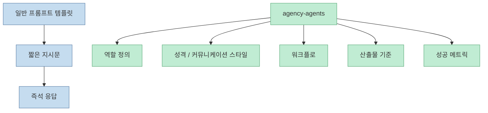
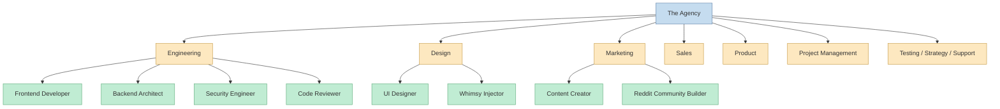
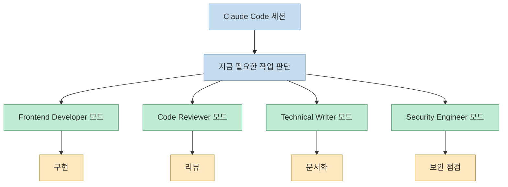
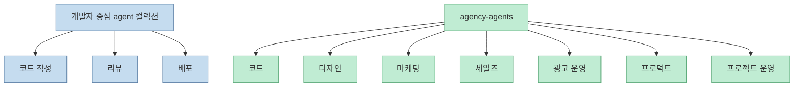
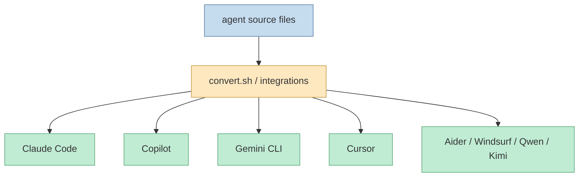
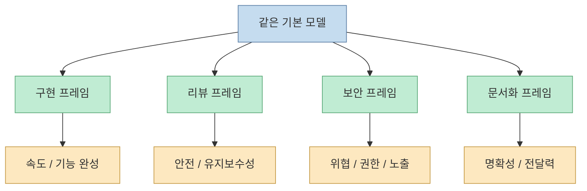
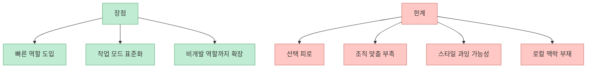

`agency-agents`가 빠르게 퍼진 이유는 단순히 "에이전트가 많다"가 아닙니다. 이 저장소는 AI를 범용 채팅 상대로 두지 않고, **Frontend Developer, Reddit Community Builder, Whimsy Injector, Code Reviewer 같은 역할 단위의 전문 인력 roster** 로 배포합니다. 즉 프롬프트 템플릿 묶음보다, 작은 디지털 에이전시의 조직도를 설치하는 경험에 가깝습니다. 저장소 README는 이것을 "A complete AI agency at your fingertips"라고 설명하고, Claude Code를 기본 추천 도구로 두면서 Copilot, Gemini CLI, Cursor, Aider, Windsurf, OpenCode 등으로도 확장합니다. <https://github.com/msitarzewski/agency-agents>

<!--more-->

## Sources

- <https://github.com/msitarzewski/agency-agents>

## 이 저장소의 핵심은 "좋은 프롬프트 모음"이 아니라 "전문 역할 패키지"다

README의 설명을 보면 각 agent는 다음 네 가지를 갖는다고 정의됩니다.

- domain-specific specialization
- personality-driven voice
- deliverable-focused structure
- production-ready workflow and success metrics

즉 `agency-agents`는 한 줄짜리 지시문 모음이 아닙니다. 역할, 말투, 작업 방식, 기대 산출물, 성공 기준이 함께 묶인 **작업 페르소나 패키지** 에 가깝습니다.

이 차이 때문에 사용자는 "무엇을 물어볼까"보다, **어떤 역할로 일하게 할까** 를 먼저 고르게 됩니다.

## 구조는 한 명의 만능 에이전트가 아니라 부서별 roster다

README의 roster를 보면 이 프로젝트는 단일 슈퍼 에이전트를 강조하지 않습니다. 오히려 실제 회사처럼 분야별 division으로 나눕니다.

- Engineering
- Design
- Paid Media
- Sales
- Marketing
- Product
- Project Management
- Testing
- Strategy
- Support
- Specialized 등

그리고 각 division 안에 다시 세부 역할이 있습니다. 예를 들어 Engineering 쪽에는 Frontend Developer, Backend Architect, Security Engineer, Code Reviewer, SRE, Database Optimizer, Git Workflow Master 같은 식으로 꽤 세분화되어 있습니다.

이 구조는 agentic workflow를 쓰는 사람에게 꽤 자연스럽습니다. 실제 문제는 "AI 하나를 더 똑똑하게 만들기"보다, **현재 과업에 어떤 작업 모드가 맞는지 빨리 전환하는 것** 인 경우가 많기 때문입니다.

## Claude Code에서 특히 잘 맞는 이유는 모드 전환 비용을 낮추기 때문이다

README는 Claude Code를 추천 경로로 둡니다. 설치도 `./scripts/install.sh --tool claude-code` 한 줄이고, 수동 설치도 `~/.claude/agents/`에 파일을 복사하는 방식입니다.

이 모델이 Claude Code에서 잘 맞는 이유는 세 가지입니다.

- Claude Code는 긴 세션에서 역할 전환의 효과가 크다
- 코드 작성, 리뷰, 설계, 문서화처럼 서로 다른 작업이 자주 섞인다
- 각 agent가 말투보다 deliverable 중심으로 설계되어 있어 실무 태스크에 바로 연결되기 쉽다

즉 이 저장소는 모델을 바꾸는 것이 아니라, **같은 모델에 더 적절한 작업 정체성을 입히는 패턴** 을 대규모로 패키징한 셈입니다.

## 이 프로젝트가 흥미로운 이유는 엔지니어링 바깥 역할까지 포함하기 때문이다

많은 agent 저장소는 개발자용 역할에 편중됩니다. 그런데 `agency-agents`는 마케팅, 세일즈, 디자인, paid media, 중국 플랫폼 운영, e-commerce, proposal, discovery coaching 같은 비개발 역할이 매우 넓게 들어갑니다.

이 점은 중요한 신호입니다. 저장소 이름이 "agency"인 이유가 여기 있습니다. 저자는 AI를 IDE 보조로만 보지 않고, **작은 디지털 에이전시나 운영팀 전체를 흉내 내는 인력 카탈로그** 로 보고 있습니다.

그래서 이 저장소는 "Claude Code용 스킬 팩"으로만 보면 반만 본 것입니다. 실제로는 **AI 조직도 템플릿 라이브러리** 에 더 가깝습니다.

## 설치 스크립트가 말해 주는 것은 이 프로젝트가 프롬프트 저장소를 넘어서고 있다는 점이다

`scripts/install.sh`를 보면 이 저장소는 단순 문서 모음이 아닙니다. 설치 대상이 꽤 많습니다.

- Claude Code
- GitHub Copilot
- Antigravity
- Gemini CLI
- OpenCode
- OpenClaw
- Cursor
- Aider
- Windsurf
- Qwen
- Kimi

이 스크립트는 도구별 설치 경로를 알고 있고, `integrations/`에서 변환된 파일을 각 도구의 설정 위치에 복사합니다. 즉 단일 포맷이 아니라 **도구별 배포 어댑터 계층** 을 함께 관리하고 있습니다.

이게 의미하는 바는 분명합니다. 작성자는 "좋은 에이전트 정의"만 중요하다고 보지 않습니다. **어떻게 각 실행 환경에 이식 가능한가** 까지 제품처럼 생각하고 있습니다.

## 왜 이렇게 많은 역할이 필요한가

표면적으로 보면 agent 수가 너무 많아 보여 과잉처럼 느껴질 수 있습니다. 하지만 이 저장소의 논리는 역할 수집이 아니라 **문맥 전환 최적화** 에 가깝습니다.

예를 들어 "Frontend Developer"와 "Code Reviewer"는 같은 모델을 쓰더라도 전혀 다른 판단 프레임을 가져야 합니다.

- 구현자는 빠르게 만들고 전진하려 한다
- 리뷰어는 느리게 읽고 위험을 찾으려 한다
- Security Engineer는 공격 표면을 먼저 본다
- Technical Writer는 사용자의 이해 가능성을 먼저 본다

이 관점에서 역할 수 증가는 노이즈가 아니라, **판단 기준을 미리 분리해 둔 라이브러리** 라고 볼 수 있습니다.

## 강점은 빠른 역할 주입이지만, 한계도 분명하다

이 저장소의 장점은 분명합니다.

- 이미 다듬어진 역할 정의를 바로 가져다 쓸 수 있다
- 팀이 자주 반복하는 작업 모드를 표준화하기 쉽다
- 비개발 역할까지 포괄해 작은 AI agency 시뮬레이션이 가능하다

하지만 한계도 있습니다.

- 역할이 많을수록 어떤 agent를 써야 할지 오히려 헷갈릴 수 있다
- 저장소의 역할 설계가 내 팀의 실제 품질 기준과 완전히 맞는 것은 아니다
- personality가 강할수록 산출물 일관성이 흔들릴 위험도 있다
- 범용 public agent는 조직 고유의 맥락, 보안 규칙, 코드베이스 관습을 자동으로 알지 못한다

그래서 이 저장소를 그대로 신봉하기보다, **좋은 출발점이자 재료 창고** 로 보는 편이 맞습니다.

## 실무적으로는 "전부 설치"보다 역할 압축이 더 중요하다

README는 전체 설치도 가능하게 하지만, 실제 실무에서는 처음부터 모든 agent를 쓰기보다 다음처럼 좁히는 편이 낫습니다.

- 구현용 2~3개
- 검증용 1~2개
- 문서/전달용 1개
- 필요 시 마케팅/전략용 별도 세트

예를 들어 Claude Code 중심 개발 팀이라면 초반 조합은 이렇게 잡을 수 있습니다.

- Frontend Developer 또는 Backend Architect
- Code Reviewer
- Security Engineer
- Technical Writer

그리고 비개발 업무가 있다면 별도로 Content Creator, Growth Hacker, Proposal Strategist 같은 역할을 추가하는 식이 더 현실적입니다.

## 핵심 요약

- `agency-agents`는 단순 프롬프트 묶음이 아니라 역할, 성격, 워크플로, 산출물 기준을 함께 담은 AI specialist roster다
- Claude Code에서 특히 잘 맞는 이유는 작업 모드 전환 비용을 낮추기 때문이다
- 이 저장소의 진짜 차별점은 개발 역할뿐 아니라 마케팅, 세일즈, 디자인, 프로젝트 운영까지 포함한 "agency형 조직도"를 제공한다는 점이다
- 설치 스크립트와 integration 구조를 보면 단순 문서 저장소가 아니라 멀티툴 배포 프로젝트에 가깝다
- 장점은 빠른 역할 주입과 작업 모드 표준화, 한계는 선택 피로와 조직 맞춤 부족이다
- 실무에서는 전체 설치보다 핵심 역할 몇 개만 압축해서 운영하는 편이 더 효과적이다

## 결론

`agency-agents`가 주목받는 이유는 모델 성능 자체를 올려서가 아닙니다. 더 정확히 말하면, **같은 모델을 더 적절한 역할로 쓸 수 있게 해 주기 때문** 입니다.  

이 프로젝트가 보여 주는 흐름은 분명합니다. 앞으로의 AI 작업 환경에서는 "어떤 모델을 쓸까"만큼이나, **어떤 역할 프레임으로 일하게 할까** 가 중요해집니다. `agency-agents`는 그 역할 프레임을 대규모로 상품화한 사례라고 볼 수 있습니다.
