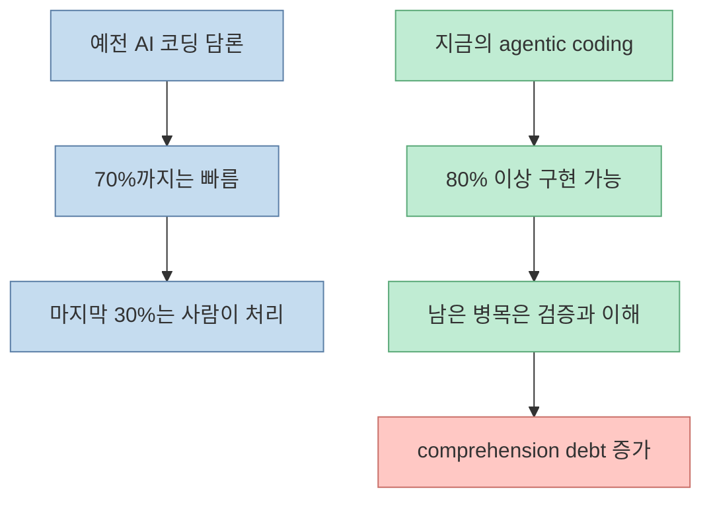
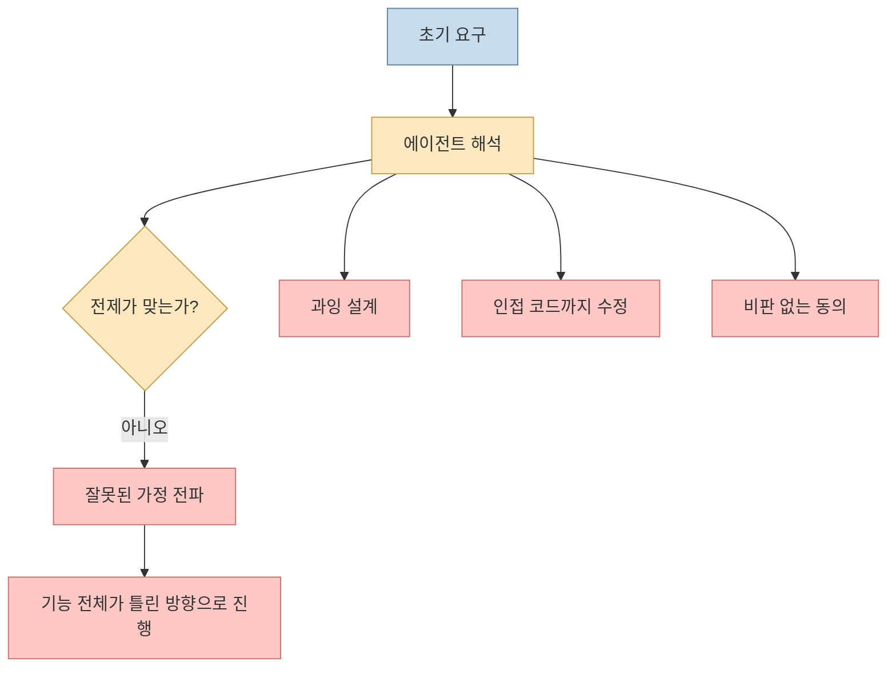
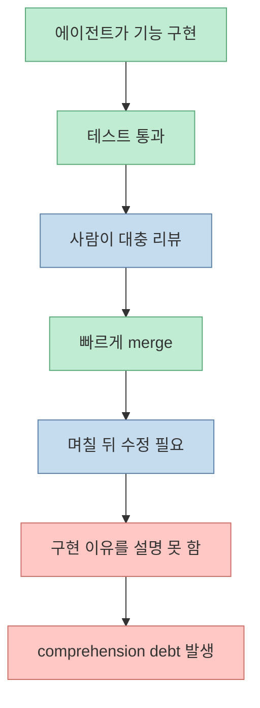
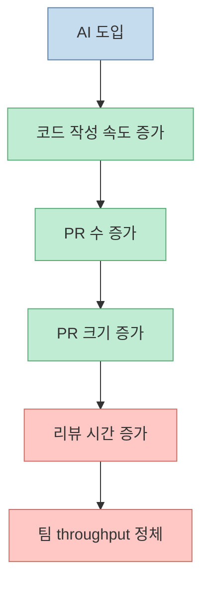
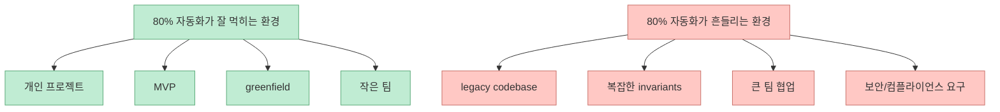
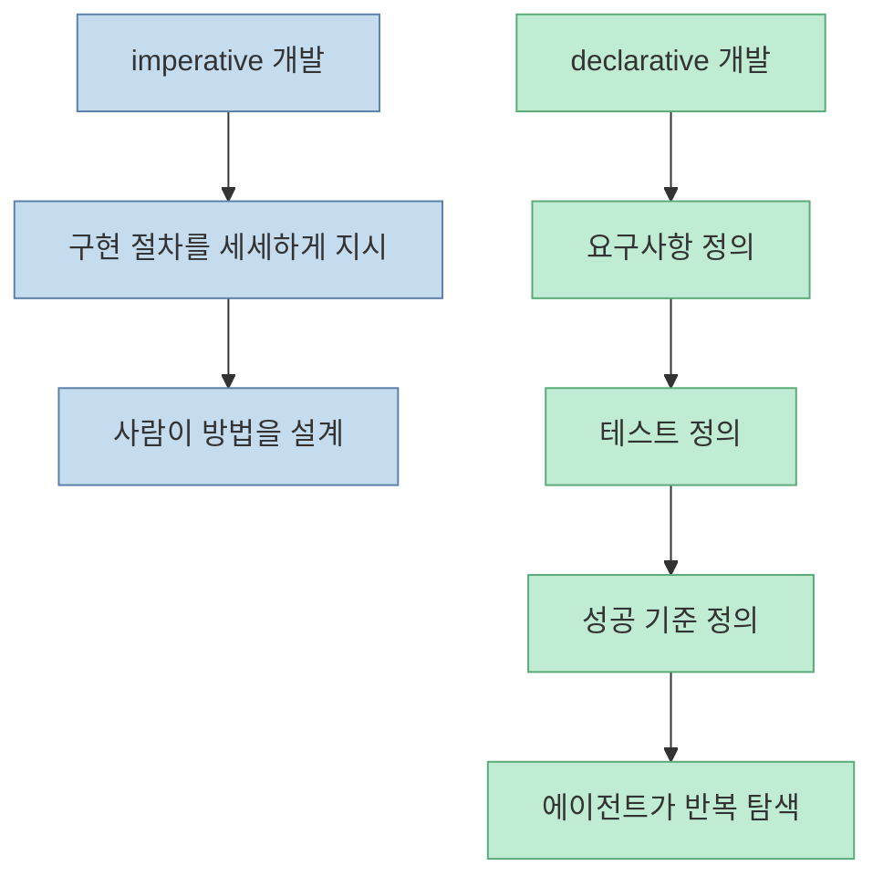
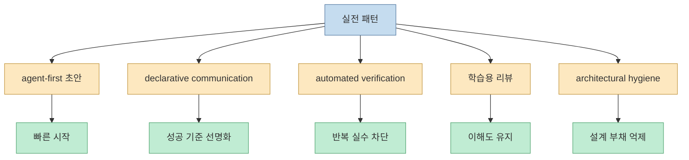
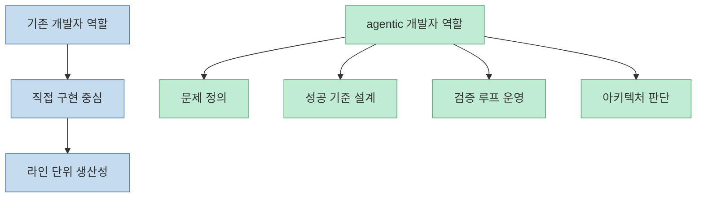

Addy Osmani의 글은 "AI가 이제 코드의 80% 이상을 써 준다"는 낙관론을 그대로 받아들이지 않습니다. 그의 핵심 주장은 더 흥미롭습니다. 문제는 더 이상 "모델이 코드를 못 짠다"가 아니라, **코드는 빨리 나오는데 사람이 그 코드를 이해하고 검증하는 속도는 그만큼 빨라지지 않는다** 는 데 있습니다. 그래서 병목은 구현에서 사라지는 대신 검증, 리뷰, 아키텍처 통제, 그리고 comprehension debt로 이동합니다.

<!--more-->

## Sources

- Addy Osmani, "The 80% Problem in Agentic Coding": <https://addyo.substack.com/p/the-80-problem-in-agentic-coding>

## 80% 문제는 완성도의 숫자 문제가 아니다

이 글은 예전의 "70% 문제"를 단순히 80%로 상향한 이야기가 아닙니다. Addy는 2025년 말~2026년 초의 agentic coding 환경에서, 적어도 greenfield 프로젝트나 개인 프로젝트에서는 에이전트가 훨씬 더 많은 구현을 맡을 수 있게 되었다고 봅니다. 하지만 그만큼 개발의 마지막 단계가 쉬워진 것은 아니라고 말합니다.

핵심은 이렇습니다.

- 작성 속도는 크게 빨라졌다
- 하지만 잘못된 가정, 과잉 추상화, 죽은 코드, 과도한 동의 같은 문제는 여전히 남아 있다
- 그래서 사람의 역할은 "직접 구현"보다 "방향 통제와 검증" 쪽으로 이동한다

즉 80%는 "이제 거의 다 자동화됐다"는 선언이 아니라, **사람이 담당해야 할 나머지 20%의 성격이 훨씬 더 무거워졌다** 는 뜻에 가깝습니다.

## 실수의 종류가 바뀌었다

Addy가 흥미롭게 보는 부분은 오류의 형태입니다. 이제 문제는 문법 오류나 사소한 API 오타보다, 더 개념적인 실패로 이동했습니다. 글은 특히 네 가지를 반복적으로 지적합니다.

- 초반 오해가 뒤까지 전파되는 잘못된 가정
- 필요 이상으로 구조를 키우는 abstraction bloat
- 정리되지 않고 남는 dead code
- 사용자의 요구를 비판 없이 실행하는 sycophantic agreement

이 문제는 단순한 프롬프트 몇 줄로 완전히 해결되지 않는다고 봅니다. `CLAUDE.md`, 시스템 프롬프트, 플랜 모드 같은 장치를 써도, 에이전트는 기본적으로 "전제를 의심하는 존재"보다 "일관된 결과를 만들어 내는 존재"에 가깝기 때문입니다.

그래서 agentic coding에서 중요한 질문은 "얼마나 많이 생성하느냐"보다, **틀린 전제를 얼마나 빨리 표면화하고 멈추게 하느냐** 입니다.

## 진짜 숨은 비용은 comprehension debt다

글에서 가장 중요한 개념은 Jeremy Twei가 이름 붙였다는 **comprehension debt** 입니다. Addy는 AI가 멋지게 기능 하나를 끝내고 테스트도 통과하면, 사람은 그 구현을 깊게 이해하지 않은 채 그냥 넘어가고 싶어지는 유혹을 받는다고 설명합니다.

그 순간에는 생산성이 올라간 것처럼 보입니다. 하지만 며칠 뒤 같은 코드를 다시 수정해야 할 때, 왜 그렇게 동작하는지 설명할 수 없다면 이미 빚이 쌓인 것입니다.

이 개념이 중요한 이유는, 읽기는 되지만 처음부터 다시 짜지는 못하는 상태가 생각보다 쉽게 온다는 점입니다. Addy의 표현을 따라가면, 그때 개발자는 엔지니어링보다 **rubber stamping** 에 가까운 상태로 밀려날 수 있습니다.

## 코드 생산성은 올랐는데 팀 throughput은 그대로일 수 있다

글은 생산성 역설도 짚습니다. Addy는 Faros AI와 Google DORA 자료를 인용해, AI 도입이 높은 팀에서 PR 수는 크게 늘었지만 리뷰 시간과 PR 크기도 함께 커졌다고 설명합니다. 그의 요지는 단순합니다.

- 코드 생성이 싸져서 더 많은 코드가 나온다
- 그러면 리뷰와 조정 비용도 함께 늘어난다
- 결국 병목은 구현에서 코드 리뷰와 검증으로 옮겨간다

이 프레임은 굉장히 실무적입니다. 개인은 빨라졌는데 팀은 덜 빨라진 이유를 설명해 주기 때문입니다. 이전에는 코드 작성이 비쌌고 리뷰가 상대적으로 뒤에 있었습니다. 이제는 코드 작성이 너무 싸져서, **리뷰 가능한 양보다 더 많은 변경이 계속 쏟아지는 상태** 가 됩니다.

## 80/20이 잘 먹히는 곳과 아닌 곳은 명확하다

Addy는 모든 환경에서 agentic coding이 비슷하게 통하지는 않는다고 봅니다. 80% 자동화 감각이 강하게 나타나는 곳은 대체로 다음과 같습니다.

- 개인 프로젝트
- MVP
- greenfield 스타트업
- 팀 규모가 작아 이해 비용이 아직 통제 가능한 환경

반대로 성숙한 코드베이스와 복잡한 불변조건이 있는 조직에서는 계산이 달라집니다. 에이전트는 문서에 없는 팀의 암묵지, 서비스 간 미묘한 합의, 운영상의 예외 규칙을 스스로 추론하지 못하기 때문입니다.

그래서 이 글은 "에이전트가 다 해 준다"보다, **어떤 종류의 소프트웨어에서 자동화 비율이 높아지는가** 를 구분해서 보라고 제안합니다.

## 진짜 레버리지는 imperative가 아니라 declarative 방식에 있다

Addy는 Karpathy의 관찰을 받아, LLM의 강점이 "코드를 쓰는 것" 자체보다 **명확한 목표를 줄 때 반복해서 맞춰 가는 능력** 에 있다고 설명합니다. 이때 개발 방식은 imperative에서 declarative로 바뀝니다.

- 예전 방식: 어떤 함수를 어떻게 구현할지 단계별로 지시
- 새로운 방식: 요구사항, 테스트, 성공 조건을 먼저 정의하고 방법은 에이전트가 탐색

이 관점에서 중요한 것은 프롬프트 미사여구가 아닙니다. 오히려 다음이 더 중요합니다.

- 테스트를 먼저 두기
- 브라우저나 실행 환경으로 실제 동작을 검증하게 하기
- API contract를 먼저 고정하기
- 정답 조건을 사람이 먼저 정의하기

결국 agentic coding의 핵심은 "잘 시키는 법"보다 **무엇이 성공인지 먼저 고정하는 법** 에 더 가깝습니다.

## 실전에서 먹히는 패턴은 자동화보다 가드레일이다

글 후반부에서 Addy는 실제로 유효했던 패턴을 정리합니다. 요약하면 에이전트 자율성을 무작정 늘리는 것이 아니라, **빠른 반복과 강한 가드레일을 같이 설계하는 팀** 이 잘 작동합니다.

이 패턴을 현재 Claude Code, Codex, 여러 에이전트 워크플로에 그대로 옮기면 다음처럼 읽을 수 있습니다.

- 초안은 에이전트에게 넓게 맡긴다
- 대신 PR 이전 검증은 더 촘촘하게 만든다
- 반복 실수는 테스트, 린트, 훅으로 흡수한다
- 사람이 보는 리뷰는 syntax보다 architecture와 assumptions에 집중한다

즉 실전의 초점은 "더 똑똑한 모델"보다 **더 엄격한 harness** 에 있습니다.

## 개발자는 두 집단으로 갈라지는 것이 아니라 역할이 분화된다

글은 이 변화를 adoption curve보다 역할 변화로 읽습니다. 한쪽은 AI를 단순한 빠른 자동완성처럼 쓰고, 다른 한쪽은 에이전트를 조율하는 방식으로 일의 구조를 바꿉니다. Addy는 후자의 사람들을 "implementer"보다 "orchestrator"에 가까운 존재로 설명합니다.

이 해석은 꽤 중요합니다. 왜냐하면 AI 시대의 격차는 언어 모델 접근 여부보다,

- 문제 정의를 얼마나 잘하는지
- 검증 전략을 얼마나 빨리 세우는지
- 생성된 결과를 얼마나 구조적으로 이해하는지

에서 벌어질 가능성이 크기 때문입니다.

그래서 이 글의 메시지는 "이제 코드를 안 써도 된다"가 아닙니다. 오히려 **코드 입력보다 판단과 통제의 비중이 커지는 방향으로 역할이 이동한다** 는 쪽에 가깝습니다.

## 정리

Addy Osmani의 "80% 문제"는 AI 코딩이 아직 부족하다는 비관론도 아니고, 이제 거의 완성됐다는 낙관론도 아닙니다. 그의 메시지는 더 정교합니다.

- 구현 자동화 비율은 실제로 올라가고 있다
- 하지만 그만큼 이해와 검증의 부담도 더 빠르게 커진다
- 따라서 생산성의 핵심은 생성량이 아니라 comprehension debt 관리다
- 잘하는 팀은 자율성을 키우기 전에 검증 하네스를 먼저 만든다

결국 agentic coding 시대의 질문은 "AI가 몇 퍼센트 대신 짜 주는가"가 아닙니다. 더 중요한 질문은 이것입니다.

**그 80%를 사람이 끝까지 설명하고 책임질 수 있는가.**
