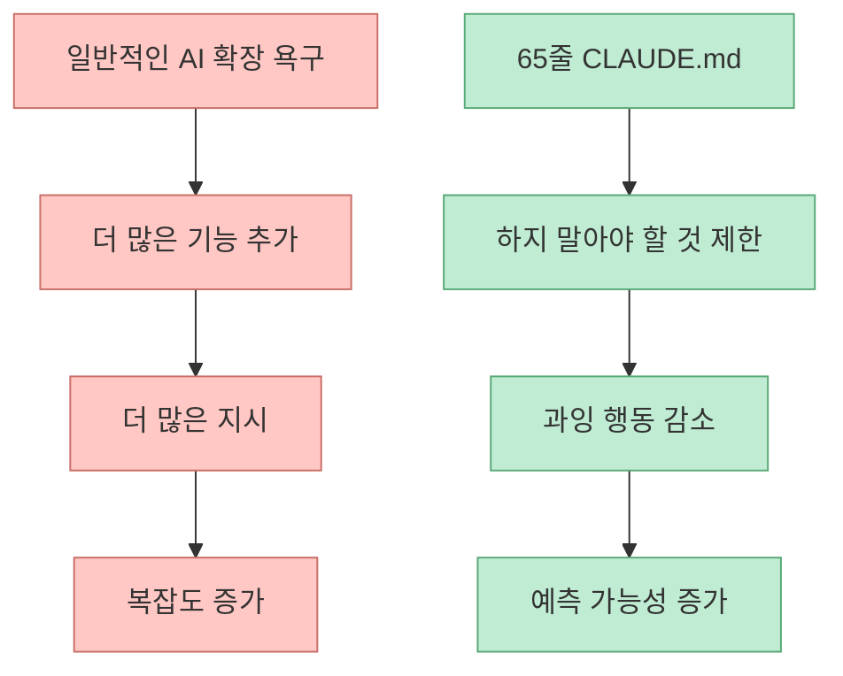
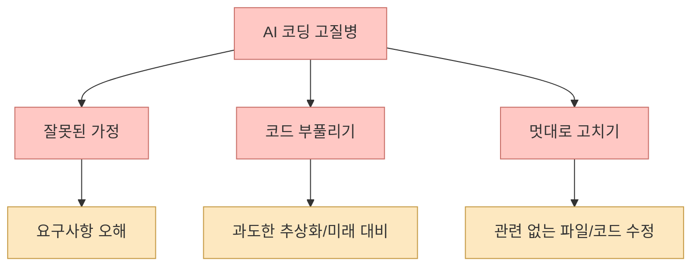
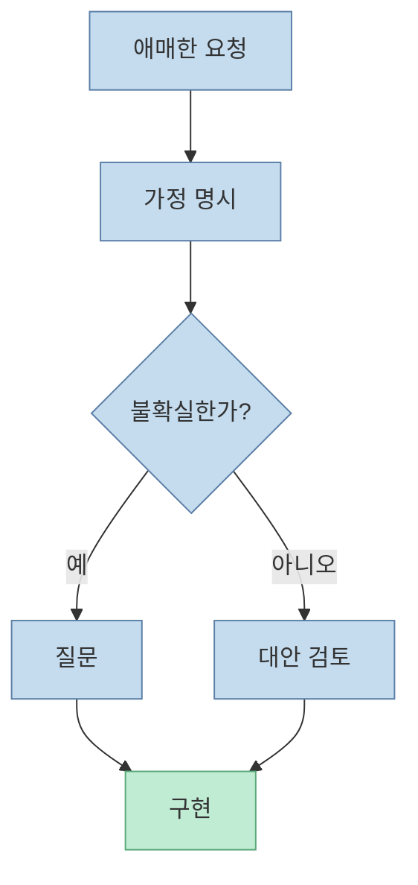
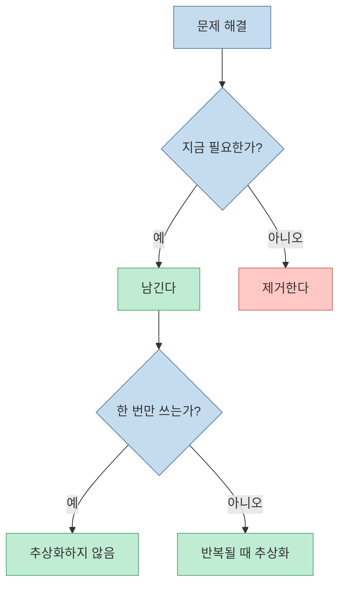
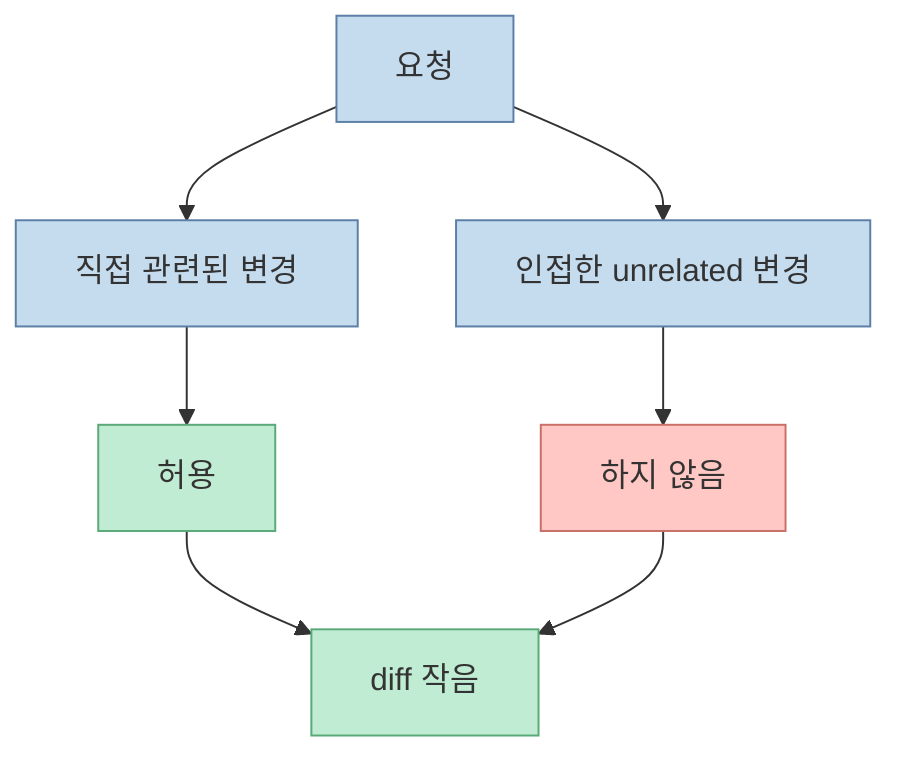
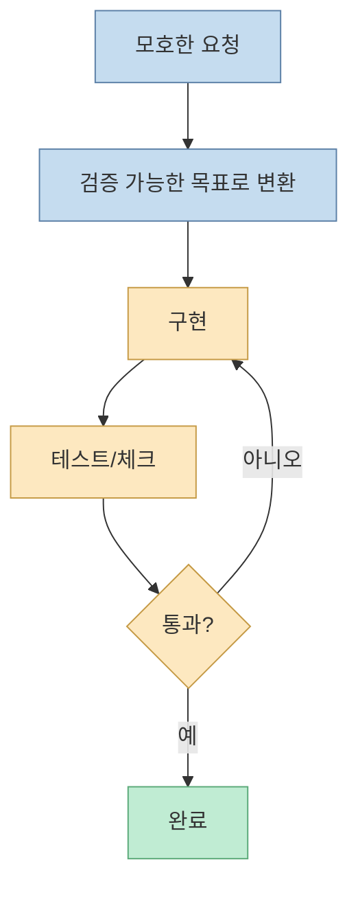
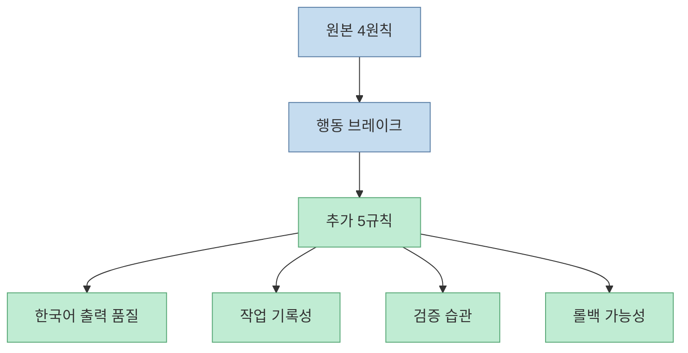
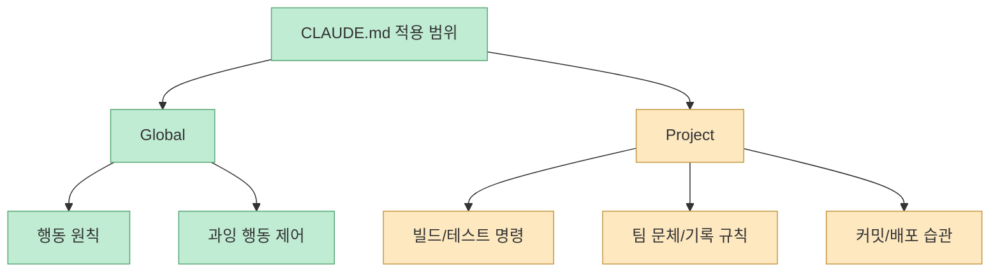

짧은 `CLAUDE.md` 하나가 이렇게 빠르게 퍼진 이유는 단순합니다. AI에게 더 많은 것을 시키기 위한 문서가 아니라, AI가 가장 자주 저지르는 실수에 최소한의 브레이크를 거는 문서였기 때문입니다. 미드나잇 로그 영상은 안드레이 카파시 아이디어에서 출발한 65줄 `CLAUDE.md`가 왜 사람들에게 먹혔는지, 그리고 그 안에 어떤 제어 장치가 들어 있는지를 설명합니다. [0:00](https://youtu.be/xnNFexW9Wrk?t=0)

<!--more-->

## Sources

- <https://youtu.be/xnNFexW9Wrk?si=5FFS1s4NyeK-LVRe>
- 원본 CLAUDE.md: <https://github.com/forrestchang/andrej-karpathy-skills/blob/main/CLAUDE.md>
- 커스텀 CLAUDE.md: <https://github.com/datajuny/andrej-karpathy-skills/blob/main/CLAUDE.md>

## 65줄이 퍼진 이유: AI를 더 똑똑하게 만드는 문서가 아니기 때문이다

영상은 65줄짜리 `CLAUDE.md`가 짧은 시간 안에 GitHub에서 크게 확산됐다고 설명합니다. [0:00](https://youtu.be/xnNFexW9Wrk?t=0) 이런 문서가 먹히는 이유는 기능 추가형 prompt가 아니라 **행동 제한형 prompt** 였기 때문입니다.

대부분의 사용자는 AI가 더 많은 것을 해 주길 원합니다. 하지만 실제로 자주 생기는 문제는 능력 부족이 아니라 과잉 행동입니다. Claude는 너무 빨리 결론 내리고, 너무 많이 만들고, 너무 넓게 고칩니다. 그래서 필요한 것은 "더 해줘"보다 "덜 해도 된다"는 제동장치입니다.

이 문서는 AI를 더 공격적으로 만드는 것이 아니라, 더 차분하게 만듭니다. 그래서 오히려 실무에서 유용합니다.

## AI의 3가지 고질병

영상은 AI의 3가지 고질병을 명확히 짚습니다. [2:05](https://youtu.be/xnNFexW9Wrk?t=125)

- 잘못된 가정
- 코드 부풀리기
- 멋대로 고치기

이 세 가지는 대부분의 AI 코딩 실수의 뿌리입니다.

이 문제를 해결하려면 더 긴 프롬프트보다 더 좋은 제약이 필요합니다. 65줄 CLAUDE.md는 바로 여기에 맞춰져 있습니다.

## 고질병 1: 잘못된 가정 → Think Before Coding

첫 번째 문제는 잘못된 가정입니다. 사용자가 애매하게 말하면 Claude는 질문하기보다 그럴듯한 해석을 골라 바로 구현하는 경향이 있습니다.

원본 CLAUDE.md의 첫 번째 원칙은 `Think Before Coding`입니다. 가정을 명시하고, 불확실하면 묻고, 여러 해석이 가능하면 조용히 하나를 고르지 말라는 규칙입니다.

이 원칙 하나만으로도 "잘못 구현한 뒤 다시 뜯어고치는 비용"을 크게 줄일 수 있습니다.

## 고질병 2: 코드 부풀리기 → Simplicity First

두 번째 문제는 코드 부풀리기입니다. AI는 문제를 해결하는 최소 코드보다, 재사용 가능한 구조, 확장 가능한 abstraction, 옵션화된 config를 과하게 넣으려는 경향이 있습니다.

원본의 두 번째 원칙은 `Simplicity First`입니다. 지금 필요한 최소 코드만 남기고, 요구하지 않은 flexibility나 abstraction을 넣지 말라는 뜻입니다.

이 규칙은 "좋은 엔지니어처럼 보이려는 AI"를 "문제를 해결하는 AI"로 되돌리는 역할을 합니다.

## 고질병 3: 멋대로 고치기 → Surgical Changes

세 번째 문제는 멋대로 고치기입니다. 사용자가 하나의 버그를 고쳐 달라고 했는데, Claude가 인접한 포맷팅, 주석, dead code, 스타일을 함께 정리해 버리는 경우가 대표적입니다.

원본의 세 번째 원칙은 `Surgical Changes`입니다. 필요한 것만 건드리고, 내 변경으로 생긴 찌꺼기만 치우며, 관련 없는 개선은 하지 말라는 뜻입니다.

실무에서 이 원칙은 특히 중요합니다. diff가 작아야 리뷰가 쉽고, rollback도 쉽고, "좋은 의도"로 만든 부작용도 줄어듭니다.

## 왜 4번째 원칙은 성공 기준에 집착하는가

원본의 마지막 원칙은 `Goal-Driven Execution`입니다. 영상도 이를 "성공 기준 먼저"로 요약합니다. [3:58](https://youtu.be/xnNFexW9Wrk?t=238)

이 원칙이 필요한 이유는 AI가 "완료"를 선언하기 쉽기 때문입니다. 하지만 성공 기준이 없으면 완료는 느낌에 불과합니다. 테스트가 통과했는지, 재현 버그가 사라졌는지, 빌드가 되는지, diff가 목적에 맞는지 검증해야 합니다.

이 원칙은 AI를 더 천천히 만드는 것처럼 보이지만, 실제로는 재작업 비용을 크게 줄입니다.

## 한국어 실무 환경에서 왜 추가 규칙이 필요했나

영상은 원본 4원칙 위에 다섯 가지 실무 규칙을 추가했다고 설명합니다. [9:03](https://youtu.be/xnNFexW9Wrk?t=543) 이미 별도 글로 정리할 수 있을 만큼 중요하지만, 이 영상에서의 포인트는 "원본만으로는 현업 운영에 약간 모자랐다"는 점입니다.

추가된 룰은 다음과 같습니다.

- 한국어 문장 끝에 콜론 금지
- 새 파일 첫 줄에 한국어 역할 주석
- Plan + Checklist + Context Notes
- 완료 전 테스트
- 의미 단위 커밋

즉 원본은 사고 방식을 제어하고, 추가 규칙은 운영 습관을 보강합니다.

## 글로벌로 둘 것인가, 프로젝트에 둘 것인가

영상은 1분 적용 방법과 함께 글로벌 적용 vs 프로젝트 적용도 언급합니다. [12:09](https://youtu.be/xnNFexW9Wrk?t=729)

실전적으로는 이렇게 나누는 편이 좋습니다.

- **글로벌**: 생각 후 코딩, 단순성 우선, 외과수술식 변경, 성공 기준 먼저
- **프로젝트별**: 빌드 명령, 테스트 명령, 커밋 규칙, 한국어 헤더, 컨텍스트 파일 생성 여부

짧은 65줄의 강점은 전역 기본값으로 쓰기 좋다는 데 있습니다. 여기에 프로젝트 특화 규칙을 얹으면 꽤 강력한 운영 레이어가 됩니다.

## 실전 적용 포인트

첫째, 새 CLAUDE.md를 넣을 때는 "더 많은 규칙"보다 "하지 말아야 할 것" 위주로 정리하는 것이 좋습니다.

둘째, 잘못된 가정, 코드 부풀리기, 멋대로 고치기 중 내 세션에서 가장 자주 나오는 문제가 무엇인지 먼저 파악해야 합니다.

셋째, 글로벌 브레이크와 프로젝트별 실행 규칙을 분리합니다. 둘을 한 문서에 다 몰아넣으면 오히려 비대해질 수 있습니다.

넷째, 추가 규칙은 한국어 출력 품질과 테스트/커밋 습관을 실제로 바꾸는 쪽이 효과가 큽니다.

다섯째, 좋은 CLAUDE.md는 능력 강화제가 아니라 사고 방지 장치입니다. "뭘 더 하게 할까"보다 "어떻게 덜 사고치게 할까"를 기준으로 손봐야 합니다.

## 핵심 요약

- 65줄 CLAUDE.md가 빠르게 퍼진 이유는 AI를 더 똑똑하게 만들기보다 과잉 행동을 줄이는 브레이크였기 때문입니다. [0:00](https://youtu.be/xnNFexW9Wrk?t=0)
- AI의 3가지 고질병은 잘못된 가정, 코드 부풀리기, 멋대로 고치기입니다. [2:05](https://youtu.be/xnNFexW9Wrk?t=125)
- 원본 4원칙은 각각 `Think Before Coding`, `Simplicity First`, `Surgical Changes`, `Goal-Driven Execution`으로 이 문제를 제어합니다. [3:58](https://youtu.be/xnNFexW9Wrk?t=238)
- 한국어 실무 환경에서는 출력 문체, 헤더 주석, 체크리스트/컨텍스트 노트, 테스트, 의미 단위 커밋 같은 운영 규칙이 추가될 수 있습니다. [9:03](https://youtu.be/xnNFexW9Wrk?t=543)
- 좋은 CLAUDE.md는 기능 확장 문서가 아니라, AI의 과잉 행동을 줄이는 최소 운영 규칙 집합입니다.

## 결론

이 65줄짜리 문서가 강한 이유는 짧아서가 아닙니다. 짧은데도 AI가 가장 자주 사고치는 지점을 정확히 겨누고 있기 때문입니다. 잘못된 가정을 막고, 불필요한 코드를 줄이고, 요청과 무관한 수정을 멈추고, 성공 기준을 먼저 세우게 만듭니다.

결국 좋은 CLAUDE.md는 "더 많은 것을 시키는 문서"가 아니라, **덜 틀리게 일하게 만드는 문서** 입니다. AI 코딩 시대에 필요한 것도 화려한 프롬프트보다 이런 브레이크일 가능성이 더 큽니다.
