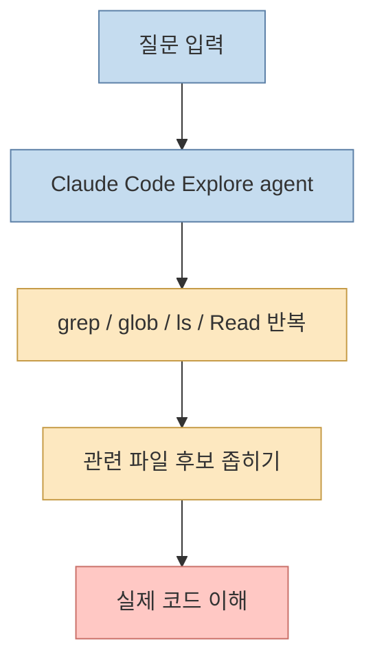
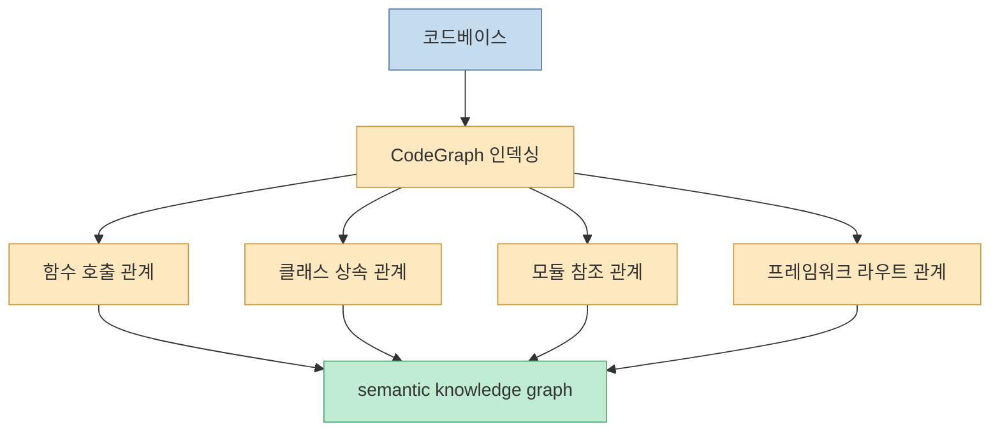
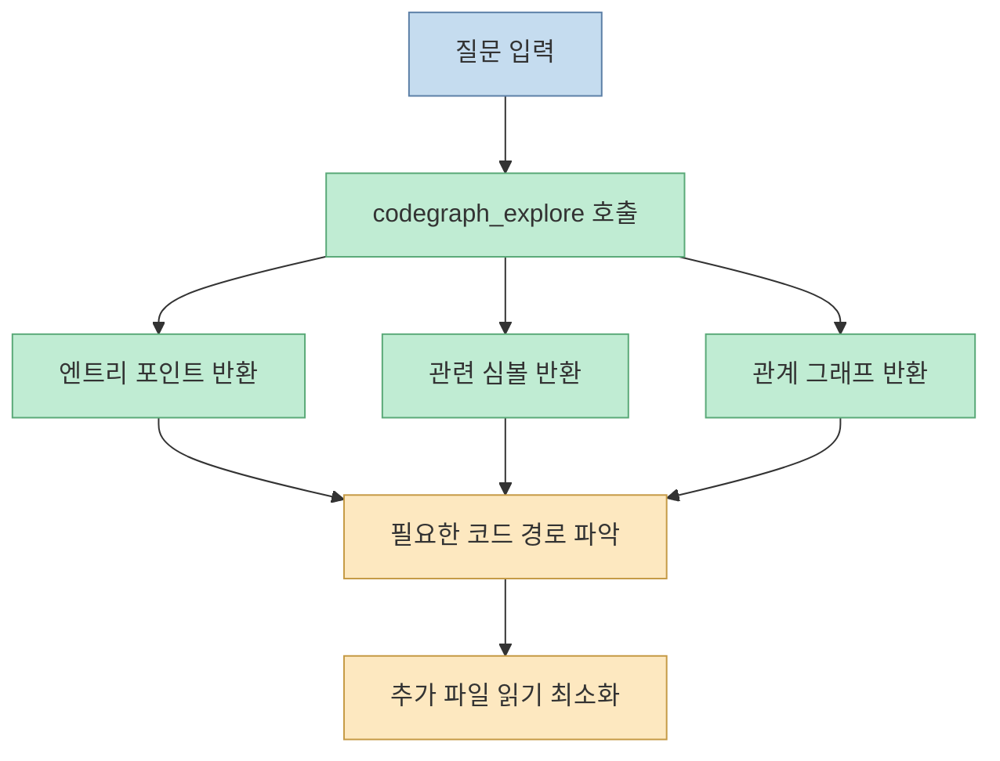
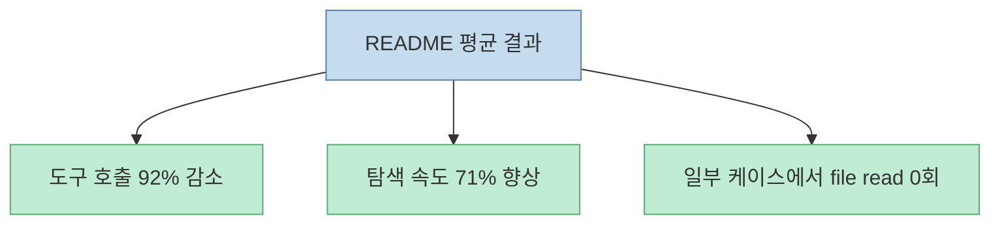
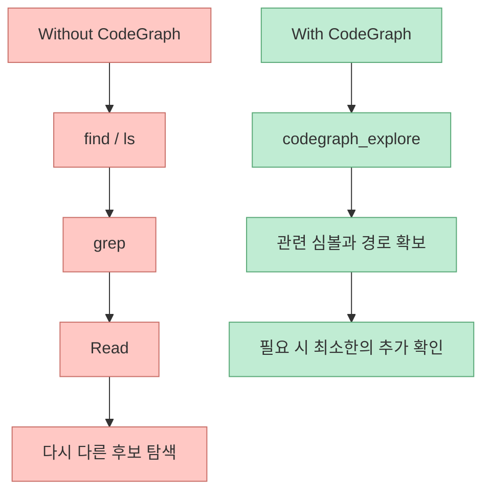
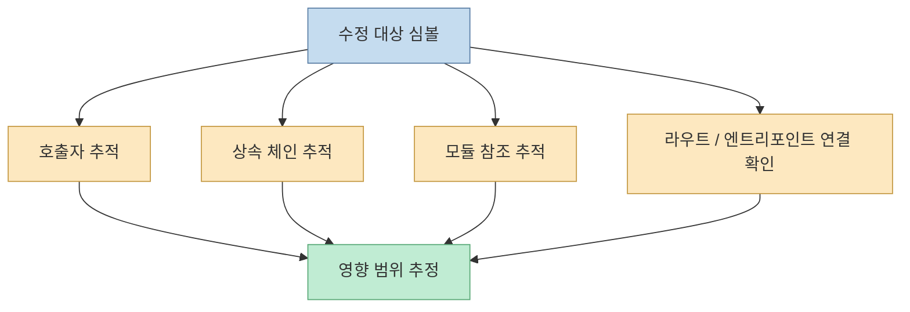
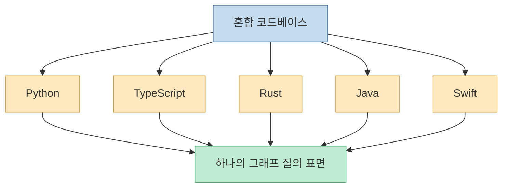
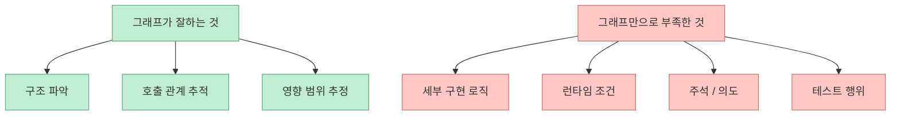

Claude Code로 큰 코드베이스를 탐색할 때 느린 이유는 모델이 똑똑하지 않아서가 아니라, **답을 찾기 전에 파일을 너무 많이 훑어야 하기 때문** 인 경우가 많습니다. GitHubDaily가 소개한 CodeGraph는 이 병목을 정면으로 겨냥합니다. 핵심 아이디어는 단순합니다. 함수 호출, 클래스 상속, 모듈 참조 같은 관계를 미리 그래프로 인덱싱해 두고, Claude Code가 파일을 하나씩 읽기 전에 그 그래프를 먼저 조회하게 만드는 것입니다. X 포스트는 이 방식으로 도구 호출이 92% 줄고 탐색 속도가 71% 빨라졌다고 소개했고, 저장소 README도 비슷한 벤치마크를 제시합니다. <https://x.com/i/status/2054917184158318628> <https://github.com/colbymchenry/codegraph>

<!--more-->

## Sources

- <https://x.com/i/status/2054917184158318628>
- <https://github.com/colbymchenry/codegraph>

## CodeGraph가 해결하려는 문제는 "코드를 읽기 전에 길 찾기" 비용이다

CodeGraph 저장소는 Claude Code가 코드베이스를 탐색할 때 Explore agent가 `grep`, `glob`, `Read` 같은 도구를 반복 호출한다고 설명합니다. 이 과정은 실제 정답을 읽기 전의 "탐색 오버헤드"를 크게 만듭니다. X 포스트도 같은 맥락에서, 코드베이스가 커질수록 구조를 찾기 위해 많은 파일을 쓸어야 하고 그만큼 툴 호출, 속도 저하, 토큰 소모가 같이 커진다고 설명합니다.

즉 문제의 본질은 "Claude Code가 코드를 못 이해한다"가 아니라, **관련 파일을 찾기까지의 경로가 비싸다** 는 점입니다.

대형 저장소에서는 이 선행 비용이 너무 커져서, 답을 아는 데 필요한 사고보다 **답에 도달하기 위한 파일 정찰** 이 더 비싸지는 경우가 많습니다.

## 접근 방식은 "파일 검색"이 아니라 "의미 관계를 미리 인덱싱"하는 것이다

CodeGraph의 설명에 따르면, 이 도구는 코드베이스에 대해 **pre-indexed knowledge graph** 를 만듭니다. 여기에는 symbol relationship, call graph, code structure 같은 정보가 포함됩니다. X 포스트는 함수 호출 체인, 클래스 상속, 모듈 참조, 프레임워크 라우트 매핑까지 식별한다고 소개합니다.

즉 단순한 텍스트 인덱스가 아니라, "어떤 심볼이 무엇을 호출하고 무엇에 의존하는가"를 질의 가능한 형태로 저장해 두는 것입니다.

이 구조의 장점은 에이전트가 매번 파일을 처음부터 뒤지는 대신, **이미 계산된 구조적 관계를 먼저 활용할 수 있다는 점** 입니다.

## Claude Code의 흐름은 이렇게 바뀐다

README의 설명을 따르면, CodeGraph를 쓰지 않을 때 에이전트는 먼저 파일을 찾고 읽는 데 시간을 씁니다. 반대로 CodeGraph를 쓸 때는 `codegraph_explore` 같은 그래프 질의 결과를 먼저 받고, 그 결과를 기반으로 필요한 엔트리 포인트와 관련 심볼을 한 번에 좁힙니다.

핵심은 단순히 "더 빨리 검색한다"가 아닙니다. **탐색의 기본 단위를 파일에서 심볼 그래프로 바꾼다** 는 데 있습니다.

## 벤치마크 수치는 인상적이지만, 저장소 기준 수치로 읽는 것이 맞다

GitHubDaily 포스트는 도구 호출 92% 감소, 탐색 속도 71% 향상을 강조합니다. 저장소 README도 "94% fewer tool calls · 77% faster exploration · 100% local"이라는 큰 헤드라인과 함께, 6개 코드베이스 평균으로 "92% fewer tool calls · 71% faster"라고 적고 있습니다.

README에 나온 예시는 다음과 같습니다.

- VS Code TypeScript 코드베이스: 52회 도구 호출 → 3회
- Excalidraw: 47회 → 3회
- Claude Code Python+Rust: 40회 → 3회
- Java 코드베이스: 26회 → 1회
- Alamofire: 32회 → 3회
- Swift Compiler: 37회 → 6회

다만 이 수치는 **저장소 작성자가 제시한 단일 소스 벤치마크** 입니다. 방향성은 분명히 흥미롭지만, 모든 팀과 모든 질문에서 같은 폭으로 재현된다고 일반화하면 과장입니다. 안전한 해석은 이 정도입니다.

- 대형 저장소일수록 탐색 오버헤드 감소 효과를 기대할 수 있다
- 구조 질의가 중요한 질문일수록 유리하다
- 실제 체감 폭은 코드베이스 특성과 질문 유형에 따라 달라진다

## 왜 도구 호출이 줄어드는가

벤치마크가 설득력 있는 이유는 감소 메커니즘이 비교적 명확하기 때문입니다. README는 CodeGraph를 쓸 때 agent가 결과를 신뢰하고, 파일 읽기로 거의 fallback하지 않았다고 설명합니다. 반대로 CodeGraph가 없을 때는 `find`, `ls`, `grep`, `Read`가 섞인 다단계 탐색을 오래 수행합니다.

즉 호출 수 감소는 마법이 아니라, **탐색 단계가 collapse되기 때문** 입니다. 여러 번의 파일 수준 추정 작업이 한 번의 그래프 질의로 치환되는 셈입니다.

## 이 도구의 진짜 강점은 리팩터링 전 영향 분석에 있다

X 포스트는 "수정 전에 영향 범위를 분석해 한 곳 고치고 다른 곳을 망가뜨리는 일을 줄일 수 있다"고 설명합니다. 이 부분이 꽤 중요합니다. 단순한 탐색 최적화만이 아니라, 변경 영향도를 더 구조적으로 파악할 수 있다는 뜻이기 때문입니다.

예를 들어 어떤 함수나 클래스 하나를 바꾸려 할 때, 다음을 함께 볼 수 있습니다.

- 누가 이것을 호출하는가
- 어떤 상속 체인 안에 있는가
- 어떤 모듈이 참조하는가
- 프레임워크 라우트나 엔트리 포인트와 어떻게 연결되는가

Claude Code를 "코드 작성기"보다 "리팩터링 조수"로 많이 쓰는 사람에게는, 오히려 이 영향 분석 쪽 가치가 더 클 수 있습니다.

## 언어와 프레임워크 범위가 넓다는 점도 포인트다

GitHubDaily 포스트는 19개 언어와 13개 프레임워크를 지원한다고 소개합니다. README도 여러 언어와 대형 저장소 예시를 통해 cross-language 탐색이 가능하다고 설명합니다. 특히 Python+Rust처럼 언어가 섞인 코드베이스에서도 연결을 찾았다고 적고 있습니다.

이 말이 중요한 이유는, 실제 팀 코드베이스는 단일 언어보다 **서버 언어 + 프런트엔드 + 스크립트 + 빌드 파일** 식으로 섞여 있는 경우가 많기 때문입니다.

Claude Code의 실제 병목이 "정답을 못 만든다"보다 "언어 경계와 폴더 경계를 넘는 연결을 찾는 데 시간이 든다"는 점을 생각하면, 이 설계는 꽤 자연스럽습니다.

## 모든 데이터를 로컬에 둔다는 점도 실무적이다

X 포스트는 "모든 데이터가 로컬에 있고 외부 서비스가 필요 없다"고 소개합니다. 저장소 README 헤드라인에도 `100% local`이라는 표현이 있습니다. 이는 두 가지 의미가 있습니다.

- 코드 구조를 외부 인덱싱 서비스로 보내지 않아도 된다
- 개발 환경에서 바로 붙이기 쉽다

특히 사내 저장소, 비공개 코드, 보안 정책이 까다로운 조직에서는 "성능 최적화" 못지않게 **어디에 코드 메타데이터가 저장되느냐** 가 중요합니다.

## 그렇다고 파일 읽기가 완전히 사라지는 것은 아니다

여기서 오해하면 안 되는 점도 있습니다. 그래프는 구조를 압축해 주지만, 구현 세부를 모두 대신하지는 못합니다. 예를 들어 다음은 여전히 실제 파일 확인이 필요할 수 있습니다.

- 복잡한 비즈니스 조건문
- 런타임 분기
- 동적 dispatch
- 주석과 문맥 의도
- 테스트에서만 드러나는 행위

따라서 CodeGraph는 "파일 읽기 제거기"라기보다, **파일 읽기 전에 어디를 봐야 하는지 정밀하게 줄여 주는 장치** 로 보는 편이 더 정확합니다.

## 핵심 요약

- CodeGraph는 Claude Code의 대형 저장소 탐색 병목을 줄이기 위한 오픈소스 도구다
- 핵심 아이디어는 파일을 매번 스캔하지 말고, 미리 구축한 semantic knowledge graph를 먼저 조회하는 것이다
- X 포스트와 저장소 README 모두 도구 호출 감소와 탐색 시간 단축을 강조한다
- 특히 호출 관계, 상속 관계, 모듈 참조, 영향 범위 분석 같은 구조 질의에 강점이 있다
- 다만 성능 수치는 저장소 작성자 기준 벤치마크이므로, 모든 팀에서 동일한 폭으로 일반화하면 안 된다
- 가장 정확한 해석은 "Claude Code의 파일 탐색 비용을 구조 질의로 치환하는 도구"라는 것이다

## 결론

CodeGraph가 흥미로운 이유는 LLM 자체를 더 똑똑하게 만드는 방식이 아니라, **LLM이 질문에 도달하기 전의 탐색 환경을 바꾸기 때문** 입니다. Claude Code 같은 에이전트형 코딩 도구는 구현 능력보다도 "어디를 봐야 하는가"에서 시간을 많이 씁니다. CodeGraph는 바로 그 앞단 비용을 줄이려는 시도입니다.

그래서 이 도구의 가치는 코드 생성보다 코드 탐색, 특히 **대형 저장소 이해와 안전한 리팩터링** 에서 더 크게 드러날 가능성이 있습니다.
