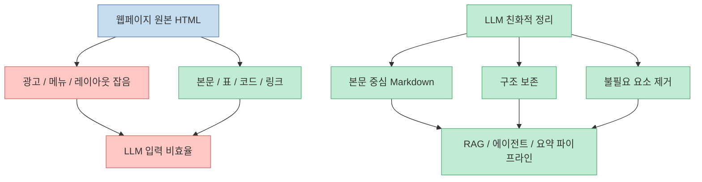
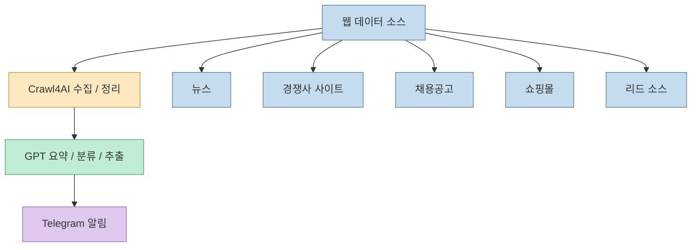
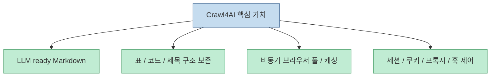
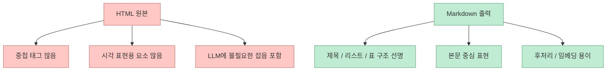
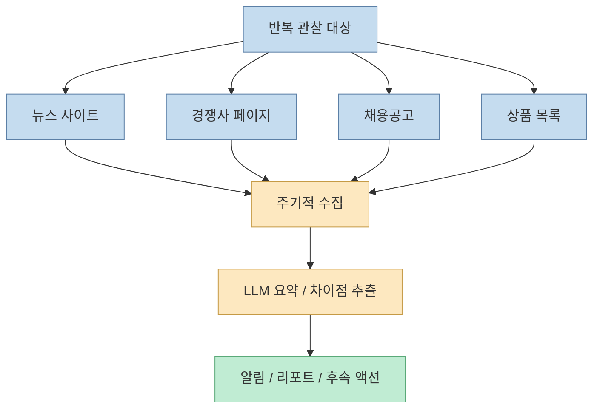
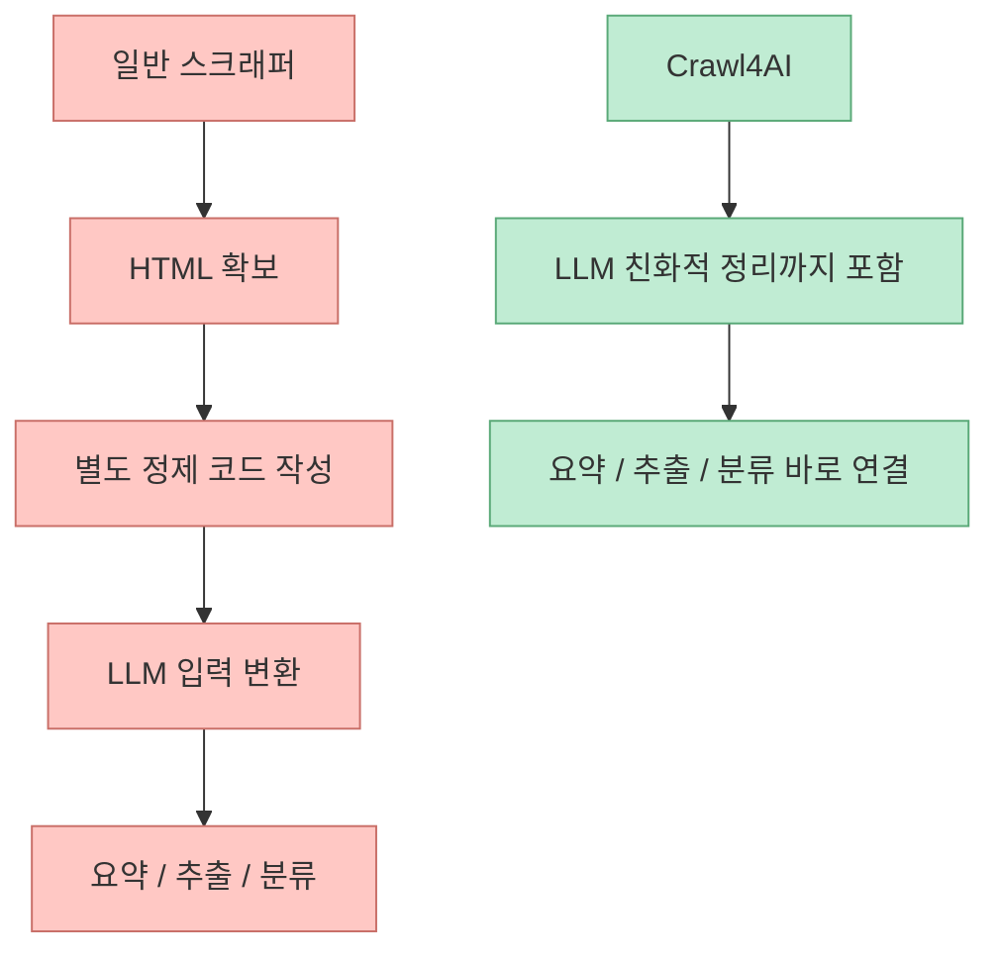

Threads에서 소개된 Crawl4AI의 포인트는 단순합니다. 웹사이트에서 데이터를 긁는 것 자체보다, **긁은 데이터를 AI가 바로 읽고 쓰기 좋은 형태로 바꾸는 것** 이 더 중요해졌다는 것입니다. 원문 포스트는 이를 "웹사이트 데이터를 AI가 읽기 좋게 자동 정리해서 뽑아주는 오픈소스"라고 표현했고, 실제 GitHub 저장소도 Crawl4AI를 "LLM Friendly Web Crawler & Scraper"라고 소개합니다. 즉 이 도구의 핵심은 수집이 아니라 **LLM 입력용 구조화** 에 있습니다.  

<!--more-->

## Sources

- <https://www.threads.com/@kyungpyo_lee/post/DYXG-l5E5Tt?xmt=AQG0k9UylDMwF43vnxpNHDBIkuXhPBO-ow3Nkw0HfOkbJzYuM0WX6suWGvGCFOcRcR5etZQ&slof=1>
- <https://github.com/unclecode/crawl4ai>

## 왜 지금 "LLM 친화적 크롤링"이 따로 필요해졌나

예전 크롤링은 HTML에서 원하는 텍스트나 필드를 뽑아 데이터베이스에 넣는 쪽이 중심이었습니다. 하지만 에이전트와 RAG가 보편화된 지금은 수집한 결과를 사람이 직접 읽는 경우보다, **모델이 바로 넘겨받아 요약·추론·후속 작업** 을 하는 경우가 더 많아졌습니다.

이때 단순 HTML은 비효율적입니다.

- 내비게이션과 광고 같은 잡음이 많음
- 본문 구조가 사이트마다 다름
- 표, 코드, 제목 계층이 깨지기 쉬움
- 모델 입력 토큰이 불필요하게 커짐

그래서 Crawl4AI 같은 도구의 진짜 역할은 단순한 스크래핑보다 **웹을 LLM 입력 형식으로 재가공하는 변환 계층** 에 가깝습니다.

## Threads 포스트가 짚은 포인트는 "정보 수집 속도"다

Threads 원문은 Crawl4AI를 "실리콘밸리 개발자들이 요즘 몰래 쓰는 돈복사기"라고 다소 강하게 표현합니다. 표현은 SNS식 과장이 있지만, 포인트 자체는 실무적입니다. 저자가 예시로 든 활용처는 다음과 같습니다.

- 뉴스 수집
- 경쟁사 추적
- 채용공고 모니터링
- 쇼핑몰 크롤링
- 리드 발굴

그리고 많이 쓰는 조합으로 `Crawl4AI + GPT + Telegram`을 제시합니다. 즉 데이터 수집 → AI 요약 → 알림 발송까지 하나의 자동화 루프로 묶는 패턴입니다.

이 조합이 자주 언급되는 이유는, 결국 경쟁력이 "더 많은 데이터를 모으는가"보다 **더 빨리 의미 있는 정보로 가공해서 행동으로 연결하는가** 로 이동했기 때문입니다.

## Crawl4AI의 저장소 설명도 같은 방향을 가리킨다

GitHub README는 Crawl4AI가 웹을 "clean, LLM ready Markdown"으로 바꾼다고 설명합니다. 사용처도 RAG, agents, data pipelines라고 명확히 적고 있습니다. 즉 처음부터 사람이 읽는 스크래퍼가 아니라, **에이전트가 소비할 출력 포맷** 을 목표로 설계된 도구입니다.

README가 강조하는 포인트는 대략 이렇습니다.

- LLM ready output
- smart Markdown with headings, tables, code, citation hints
- async browser pool과 caching을 통한 속도
- sessions, proxies, cookies, user scripts, hooks 같은 제어 기능

즉 이 프로젝트는 "브라우저 자동화로 HTML 가져오기"보다 훨씬 위층을 겨냥합니다. **수집 결과를 에이전트 파이프라인의 재료로 만드는 표준화** 가 핵심입니다.

## 왜 Markdown이 중요한가

여기서 Markdown은 단순한 출력 포맷 취향 문제가 아닙니다. LLM 관점에서는 꽤 실용적입니다.

- 제목 계층이 살아 있어 문서 구조를 파악하기 쉽다
- 표와 리스트가 평문보다 덜 깨진다
- 코드 블록이 분리되어 모델이 다루기 편하다
- HTML보다 토큰 낭비가 적은 경우가 많다

그래서 Crawl4AI의 가치는 페이지를 받아 오는 것보다, **AI가 덜 헷갈리는 중간 표현으로 옮겨 주는 일** 에 있습니다.

## 이런 도구가 특히 강한 곳은 "반복 관찰"이다

Threads 포스트가 예시로 든 뉴스, 경쟁사 추적, 채용공고 모니터링은 공통점이 있습니다. 한 번 읽고 끝나는 작업이 아니라, **계속 같은 사이트를 반복적으로 보고 변화만 뽑아내야 하는 작업** 입니다.

이 경우 사람이 매번 브라우저로 들어가 읽는 방식은 금방 병목이 됩니다.

이런 패턴에서는 크롤러의 핵심 성능이 "한 번 잘 긁는다"가 아니라, **계속 돌아도 싸고 안정적이며 후처리 비용이 낮다** 는 쪽으로 이동합니다.

## 단순 스크래퍼와의 차이는 "후처리 비용 절감"이다

많은 사람이 웹 수집 도구를 평가할 때 크롤링 가능 여부만 봅니다. 하지만 실제 AI 파이프라인에서는 그 다음 단계 비용이 더 큽니다.

- HTML 정리
- 본문 추출
- 노이즈 제거
- 표/코드 구조 보정
- 모델 입력 포맷 맞춤

Crawl4AI가 주목받는 이유는 이 후처리 부담을 줄여 주기 때문입니다.

즉 실무에서 체감되는 차이는 수집 성공률 자체보다, **수집 뒤에 붙는 glue code를 얼마나 덜 쓰게 하느냐** 에서 나옵니다.

## 그렇다고 "돈복사기"처럼 보면 안 된다

Threads 표현은 주목을 끌기 좋지만, 실제로는 몇 가지 현실을 같이 봐야 합니다.

- 사이트별 anti-bot 대응은 여전히 변수다
- 로그인, 동적 렌더링, 동의 팝업, 프록시 정책 같은 운영 이슈가 있다
- 좋은 출력이 나와도, 그 위의 요약/판단 품질은 결국 LLM과 프롬프트 설계에 달린다
- 수집 자동화는 법적·윤리적 경계도 함께 봐야 한다

README도 anti-bot detection, proxy escalation, consent popup removal 같은 표현을 넣고 있어, 이 도구가 단순한 정적 HTML 파서가 아니라는 점을 보여 줍니다. 동시에 그 말은 웹 수집이 여전히 **현실적인 운영 문제를 동반한다** 는 뜻이기도 합니다.

## 핵심 요약

- Threads에서 화제가 된 Crawl4AI의 핵심은 단순 크롤링이 아니라 웹 데이터를 LLM 친화적인 Markdown으로 정리해 주는 데 있다
- GitHub 저장소도 RAG, agents, data pipelines를 주요 사용처로 명시한다
- 이 도구가 유용한 이유는 HTML 수집 이후의 후처리 비용을 크게 줄여 주기 때문이다
- 뉴스 수집, 경쟁사 추적, 채용공고 모니터링, 쇼핑몰 감시, 리드 발굴 같은 반복 관찰 업무에 특히 잘 맞는다
- `Crawl4AI + GPT + Telegram` 조합은 수집 → 요약 → 알림 자동화의 전형적인 패턴이다
- 다만 anti-bot, 운영 안정성, 법적·윤리적 경계는 여전히 별도 관리가 필요하다

## 결론

Crawl4AI가 주목받는 이유는 웹을 더 잘 긁어서가 아니라, **긁은 결과를 AI가 바로 쓸 수 있게 만들어 주기 때문** 입니다. 앞으로의 데이터 수집 경쟁은 단순 크롤링 기술보다, 수집된 정보를 얼마나 빨리 **의미 있는 컨텍스트** 로 바꿔 에이전트와 워크플로에 연결하느냐에 달려 있습니다.

그래서 이 도구의 진짜 의미는 크롤러라기보다, **웹과 LLM 사이의 변환 계층** 에 가깝습니다.
