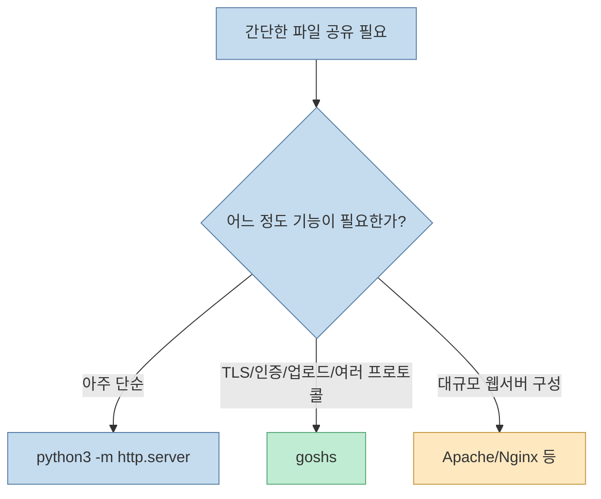
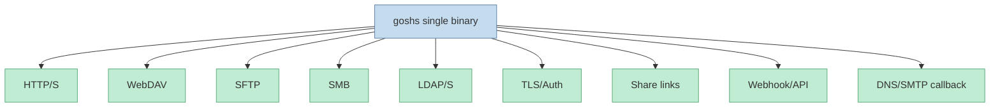
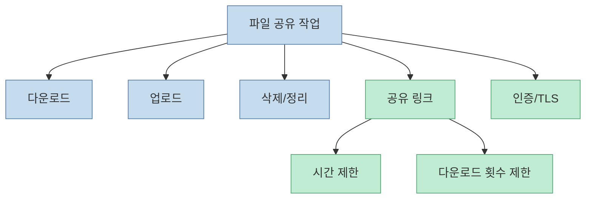
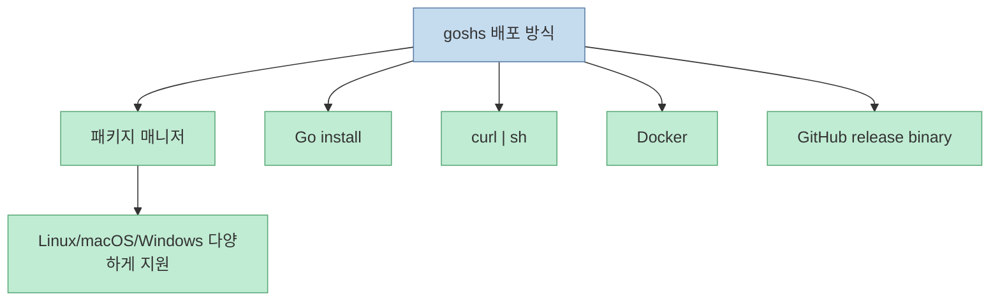
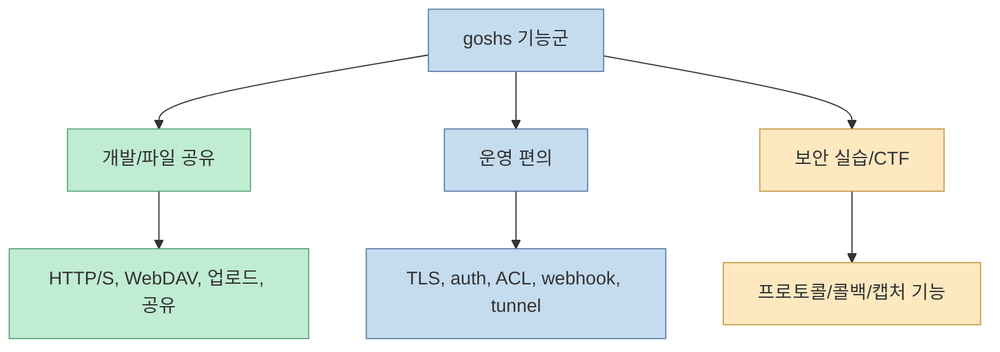
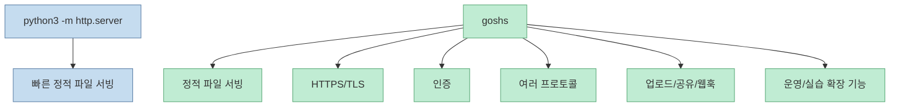
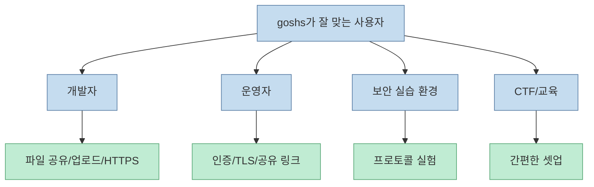

`python3 -m http.server`는 정말 편합니다. 하지만 파일 하나 빠르게 띄우는 수준을 넘어서면 금방 한계가 드러납니다. HTTPS가 필요하고, 인증이 필요하고, 업로드나 WebDAV가 필요하고, 더 나아가 여러 프로토콜을 함께 열어야 하면 즉시 다른 도구를 찾게 됩니다. `goshs`는 바로 그 지점을 겨냥한 도구입니다. 단일 바이너리 하나로 파일 서버, 인증, TLS, 여러 프로토콜, 공유 링크, 콜백 기능까지 묶어 놓은 Go 기반 서버입니다. [README](https://github.com/patrickhener/goshs)

<!--more-->

## Sources

- <https://github.com/patrickhener/goshs>
- 프로젝트 사이트: <https://goshs.de>
- 문서 사이트: <https://docs.goshs.de>

## goshs의 핵심 아이디어: “Apache까지는 무겁고, http.server는 너무 가볍다”

README의 첫 문장은 이 프로젝트의 포지션을 잘 드러냅니다. 파일을 옮기거나 빠르게 HTTPS 서버를 세워야 하는 순간, `python3 -m http.server`로는 부족하지만 Apache를 구성하기도 부담스럽다는 문제의식입니다. `goshs`는 이 중간 지점을 단일 실행 파일 하나로 메우려 합니다. [README](https://github.com/patrickhener/goshs)

즉 goshs는 "작지만 기능 많은 임시 서버"라는 위치를 차지합니다. 설치와 실행은 가볍게 유지하면서, 실전에서 자주 필요한 옵션은 넓게 챙긴 것이 특징입니다.

## 하나의 바이너리 안에 들어간 것들

README를 보면 goshs는 단순 HTTP 파일 서버가 아닙니다. HTTP/S, WebDAV, SFTP, SMB, LDAP/S, basic auth, certificate auth, self-signed 및 Let's Encrypt TLS, IP whitelist, file-based ACL, share link, webhook, JSON API, mDNS, localhost.run tunnel 같은 기능을 포함합니다. [README](https://github.com/patrickhener/goshs)

이 구성을 보면 goshs가 단순 "파일 올리고 받는 서버"가 아니라, **파일 전달·프로토콜 실험·운영 편의 기능을 한 번에 묶은 툴박스** 에 가깝다는 것을 알 수 있습니다.

## 파일 서버 관점에서 보면: 업로드, 다운로드, 공유, 인증이 한 세트다

가장 무난한 사용 시나리오는 파일 서버입니다. README는 drag & drop 업로드, POST/PUT 업로드, 삭제, bulk ZIP, QR code 생성, token-based share link, download limit, time limit 같은 기능을 제공합니다. [README](https://github.com/patrickhener/goshs)

이 조합이 중요한 이유는 실제 파일 전달 작업이 생각보다 빨리 운영 문제로 넘어가기 때문입니다. "파일 하나 잠깐 열자"로 시작해도 곧 "외부에 보내야 하니 HTTPS가 필요하다", "아무나 받으면 안 되니 인증이 필요하다", "다운로드 횟수를 제한하고 싶다"는 요구가 따라옵니다.

## goshs가 진짜 편한 이유: 설치 경로가 매우 넓다

README를 보면 설치 경로가 매우 폭넓습니다. curl|sh, `go install`, Kali/Parrot 패키지, Arch AUR, BlackArch, Alpine, Snap, Fedora COPR, openSUSE, Nix, Homebrew, Scoop, winget, Chocolatey, Docker, GitHub Releases까지 제공합니다. [README](https://github.com/patrickhener/goshs)

이 의미는 단순히 "설치 명령이 많다"가 아닙니다. 사용 환경이 제각각인 개발자, 보안 실습 환경, 리눅스 배포판, macOS, Windows에서 **똑같은 도구를 바로 가져다 쓸 수 있다** 는 뜻입니다.

단일 바이너리 툴의 강점은 결국 "필요한 순간 바로 쓸 수 있느냐"입니다. goshs는 이 점을 상당히 신경 쓴 프로젝트로 보입니다.

## 왜 Go로 만들었는가

저장소 메타데이터를 보면 이 프로젝트는 Go로 작성되어 있습니다. GitHub API 기준 기본 언어는 Go이고, 저장소 설명도 single-binary file server를 강조합니다. Go는 정적 바이너리 배포, 네트워크 서버 작성, cross-platform release, concurrency 처리에 유리하기 때문에 이런 도구와 궁합이 좋습니다. [GitHub API metadata](https://github.com/patrickhener/goshs)

즉 goshs의 "무엇이든 한 파일로 들고 다닌다"는 느낌은 구현 언어 선택과도 잘 맞아떨어집니다.

## 이 프로젝트가 특히 다른 점: 협업/실습/보안 도구가 같이 들어 있다

README에는 일반 파일 서버 기능 외에 DNS server, SMTP server, redirect endpoint, webhook, rev shell catcher, NTLM hash capture, LDAP credential capture 같은 기능도 나옵니다. [README](https://github.com/patrickhener/goshs)

이 부분은 분명히 보안 실습, CTF, red team, penetration testing 문맥에서 유용한 기능들입니다. 저장소 topic에도 `red-teaming`, `penetration-testing`, `offensive-security`, `ctf`가 포함되어 있습니다. [GitHub API metadata](https://github.com/patrickhener/goshs)

다만 이 기능들은 오남용 여지가 있으므로, 합법적이고 승인된 보안 실습, 자체 환경 테스트, 교육 목적에서만 다뤄야 합니다. 여기서는 사용 절차를 상세히 다루지 않고, 프로젝트의 성격을 설명하는 수준에 머무는 것이 적절합니다.

이 점 때문에 goshs는 일반 개발자 도구이면서 동시에 offensive security 쪽에서 관심을 받을 수 있는 경계형 툴입니다.

## `python3 -m http.server` 대체재라는 말의 진짜 의미

README는 goshs를 `python3 -m http.server` 대체재로 부릅니다. [README](https://github.com/patrickhener/goshs) 이 말을 곧이곧대로 "완전히 같은 범주의 더 좋은 버전"으로 이해하면 조금 부족합니다. 사실 goshs는 훨씬 큰 범위를 커버합니다.

즉 "간단한 한 줄 서버"라는 UX는 유지하되, 실전에서 곧바로 부딪히는 요구사항을 더 많이 감당하도록 확장한 도구라고 보는 편이 정확합니다.

## 어떤 사람에게 특히 맞을까

README만 봐도 대상 사용자는 꽤 분명합니다.

- 빠르게 안전한 파일 공유를 해야 하는 개발자
- HTTPS, 인증, 공유 링크까지 한 번에 필요한 운영자
- 여러 프로토콜을 테스트하거나 실습하는 보안 엔지니어/교육 환경
- 단일 바이너리 기반 툴을 선호하는 사용자

반대로 단순 정적 파일 한 번 띄우는 것이 전부라면 여전히 Python 내장 서버나 간단한 다른 도구가 더 충분할 수 있습니다.

## 실전 적용 포인트

첫째, goshs는 "무조건 대체" 도구라기보다 "요구사항이 하나만 더 생기면 내장 서버 대신 꺼낼 도구"에 가깝습니다.

둘째, 기능이 많은 만큼 기본 사용 시에도 어떤 포트, 어떤 인증, 어떤 프로토콜을 열고 있는지 명확히 알아야 합니다. 단일 바이너리의 편의성이 곧 설정 단순성을 의미하지는 않습니다.

셋째, 보안 실습용 기능은 합법적이고 승인된 환경에서만 다뤄야 합니다. 일반 파일 공유 목적과 offensive security 목적을 혼동하면 안 됩니다.

넷째, 팀에서 반복적으로 파일 전달/수집/공유가 일어난다면 HTTPS, basic auth, time-limited share link 같은 운영 기능의 체감 가치가 큽니다.

다섯째, 단일 바이너리 툴은 배포가 쉽지만, 그래서 더더욱 어떤 기능이 기본 활성화인지 문서를 먼저 읽고 들어가는 습관이 중요합니다.

## 핵심 요약

- goshs는 Go로 만든 단일 바이너리 파일 서버이며, `python3 -m http.server`보다 더 많은 실전 요구를 커버하려는 도구입니다. [README](https://github.com/patrickhener/goshs)
- HTTP/S, WebDAV, SFTP, SMB, LDAP/S, TLS, 인증, 업로드/삭제, 공유 링크, 웹훅, JSON API 등을 포함합니다.
- 설치 경로가 매우 넓어 Linux, macOS, Windows, Docker, 패키지 매니저 환경에서 바로 쓸 수 있습니다.
- 단순 파일 공유를 넘어 운영 편의와 여러 프로토콜 실험까지 하나의 실행 파일로 묶은 것이 특징입니다.
- 일부 기능은 보안 실습/CTF/레드팀 문맥에서 유용하지만, 오남용 가능성이 있으므로 합법적이고 승인된 환경에서만 다뤄야 합니다.

## 결론

goshs의 매력은 "기능이 많다"보다 "필요한 순간 바로 꺼내 쓸 수 있는 단일 바이너리"라는 점에 있습니다. 내장 서버의 가벼움과 실전 기능의 넓이를 동시에 잡으려는 시도라고 볼 수 있습니다.

그래서 이 프로젝트를 볼 때 중요한 질문은 "이게 Python 내장 서버보다 좋은가?"가 아니라, **"내가 필요한 실전 기능을 얼마나 빠르게 한 파일로 가져올 수 있는가?"** 입니다. 그 질문에 자주 "TLS도 필요하고, 인증도 필요하고, 업로드도 필요하고, 가끔은 여러 프로토콜도 필요하다"라고 답한다면, goshs는 꽤 설득력 있는 선택지입니다.
