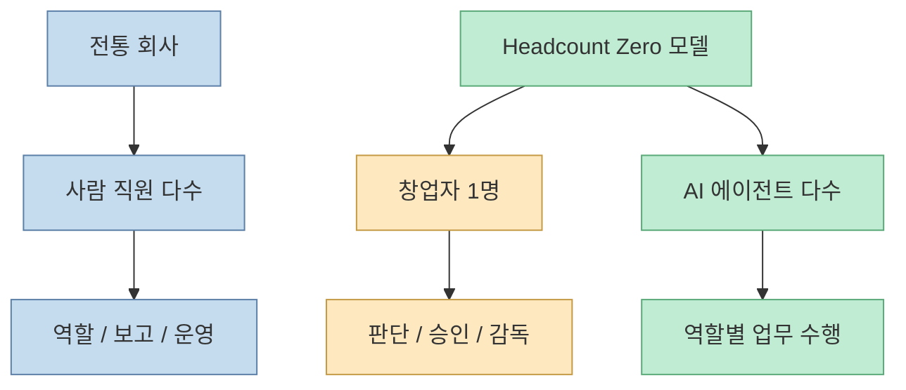
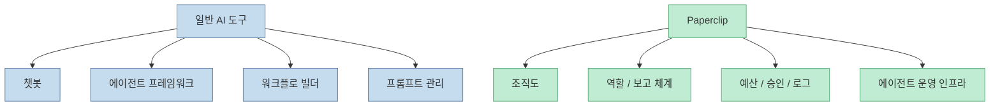
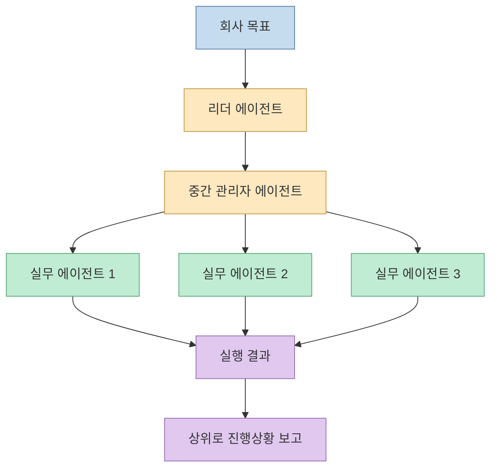
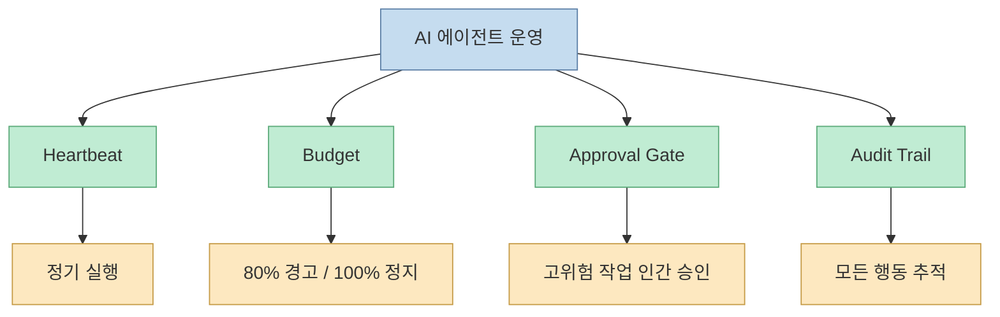
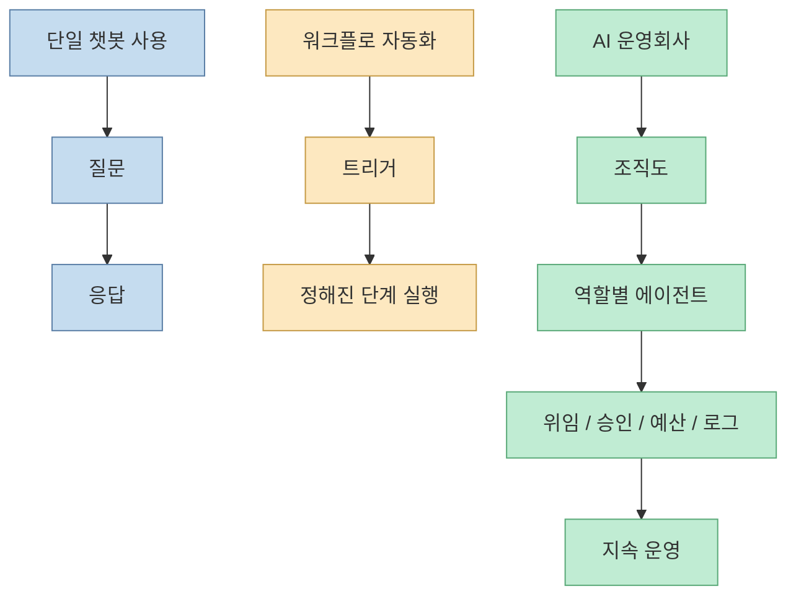
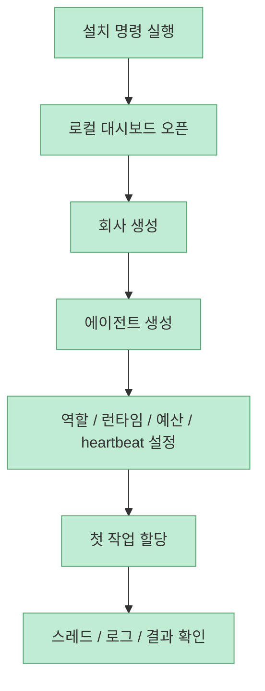
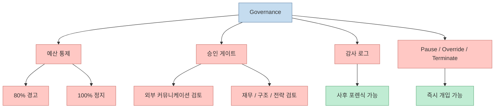
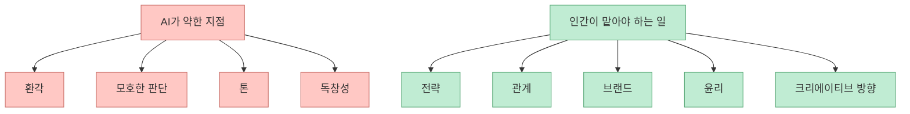
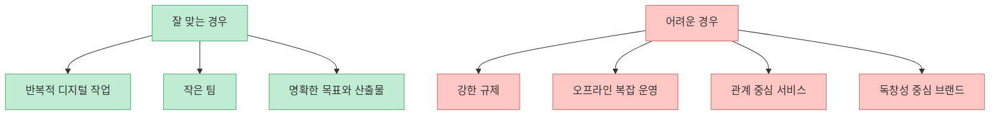

Anthony David Adams의 오픈소스 책 **Headcount Zero: How to Build an AI-Run Company with Paperclip** 은 자극적인 제목과 달리, 단순히 "AI가 사람을 완전히 대체한다"는 식의 과장된 선언에 머물지 않습니다. 이 책의 더 흥미로운 지점은 AI 에이전트를 몇 개 붙이는 수준이 아니라, **회사 운영 자체를 조직도, 예산, 승인 게이트, 감사 로그로 구조화된 시스템으로 바꾸려 한다는 점** 입니다. 중심 도구는 오픈소스 플랫폼 **Paperclip** 이고, 저자는 이것을 챗봇이나 자동화 툴이 아니라 "AI 회사의 운영체제"로 설명합니다.  

<!--more-->

## Sources

- <https://github.com/AnthonyDavidAdams/zero-employee-company-book>

## 이 책이 말하는 "직원 0명 회사"의 정확한 뜻

README에 따르면 이 책은 "AI agents as their entire workforce"라는 문구를 전면에 둡니다. 급여도, HR도, 전통적 직원도 없이, 한 명의 창업자와 조직도 전체를 채운 AI 에이전트, 그리고 그것을 조율하는 Paperclip으로 회사를 운영한다는 구상입니다.

하지만 책의 후반부를 읽어 보면, 이 개념은 **zero-human company**가 아니라 **one-human, many-agent company** 에 더 가깝습니다. Chapter 11은 "Zero-employee does not mean zero-human"이라고 분명하게 적습니다. 즉 사람의 노동을 줄이려는 구조이지, 사람의 판단 자체를 제거하려는 구조는 아닙니다.

따라서 이 책을 읽을 때 가장 먼저 버려야 할 오해는 "사람이 완전히 빠진다"는 상상입니다. 저자가 실제로 강조하는 것은 **노동의 자동화와 판단의 집중** 입니다.

## Paperclip은 챗봇도, 에이전트 프레임워크도, 워크플로 빌더도 아니라는 주장

Chapter 5에서 저자는 Paperclip을 정의할 때, 먼저 그것이 **무엇이 아닌지**를 길게 설명합니다.

- 챗봇이 아님
- LangChain, CrewAI, AutoGen 같은 agent framework가 아님
- Zapier, Make, n8n 같은 workflow builder가 아님
- prompt manager가 아님

그의 설명을 요약하면 이렇습니다. 기존 도구들은 대체로 "대화", "에이전트 제작", "사전 정의된 단계 연결", "프롬프트 관리"에 집중합니다. 반면 Paperclip은 이미 존재하는 에이전트들을 **조직처럼 배치하고 운영하는 관리 계층** 에 집중합니다.

이 차이는 꽤 중요합니다. 많은 AI 도구가 "작업 자동화"를 말하지만, 이 책은 작업보다 더 상위 개념인 **조직 구조 그 자체가 제품** 이라고 봅니다.

## 핵심 아이디어는 "AI를 사람처럼 조직한다"는 것이다

저자가 가장 강하게 미는 통찰은 단순합니다. 회사 일을 AI에게 시키고 싶다면, AI를 그냥 호출하지 말고 **회사처럼 조직하라** 는 것입니다.

Chapter 5는 다음 요소를 반복해서 설명합니다.

- 모든 에이전트는 역할과 직책을 가진다
- 누가 누구에게 보고하는지 정의된다
- 회사 목표는 위에서 아래로 cascade된다
- 여러 회사를 하나의 인스턴스에서 따로 운영할 수 있다

즉 에이전트는 API 호출 단위가 아니라, **역할을 가진 지속적 주체** 로 모델링됩니다.

이 구조는 오늘날 흔한 "AI에게 작업 하나 던지기"와 다릅니다. 저자는 그 방식이 샌드박스에는 유용하지만, 회사 운영으로 올라가려면 역할, 권한, 위임, 보고 체계가 필요하다고 봅니다.

## heartbeat, budget, approval gate, audit trail이 핵심 운영축이다

Paperclip 설명에서 가장 실무적으로 흥미로운 부분은 에이전트의 자율성보다, 그 자율성을 감싸는 **통제 장치** 입니다. Chapter 5와 9를 합쳐 보면 운영축은 네 가지입니다.

- heartbeat
- budget
- approval gate
- audit trail

### 1. Heartbeat

에이전트는 사용자가 매번 호출할 때만 움직이는 것이 아니라, 정해진 스케줄에 따라 깨어나 작업합니다. 콘텐츠 라이터는 매일, SEO 에이전트는 매주, 리서치 에이전트는 매월 같은 식입니다.

### 2. Budget

각 에이전트에는 월별 예산 상한이 있고, 80%에 도달하면 경고, 100%에 도달하면 정지합니다. 책은 이것을 제안이 아니라 **기계적 강제** 라고 설명합니다.

### 3. Approval gate

고객 메일, 게시, 가격 변경, 조직도 수정 같은 중요한 작업은 사람 승인 없이는 진행되지 않도록 게이트를 둡니다.

### 4. Audit trail

모든 툴 호출, 결정, 위임, 출력이 수정 불가능한 로그로 남습니다.

이 점에서 이 책은 AI 에이전트를 "똑똑한 비서"보다 **예산과 감사를 받는 디지털 부서** 에 가깝게 취급합니다.

## 이 모델이 챗봇 기반 자동화보다 한 단계 위인 이유

많은 팀이 AI를 쓸 때 아직도 프롬프트와 출력 사이에 머뭅니다. 하지만 이 책의 구상은 그보다 상위 층입니다. 핵심은 "에이전트 한 명의 능력"보다 **에이전트 조직의 운영성** 입니다.

저자의 주장에 동의하든 아니든, 이 구분은 꽤 유효합니다. 지금 AI 업계에서 반복되는 많은 실험은 아직 "작업 자동화" 단계에 머물러 있고, 이 책은 그것을 **조직 자동화** 로 밀어 올리려 합니다.

## 실제 온보딩 메시지는 의외로 단순하다

Chapter 7은 굉장히 공격적인 메시지를 던집니다. "다른 탭 닫고 터미널을 열어라. 30분 안에 첫 AI 회사를 띄울 수 있다." 설치도 `npx paperclipai onboard --yes` 한 줄로 제시합니다. 임베디드 Postgres를 포함해 플랫폼을 띄우고, 로컬 대시보드에서 회사 이름, 설명, 목표, 에이전트 역할, 런타임, 예산, heartbeat를 설정한 뒤 첫 작업을 맡기는 흐름입니다.

이 장이 시사하는 것은 두 가지입니다.

- 이 비전은 완전히 추상적인 선언이 아니라, 적어도 저자가 의도한 UX 상으로는 빠른 데모가 가능해야 한다
- 동시에 진입 장벽을 "기술적 구축"이 아니라 "운영 설계"로 옮기려 한다

즉 차별점은 "에이전트를 만드는 법"보다, **회사처럼 굴러가게 만드는 법** 을 사용자 경험으로 감싸려는 데 있습니다.

## 저자가 가장 진지하게 보는 것은 governance다

이 책이 단순한 낙관론을 조금 벗어나는 지점은 Chapter 9입니다. 여기서 저자는 "장난감에는 기능이 있지만, 회사에는 governance가 있다"고 말합니다. 즉 진짜 회사가 되려면 기능보다 **통제 메커니즘** 이 먼저라고 보는 셈입니다.

Chapter 9는 세 층의 예산 통제를 제시합니다.

- agent별 월 예산 상한
- 80% 도달 경고
- 100% 도달 정지

또한 어떤 작업은 반드시 gate하라고 제안합니다.

- 외부 커뮤니케이션
- 게시
- 재무 결정
- 구조 변경
- 전략 실행

실제로 이 부분은 현재의 agentic coding, AI ops, autonomous workflow 논의에서도 가장 현실적인 층입니다. 성능보다 먼저 필요한 것은 **폭주 방지, 승인 체계, 로그 추적** 이기 때문입니다.

## 책의 후반부는 오히려 "인간은 빠질 수 없다"는 쪽에 가깝다

Chapter 11은 이 책 전체를 과열된 주장으로 읽지 않게 만드는 균형점입니다. 저자는 AI 에이전트의 실패 모드를 네 가지로 정리합니다.

- hallucination
- ambiguity
- tone
- originality

여기서 저자가 말하는 인간의 역할은 단순 리뷰어가 아닙니다. 그는 다섯 가지를 **오직 인간만 할 수 있는 일** 로 둡니다.

- 전략
- 관계
- 브랜드
- 윤리
- 크리에이티브 디렉션

이 부분을 보면 책의 핵심은 "사람이 필요 없다"가 아니라, **사람이 해야 할 일이 노동에서 판단으로 이동한다** 는 주장에 더 가깝습니다.

## 그래서 이 모델은 누구에게 맞는가

책 내용을 그대로 받아 적으면, 가장 잘 맞는 대상은 다음과 같습니다.

- 콘텐츠 회사
- 소규모 이커머스 운영
- 리서치·리포트 기반 서비스
- 반복적 내부 운영이 많은 1인 또는 초소형 팀

반대로 바로 한계가 드러나는 영역도 분명합니다.

- 고도의 대인 신뢰가 중요한 사업
- 강한 규제와 법적 책임이 걸린 운영
- 독창성과 감각이 핵심 경쟁력인 브랜드
- 현장 실행과 오프라인 운영이 많은 업종

즉 이 책은 모든 회사를 대체하는 보편 모델이라기보다, **디지털 작업 비중이 높고 조직 설계를 소프트웨어처럼 다룰 수 있는 사업** 에 더 잘 맞는 청사진입니다.

## 핵심 요약

- **Headcount Zero** 는 AI 에이전트로 회사 전체 인력을 대체한다는 도발적 비전을 제시하지만, 실제 내용은 "사람 없는 회사"보다 "사람 1명 + 에이전트 조직"에 가깝다
- 중심 도구 **Paperclip** 은 챗봇이나 워크플로 빌더가 아니라, 에이전트 조직을 운영하는 인프라로 설명된다
- 핵심 설계 요소는 조직도, 목표 cascade, heartbeat, 예산, 승인 게이트, 감사 로그다
- Chapter 7은 빠른 설치와 실험 가능성을 강조하지만, 진짜 차별점은 설치 편의보다 운영 모델에 있다
- Chapter 9는 governance를 전면에 두며, budget cap, approval gate, audit trail, kill switch를 핵심으로 본다
- Chapter 11은 hallucination, ambiguity, tone, originality 문제를 지적하며, 전략·관계·브랜드·윤리·창의 방향은 결국 인간의 몫이라고 정리한다

## 결론

이 책의 제목만 보면 "직원 없는 회사"라는 과장된 미래 마케팅처럼 들릴 수 있습니다. 하지만 내용을 뜯어보면, 더 본질적인 질문을 던집니다.  

**AI를 몇 개 더 붙이는 것이 아니라, 회사를 운영체제로 다시 설계할 수 있는가.**

Headcount Zero의 제안은 아직 거칠고, 실제로는 많은 업종에서 바로 적용되기 어렵습니다. 그럼에도 불구하고 흥미로운 이유는 분명합니다. 오늘의 AI 도구들이 대부분 개인 생산성이나 작업 자동화에 머무는 동안, 이 책은 그보다 한 층 위인 **조직 구조와 통제 구조의 자동화** 를 이야기하고 있기 때문입니다.  

결국 이 비전의 성공 여부는 모델 성능보다, **얼마나 좋은 governance와 얼마나 선명한 인간 판단을 함께 붙일 수 있느냐** 에 달려 있습니다.
