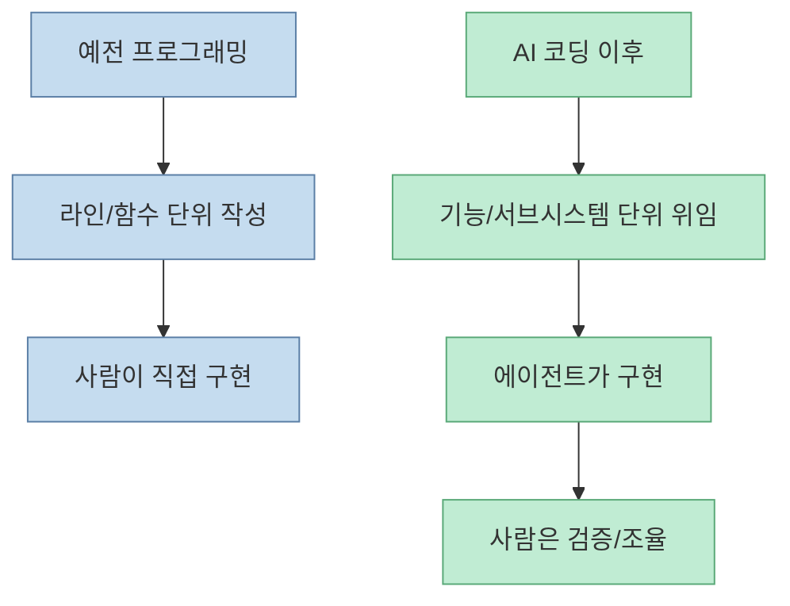
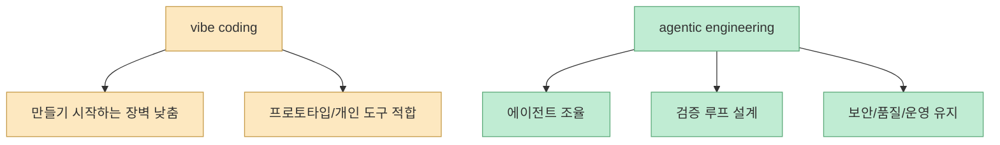
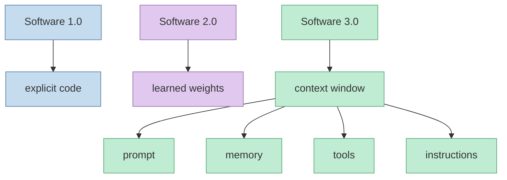
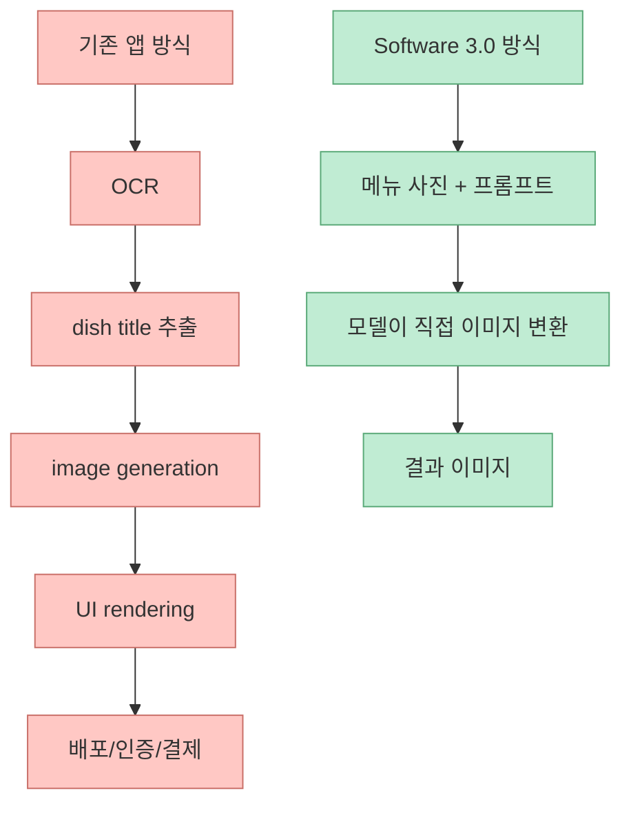
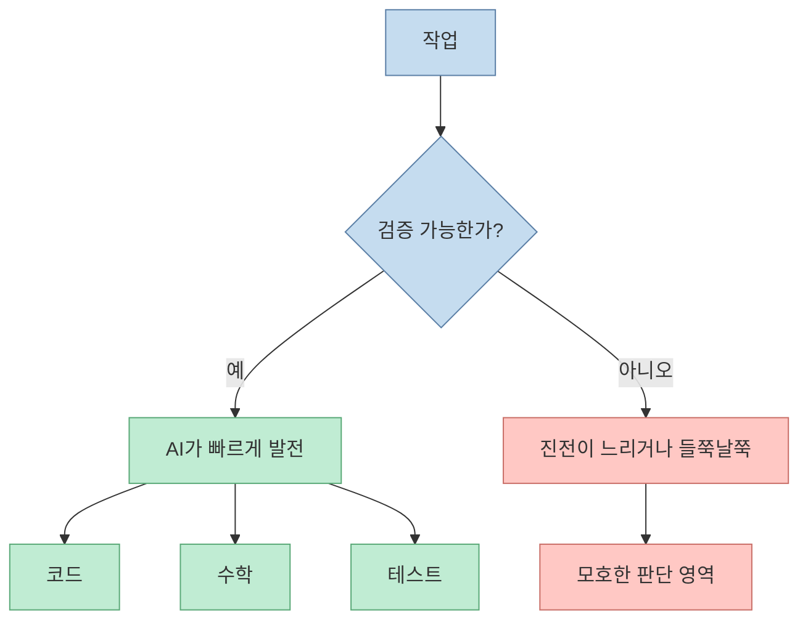
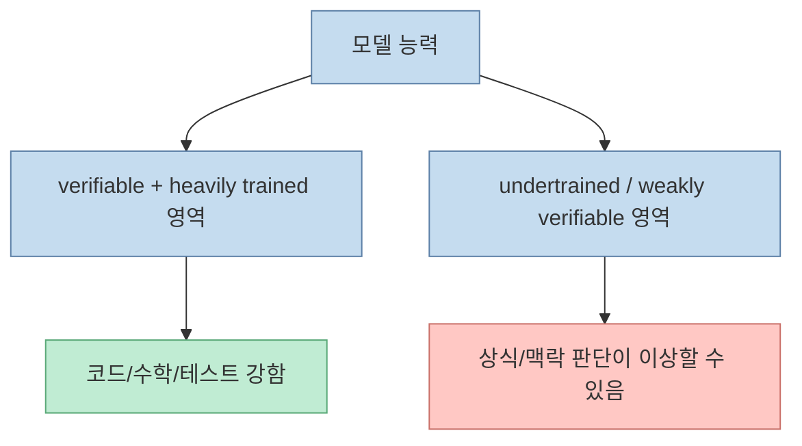
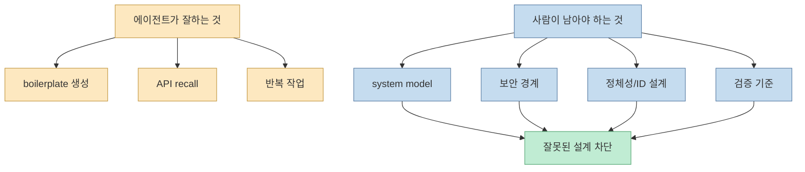
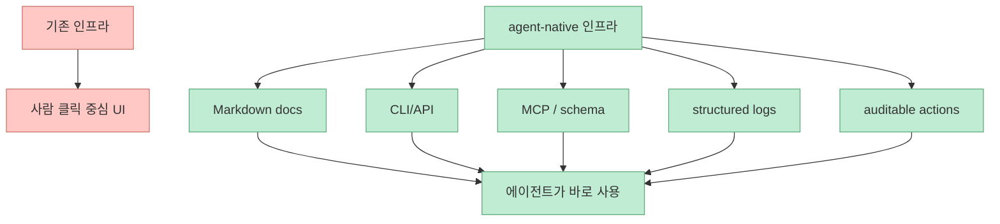
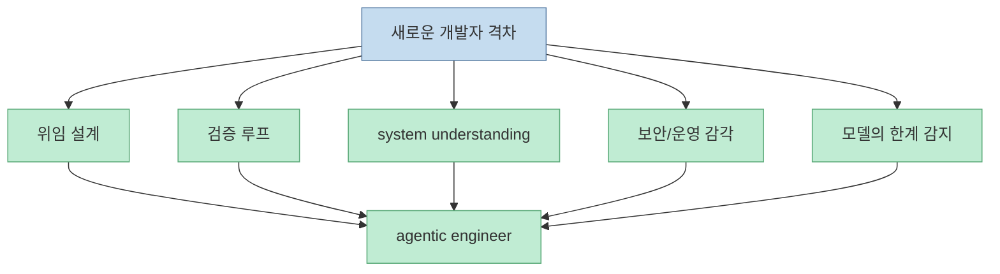

Andrej Karpathy가 Sequoia 대담에서 "프로그래머로서 이렇게 뒤처진 느낌은 처음"이라고 말했을 때, 그 뜻은 단순히 AI가 코드를 잘 짠다는 의미가 아니었습니다. 아일의 워크룸 영상은 이 발언을 개발자의 기본 작업 단위가 바뀌고 있다는 신호로 읽습니다. 이제 중요한 것은 몇 줄을 직접 타이핑하느냐가 아니라, 얼마나 큰 작업을 에이전트에게 위임하고 그 결과를 검증할 수 있느냐입니다. [00:00](https://youtu.be/dlAn9H8goUA?t=0)

<!--more-->

## Sources

- <https://youtu.be/dlAn9H8goUA?si=H8ggHAsNlnc6fk08>
- Karpathy 글: <https://karpathy.bearblog.dev/sequoia-ascent-2026/>
- Sequoia 원본 영상: <https://www.youtube.com/watch?v=96jN2OCOfLs>
- Karpathy 개인 사이트: <https://karpathy.ai/>

## “뒤처졌다”는 말의 진짜 의미

Karpathy 글을 보면 그가 뒤처졌다고 느낀 이유는 프로그래밍이 예전보다 더 어려워졌기 때문이 아닙니다. 2025년 12월 무렵부터 agentic 도구가 더 큰 코드 덩어리를 더 일관되게 생성하기 시작했고, 자신도 점점 더 많은 일을 에이전트에게 맡기게 되었다는 점이 핵심입니다. [Karpathy 글](https://karpathy.bearblog.dev/sequoia-ascent-2026/)

영상도 이 지점을 "기본 단위가 바뀌고 있다"는 말로 해석합니다. [01:35](https://youtu.be/dlAn9H8goUA?t=95)

즉 뒤처짐은 도구 사용법을 늦게 배웠다는 뜻보다, **작업을 바라보는 단위가 바뀌는 속도** 를 체감했다는 뜻에 가깝습니다.

## vibe coding과 agentic engineering은 같은 말이 아니다

영상은 1:35부터 vibe coding과 agentic engineering을 구분합니다. [01:35](https://youtu.be/dlAn9H8goUA?t=95) Karpathy 글에서도 둘을 분리해 설명합니다. vibe coding은 소프트웨어 제작의 진입장벽을 낮춰 거의 누구나 만들게 해 주지만, agentic engineering은 fallible agent를 조율하면서 correctness, security, maintainability를 지키는 전문 작업입니다.

따라서 AI 코딩 시대에 개발자가 덜 중요해지는 것이 아니라, 오히려 **프롬프트보다 검증 구조를 설계하는 사람** 의 가치가 커집니다.

## Software 3.0: 프로그램이 코드에서 컨텍스트로 이동한다

영상은 5:06부터 Software 3.0과 context 개념을 설명합니다. [05:06](https://youtu.be/dlAn9H8goUA?t=306) Karpathy는 이를 세 단계로 구분합니다.

- Software 1.0: 사람이 코드를 직접 쓴다
- Software 2.0: 데이터와 목표로 신경망을 학습시킨다
- Software 3.0: LLM에게 prompt, context, examples, tools, memory를 주어 프로그래밍한다

이 관점에서 설치 스크립트조차 바뀝니다. Karpathy는 복잡한 cross-platform shell script 대신, "이 블록을 에이전트에게 붙여 넣으면 알아서 환경을 보고 설치하는" 형태가 더 강력하다고 봅니다. 이것은 코드가 사라진 것이 아니라, 프로그램의 매체가 **정확한 절차 코드에서 적응형 컨텍스트** 로 옮겨간 것입니다.

## MenuGen 사례: 어떤 소프트웨어는 앱으로 존재할 필요가 없어진다

영상은 6:56에서 MenuGen 사례를 통해 Software 3.0을 설명합니다. [06:56](https://youtu.be/dlAn9H8goUA?t=416) Karpathy 글에서 MenuGen은 원래 OCR, 이미지 생성, 프론트엔드, 배포, 인증을 갖춘 전통적인 웹앱이었습니다. 그러나 나중에는 "메뉴 사진을 넣고 dish 이미지를 직접 overlay 해 달라"고 multimodal model에 요청하는 방식으로 많은 앱 층이 사라질 수 있음을 봤다고 설명합니다. [Karpathy 글](https://karpathy.bearblog.dev/sequoia-ascent-2026/)

이 사례는 단순히 "더 빠르게 앱을 만든다"가 아니라, 어떤 앱은 아예 앱으로 존재할 필요가 없다는 점을 보여 줍니다. 개발자는 이제 "무엇을 더 빨리 만들까?"보다 "무엇은 더 이상 이렇게 만들 필요가 없을까?"를 묻게 됩니다.

## verifiability: 왜 코딩에서 AI가 유독 빨라졌는가

영상은 8:34에서 `verifiability`를 다룹니다. [08:34](https://youtu.be/dlAn9H8goUA?t=514) Karpathy는 전통적 소프트웨어가 "명세할 수 있는 것"을 자동화했다면, 최신 LLM과 RL 시스템은 "검증할 수 있는 것"을 자동화한다고 봅니다.

코딩은 왜 빨리 좋아졌을까요. 테스트가 pass/fail로 나뉘고, 프로그램이 실행되거나 crash 나고, diff를 inspection할 수 있기 때문입니다. 즉 자동 reward가 있는 영역입니다.

이 프레임을 이해하면 AI 코딩 도구가 왜 chat bot보다 훨씬 인상적이었는지도 설명됩니다. 코드는 AI가 연습하고 검증하기 좋은 세계이기 때문입니다.

## jagged intelligence: 똑똑함은 매끈하게 분포하지 않는다

영상은 같은 구간에서 `jagged intelligence`도 함께 설명합니다. [08:34](https://youtu.be/dlAn9H8goUA?t=514) Karpathy는 최신 모델이 어떤 영역에서는 놀라울 정도로 강하지만, 다른 영역에서는 기초적인 판단도 이상하게 틀리는 이유를 verifiability와 training attention의 결합으로 해석합니다.

예를 들어 모델은 거대한 코드베이스를 리팩터링하면서도, 다른 맥락에서는 상식적인 생활 판단을 이상하게 할 수 있습니다. 즉 지능이 사람처럼 매끄럽게 퍼져 있지 않습니다.

그래서 개발자는 AI를 "대체 인간"이 아니라 **비대칭적으로 강한 도구** 로 다뤄야 합니다. 강한 축에서는 레버리지로 쓰고, 약한 축에서는 guardrail을 세워야 합니다.

## 테스트와 system model: 이해는 아웃소싱할 수 없다

영상은 10:37부터 테스트와 system model을 강조하고, 13:28에 "이해는 아웃소싱할 수 없다"고 정리합니다. [10:37](https://youtu.be/dlAn9H8goUA?t=637) [13:28](https://youtu.be/dlAn9H8goUA?t=808)

Karpathy도 같은 맥락에서, 에이전트가 API 파라미터나 라이브러리 세부는 기억해 줄 수 있어도, 사람은 여전히 storage, view, memory copy, identity, security boundary, system invariants를 이해해야 한다고 말합니다. [Karpathy 글](https://karpathy.bearblog.dev/sequoia-ascent-2026/)

이 때문에 개발자의 역할은 줄어드는 것이 아니라 더 추상적인 층으로 이동합니다. 직접 모든 코드를 쓰는 비중은 줄어들 수 있지만, 무엇이 맞는 시스템인지 판단하는 비중은 커집니다.

## agent-native infrastructure: 사람 클릭용 소프트웨어에서 에이전트용 표면으로

영상은 12:22에서 `agent-native infrastructure`를 언급하고, 12:52에 배포와 운영 경계를 이야기합니다. [12:22](https://youtu.be/dlAn9H8goUA?t=742) [12:52](https://youtu.be/dlAn9H8goUA?t=772)

Karpathy는 문서, CLI, API, MCP server, structured log, machine-readable schema, auditable action처럼 agent가 바로 읽고 조작할 수 있는 surface가 더 중요해진다고 봅니다. [Karpathy 글](https://karpathy.bearblog.dev/sequoia-ascent-2026/)

이 변화는 도구를 만드는 팀에도 직접적입니다. 제품은 이제 "사람이 UI를 클릭하기 쉽다"뿐 아니라 "에이전트가 오해 없이 조작하기 쉽다"도 만족해야 합니다.

## 개발자 격차는 어디서 커질까

영상의 마지막은 개발자 격차가 어디서 벌어질지를 짚습니다. [14:21](https://youtu.be/dlAn9H8goUA?t=861) 단순히 AI를 쓰는지 여부가 아니라, 다음을 얼마나 잘하느냐가 중요해집니다.

- 작업을 에이전트에게 분해해 위임하는 능력
- 검증 가능한 성공 기준을 세우는 능력
- system model과 business logic을 이해하는 능력
- 보안/운영 경계를 설계하는 능력
- 에이전트가 off the rails일 때 감지하는 능력

결국 중요한 것은 코드를 직접 더 빨리 치는 손이 아니라, 에이전트가 일하는 레일을 설계하는 능력입니다.

## 실전 적용 포인트

첫째, AI 코딩 도구를 "빠른 자동완성"으로만 쓰지 말고, 기능 단위/서브시스템 단위로 위임하는 연습을 해야 합니다.

둘째, 위임 전에 success criteria를 먼저 씁니다. 테스트, diff 기준, 보안 체크, 배포 조건이 있어야 에이전트 결과를 검증할 수 있습니다.

셋째, system model을 이해하지 못하는 영역은 그대로 위임하면 안 됩니다. 계정 연결, 결제, identity, 권한, 데이터 삭제 같은 곳은 사람이 더 깊게 봐야 합니다.

넷째, 문서와 도구를 agent-native하게 바꾸는 것이 중요합니다. 클릭 가이드 대신 CLI, structured docs, reproducible setup, machine-readable config가 필요합니다.

다섯째, AI의 이상한 실수는 "멍청하다"로 끝내지 말고, 그 작업이 verifiable한지, training attention이 충분한지, guardrail이 있는지로 해석해야 합니다.

## 핵심 요약

- Karpathy가 말한 "뒤처짐"은 AI가 코드를 잘 짠다는 뜻보다, 개발자의 작업 단위가 더 큰 위임 단위로 바뀌는 변화를 의미합니다. [00:00](https://youtu.be/dlAn9H8goUA?t=0)
- vibe coding은 진입장벽을 낮추고, agentic engineering은 품질과 검증을 유지하며 에이전트를 조율하는 전문 작업입니다. [01:35](https://youtu.be/dlAn9H8goUA?t=95)
- Software 3.0에서는 코드보다 context window가 더 중요한 프로그램 매체가 됩니다. [05:06](https://youtu.be/dlAn9H8goUA?t=306)
- MenuGen 사례는 어떤 앱은 더 이상 전통적인 앱으로 존재할 필요가 없을 수 있음을 보여 줍니다. [06:56](https://youtu.be/dlAn9H8goUA?t=416)
- AI가 코딩에서 빠르게 발전한 이유는 verifiability 때문이며, 동시에 jagged intelligence 때문에 여전히 guardrail과 human judgment가 필요합니다. [08:34](https://youtu.be/dlAn9H8goUA?t=514)
- 이해는 아웃소싱할 수 없고, system model과 검증 책임은 오히려 더 중요해집니다. [13:28](https://youtu.be/dlAn9H8goUA?t=808)

## 결론

AI 코딩 시대에 개발자의 가치가 사라지는 것이 아닙니다. 가치가 이동하는 것입니다. 코드 작성 그 자체는 덜 희소해지고, 대신 이해, taste, 검증, 보안, orchestration이 더 희소해집니다.

Karpathy의 "뒤처짐"은 그래서 위기라기보다 경고에 가깝습니다. 여전히 예전 방식으로만 일하면 뒤처질 수 있지만, 에이전트와 함께 일하는 새로운 기본 단위를 익히면 더 큰 레버리지를 얻을 수 있습니다. 앞으로의 격차는 코드를 얼마나 빨리 쓰느냐가 아니라, **얼마나 잘 위임하고 검증하느냐** 에서 벌어질 가능성이 큽니다.
