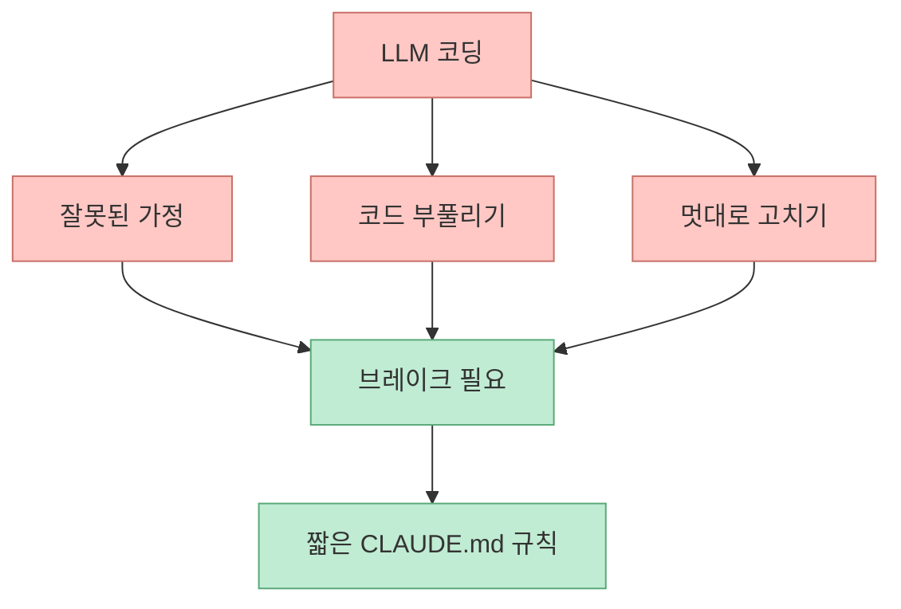
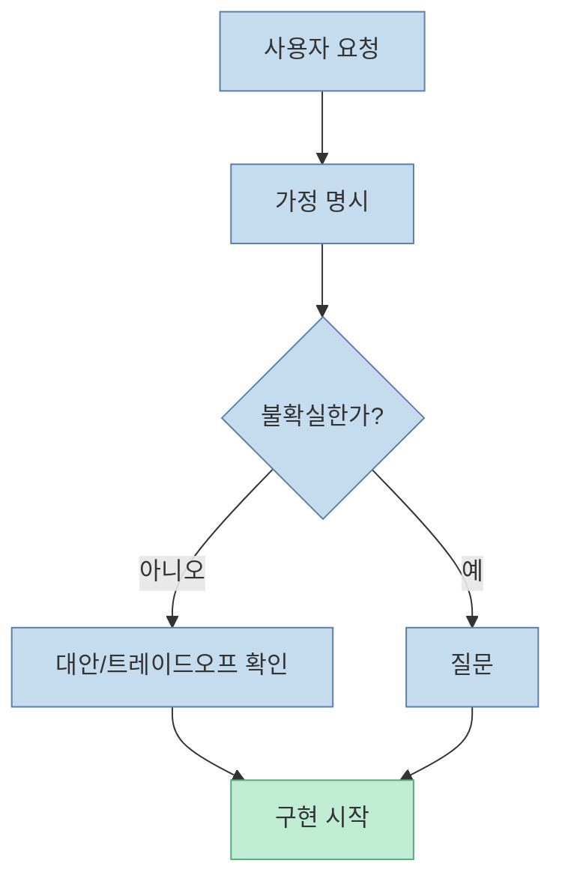
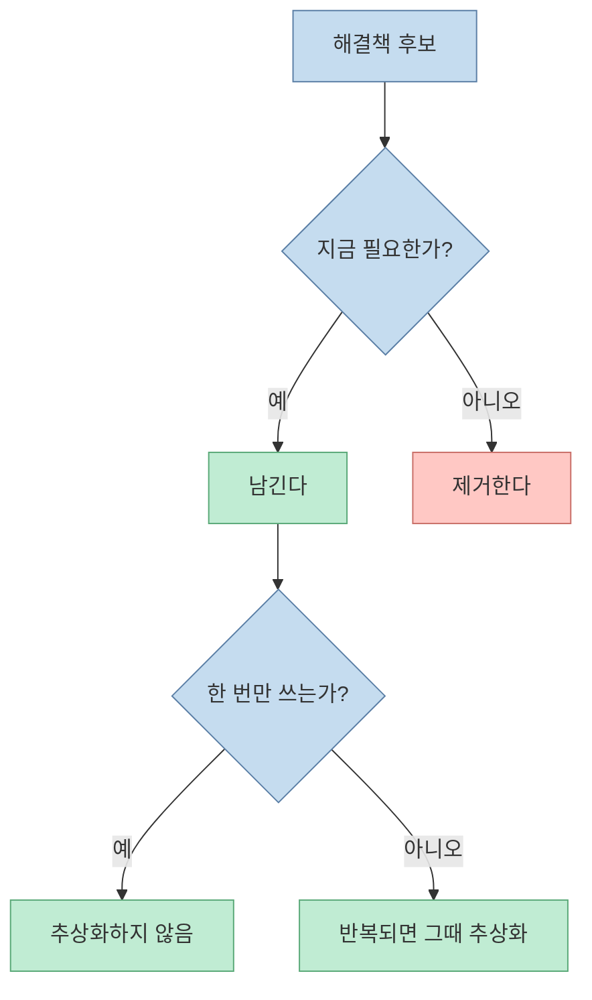
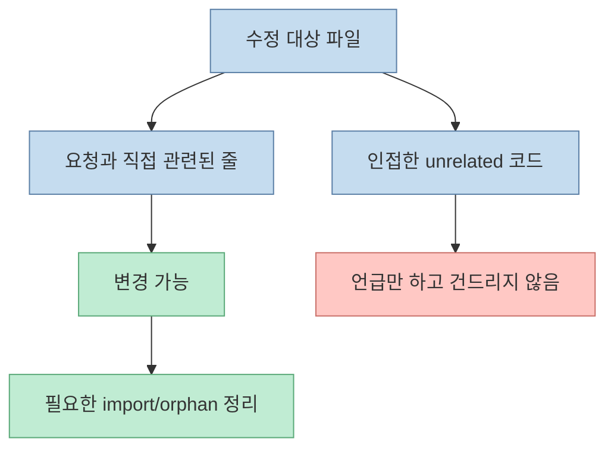
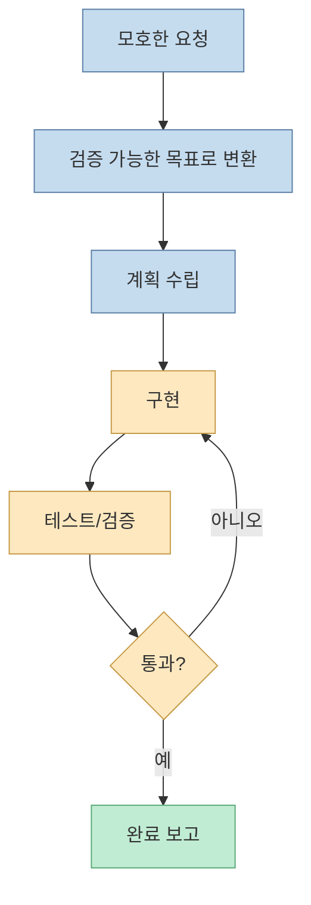
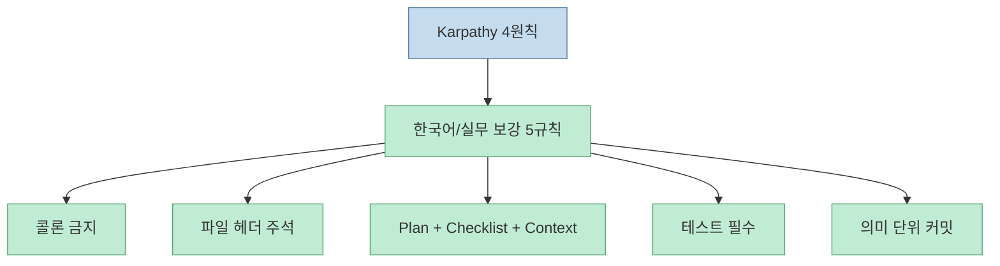
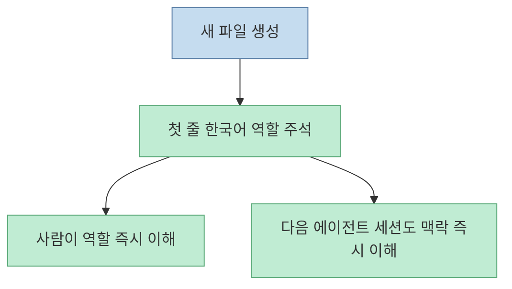
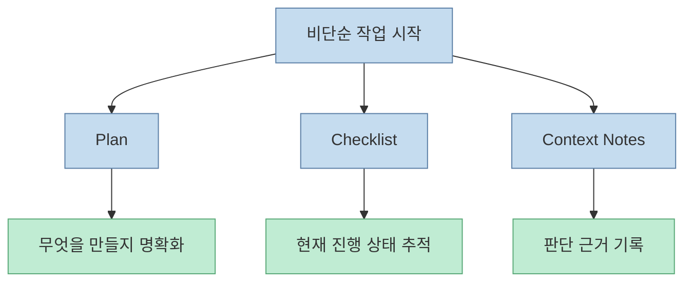
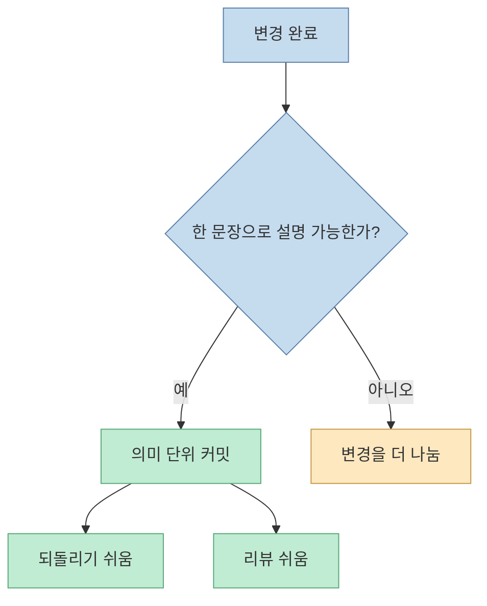
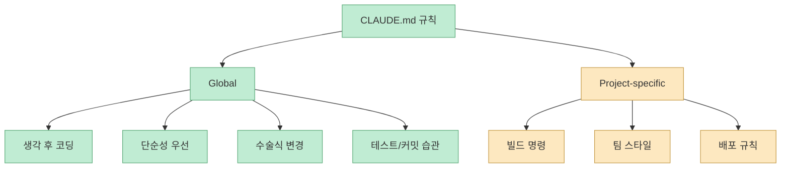

안드레이 카파시 아이디어에서 출발한 `65줄 CLAUDE.md`가 널리 퍼진 이유는 간단합니다. AI가 코드를 못 짜서가 아니라, 너무 잘 짜서 생기는 문제를 줄여 주기 때문입니다. 미드나잇 로그 영상은 이 65줄짜리 원본의 핵심 4원칙과, 한국어 실무 환경에서 실제로 운영하며 추가한 5가지 규칙을 함께 설명합니다. [0:00](https://youtu.be/xnNFexW9Wrk?t=0)

<!--more-->

## Sources

- <https://youtu.be/xnNFexW9Wrk?si=5FFS1s4NyeK-LVRe>
- 원본 CLAUDE.md: <https://github.com/forrestchang/andrej-karpathy-skills/blob/main/CLAUDE.md>
- 커스텀 CLAUDE.md: <https://github.com/datajuny/andrej-karpathy-skills/blob/main/CLAUDE.md>

## 왜 65줄짜리 CLAUDE.md가 퍼졌는가

영상은 안드레이 카파시를 "AI 계의 GD"처럼 소개하며, 그의 짧은 글이 몇 시간 만에 65줄짜리 `CLAUDE.md`로 정리되어 GitHub에서 빠르게 확산됐다고 설명합니다. [0:57](https://youtu.be/xnNFexW9Wrk?t=57)

핵심 메시지는 단순합니다. AI는 코드를 못 짜는 것이 아니라, 너무 잘 짜서 문제를 만든다는 것입니다. 즉 필요 이상으로 복잡하게 만들고, 사용자 의도를 추정해서 멋대로 고치고, 인접한 코드까지 "개선"하려 드는 경향을 제어해야 합니다.

즉 이 파일의 목적은 능력을 늘리는 것이 아니라, **과잉 행동을 줄이는 것** 입니다.

## 카파시 4원칙 1: Think Before Coding

첫 번째 원칙은 `Think Before Coding`입니다. 원본은 "Don't assume. Don't hide confusion. Surface tradeoffs."라고 요약합니다. 구현 전에 가정을 명시하고, 불확실하면 묻고, 더 단순한 접근이 있으면 말하고, 헷갈리면 멈추라는 규칙입니다.

영상은 이를 "코딩 전에 먼저 생각"으로 소개합니다. [3:58](https://youtu.be/xnNFexW9Wrk?t=238)

이 규칙이 중요한 이유는 Claude Code가 애매한 요청에서도 자신 있게 움직이기 때문입니다. "잘못 이해한 채 빨리 구현"하는 것이 "느리지만 먼저 묻는 것"보다 더 비쌉니다.

## 카파시 4원칙 2: Simplicity First

두 번째 원칙은 `Simplicity First`입니다. 원본은 "Minimum code that solves the problem. Nothing speculative."라고 정리합니다. 요구하지 않은 기능, 일회성 코드를 위한 추상화, 미래를 위한 유연성, 불필요한 예외 처리를 넣지 말라고 합니다.

영상은 이를 "단순하게 먼저"라고 설명합니다. [3:58](https://youtu.be/xnNFexW9Wrk?t=238)

AI는 "혹시 나중에 필요할 수도 있지 않을까?"를 너무 좋아합니다. 이 원칙은 그 미래 상상을 끊고, 현재 요청만 해결하게 만듭니다.

## 카파시 4원칙 3: Surgical Changes

세 번째 원칙은 `Surgical Changes`입니다. 원본은 "Touch only what you must. Clean up only your own mess."라고 말합니다. 관련 없는 주석, 포맷팅, 인접 코드, 기존 dead code를 멋대로 정리하지 말고, 내 변경으로 생긴 쓰레기만 치우라는 뜻입니다.

영상은 이를 "외과수술처럼 정확하게"라고 설명합니다. [3:58](https://youtu.be/xnNFexW9Wrk?t=238)

이 규칙은 diff를 작게 유지합니다. 결과적으로 리뷰가 쉬워지고, rollback도 쉬워지고, AI가 "좋은 의도"로 만든 부수 피해를 줄일 수 있습니다.

## 카파시 4원칙 4: Goal-Driven Execution

네 번째 원칙은 `Goal-Driven Execution`입니다. 원본은 성공 기준을 먼저 정의하고, 검증 가능한 형태로 루프를 만들라고 합니다. "버그 고치기"가 아니라 "버그를 재현하는 테스트를 먼저 만들고 통과시키기" 같은 식입니다.

영상은 이를 "성공 기준 먼저"라고 요약합니다. [3:58](https://youtu.be/xnNFexW9Wrk?t=238)

이 원칙이 있으면 Claude가 "다 된 것 같아요"라고 말하기 전에 실제로 확인해야 할 check가 생깁니다.

## 한국어 실무 환경에서 추가한 5가지 규칙

영상은 9:03부터 원본에 더해 실제 운영하면서 추가한 다섯 가지 규칙을 설명합니다. [9:03](https://youtu.be/xnNFexW9Wrk?t=543) 커스텀 `CLAUDE.md`를 보면 핵심은 다음 다섯 갈래입니다.

- 한국어 문장 끝에 콜론 쓰지 않기
- 새 소스 파일 첫 줄에 한국어 역할 주석
- 비단순 작업 전 `Plan + Checklist + Context Notes`
- 완료 전에 테스트 실행
- 의미 단위 커밋

즉 원본 4원칙이 "AI의 과잉 행동을 줄이는 브레이크"라면, 추가 5규칙은 "한국어 실무에서 운영 가능한 작업 습관"을 붙이는 역할입니다.

## 추가 규칙 1: 한국어 문장 끝에 콜론 금지

커스텀 버전의 5번 규칙은 한국어 출력에서 문장 끝에 `:` 를 쓰지 말라는 것입니다. 영어 문서를 많이 학습한 LLM은 한국어에서도 "문장 + 콜론 + 목록" 습관을 그대로 가져오곤 합니다.

이 규칙은 사소해 보이지만, 한국어 문서 톤을 정리하고 산출물을 덜 번역투처럼 보이게 합니다.

## 추가 규칙 2: 새 파일 첫 줄에 한국어 역할 주석

커스텀 6번 규칙은 새 소스 파일 첫 줄에 그 파일의 역할을 설명하는 한국어 한 줄 주석을 넣으라고 합니다. 예: `// 사용자 인증 상태를 관리하는 Context Provider`

이 규칙은 사람이 아니라 **다음 세션의 에이전트** 를 위한 맥락 장치이기도 합니다. 파일 전체를 다시 읽지 않아도 역할을 빠르게 파악할 수 있기 때문입니다.

## 추가 규칙 3: Plan + Checklist + Context Notes

커스텀 7번 규칙은 비단순 작업 전에 세 가지 산출물을 요구합니다.

- Plan
- Checklist (`checklist.md`)
- Context Notes (`context-notes.md`)

이 규칙은 장기 작업, 여러 세션, 여러 에이전트가 얽힌 상황에서 특히 유용합니다. 단순히 "계획을 세워라"보다 한 단계 더 나아가, 체크리스트와 작업 중 판단 근거까지 기록하게 합니다.

이 규칙은 세션이 끊겨도 작업을 다시 이어 붙이기 쉽게 만듭니다.

## 추가 규칙 4: 완료 전 테스트

커스텀 8번 규칙은 코드를 건드렸다면 테스트를 실행한 뒤에야 완료라고 말하라는 것입니다. 테스트가 없다면 최소한 빌드/컴파일은 확인해야 합니다.

이 규칙은 LLM이 가장 자주 건너뛰는 마지막 10%를 강제로 붙잡습니다. "수정했습니다"와 "수정 후 실제로 통과했습니다" 사이에는 큰 차이가 있습니다.

## 추가 규칙 5: 의미 단위 커밋

커스텀 9번 규칙은 하나의 논리적 변경이 끝날 때마다 의미 단위로 커밋하라는 것입니다. 한 문장으로 설명할 수 없다면 변경이 섞였다는 뜻이므로 나누어야 합니다.

이 규칙은 1인 개발자에게도 유용합니다. 혼자서도 rollback과 비교가 쉬워지기 때문입니다.

## 글로벌 적용 vs 프로젝트 적용

영상은 이 CLAUDE.md를 글로벌하게 둘지, 프로젝트별로 둘지도 언급합니다. [12:09](https://youtu.be/xnNFexW9Wrk?t=729)

실전 기준으로 보면:

- **글로벌 적용**: 모든 프로젝트에서 공통으로 지키고 싶은 행동 규칙
- **프로젝트 적용**: 기술 스택, 빌드 명령, 팀 규칙, 배포 정책처럼 프로젝트 특화 규칙

짧은 65줄 원본은 글로벌 layer로 두기 좋고, 커스텀 5규칙 중 일부는 프로젝트 특화 규칙으로 분리하는 것도 좋은 방법입니다.

## 실전 적용 포인트

첫째, 원본 4원칙은 거의 모든 프로젝트에 공통으로 깔아 둘 만합니다. 이 규칙들은 특정 언어나 프레임워크보다 LLM의 행동 자체를 다룹니다.

둘째, 한국어로 주로 작업한다면 콜론 금지, 파일 헤더 주석, 컨텍스트 노트 같은 규칙은 실제 산출물 품질을 꽤 많이 바꿉니다.

셋째, 모든 규칙을 한 파일에 몰아넣기보다 글로벌 행동 규칙과 프로젝트별 실행 규칙을 나누는 편이 좋습니다.

넷째, 테스트와 커밋 규칙은 귀찮아 보여도 장기적으로 가장 큰 차이를 만듭니다. 특히 AI 코딩에서는 "빠르게 쌓이는 작은 실수"를 줄이는 데 효과가 큽니다.

다섯째, 좋은 CLAUDE.md는 모델을 더 똑똑하게 만드는 문서가 아니라, **과잉 행동을 덜 하게 만드는 운영 가이드** 입니다.

## 핵심 요약

- 카파시 아이디어에서 나온 65줄 CLAUDE.md의 목적은 AI의 과잉 코딩 습관에 브레이크를 거는 것입니다. [0:00](https://youtu.be/xnNFexW9Wrk?t=0)
- 원본 4원칙은 `Think Before Coding`, `Simplicity First`, `Surgical Changes`, `Goal-Driven Execution`입니다. [3:58](https://youtu.be/xnNFexW9Wrk?t=238)
- 커스텀 버전은 한국어 실무 환경에서 `콜론 금지`, `파일 헤더 주석`, `Plan+Checklist+Context Notes`, `테스트`, `의미 단위 커밋`을 추가합니다. [9:03](https://youtu.be/xnNFexW9Wrk?t=543)
- 원본은 글로벌 행동 규칙으로, 커스텀 추가 규칙은 프로젝트 운영 규칙으로 나누어 적용하기 좋습니다.
- 좋은 CLAUDE.md는 AI의 능력을 늘리는 것이 아니라, 실수와 과잉 행동을 줄이는 브레이크 역할을 합니다.

## 결론

짧은 CLAUDE.md가 강한 이유는 많은 것을 시키기 때문이 아니라, 하지 말아야 할 것을 분명히 하기 때문입니다. 카파시 4원칙은 LLM이 흔히 저지르는 과도한 추정, 과도한 설계, 과도한 수정 습관을 제어합니다.

한국어 실무 환경에서는 여기에 작업 기록과 테스트와 커밋 습관이 더해져야 실제로 굴러갑니다. 결국 좋은 CLAUDE.md는 멋진 문구 모음이 아니라, **AI가 덜 사고치고 더 예측 가능하게 일하도록 만드는 운영 규칙 집합** 입니다.
