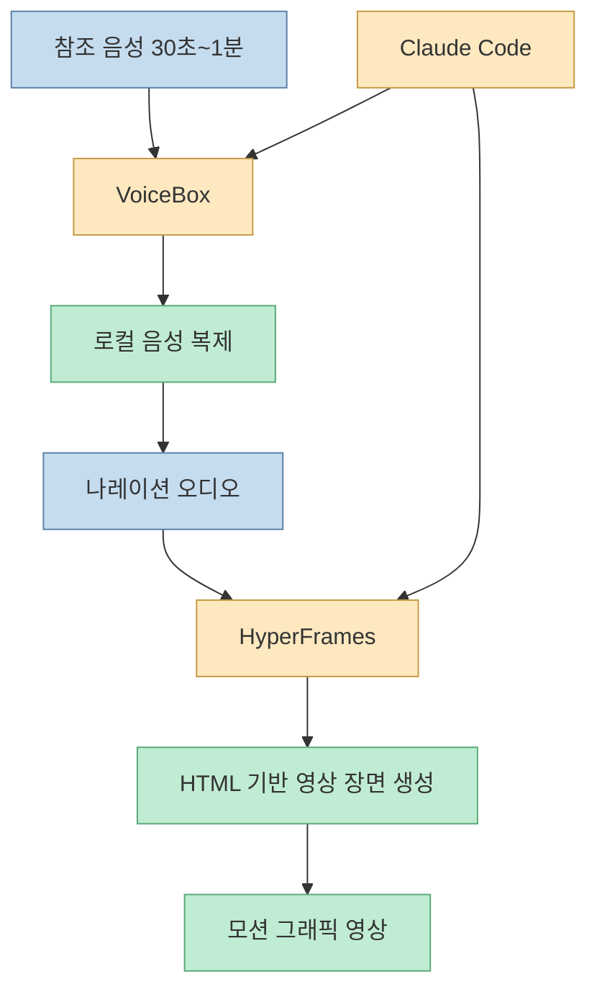
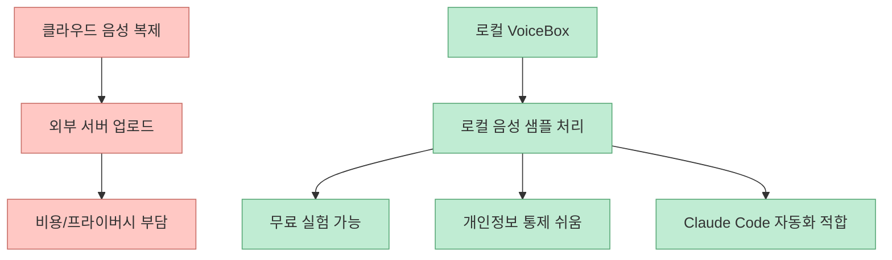
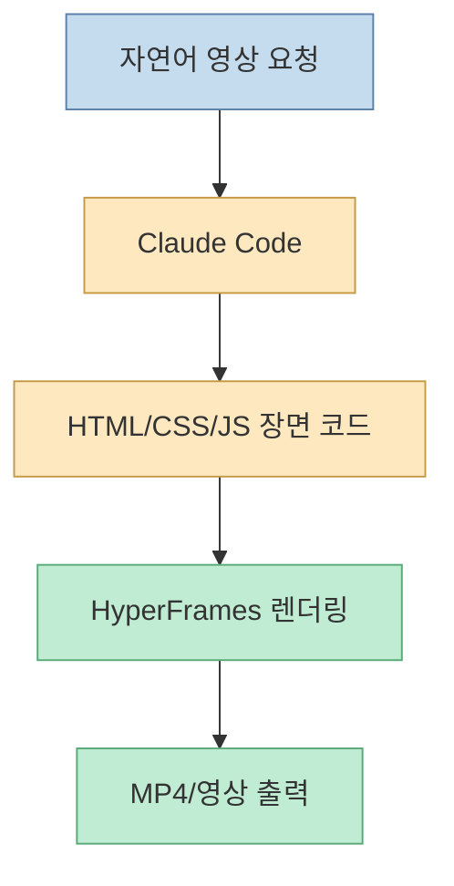
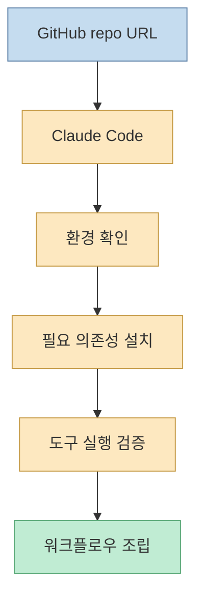
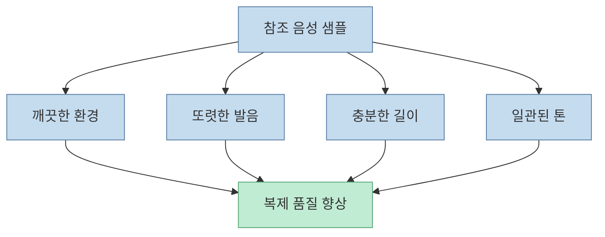
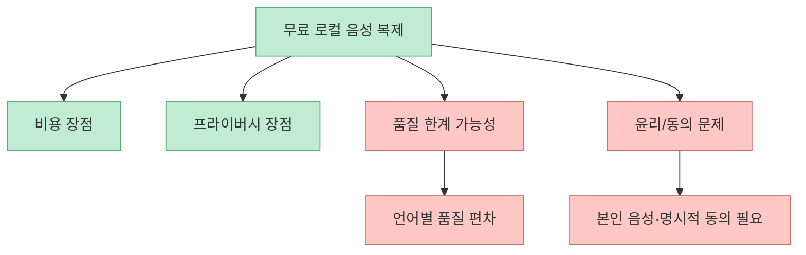
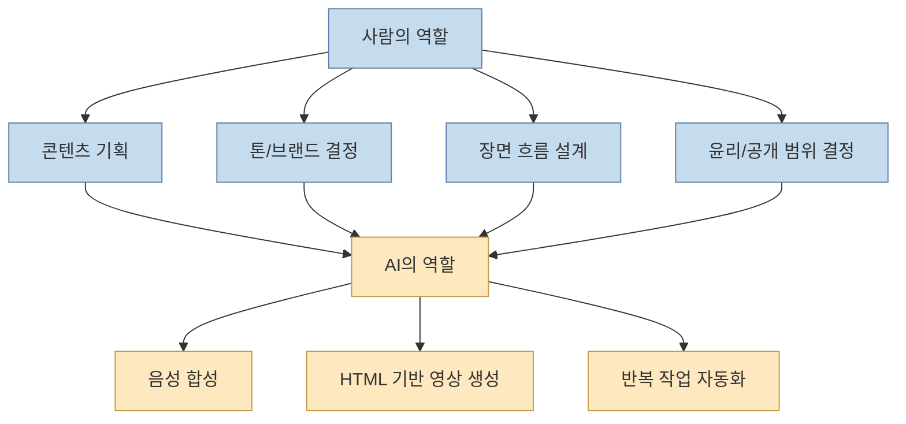

에딭초이의 영상은 요즘 AI 영상 자동화가 어디까지 내려왔는지 잘 보여줍니다. 한 마디도 직접 녹음하지 않고, 한 줄도 직접 코딩하지 않으면서, 내 목소리로 나레이션을 만들고 그 나레이션을 기반으로 모션 그래픽 영상까지 자동 생성합니다. 핵심 조합은 `VoiceBox`와 `HyperFrames`, 그리고 이를 설치하고 실행하게 만드는 `Claude Code`입니다. [0:00](https://youtu.be/aaiEg5ZniyQ?t=0)

<!--more-->

## Sources

- <https://youtu.be/aaiEg5ZniyQ?si=Amb93xX99RgDCTSk>
- VoiceBox GitHub: <https://github.com/jamiepine/voicebox>
- VoiceBox site: <https://voicebox.sh/>
- HyperFrames GitHub: <https://github.com/heygen-com/hyperframes>
- HyperFrames site: <https://hyperframes.heygen.com/>
- Claude Code: <https://claude.com/code>

## 전체 구조: 두 단계면 영상 한 편이 나온다

영상은 워크플로우를 두 단계로 설명합니다. 첫 번째는 VoiceBox로 내 목소리를 복제해 나레이션을 만드는 단계, 두 번째는 그 나레이션을 HyperFrames에 넘겨 모션 그래픽 영상을 만드는 단계입니다. [00:15](https://youtu.be/aaiEg5ZniyQ?t=15)

즉 이 흐름은 "TTS 도구 하나"가 아니라, **음성 계층** 과 **영상 계층** 을 분리한 자동화 파이프라인입니다. VoiceBox는 목소리와 발화를 담당하고, HyperFrames는 시각 표현과 모션을 담당합니다.

## VoiceBox: 로컬 음성 복제의 의미

영상은 VoiceBox를 GitHub 별 25,000개 이상을 받은 로컬 음성 복제 도구로 소개합니다. [00:35](https://youtu.be/aaiEg5ZniyQ?t=35) 공개 저장소 설명도 VoiceBox를 "local-first AI voice studio"라고 부르며, 짧은 오디오 샘플로 voice cloning을 하고, 여러 TTS 엔진으로 speech generation을 수행하며, 전체 stack을 로컬 머신에서 돌린다고 설명합니다. [VoiceBox GitHub](https://github.com/jamiepine/voicebox)

이 로컬 실행의 의미는 큽니다.

- 외부 서버에 내 음성 샘플을 보내지 않아도 됨
- 클라우드 사용료 없이 실험 가능
- voice profile과 음성 데이터가 로컬에 남음
- Claude Code가 설치/실행을 자동화하기 쉬움

영상도 ElevenLabs 같은 유료 대안을 언급하지만, 이 워크플로우의 매력은 **무료 + 로컬 + 자동화** 라는 조합에 있습니다.

## HyperFrames: “영상 만들어줘”를 HTML로 바꾸는 계층

영상은 HyperFrames를 "이런 영상 만들어줘"라고 요청하면 HTML 기반으로 짜 주는 도구라고 설명합니다. [00:35](https://youtu.be/aaiEg5ZniyQ?t=35) HeyGen의 공개 저장소도 HyperFrames를 `Write HTML. Render video. Built for agents.`라고 설명합니다. 즉 프레임 기반 영상 생성 문제를 HTML/CSS/JS 렌더링 문제로 바꾸는 접근입니다. [HyperFrames GitHub](https://github.com/heygen-com/hyperframes)

이 구조가 중요한 이유는 Claude Code가 잘하는 일이 "코드 생성"이기 때문입니다. 일반 video editor를 직접 조작하는 것보다, HTML 기반 장면으로 바꾸는 쪽이 에이전트에게 더 잘 맞습니다.

## 설치는 사람이 아니라 Claude Code에게 맡긴다

영상은 둘 다 GitHub 오픈소스이고 설치부터 영상 제작까지 Claude Code에게 시켜서 만들었다고 설명합니다. [00:35](https://youtu.be/aaiEg5ZniyQ?t=35) 실제 시연에서도 바탕화면에 테스트 폴더를 만든 뒤 VoiceBox GitHub 주소를 복사해 Claude에게 설치를 부탁합니다. [01:12](https://youtu.be/aaiEg5ZniyQ?t=72)

이 지점이 중요합니다. AI 영상 자동화의 병목은 도구 성능만이 아니라 설치와 연결입니다. VoiceBox는 로컬 TTS/voice cloning 툴이고, HyperFrames는 Node.js 기반 렌더링 툴이므로, 각각 설치와 환경 구성이 필요합니다. Claude Code는 이 연결 작업을 대신 수행합니다.

즉 Claude Code는 영상 자체를 만드는 메인 엔진이 아니라, 서로 다른 오픈소스 툴을 **작업 가능한 파이프라인으로 엮는 자동화 관리자** 역할을 합니다.

## 실제 입력: 30초 음성 샘플 하나로 시작한다

자막을 보면 VoiceBox 설치 후 최대 30초 업로드를 요구하며, 제작자는 바로 자신의 목소리를 녹음해 샘플로 넣습니다. [01:51](https://youtu.be/aaiEg5ZniyQ?t=111) 이것은 중요한 제약입니다. 워크플로우가 아주 간단해 보이지만, 최소한 참조 음성 샘플 품질은 결과를 크게 좌우합니다.

좋은 샘플의 조건은 보통 다음과 같습니다.

- 배경 소음이 적음
- 말이 또렷함
- 너무 짧지 않음
- 지나친 감정 표현이나 효과음이 없음

즉 "5분 만에 복제"는 가능하더라도, 실제 품질은 입력 음성의 품질에 크게 좌우됩니다.

## 결과는 빠르지만 한계도 분명하다

영상은 1:20에서 결과를 보여주고, 1:28에서 한국어 한계와 윤리 문제를 솔직하게 짚습니다. [01:20](https://youtu.be/aaiEg5ZniyQ?t=80) [01:28](https://youtu.be/aaiEg5ZniyQ?t=88)

이 지점은 매우 중요합니다. 로컬 오픈소스 음성 복제는 무료이고 빠르지만, 한국어 발음 자연스러움, 감정 표현, prosody, 장문 안정성 면에서 유료 상용 서비스보다 약할 수 있습니다. 또한 목소리 복제는 기술적으로 가능하더라도, 타인의 목소리를 무단으로 쓰는 것은 윤리적·법적 문제가 큽니다.

이 워크플로우는 "클론이 가능하다"는 데서 끝나지 않습니다. 어디까지 쓸 것인지, 누구의 음성을 쓸 것인지, 상업 이용 시 어떤 고지를 할 것인지도 설계해야 합니다.

## 결국 중요한 건 디렉터의 안목이다

영상 마지막 메시지는 도구보다 디렉터의 안목이 더 중요하다는 점입니다. [01:51](https://youtu.be/aaiEg5ZniyQ?t=111) 이 말은 AI 영상 자동화 전체를 관통합니다.

AI가 대신하는 것은 녹음과 장면 렌더링입니다. 하지만 다음은 여전히 사람이 결정해야 합니다.

- 어떤 톤으로 말할 것인가
- 어떤 메시지를 몇 초 안에 전달할 것인가
- 어떤 장면 흐름이 적절한가
- 어떤 브랜드 감성을 유지할 것인가
- 어디까지 자동화하고 어디서 수동 검수할 것인가

좋은 영상 자동화는 AI가 전부 대신하는 것이 아니라, 사람이 방향을 정하고 AI가 반복 제작을 담당하는 구조에서 나옵니다.

## 실전 적용 포인트

첫째, 처음에는 10~20초짜리 짧은 영상으로 테스트하는 편이 좋습니다. 음성 복제와 장면 생성의 품질을 한 번에 긴 분량에서 검증하려 하면 수정 비용이 커집니다.

둘째, VoiceBox는 로컬 툴이므로 장비 성능 영향을 받습니다. 영상도 너무 저사양이면 잘 안 될 수 있다고 언급합니다. 반면 HyperFrames는 Node.js 설치만으로 시작 가능하다고 설명합니다. [01:12](https://youtu.be/aaiEg5ZniyQ?t=72)

셋째, 나레이션 스크립트는 짧고 장면 단위로 나눠야 HyperFrames에서 시각 흐름을 설계하기 쉽습니다. 하나의 긴 문단보다 장면별 메시지가 더 잘 맞습니다.

넷째, 한국어 품질은 반드시 직접 확인해야 합니다. 음성은 사람에게 가장 민감한 출력이므로, 아주 작은 억양 이상도 전체 퀄리티를 떨어뜨릴 수 있습니다.

다섯째, 본인 음성 또는 명시적 허락을 받은 음성만 사용해야 합니다. 무료 오픈소스라고 해서 윤리 기준까지 무료가 되는 것은 아닙니다.

## 핵심 요약

- 이 워크플로우는 `VoiceBox`로 로컬 음성 복제를 하고 `HyperFrames`로 HTML 기반 모션 그래픽 영상을 만드는 2단계 구조입니다. [00:15](https://youtu.be/aaiEg5ZniyQ?t=15)
- 둘 다 GitHub 오픈소스이며, Claude Code가 설치와 연결을 자동화하는 역할을 맡습니다. [00:35](https://youtu.be/aaiEg5ZniyQ?t=35)
- VoiceBox의 장점은 무료, 로컬 실행, 프라이버시 통제이고, HyperFrames의 장점은 에이전트가 잘 다룰 수 있는 HTML 기반 영상 생성입니다.
- 결과는 빠르게 나오지만, 한국어 자연스러움과 윤리 문제는 반드시 검토해야 합니다. [01:28](https://youtu.be/aaiEg5ZniyQ?t=88)
- 결국 차이는 도구가 아니라 디렉터의 안목에서 나온다는 것이 영상의 결론입니다. [01:51](https://youtu.be/aaiEg5ZniyQ?t=111)

## 결론

이 워크플로우가 보여주는 가장 큰 변화는 "영상 제작의 기술 장벽"이 아니라 "영상 제작의 구조"가 바뀌고 있다는 점입니다. 목소리는 VoiceBox가, 장면은 HyperFrames가, 설치와 연결은 Claude Code가 맡습니다. 사람은 점점 손을 덜 대지만, 대신 더 정확하게 기획하고 판단해야 합니다.

그래서 앞으로 중요한 능력은 더 좋은 TTS 버튼을 찾는 것이 아니라, 어떤 톤의 나레이션과 어떤 장면 흐름이 맞는지 판단하는 능력입니다. 도구는 계속 쉬워지고 무료화되겠지만, 결과물의 차이는 결국 **디렉터로서의 감각과 설계 능력** 에서 갈리게 됩니다.
