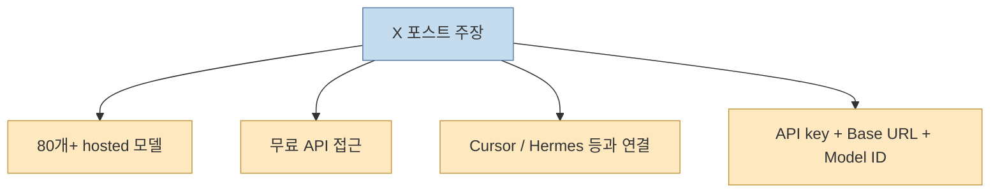
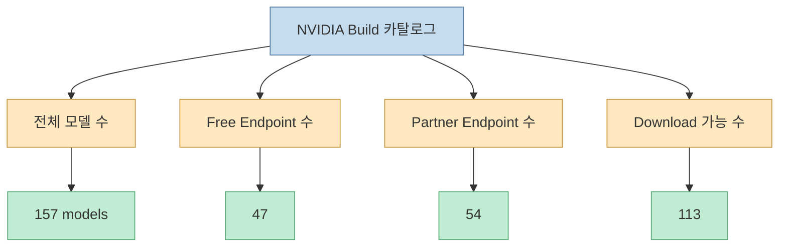
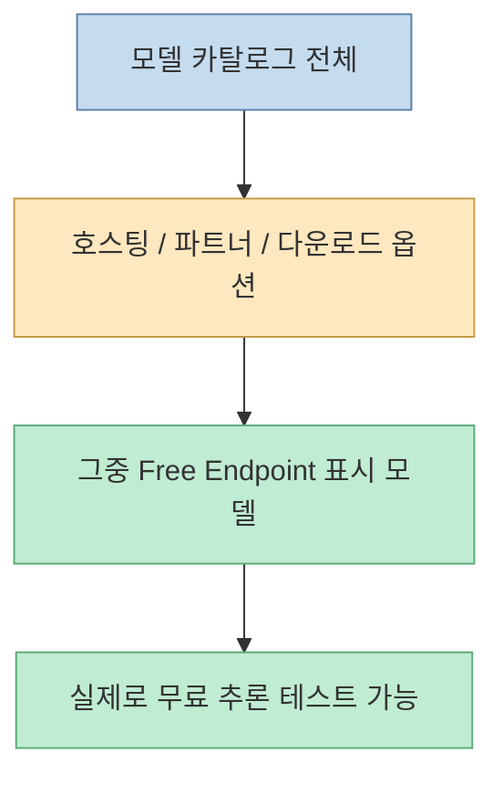
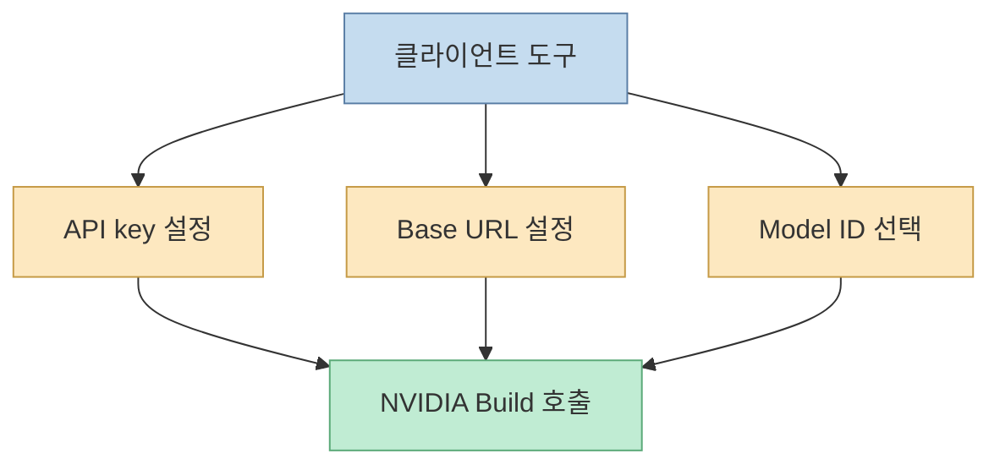
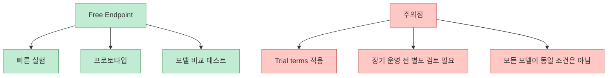
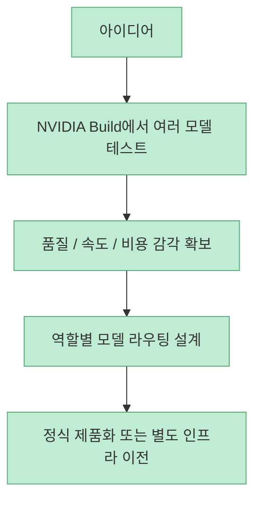

X에서 퍼진 포스트의 요지는 강렬합니다. "NVIDIA가 API로 80개가 넘는 호스팅 AI 모델을 무료로 풀고 있다"는 주장입니다. 실제로 NVIDIA의 공식 서비스인 `build.nvidia.com`은 상당히 큰 모델 카탈로그를 제공하고, 여러 모델 페이지에서 `Using free API` 또는 `Free Endpoint` 표기를 확인할 수 있습니다. 다만 공식 페이지를 그대로 보면, **전체 모델 수와 실제 무료로 바로 호출 가능한 엔드포인트 수는 다릅니다.** 그래서 이 이슈를 정확히 이해하려면 "카탈로그에 있는 모델 수"와 "Free Endpoint로 표시된 모델 수"를 분리해서 봐야 합니다.

<!--more-->

## Sources

- <https://x.com/i/status/2055420014010695897>
- NVIDIA Build 메인: <https://build.nvidia.com/>
- NVIDIA Models 카탈로그: <https://build.nvidia.com/models>

## X 포스트의 주장은 무엇이었나

원문 포스트는 스페인어로 다음과 같이 주장합니다.

- NVIDIA가 API로 80개 이상의 hosted AI model 접근을 무료로 제공한다
- MiniMax, GLM, Kimi, DeepSeek, GPT-OSS, Sarvam 계열 모델이 포함된다
- Cursor, Zed, OpenCode, Hermes, OpenClaude 같은 도구에 직접 붙일 수 있다
- 설정은 API key, base URL, model ID 세 가지만 알면 된다고 설명한다

특히 포스트는 base URL로 `integrate.api.nvidia.com`을, 예시 모델 ID로 `minimaxai/minimax-m2.7`을 제시합니다.

이 주장은 완전히 허구는 아니지만, **숫자 해석을 조금 더 정밀하게 해야 맞는 말** 이 됩니다.

## NVIDIA Build 공식 페이지는 무엇을 보여 주나

NVIDIA의 `build.nvidia.com` 메인 페이지는 "Free inference with leading models"라고 직접 적고 있습니다. 즉 무료 추론 자체는 공식 메시지입니다. 또한 `build.nvidia.com/models` 카탈로그 페이지에서는 현재 다음과 같은 필터 숫자가 보입니다.

- 전체 모델: 157 models
- Free Endpoint: 47
- Partner Endpoint: 54
- Download Available: 113

또 다른 NVIDIA publisher 전용 페이지에서는 `Models (83)` 같은 숫자도 보입니다. 즉 X에서 말한 "80개 이상"은 어떤 맥락에서는 전체 카탈로그 또는 특정 퍼블리셔 범주의 숫자와 닿아 있을 수 있지만, **그 숫자가 곧바로 무료 엔드포인트 수를 뜻하는 것은 아닙니다.**

즉 안전하게 말하면 이렇습니다.

- **무료 추론은 실제로 존재한다**
- **카탈로그는 매우 크다**
- **하지만 모든 모델이 무료 엔드포인트는 아니다**

## "80개 넘는 무료 모델"이라고 바로 말하면 왜 위험한가

이 부분이 핵심입니다. X 포스트는 "80개 이상의 모델 hosted + gratis via API"처럼 읽히지만, 공식 카탈로그 수치는 무료 여부를 세분화해서 보여 줍니다. 따라서 실무적으로는 세 가지 층을 구분해야 합니다.

1. 카탈로그에 존재하는 모델
2. hosted 또는 partner 방식으로 접근 가능한 모델
3. 지금 무료 엔드포인트로 즉시 호출 가능한 모델

이 구분 없이 "80개 넘는 모델을 공짜 API로 쓸 수 있다"고 받아들이면, 나중에 특정 모델에서 과금 조건이나 접근 방식이 달라질 때 혼란이 생길 수 있습니다.

## OpenAI 호환처럼 붙이기 쉬운 구조라는 점은 꽤 중요하다

X 포스트가 실무적으로 유용한 지점을 하나 짚었습니다. `integrate.api.nvidia.com/v1` 같은 base URL을 쓰는 흐름입니다. NVIDIA 공식 문서 조각에서도 DGX Spark 예시가 API Base URL로 `https://integrate.api.nvidia.com/v1`를 명시합니다.

이건 의미가 큽니다. 많은 툴이 이미 OpenAI 스타일 endpoint 구성을 전제로 provider를 바꿔 끼울 수 있기 때문입니다. 그래서 Cursor, Hermes, OpenCode 같은 툴에 붙일 수 있다는 말이 완전히 이상한 소리는 아닙니다. 핵심은 다음 세 요소입니다.

- API key
- base URL
- model ID

즉 사용성 관점에서 보면 이 서비스의 진짜 장점은 "모델이 많다"보다, **기존 AI 클라이언트에 빠르게 꽂아 실험하기 좋다** 는 데 있습니다.

## 무료 추론의 성격은 "trial"에 가깝게 읽는 편이 맞다

여러 모델 페이지를 보면 공통적으로 `NVIDIA API Trial Terms of Service` 또는 `trial service`라는 표현이 붙습니다. 즉 이것을 무제한 상용 무료 API처럼 이해하면 안 됩니다. 더 정확한 해석은:

- 개발자 실험과 프로토타이핑에 친화적
- 모델을 빠르게 맛보는 체험판 성격이 강함
- 장기 운영, 대량 호출, SLA 보장은 별도로 판단해야 함

그래서 X 포스트 마지막 문장처럼 "지금 프로토타이핑 중이면 사실상 무료 추론"이라는 해석은 어느 정도 맞지만, **그 전제가 'trial 범위 안의 실험용'이라는 점은 같이 붙여야 정확합니다.**

## 실제로 무엇이 매력적인가

이 서비스가 매력적인 이유는 단순 무료보다 **모델 실험 비용을 낮춘다** 는 데 있습니다.

- 여러 provider 모델을 한 카탈로그에서 탐색 가능
- 일부는 Free Endpoint로 바로 테스트 가능
- 기존 툴체인에 빠르게 연결 가능
- 모델 비교와 라우팅 실험의 초기 비용을 줄여 줌

특히 에이전트 워크플로를 만드는 사람에게는 이런 패턴이 가능합니다.

- 동일 프롬프트를 여러 모델에 던져 품질 비교
- 요약/코드/리랭킹/ASR 같은 역할별 모델 분기
- 무료 엔드포인트에서 먼저 실험 후 유료/전용 인프라로 이전

즉 "공짜 모델이 많다"보다, **모델 선택 실험장이 잘 마련되어 있다** 는 쪽이 더 본질적인 가치입니다.

## 핵심 요약

- X에서 퍼진 "NVIDIA가 80개 넘는 모델 API를 무료로 준다"는 말은 방향은 맞지만 숫자 해석은 단순화돼 있다
- NVIDIA Build 공식 메인은 실제로 `Free inference with leading models`라고 안내한다
- 하지만 공식 카탈로그에서는 전체 모델 수와 `Free Endpoint` 수가 구분되어 보인다
- 현재 공식 카탈로그 기준으로는 전체 모델, 파트너 엔드포인트, 다운로드 가능 모델, 무료 엔드포인트가 각각 별도 집계된다
- `integrate.api.nvidia.com/v1` 기반으로 기존 도구에 연결하기 쉬운 점은 실무적으로 큰 장점이다
- 다만 `trial service` 성격이므로 실험용과 운영용을 분리해서 생각해야 한다

## 결론

NVIDIA Build를 둘러싼 지금의 화제는 완전한 허풍도 아니고, 그대로 받아들이기엔 조금 거친 요약도 맞습니다. 더 정확한 문장은 이쪽에 가깝습니다.

**NVIDIA는 큰 모델 카탈로그와 일부 무료 추론 엔드포인트를 제공하고 있고, 이를 기존 AI 도구에 꽂아 빠르게 실험할 수 있게 해 준다.**

따라서 이 서비스의 진짜 가치는 "무료 모델 80개"라는 숫자보다, **여러 모델을 낮은 마찰로 시험해 볼 수 있는 실험 인프라** 로 이해하는 편이 맞습니다.
