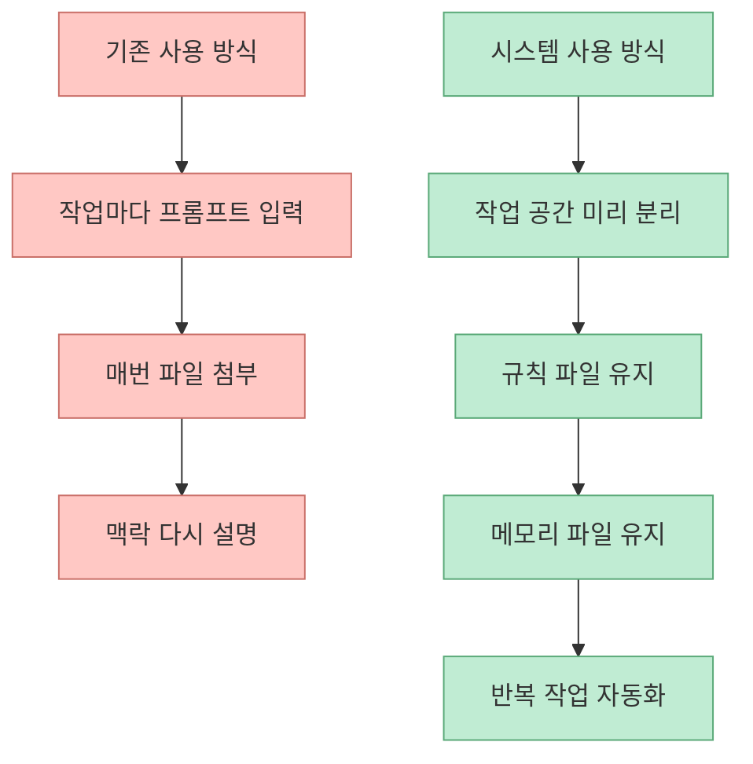
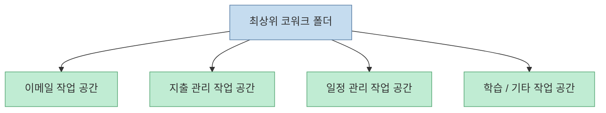
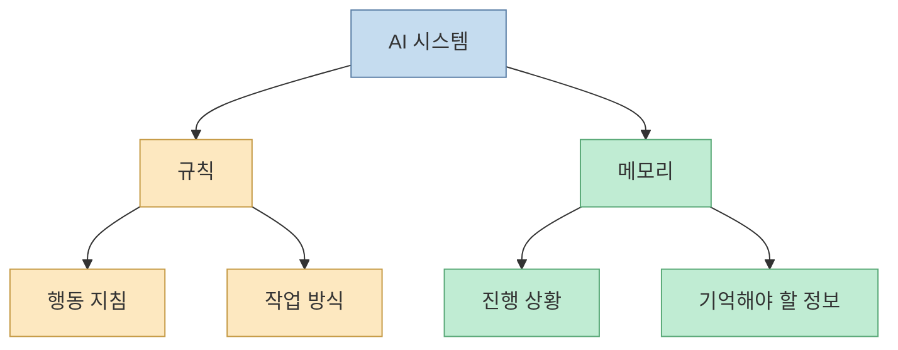
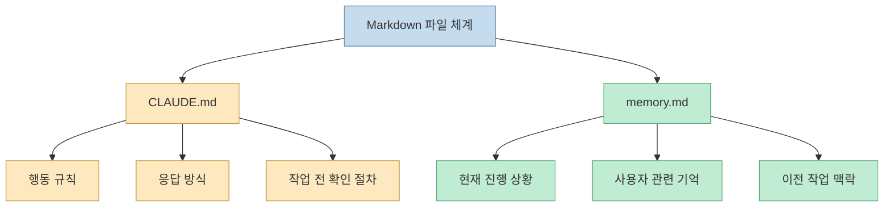
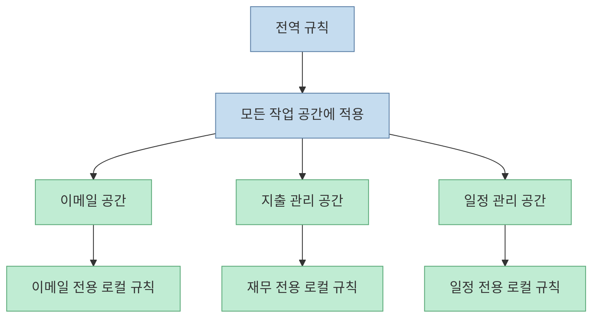
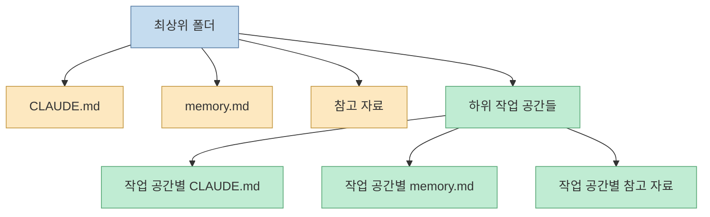
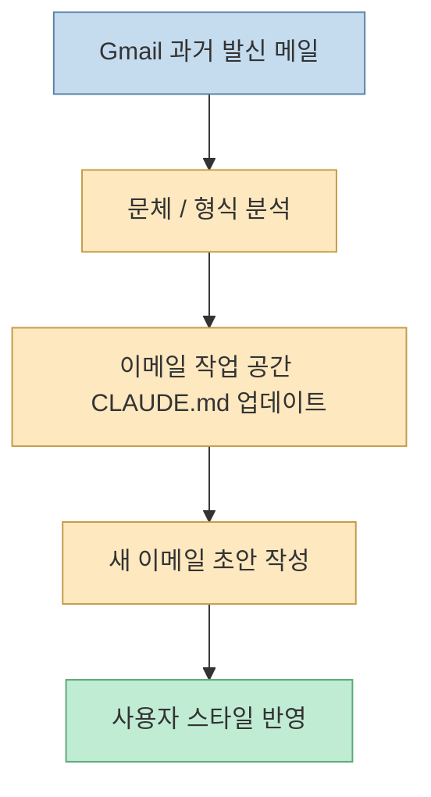
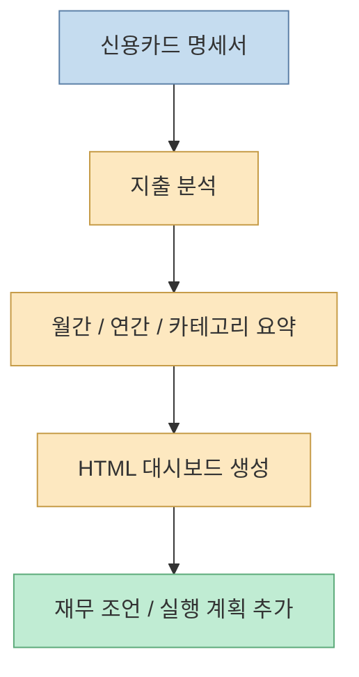
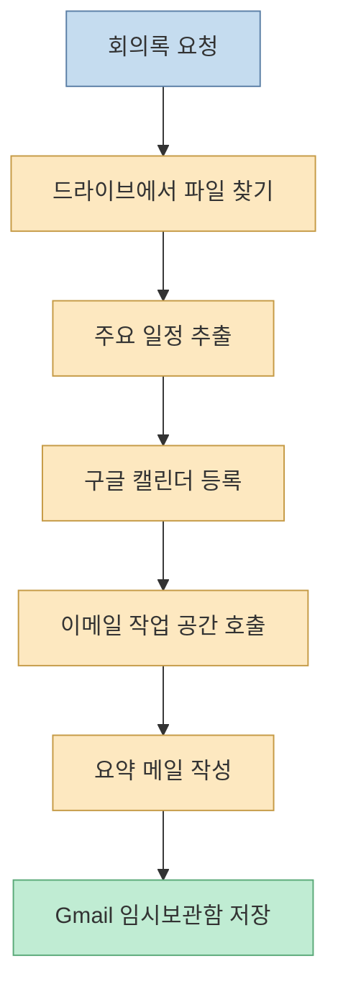
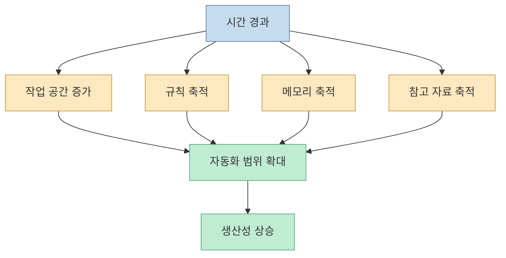

이 영상의 핵심은 "Claude로 뭘 한 번 더 잘 시킬까"가 아닙니다. 오히려 그 반대입니다. 매번 프롬프트를 새로 치고, 파일을 다시 첨부하고, 맥락을 다시 설명하는 방식을 버리고, **작업 공간·규칙·메모리 파일을 가진 개인용 AI 시스템** 으로 Claude를 운영하자는 제안입니다. 영상에서는 이것을 이메일, 지출 관리, 일정 등록 같은 예시로 보여 주면서, 결국 중요한 것은 모델 자체보다 **작업 환경을 어떻게 구조화하느냐** 라고 설명합니다. [00:00](https://youtu.be/hFlfGjrWiSA?t=0)

<!--more-->

## Sources

- <https://youtu.be/hFlfGjrWiSA?si=RXBx4jpHj04kBU3O>

## 이 영상이 바꾸려는 것은 "사용 방식"이다

영상 초반에서 발표자는 기존 AI 사용 방식을 "그때그때 필요한 작업만 골라서 처리하는 방식"으로 설명하고, 이번에는 그보다 심화된 구조를 보여 주겠다고 말합니다. 목표는 단순 자동화가 아니라, 업무와 일상에서 반복되는 작업을 처리하는 **맞춤형 AI 시스템** 을 구축하는 것입니다. [00:30](https://youtu.be/hFlfGjrWiSA?t=30) [00:45](https://youtu.be/hFlfGjrWiSA?t=45)

즉 이 영상의 메시지는 "Claude를 더 똑똑하게 쓰는 프롬프트"가 아니라, **Claude가 계속 일할 수 있는 작업 환경을 먼저 만드는 것** 에 가깝습니다.

## 작동 원리는 특정 폴더 안에서 분업하는 것이다

영상 설명에 따르면 이 방식은 Claude가 특정 폴더를 선택해 그 안에서만 작업하도록 두고, 그 안에 여러 하위 폴더를 만들어 업무 카테고리별로 분업시키는 구조입니다. 발표자는 이를 회사의 부서 구조에 비유합니다. 인사팀, 영업팀, 개발팀처럼, AI 쪽에서도 이메일 작업 공간, 데이터 작업 공간, 재무 관리 공간, 여행 공간, 학습 공간 같은 식으로 나눈다는 뜻입니다. [01:14](https://youtu.be/hFlfGjrWiSA?t=74) [01:28](https://youtu.be/hFlfGjrWiSA?t=88)

이 구조는 중요합니다. 모델에게 역할을 말로만 지시하는 대신, **폴더 자체를 역할 경계로 쓰는 방식** 이기 때문입니다.

## 핵심 구성 요소는 두 가지다: 규칙과 메모리

영상에서 가장 강조하는 개념은 두 가지입니다.

- 규칙
- 메모리

발표자는 규칙이 "반드시 지켜야 할 지침"이고, 메모리는 "어디까지 했는지, 이전에 무엇이 있었는지, 계속 기억해야 할 정보"라고 설명합니다. 그리고 이 두 가지를 매번 사람이 설명하는 대신, 파일로 만들어 Claude가 항상 읽게 하자는 방식입니다. [01:59](https://youtu.be/hFlfGjrWiSA?t=119) [02:20](https://youtu.be/hFlfGjrWiSA?t=140)

이 관점은 최근 컨텍스트 엔지니어링과도 닿아 있습니다. 좋은 결과는 프롬프트 한 줄보다, **항상 함께 들어가는 상태 정보와 운영 규칙** 에서 나옵니다.

## 파일은 Markdown으로 주고, 역할을 명확히 나눈다

영상에서는 이 파일 형식으로 Markdown을 사용합니다. 규칙은 `CLAUDE.md` 성격의 파일, 메모리는 별도 `memory.md` 성격의 파일로 두고, 각각의 역할을 구분합니다. 발표자는 규칙 파일은 행동 매뉴얼, 메모리 파일은 현재 작업과 기억 정보 저장소라고 설명합니다. [02:35](https://youtu.be/hFlfGjrWiSA?t=155) [02:46](https://youtu.be/hFlfGjrWiSA?t=166)

결국 이 구조는 Claude를 "응답 생성기"가 아니라, **파일을 읽고 상태를 이어 가는 작업자** 로 바꾸는 장치입니다.

## 규칙은 전역과 로컬로 나뉜다

영상 중반의 비유가 꽤 좋습니다. 발표자는 전역 규칙과 작업 공간 규칙의 관계를 헌법과 하위 법규에 비유합니다. 모든 작업 공간에 공통으로 적용되는 규칙이 있고, 이메일 작업 공간에만 적용되는 규칙, 지출 관리 공간에만 적용되는 규칙이 따로 있는 식입니다. [03:20](https://youtu.be/hFlfGjrWiSA?t=200) [03:38](https://youtu.be/hFlfGjrWiSA?t=218)

이 계층 구조가 중요한 이유는, 작업별 특화와 전체 일관성을 동시에 확보할 수 있기 때문입니다.

## 실제 셋업은 surprisingly 단순하다

영상에서 제안하는 기본 셋업은 생각보다 복잡하지 않습니다.

- 최상위 폴더 하나 생성
- 그 안에 전역 `CLAUDE.md`
- 전역 `memory.md`
- 참고 자료 폴더 생성

그리고 이후 작업 공간이 늘어날 때마다 각 하위 폴더 안에도 같은 구조를 둡니다. 참고 자료 폴더는 특정 업무에만 필요한 보조 자료, 예를 들어 보고서 템플릿 같은 것을 넣는 곳으로 설명됩니다. [03:51](https://youtu.be/hFlfGjrWiSA?t=231) [05:20](https://youtu.be/hFlfGjrWiSA?t=320)

즉 복잡한 멀티에이전트 프레임워크를 도입하지 않아도, **폴더와 Markdown만으로 상태 분리와 역할 분리를 시작할 수 있다** 는 게 이 영상의 실용적인 장점입니다.

## 예시 1: 이메일 작업 공간은 "내 문체"를 학습하는 방식이다

첫 번째 데모는 이메일 작업 공간입니다. 발표자는 Gmail에서 최근 한 달간 보낸 이메일을 분석해, 자주 쓰는 문체·스타일·형식을 추출하고, 그 결과를 이메일 작업 공간의 규칙 파일에 저장하라고 요청합니다. 이후 최근 협업 제안 메일에 대한 답장 초안을 작성시키는데, 영상에서는 실제로 사용자의 문체와 상황을 반영한 거절 답장이 생성되었다고 설명합니다. [05:56](https://youtu.be/hFlfGjrWiSA?t=356) [06:31](https://youtu.be/hFlfGjrWiSA?t=391)

이 데모의 요점은 이메일 작성 그 자체보다, **개인 스타일을 파일로 외부화해 재사용 가능하게 만들었다** 는 데 있습니다.

## 예시 2: 지출 관리 작업 공간은 입력 파일에서 대시보드를 만든다

두 번째 예시는 신용카드 명세서를 바탕으로 한 지출 관리 작업 공간입니다. 영상에서는 1월부터 5월까지의 명세서를 첨부한 뒤, 지난 5개월의 지출을 분석하고, 월간 요약·연간 예상·카테고리별 지출 현황이 포함된 HTML 대시보드를 참고 자료에 넣어 달라고 요청합니다. 결과로 핵심 요약, 평균 지출, 카테고리별 합계, 인사이트와 재무 조언까지 포함된 대시보드가 생성되었다고 설명합니다. [07:18](https://youtu.be/hFlfGjrWiSA?t=438) [07:45](https://youtu.be/hFlfGjrWiSA?t=465)

이 예시는 AI가 단순 요약을 넘어서 **입력 문서 → 구조화된 산출물 → 의사결정 조언** 의 흐름으로 연결될 수 있음을 보여 줍니다.

## 예시 3: 진짜 포인트는 여러 작업 공간을 엮는 것이다

영상 후반의 가장 중요한 장면은 일정 관리 예시입니다. 발표자는 구글 드라이브에서 최근 마케팅 회의록을 찾고, 주요 일정을 캘린더에 등록하고, 담당자에게 보낼 일정 요약 이메일 초안을 Gmail 임시 보관함에 저장해 달라고 한 번에 요청합니다. 여기서는 드라이브, 일정, 이메일 작업 공간이 서로 연결됩니다. [08:48](https://youtu.be/hFlfGjrWiSA?t=528) [09:30](https://youtu.be/hFlfGjrWiSA?t=570)

이 부분이야말로 영상 제목에 있는 "24시간 일해주는 시스템"의 실체입니다. 단일 답변 품질이 아니라, **서로 다른 작업 공간이 한 요청 안에서 연쇄적으로 호출되는 구조** 가 핵심입니다.

## 시간이 지날수록 좋아진다는 주장도 결국 메모리 축적을 뜻한다

발표자는 작업 공간이 많아지고, 규칙과 메모리가 풍부해질수록 생산성이 더 올라간다고 말합니다. [09:59](https://youtu.be/hFlfGjrWiSA?t=599) 이 말은 추상적으로 들릴 수 있지만, 실제 의미는 비교적 명확합니다.

- 작업 규칙이 축적된다
- 사용자 스타일 정보가 축적된다
- 참고 자료가 축적된다
- 이전 작업 맥락이 남는다

즉 이 영상의 생산성 논리는 "모델이 똑똑해진다"가 아니라, **나에게 맞는 운영 환경이 자라난다** 는 쪽에 더 가깝습니다.

## 이 방식의 장점과 한계

영상이 제안하는 방식은 분명 강점이 있습니다.

- 반복 맥락 설명을 줄여 준다
- 작업별 규칙을 분리할 수 있다
- 참고 자료를 축적 자산으로 만든다
- 여러 도구와 업무를 한 줄 요청으로 묶을 수 있다

하지만 한계도 분명합니다.

- 초기 규칙 파일 설계가 엉성하면 결과도 흔들린다
- 메모리가 쌓일수록 정리 전략이 필요하다
- 외부 도구 권한이 많아질수록 승인과 보안 설계가 중요해진다
- 자동 생성 자막 기준으로는 세부 구현보다 개념적 데모에 가깝다

즉 이 방식은 "Claude가 모든 걸 알아서 한다"보다, **사람이 먼저 작업 환경을 설계하고 Claude는 그 안에서 일한다** 는 관점으로 이해해야 맞습니다.

## 핵심 요약

- 이 영상의 핵심은 Claude를 단발성 프롬프트 도구가 아니라 작업 공간 기반 시스템으로 쓰자는 제안이다
- 기본 구조는 최상위 폴더, 작업 공간 하위 폴더, `CLAUDE.md`, `memory.md`, 참고 자료 폴더다
- 규칙 파일은 행동 매뉴얼, 메모리 파일은 진행 상황과 기억 저장소 역할을 한다
- 전역 규칙과 작업 공간별 로컬 규칙을 함께 두어 계층적으로 운영한다
- 이메일, 지출 관리, 일정 관리 예시를 통해 작업 공간 간 연쇄 자동화를 보여 준다
- 시간이 지날수록 좋아진다는 말의 실체는 규칙·메모리·참고 자료의 축적이다

## 결론

이 영상이 보여 주는 가장 중요한 전환은 "Claude를 잘 쓰는 법"에서 "Claude가 계속 잘 일하게 만드는 환경"으로의 이동입니다. 프롬프트를 더 길고 똑똑하게 쓰는 것보다, **작업 공간·규칙·메모리라는 외부 구조를 잘 설계하는 것** 이 더 큰 차이를 만든다는 뜻입니다.

결국 이 방식은 AI를 도구처럼 한 번씩 꺼내 쓰는 단계에서, **개인용 운영체제처럼 길들이는 단계** 로 넘어가려는 시도라고 볼 수 있습니다.
