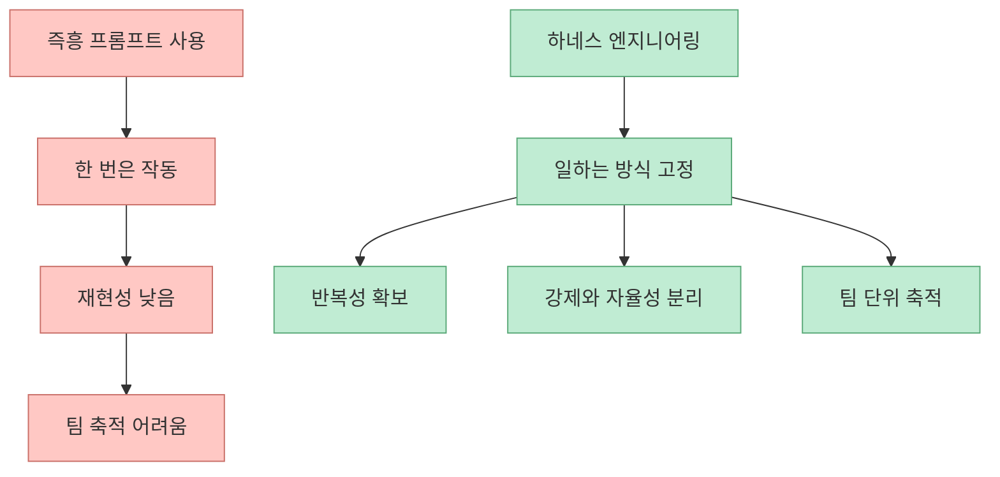
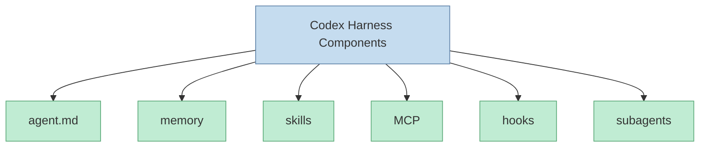
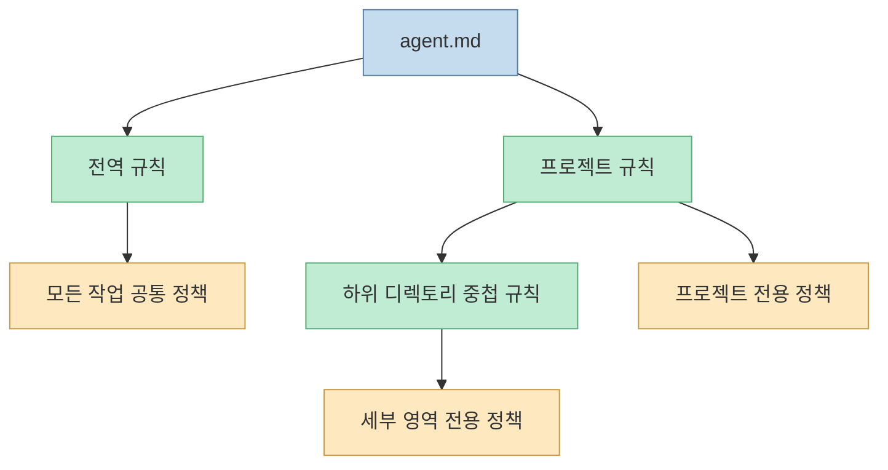
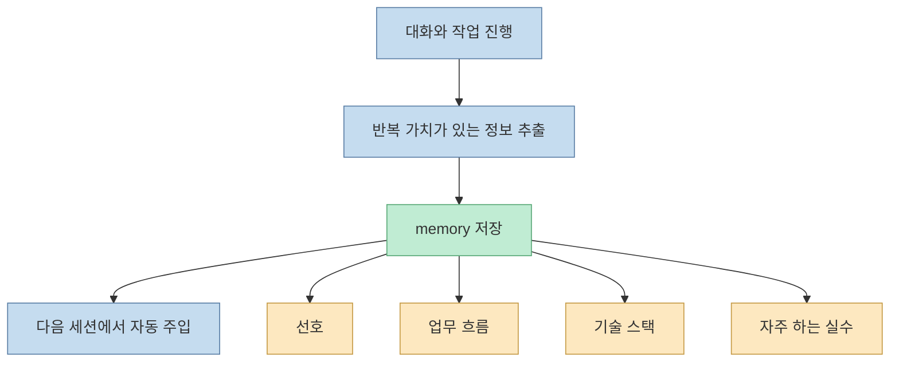
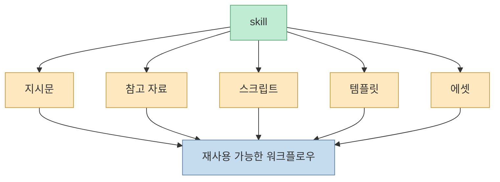
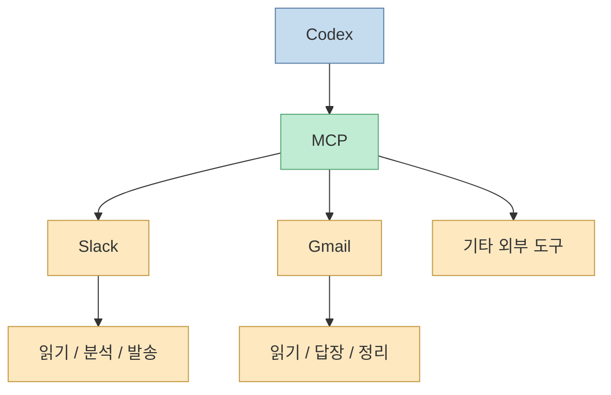
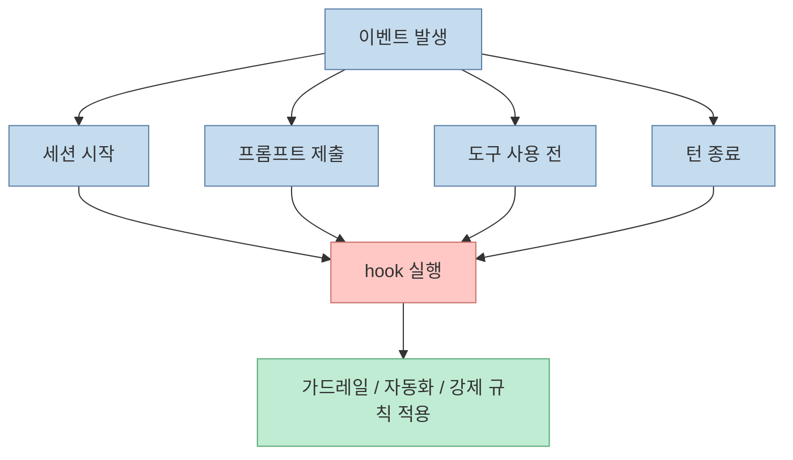
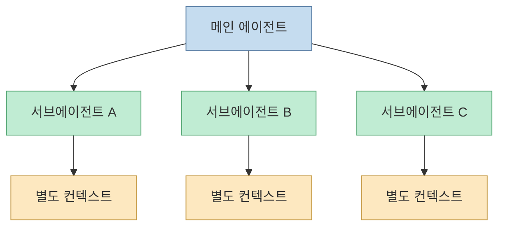
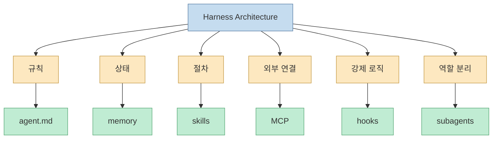

이 영상은 Codex를 잘 쓰는 팁 몇 개를 나열하는 강의가 아닙니다. 더 정확히 말하면, **Codex가 어떤 방식으로 일하게 만들 것인가** 를 시스템 관점에서 설명하는 강의입니다. 발표자는 하네스를 "일하는 방식을 고정하는 구조"라고 정의하고, 프롬프트만으로는 앱 하나를 안정적으로 만들기 어렵기 때문에 규칙 파일, 메모리, 스킬, MCP, 훅, 서브에이전트 같은 레이어를 나눠 설계해야 한다고 말합니다. [00:03](https://youtu.be/wScdyoQjj8E?t=3) [01:17](https://youtu.be/wScdyoQjj8E?t=77)

<!--more-->

## Sources

- <https://youtu.be/wScdyoQjj8E?si=i976zEckdycEAezu>

## 하네스의 정의는 "일하는 방식을 고정하는 구조"다

영상 초반에서 발표자는 하네스를 단순 설정 묶음이 아니라, **에이전트가 우리가 원하는 방식대로 동작하도록 강제하는 구조** 로 설명합니다. 바이브 코딩처럼 즉흥적으로 프롬프트를 던지는 방식은 빠를 수는 있어도 반복성과 팀 축적, 자율성과 강제의 분리를 만들기 어렵기 때문입니다. [01:06](https://youtu.be/wScdyoQjj8E?t=66) [01:35](https://youtu.be/wScdyoQjj8E?t=95)

즉 하네스는 모델 IQ를 높이는 기능이 아니라, **작업의 운영 조건을 고정하는 장치** 입니다.

## 발표자가 나누는 핵심 구성 요소는 6개다

이 영상이 실무적으로 유용한 이유는 Codex의 구성 요소를 비교적 깔끔하게 여섯 개로 나누기 때문입니다.

- `agent.md`
- memory
- skills
- MCP
- hooks
- subagents

발표자는 이 여섯 개를 전부 같은 종류의 기능으로 보지 않습니다. 어떤 것은 지시, 어떤 것은 기억, 어떤 것은 외부 연결, 어떤 것은 강제 로직입니다. [02:08](https://youtu.be/wScdyoQjj8E?t=128)

핵심은 이 구성 요소들을 모두 "프롬프트 확장"으로 보지 말고, **서로 다른 시스템 층으로 구분해야 한다** 는 점입니다.

## 1. `agent.md`는 규칙 레이어다

발표자는 `agent.md`를 Codex의 규칙 파일이라고 설명합니다. 이 파일은 에이전트가 항상 참고할 수 있는 지침을 담습니다. 특히 전역(global)과 프로젝트(project) 스코프를 나눠 둘 수 있다고 말합니다.

- 전역 규칙은 홈 경로의 Codex 설정 쪽에 둘 수 있음
- 프로젝트 규칙은 각 저장소 루트에 둘 수 있음
- 중첩 구조도 가능함

[02:32](https://youtu.be/wScdyoQjj8E?t=152) [05:57](https://youtu.be/wScdyoQjj8E?t=357)

이 설명은 Claude의 `CLAUDE.md`와 거의 같은 철학입니다. 즉 규칙 파일은 문장 몇 줄이 아니라, **팀이 합의한 일하는 방식의 버전 관리 대상** 입니다.

## 2. memory는 세션을 넘겨 주는 상태 레이어다

영상에서는 메모리가 기본 비활성화 상태이고, 활성화하면 반복해서 쓸 만한 맥락을 저장해 이후 세션에서 다시 불러올 수 있다고 설명합니다. 이때 저장되는 것은 단순 로그보다:

- 사용자 선호
- 반복 업무 흐름
- 기술 스택
- 프로젝트 관리 방식
- 자주 빠지는 실수

같은 재사용 가능한 패턴입니다. [07:59](https://youtu.be/wScdyoQjj8E?t=479) [08:50](https://youtu.be/wScdyoQjj8E?t=530)

즉 memory는 단순 기록이 아니라, **다음 세션의 초기 컨텍스트를 더 똑똑하게 만드는 상태 압축층** 입니다.

## 3. skills는 반복 절차를 패키징하는 워크플로 레이어다

발표자는 skills를 "반복되는 절차를 패키징하는 기술"이라고 설명합니다. 프롬프트 템플릿과 비슷해 보일 수 있지만, 실제로는 프롬프트만 있는 것이 아니라:

- 지시문
- 참고 자료
- 스크립트
- 템플릿
- 에셋

같은 것을 함께 묶은 재사용 가능한 워크플로 패키지라는 점을 강조합니다. [09:28](https://youtu.be/wScdyoQjj8E?t=568) [10:00](https://youtu.be/wScdyoQjj8E?t=600)

그리고 이 스킬은 한 번에 모든 문서를 로딩하지 않고, 필요할 때 점진적으로 읽어 간다고 설명합니다. 이건 컨텍스트 비용을 줄이는 중요한 설계 포인트입니다.

## 4. MCP는 외부 시스템과 연결하는 도구 레이어다

영상은 MCP를 모델이 혼자서는 할 수 없는 작업을 외부 도구에 연결하는 표준 프로토콜로 설명합니다. 예시로는 슬랙과 Gmail이 나옵니다.

- 메일 읽기
- 메일 답장
- 슬랙 메시지 읽기
- 슬랙 메시지 분석
- 슬랙 메시지 보내기

[10:58](https://youtu.be/wScdyoQjj8E?t=658) [11:35](https://youtu.be/wScdyoQjj8E?t=695)

즉 MCP는 하네스의 내부 규칙을 외부 세계와 연결하는 **행동 인터페이스 층** 입니다.

## 5. hooks는 읽는 규칙이 아니라 실행되는 규칙이다

이 영상에서 hooks 설명이 가장 중요합니다. 발표자는 `agent.md`, memory, skills 같은 요소는 Codex가 "읽고 판단하는" 층이기 때문에 100% 보장을 해 줄 수 없다고 말합니다. 반면 hooks는 런타임 이벤트에 프로그래밍 로직을 주입하는 방식이라, 더 강제력이 강합니다. [03:52](https://youtu.be/wScdyoQjj8E?t=232) [12:03](https://youtu.be/wScdyoQjj8E?t=723)

예시 이벤트:

- 세션 시작
- 프롬프트 제출
- 도구 사용 전
- 턴 종료

이 구분은 매우 중요합니다. **읽히는 규칙과 실행되는 규칙은 다르다** 는 것이고, 진짜 하네스는 후자까지 포함해야 강제력이 생깁니다.

## 6. subagents는 컨텍스트 분리 레이어다

발표자는 subagents를 별도 역할을 가진 에이전트를 생성해 완전히 별도 컨텍스트에서 작업하게 만드는 기능으로 설명합니다. [04:37](https://youtu.be/wScdyoQjj8E?t=277)

이 의미는 생각보다 큽니다.

- 메인 컨텍스트 오염 방지
- 역할별 전문성 분리
- 조사 / 구현 / 검토 병렬화

즉 subagents는 단순 분업이 아니라, **컨텍스트 경계 설계 도구** 로 이해하는 편이 맞습니다.

## 이 여섯 가지는 서로 대체재가 아니라 각자 다른 층을 맡는다

이 영상에서 가장 유용한 실무 감각은 여기서 나옵니다.

- `agent.md`는 규칙
- memory는 상태
- skills는 절차 패키지
- MCP는 외부 연결
- hooks는 강제 로직
- subagents는 역할 분리

그래서 하네스를 잘 설계한다는 말은 결국 **모든 문제를 한 파일에 우겨넣지 않고, 어떤 문제를 어느 레이어에서 해결할지 명확히 나누는 일** 입니다.

## 발표자가 반복해서 말하는 요점은 "규칙 파일을 팀 자산으로 보라"는 것이다

영상 중반에서 발표자는 `agent.md` 같은 규칙 파일을 버전 관리하고 팀과 공유해야 하는 자산이라고 반복해서 말합니다. [07:10](https://youtu.be/wScdyoQjj8E?t=430) 이 포인트는 중요합니다.

많은 사람이 AI 활용을 개인의 비밀 프롬프트 모음처럼 다루지만, 하네스 엔지니어링 관점에서는 반대입니다.

- 규칙은 공유돼야 하고
- 수정 이력도 남아야 하고
- 프로젝트마다 진화해야 하며
- 팀의 일하는 방식이 코드처럼 누적돼야 합니다

즉 하네스는 개인 창의성보다, **팀의 운영 방식이 문서와 코드로 누적되는 과정** 에 더 가깝습니다.

## 이 강의의 실전적 메시지는 '프롬프트를 버리자'가 아니다

중요한 건 프롬프트가 쓸모없다는 뜻이 아닙니다. 이 영상이 말하는 것은 더 구조적입니다.

- 프롬프트는 필요하다
- 하지만 프롬프트만으로는 부족하다
- 재현성과 강제력은 별도 레이어가 필요하다

즉 하네스 엔지니어링은 프롬프트를 대체하는 것이 아니라, **프롬프트를 더 큰 시스템 안의 한 조각으로 격하시키는 과정** 입니다.

## 핵심 요약

- 이 영상은 하네스를 "일하는 방식을 고정하는 구조"로 정의한다
- Codex 하네스의 핵심 구성 요소는 `agent.md`, memory, skills, MCP, hooks, subagents의 6개다
- `agent.md`는 규칙, memory는 세션 간 상태, skills는 반복 절차 패키지, MCP는 외부 시스템 연결, hooks는 강제 로직, subagents는 컨텍스트 분리 역할을 맡는다
- 특히 hooks는 읽는 규칙이 아니라 실행되는 규칙이라는 점에서 강제력이 다르다
- 좋은 하네스 설계는 모든 요구를 한 파일에 몰지 않고, 문제를 적절한 레이어에 배치하는 것이다
- 규칙 파일은 개인 팁이 아니라 팀의 버전 관리 자산으로 봐야 한다

## 결론

이 영상이 보여 주는 가장 중요한 전환은 Codex를 "좋은 답변을 주는 모델"로 보는 시각에서, **여러 시스템 레이어를 가진 작업 런타임** 으로 보는 시각으로의 이동입니다.

하네스 엔지니어링의 핵심은 결국 이 질문으로 요약됩니다.

**이 문제를 프롬프트로 해결할 것인가, 상태로 해결할 것인가, 절차로 해결할 것인가, 아니면 강제 로직으로 해결할 것인가?**

이 질문에 답할 수 있게 되는 순간부터, Codex는 단순 채팅 도구가 아니라 설계 가능한 에이전트 시스템이 됩니다.
