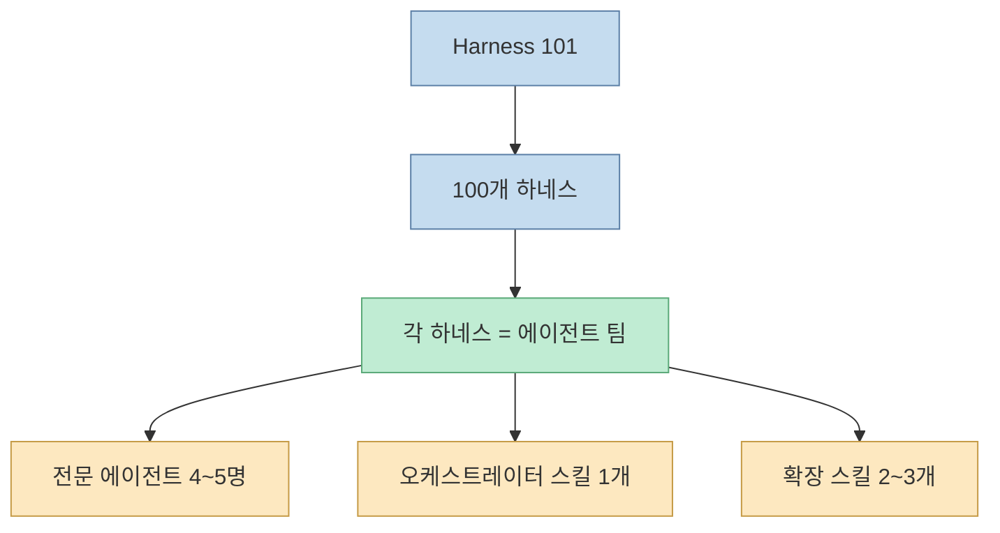
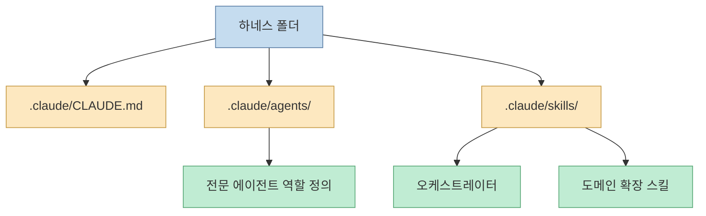
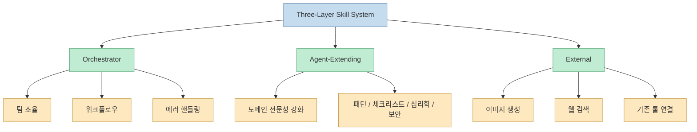
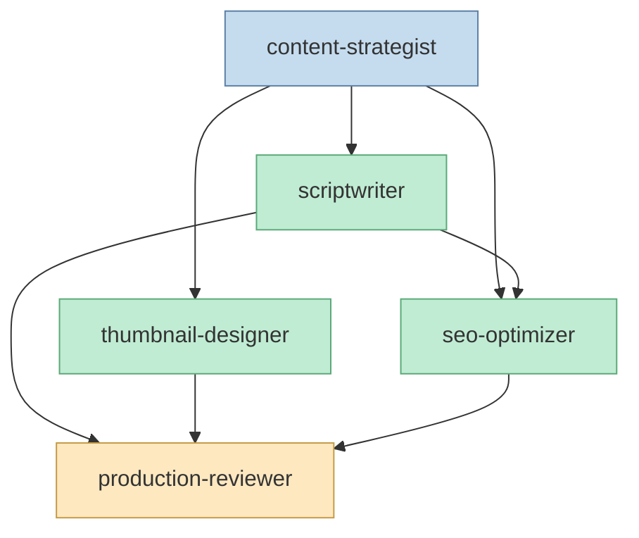
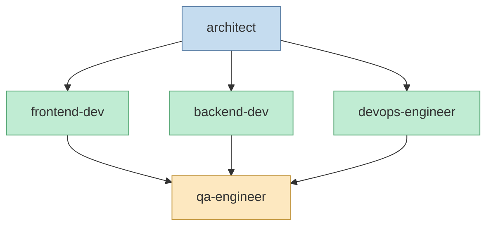
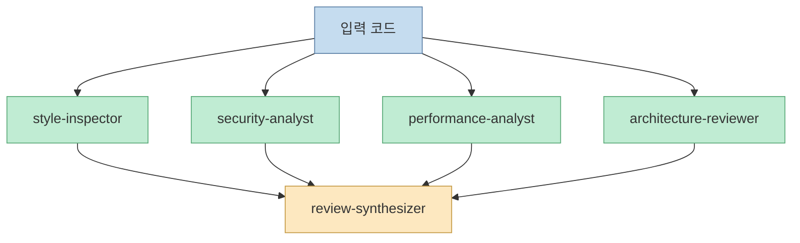
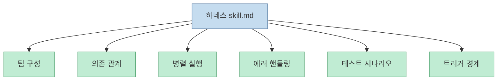
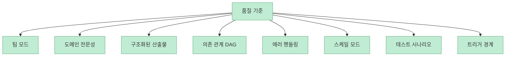

`harness-101`을 처음 보면 "Claude Code용 예제 100개"처럼 보일 수 있습니다. 하지만 저장소를 실제로 뜯어보면 성격이 다릅니다. 이 프로젝트는 프롬프트를 많이 모아 둔 저장소가 아니라, **에이전트 팀이 협업하는 작업 시스템을 100개 패키징한 하네스 라이브러리** 에 더 가깝습니다. 저장소 소개도 이를 분명히 말합니다. 10개 도메인에 걸쳐 100개의 ready-to-use harness를 제공하고, 각 하네스는 4~5명의 specialist agent, 1개의 orchestrator skill, 그리고 2~3개의 agent-extending skill로 구성됩니다. <https://github.com/WithModulabs/harness-101>

<!--more-->

## Sources

- <https://github.com/WithModulabs/harness-101/tree/main/ko>

## 이 저장소의 핵심은 "100개의 스킬"이 아니라 "100개의 팀 구조"다

README를 보면 프로젝트 전체 설명이 아주 명확합니다.

- 하네스 100개
- 에이전트 정의 489개
- 스킬 315개
- 총 Markdown 파일 904개(한 언어 기준)

여기서 중요한 것은 숫자 자체보다 구성 방식입니다. 각 하네스는 **하나의 작업을 잘하는 단일 에이전트** 가 아니라, 서로 다른 역할을 가진 팀이 협업하도록 설계되어 있습니다.

즉 이 저장소는 "잘 만든 프롬프트 라이브러리"보다, **재사용 가능한 AI 작업 조직도** 를 제공한다고 보는 편이 더 정확합니다.

## 폴더 구조부터 이미 '팀 운영'을 전제로 한다

README와 개별 하네스의 `CLAUDE.md`를 보면 구조가 거의 고정되어 있습니다.

- `.claude/CLAUDE.md`
- `.claude/agents/`
- `.claude/skills/`

이 중 역할은 비교적 선명합니다.

- `CLAUDE.md`: 하네스 전체 개요와 사용법
- `agents/`: 역할별 전문 에이전트 정의
- `skills/`: 오케스트레이터와 확장 스킬

이 구조는 단순합니다. 하지만 중요한 것은 그 단순함이 **에이전트 팀 운영의 표준 인터페이스** 역할을 한다는 점입니다.

## 세 층 구조가 이 저장소의 핵심 설계다

README는 이 프로젝트의 스킬 체계를 세 층으로 나눕니다.

- Orchestrator
- Agent-Extending
- External

오케스트레이터는 팀 조율, 워크플로, 에러 핸들링을 맡고, agent-extending 스킬은 각 에이전트의 전문성을 강화하며, external은 Gemini 이미지 생성이나 웹 검색처럼 외부 도구를 붙이는 층입니다.

이 구조가 중요한 이유는, 하네스를 "한 번 호출하고 끝나는 스킬"이 아니라 **에이전트 운영 프레임워크** 로 바꾸기 때문입니다.

## 예시 1: YouTube Production 하네스는 제작팀을 복제한다

`01-youtube-production` 하네스를 보면, 역할이 꽤 현실적으로 나뉩니다.

- content-strategist
- scriptwriter
- thumbnail-designer
- seo-optimizer
- production-reviewer

그리고 오케스트레이터 스킬은 이 팀의 의존 관계와 병렬 실행 순서를 정의합니다. 전략가가 먼저 브리프를 만들고, 그 다음 대본과 썸네일이 병렬 실행되며, 이후 SEO가 대본을 바탕으로 패키지를 만들고, 마지막에 reviewer가 전체 정합성을 검증합니다.

즉 이 하네스는 "유튜브 대본 써주는 프롬프트"가 아니라, **기획·대본·썸네일·SEO·리뷰 팀을 Claude Code 안에 이식한 것** 에 가깝습니다.

## 예시 2: Fullstack Web App 하네스는 개발 파이프라인 자체를 캡슐화한다

`16-fullstack-webapp` 하네스도 마찬가지입니다. 이쪽은:

- architect
- frontend-dev
- backend-dev
- qa-engineer
- devops-engineer

로 나뉘어 있습니다. 워크플로는 요구사항 정리 → 아키텍처 설계 → 프론트/백엔드/DevOps 병렬 실행 → QA 리뷰 구조입니다.

이건 중요한 차이입니다. 일반적인 "웹앱 만들어줘" 프롬프트는 구현 중심으로 흘러가지만, 이 하네스는 **설계와 검증을 먼저 구조 안에 박아 넣습니다.**

## 예시 3: Code Reviewer 하네스는 리뷰를 다면 평가로 쪼갠다

`21-code-reviewer` 하네스는 더 직접적으로 하네스 철학을 보여 줍니다. 하나의 리뷰어가 코드를 전부 판단하는 대신:

- style-inspector
- security-analyst
- performance-analyst
- architecture-reviewer
- review-synthesizer

로 역할을 분리합니다.

이 구조의 장점은 분명합니다. 리뷰 품질을 "한 에이전트가 얼마나 똑똑한가"에 덜 의존하고, **서로 다른 실패 모드를 역할 분리로 흡수** 할 수 있기 때문입니다.

## 이 저장소가 프롬프트 모음보다 더 큰 이유는 워크플로를 문서화하기 때문이다

개별 skill 파일을 보면 단순 설명만 있는 것이 아닙니다. 보통 다음이 포함됩니다.

- 실행 모드
- 팀 구성
- 단계별 워크플로
- 의존 관계 표
- 병렬 실행 지점
- 데이터 전달 프로토콜
- 에러 핸들링
- 작업 규모별 모드
- 테스트 시나리오

즉 이 저장소는 "어떤 프롬프트를 쓸까"를 알려 주는 수준이 아니라, **어떻게 일을 나누고, 어떤 순서로 돌리고, 실패 시 무엇을 할지까지 문서화한 운영 명세** 를 제공합니다.

## 품질 기준이 명시된다는 점도 중요하다

README의 품질 기준은 꽤 인상적입니다. 모든 하네스가 다음 요소를 갖는다고 말합니다.

- Agent Team Mode
- Domain Expertise
- Structured Outputs
- Dependency DAG
- Error Handling
- Scale Modes
- Test Scenarios
- Trigger Boundaries

이건 중요합니다. 저장소가 단순한 creativity pack이 아니라, **재현성과 운영성을 의식해서 설계된 시스템** 임을 보여 주기 때문입니다.

이 철학은 최근 하네스 엔지니어링 흐름과도 정확히 맞닿아 있습니다. 모델 출력보다, **모델이 일하는 시스템 조건을 얼마나 잘 설계하느냐** 가 더 중요하다는 관점입니다.

## 실전에서의 장점은 "역할 분리"와 "재사용성"이다

이 저장소가 유용한 이유는 크게 두 가지입니다.

첫째, 역할 분리입니다. 하나의 에이전트에 모든 판단을 몰아주지 않고, 역할을 쪼개 교차 검증하게 만듭니다.

둘째, 재사용성입니다. 특정 업무를 잘 수행하는 팀 구조를 `.claude/` 폴더 단위로 바로 복사해 붙일 수 있습니다.

즉 이 프로젝트는 Claude Code를 "질문 답변기"로 쓰지 않고, **복사 가능한 작업 시스템 런타임** 으로 쓰게 만듭니다.

## 다만 그대로 가져다 쓰면 끝나는 것은 아니다

장점이 크지만 한계도 있습니다.

- 100개라는 숫자 자체가 선택 피로를 만들 수 있다
- 모든 하네스가 내 조직의 실제 워크플로와 1:1로 맞지는 않는다
- 역할이 많을수록 호출 비용과 조율 비용이 늘 수 있다
- 공개 저장소의 일반적 규칙은 로컬 맥락과 충돌할 수 있다

그래서 실제 도입은 "전부 쓰기"보다, **내가 반복하는 작업에서 2~3개 하네스를 먼저 골라 내 규칙으로 다시 다듬는 방식** 이 더 현실적입니다.

## 핵심 요약

- `harness-101`은 Claude Code용 100개 하네스를 제공하는 대규모 팀 하네스 라이브러리다
- 각 하네스는 4~5명의 전문 에이전트, 오케스트레이터 스킬, 확장 스킬로 구성된다
- 핵심은 단일 슈퍼 프롬프트가 아니라, 역할 분리와 교차 검증이 있는 팀 구조를 복사 가능하게 만든다는 점이다
- YouTube Production, Fullstack Web App, Code Reviewer 같은 예시는 실제 조직의 업무 흐름을 그대로 반영한다
- skill 파일에는 워크플로, 의존 관계, 병렬 실행, 에러 핸들링, 테스트 시나리오까지 포함돼 있어 운영 명세에 가깝다
- 따라서 이 저장소는 프롬프트 라이브러리보다 "에이전트 팀 운영체제의 카탈로그"로 읽는 편이 맞다

## 결론

`harness-101`이 흥미로운 이유는 모델을 더 좋게 만들기 때문이 아닙니다. 더 정확히 말하면, **Claude Code가 일하는 조직 구조를 미리 설계해 둔다는 점** 이 핵심입니다.

앞으로 AI 활용의 경쟁력이 프롬프트 문장보다 하네스 설계로 이동한다면, 이런 저장소의 가치는 더 커질 가능성이 높습니다. 결국 중요한 것은 "어떤 모델을 쓰나"만이 아니라, **그 모델을 어떤 팀 구조와 어떤 워크플로 안에 넣어 일하게 하느냐** 이기 때문입니다.
