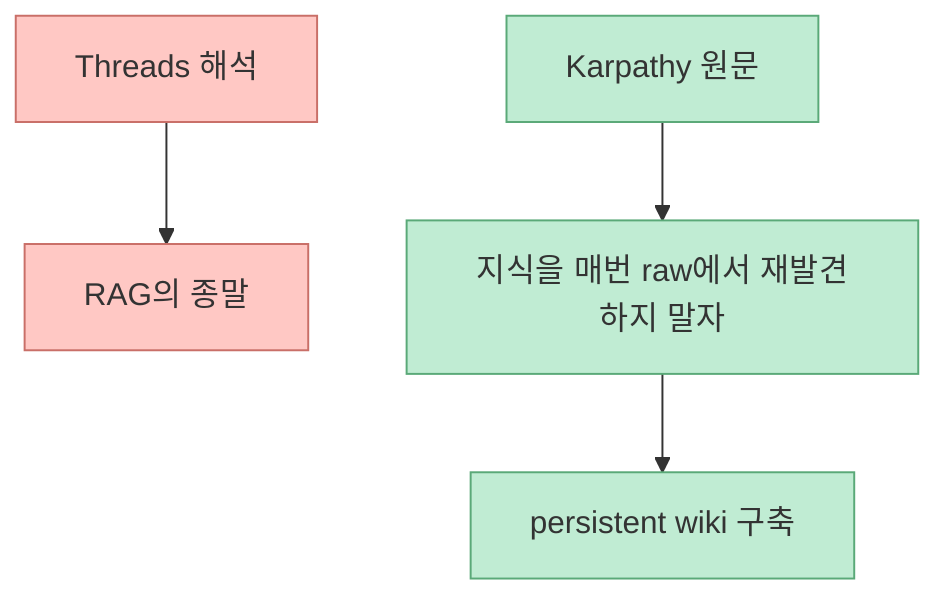
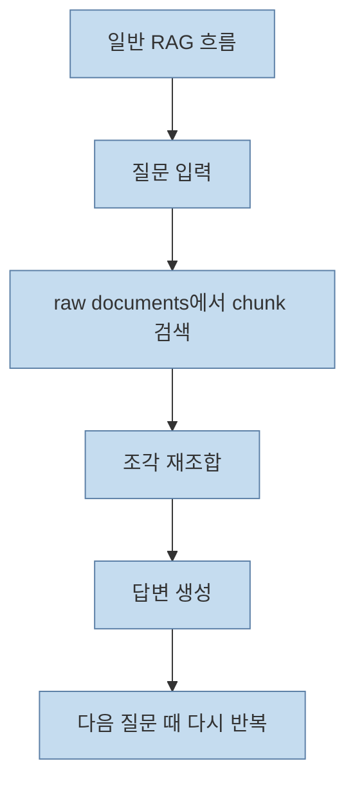
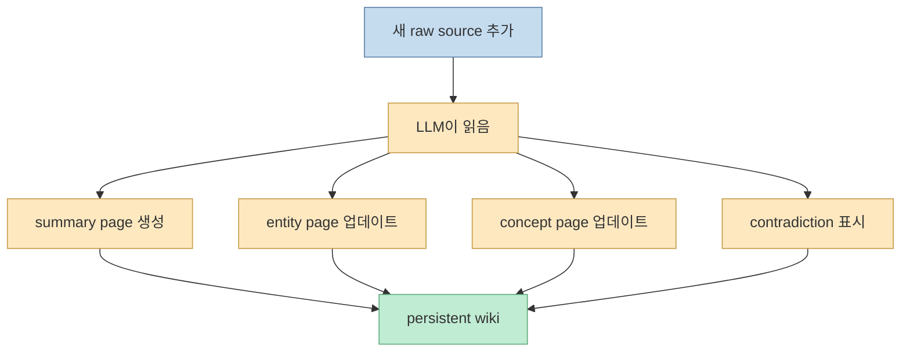
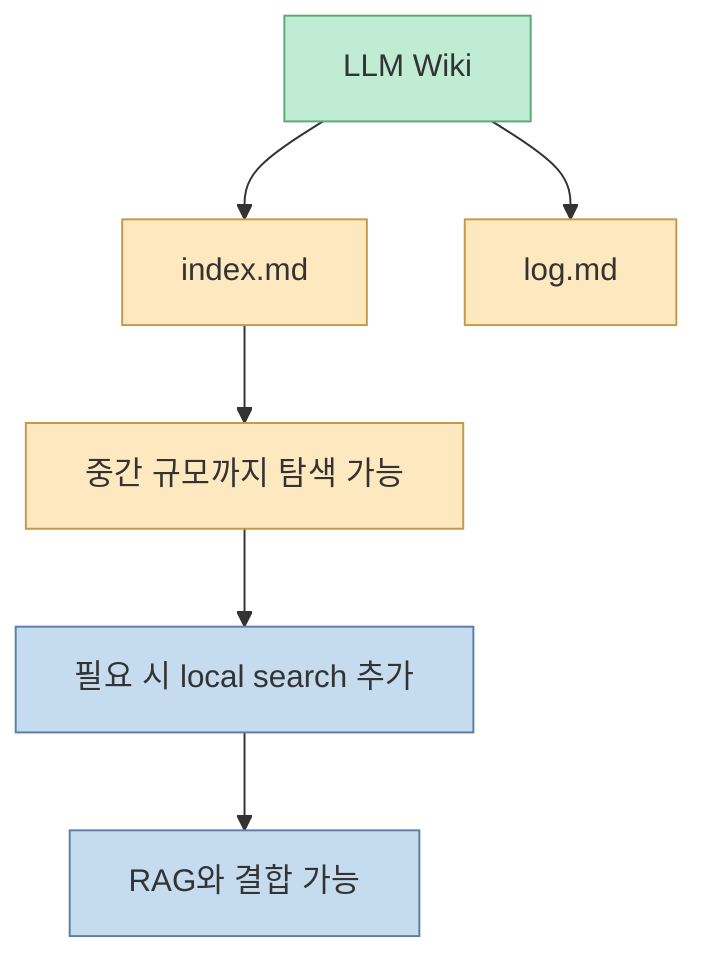
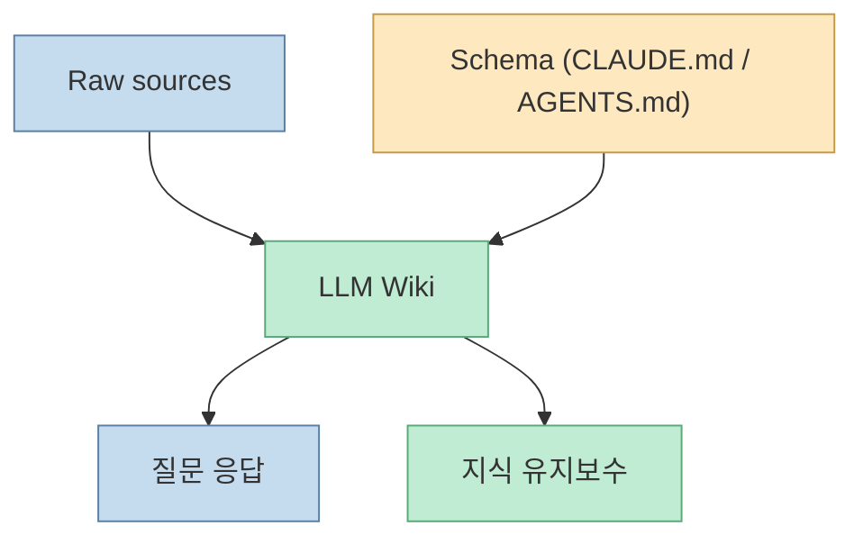
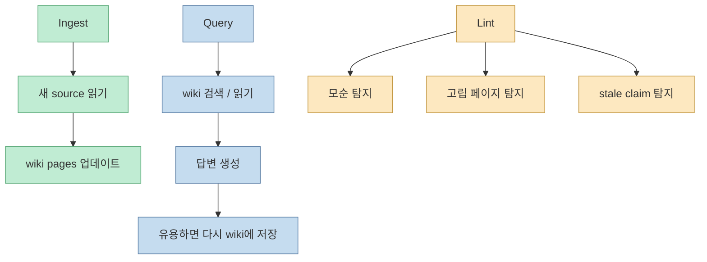
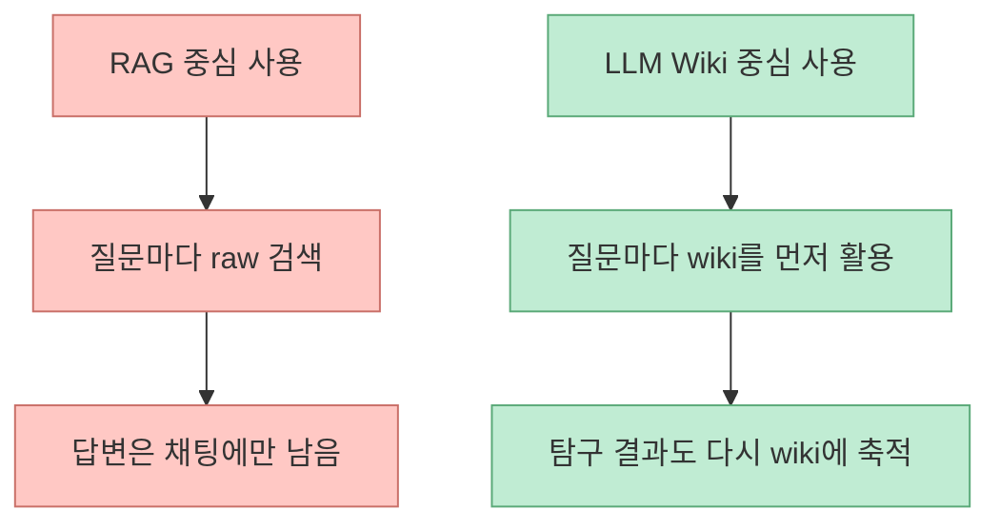

Threads 포스트는 꽤 자극적입니다. Karpathy가 "LLM 활용 새 패턴 한 장짜리 문서"를 공개했고, 24시간 만에 별 5,000개가 붙었으며, 이게 거의 **RAG의 종말** 같다는 표현입니다. 실제로 Karpathy의 `llm-wiki.md` gist는 엄청난 반응을 얻었고, 문서도 꽤 강력합니다. 하지만 원문을 차분히 읽어 보면, 이 문서는 RAG를 부정하는 선언문이라기보다 **지식을 매번 raw document에서 재발견하지 말고, persistent wiki로 축적하자** 는 제안에 더 가깝습니다. <https://www.threads.com/@qjc.ai/post/DYbcPawD-Lq?xmt=AQG00Z8HXE1apznc5mraJoSLMRwy9DcgtUQJg18kIQ1-ivFVVMokiFvvCMO6BkMhGXC-TvMD&slof=1> <https://gist.github.com/karpathy/442a6bf555914893e9891c11519de94f>

<!--more-->

## Sources

- <https://www.threads.com/@qjc.ai/post/DYbcPawD-Lq?xmt=AQG00Z8HXE1apznc5mraJoSLMRwy9DcgtUQJg18kIQ1-ivFVVMokiFvvCMO6BkMhGXC-TvMD&slof=1>
- <https://gist.github.com/karpathy/442a6bf555914893e9891c11519de94f>

## Threads 포스트가 짚은 포인트는 반쯤 맞고 반쯤 과장이다

Threads 원문은 세 가지를 강조합니다.

- Karpathy가 새 패턴 문서를 공개했다
- 하루 만에 반응이 폭발했다
- 내용은 "RAG의 종말"처럼 느껴진다

GitHub gist 페이지를 실제로 보면, 문서 제목은 `LLM Wiki`이고, 생성일은 2026년 4월 4일이며, 현재 `5,000+` star와 `5,000+` fork 표기가 붙어 있습니다. 그러니 폭발적 반응이라는 진단 자체는 맞습니다. [Karpathy gist](https://gist.github.com/karpathy/442a6bf555914893e9891c11519de94f)

하지만 "RAG의 종말"이라는 해석은 문서 원문보다 한 단계 더 나간 표현입니다. Karpathy는 문서에서 RAG가 틀렸다고 말하지 않습니다. 대신 **raw sources 위에 persistent wiki 레이어를 두면, 같은 지식을 매번 처음부터 다시 꺼내 조합하는 비효율을 줄일 수 있다** 고 말합니다.

즉 논쟁점은 retrieval의 존폐가 아니라, **retrieval 이전에 어떤 지식 구조를 미리 만들어 둘 것인가** 입니다.

## Karpathy가 실제로 비판하는 것은 '매 쿼리마다 처음부터 다시 찾는 방식'이다

원문 핵심 문장은 매우 명확합니다. 대부분의 사람은 LLM과 문서를 쓸 때 RAG처럼 동작한다는 것입니다. 파일 모음을 업로드해 두고, 질문이 들어오면 relevant chunk를 찾아 답을 생성합니다. 이 방식도 작동하지만, subtle question처럼 여러 문서를 종합해야 하는 문제에서는 LLM이 **매번 관련 조각을 다시 찾고 다시 조합해야 한다** 고 지적합니다. [Karpathy gist](https://gist.github.com/karpathy/442a6bf555914893e9891c11519de94f)

Karpathy가 문제 삼는 것은 retrieval 자체가 아니라, **축적이 없다는 점** 입니다. 질문이 바뀌어도 시스템이 이전 합성 결과를 자산으로 남기지 못하면, 매번 비용을 다시 내야 합니다.

## LLM Wiki의 핵심은 지식을 '컴파일된 중간층'으로 만든다는 것이다

LLM Wiki 패턴은 raw source와 사용자 사이에 markdown wiki를 둡니다. 새 문서를 추가하면 LLM은 단순히 later retrieval을 위해 인덱싱하는 것이 아니라:

- 핵심 정보를 읽고
- 요약 페이지를 만들고
- 관련 entity page와 concept page를 갱신하고
- 기존 주장과의 충돌을 표시하고
- cross-reference를 유지합니다

Karpathy가 말하는 차이는 명확합니다. 지식은 매 질의마다 raw source에서 다시 유도되는 것이 아니라, **한 번 컴파일되고 계속 갱신되는 아티팩트** 가 됩니다. [Karpathy gist](https://gist.github.com/karpathy/442a6bf555914893e9891c11519de94f)

이 중간층이 생기면 이후 질문은 raw chunk가 아니라 **이미 구조화된 지식 레이어** 를 먼저 읽게 됩니다.

## 그래서 이건 RAG의 대체라기보다 '사전 컴파일형 지식층'에 가깝다

원문은 아예 `index.md`와 `log.md`라는 두 특수 파일까지 제안합니다.

- `index.md`: 콘텐츠 중심 카탈로그
- `log.md`: 연대기 중심 작업 기록

그리고 moderate scale에서는 이 index가 embedding 기반 RAG 인프라를 아예 대체할 수도 있다고 말합니다. 하지만 바로 다음 절에서는, 위키가 커지면 proper search가 필요해질 수 있고, `qmd` 같은 로컬 검색 엔진을 붙일 수도 있다고 적습니다. [Karpathy gist](https://gist.github.com/karpathy/442a6bf555914893e9891c11519de94f)

즉 Karpathy의 제안은 "검색은 필요 없다"가 아닙니다. 오히려:

- 작은 규모에서는 index 기반 탐색만으로도 충분할 수 있고
- 큰 규모에서는 search engine을 추가해도 되며
- 중요한 것은 retrieval 이전에 **지식을 persistent하게 정리해 두는 레이어** 라는 것입니다

그래서 LLM Wiki는 anti-RAG보다는, **stateless retrieval 위에 compounding knowledge layer를 추가하는 패턴** 으로 보는 편이 더 정확합니다.

## 아키텍처는 raw sources, wiki, schema의 3층 구조다

Karpathy 문서가 특히 좋은 이유는 개념을 매우 간결하게 3층으로 나눈다는 점입니다.

- Raw sources
- The wiki
- The schema

Raw source는 immutable source of truth이고, wiki는 LLM이 쓰고 관리하는 markdown layer이며, schema는 `CLAUDE.md` 또는 `AGENTS.md` 같은 형식으로 위키 구조와 workflow를 규정하는 문서입니다. [Karpathy gist](https://gist.github.com/karpathy/442a6bf555914893e9891c11519de94f)

이 구조는 최근 컨텍스트 엔지니어링과도 연결됩니다. 답변 품질을 결정하는 것은 모델 파라미터보다, **어떤 파일 구조와 어떤 운영 규칙 아래에서 상태를 누적하느냐** 라는 뜻입니다.

## 세 가지 핵심 연산은 ingest, query, lint다

Karpathy는 이 패턴의 핵심 작업을 세 가지로 압축합니다.

- Ingest
- Query
- Lint

### Ingest
새 source를 읽고, 요약 페이지를 만들고, 관련 entity/concept page를 수정하고, log에 남깁니다.

### Query
위키를 읽고 답을 합성합니다. 그리고 그 답 자체를 다시 새 wiki page로 저장할 수도 있습니다.

### Lint
위키를 주기적으로 건강검진합니다. 모순, 고립된 페이지, stale claim, 빠진 cross-reference를 찾습니다.

이 세 연산은 매우 중요합니다. 왜냐하면 LLM Wiki를 "정적 문서 모음"이 아니라 **자기 유지보수형 지식 시스템** 으로 정의하기 때문입니다.

## 왜 사람들은 이걸 RAG의 종말처럼 느끼는가

Threads 해석이 완전히 뜬금없는 것은 아닙니다. 많은 RAG 시스템은 실제로 매 질문마다 원문에서 다시 찾고, 다시 조합하고, 다시 답합니다. 그런데 LLM Wiki는 그 중간 결과를 계속 남기고, 링크를 유지하고, 이전 탐구 결과도 자산화합니다.

이 차이는 체감상 매우 큽니다.

- RAG: 질문 순간의 검색 성능 중심
- LLM Wiki: 시간이 지날수록 두꺼워지는 지식층 중심

그래서 사람들은 이를 "RAG의 종말"로 느끼지만, 더 정확한 표현은 **stateless RAG에 대한 불만이 compounding knowledge pattern으로 이동한 것** 이라고 할 수 있습니다.

## 그렇다고 모든 문제가 사라지는 것은 아니다

Karpathy 문서도 의도적으로 추상적입니다. 구체 구현은 도메인과 선호에 따라 다르다고 밝힙니다. 실제로 대규모 운영에 들어가면 이런 문제가 남습니다.

- 링크 무결성 유지
- 오래된 주장 갱신 비용
- 위키 구조 설계
- 검색과 위키의 하이브리드 운영
- human-in-the-loop 필요성

즉 LLM Wiki는 silver bullet이 아니라, **지식 관리의 비용 구조를 바꾸는 제안** 으로 이해해야 합니다.

## 핵심 요약

- Threads에서 말한 "RAG의 종말"은 자극적인 해석이지만, 문제의식 자체는 실제 Karpathy 문서와 맞닿아 있다
- Karpathy가 비판하는 것은 retrieval 자체보다, 매 쿼리마다 raw document에서 다시 지식을 조합하는 비축적성이다
- LLM Wiki는 raw source 위에 persistent markdown wiki 레이어를 두고, 새 source가 들어올 때마다 지식을 컴파일하고 갱신한다
- 구조는 raw sources, wiki, schema의 3층으로 나뉜다
- 핵심 연산은 ingest, query, lint이며, 답변 자체도 다시 지식 자산으로 누적될 수 있다
- 따라서 이 패턴은 RAG를 없애는 것보다, RAG 앞단에 compounding knowledge layer를 두는 제안에 가깝다

## 결론

Karpathy의 `LLM Wiki`는 RAG를 부정하는 전쟁 선언문이 아닙니다. 더 정확히 말하면, **지식을 매번 다시 찾는 시스템에서 지식을 계속 자라게 하는 시스템으로 넘어가자** 는 제안입니다.

그래서 이 문서의 진짜 파괴력은 "RAG is dead"라는 구호보다, 다음 질문에 있습니다.

**왜 우리는 매 질문마다 이미 한 번 배운 것을 다시 조합하고 있는가?**

이 질문이 불편하게 느껴진다면, 아마 그 순간부터 LLM Wiki 패턴이 왜 이렇게 빠르게 퍼졌는지 이해하게 될 것입니다.
