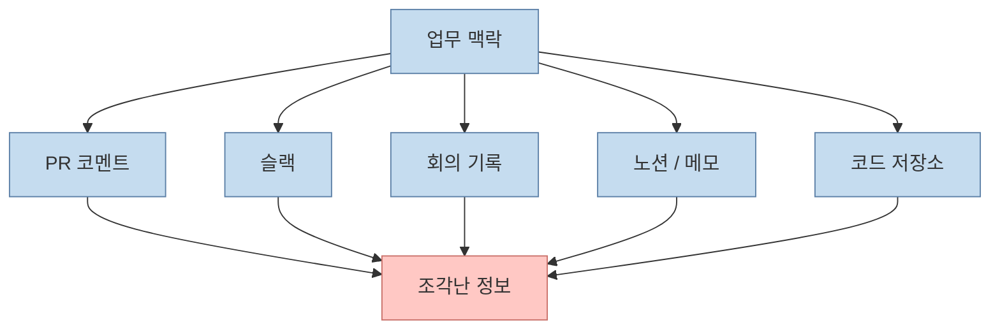
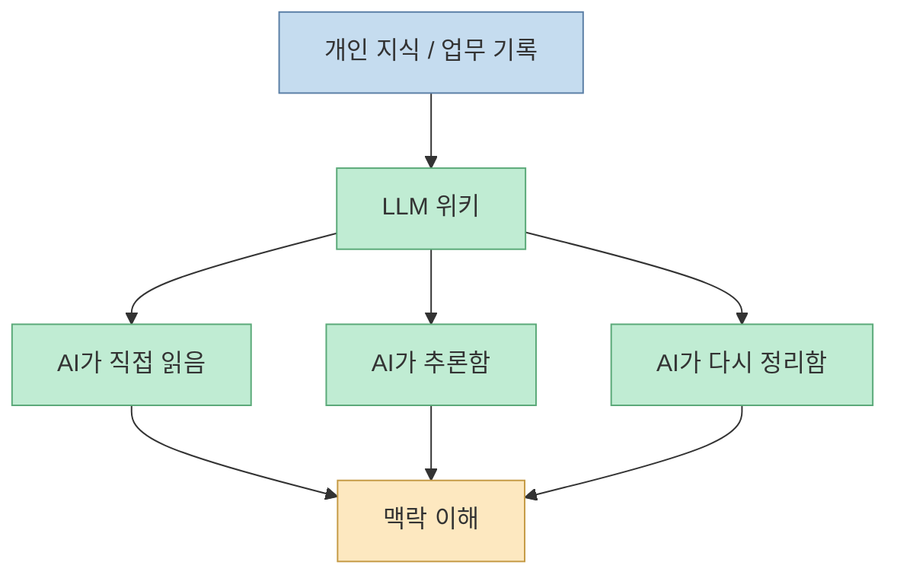
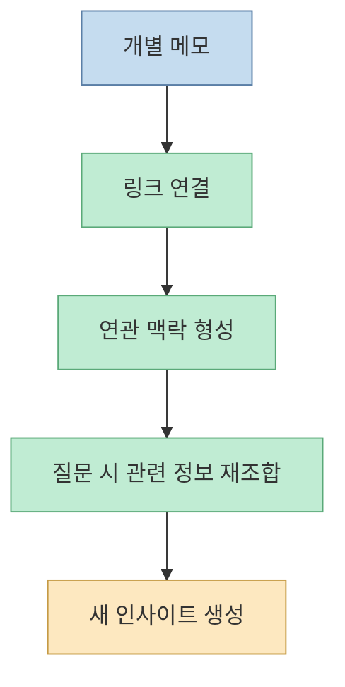
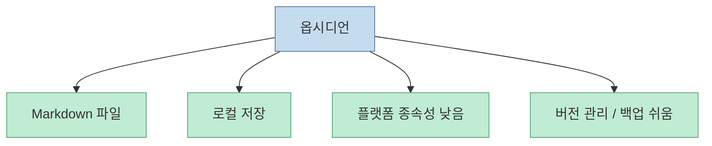
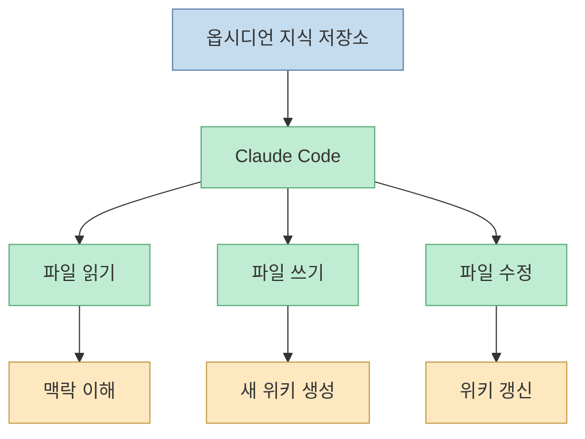
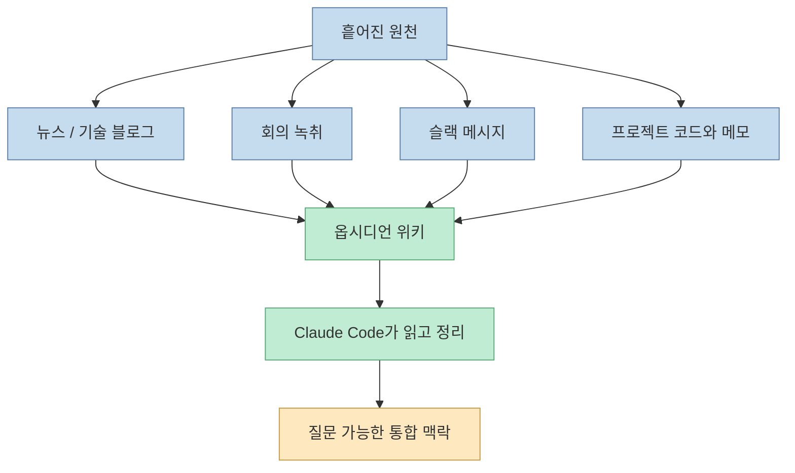
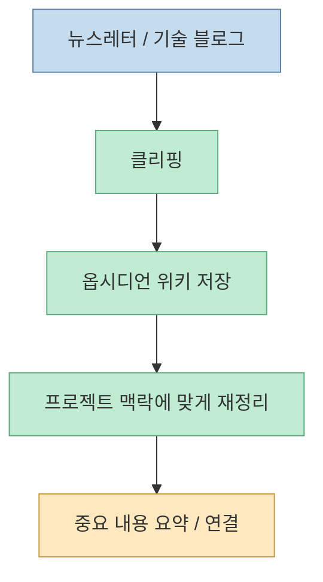
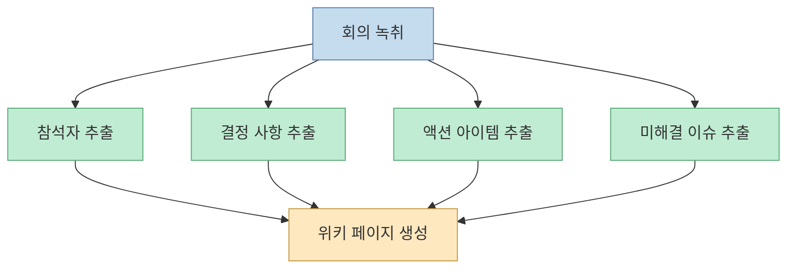
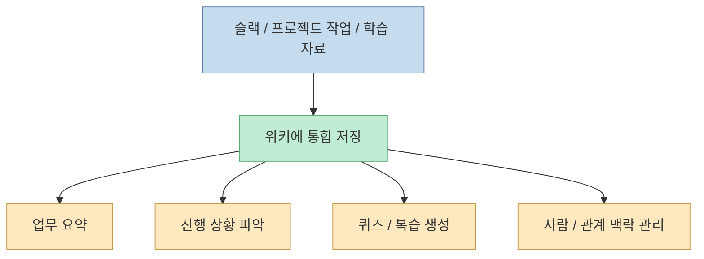
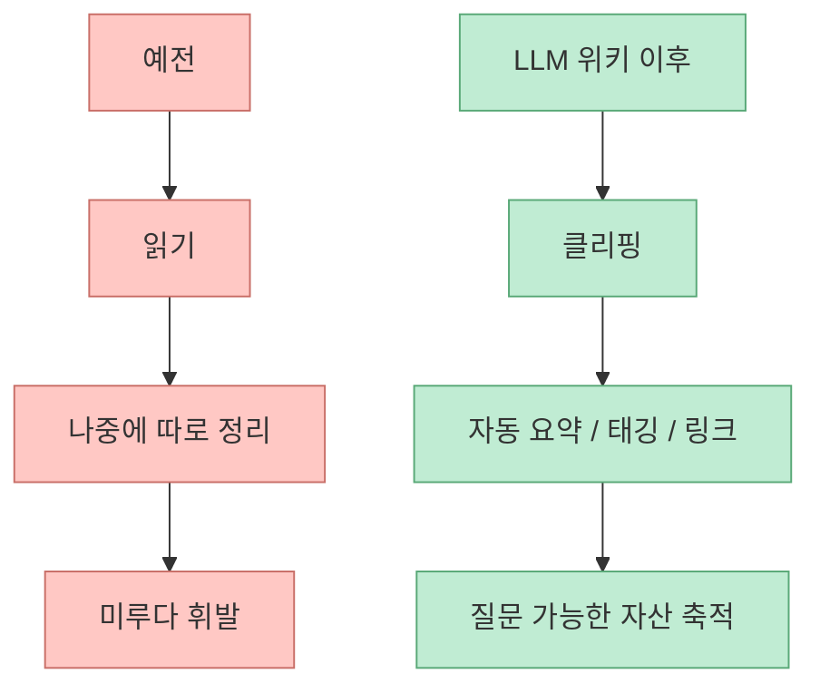

이 영상의 출발점은 꽤 직설적입니다. **프롬프트만 잘 짜면 AI를 잘 쓰는 것이라는 믿음은 절반만 맞다** 는 것입니다. 개발자와 기획자가 실제로 겪는 문제는 모델이 코드를 잘 이해하느냐보다, 회의 내용·아키텍처 결정 이유·슬랙 논의·기술 메모·과거 버그 대응 기록처럼 중요한 맥락이 여러 도구에 흩어져 있다는 점입니다. 영상은 이 문제를 해결하는 구조로 `LLM 위키`를 제안하고, 그 구현 조합으로 옵시디언과 Claude Code를 붙입니다. [00:30](https://youtu.be/9IuIwXAz_84?t=30) [02:22](https://youtu.be/9IuIwXAz_84?t=142)

<!--more-->

## Sources

- <https://youtu.be/9IuIwXAz_84?si=0YgpdcTSeDY-B-26>

## 문제는 모델 지능보다 맥락 파편화다

영상 초반은 꽤 공감 가는 사례들로 시작합니다. 3개월 전에 왜 그런 아키텍처 결정을 했는지 기억이 안 나고, PR 코멘트에는 단편만 남아 있고, 슬랙에는 중요한 결정이 묻혀 있고, 1년 전에 푼 버그를 다시 처음부터 디버깅하는 상황 말입니다. 발표자는 노션, 슬랙, Git, ChatGPT가 각각 한 조각만 갖고 있을 뿐, 모든 맥락을 통합해 주지는 못한다고 말합니다. [01:19](https://youtu.be/9IuIwXAz_84?t=79) [01:47](https://youtu.be/9IuIwXAz_84?t=107)

이 관점은 중요합니다. 문제를 "좋은 프롬프트가 없어서"로 보면 해결책이 문장 다듬기로 흘러가지만, 문제를 **맥락이 흩어진 상태** 로 보면 해결책은 저장과 연결 구조로 바뀝니다.

## LLM 위키는 "나만 아는 AI"가 아니라 "나를 알아버리는 AI"라는 주장

영상은 LLM 위키를 "개인 지식 DB를 위해서 AI가 직접 읽고 추론하는 시스템"이라고 설명합니다. 더 흥미로운 표현은 그다음입니다. 단순히 나만 아는 AI가 아니라, **나를 나보다 더 잘 알게 되는 구조** 라는 것입니다. [02:22](https://youtu.be/9IuIwXAz_84?t=142) [02:36](https://youtu.be/9IuIwXAz_84?t=156)

이 표현이 과장처럼 들릴 수는 있지만, 실제 의미는 비교적 명확합니다. 내가 직접 외우고 재설명하지 않아도, **AI가 장기 맥락을 외부 저장소에서 계속 불러와 판단에 쓰게 만든다** 는 뜻입니다.

## 이 구조의 메모 철학은 제텔카스텐에 가깝다

영상은 LLM 위키의 기반 철학으로 제텔카스텐을 언급합니다. 핵심은 메모를 단순 저장하지 않고, 하나의 아이디어를 하나의 카드로 만들고, 카드끼리 링크를 연결해 새로운 생각이 자연스럽게 발생하도록 하는 구조입니다. 옵시디언이 이 철학과 잘 맞는 이유도 바로 이런 연결성 때문입니다. [02:46](https://youtu.be/9IuIwXAz_84?t=166) [03:09](https://youtu.be/9IuIwXAz_84?t=189)

즉 LLM 위키는 단순한 "검색 가능한 메모장"이 아니라, **연결된 메모 네트워크를 AI가 읽을 수 있게 만든 상태 저장소** 에 더 가깝습니다.

## 왜 하필 옵시디언인가

영상은 두 도구가 필요하다고 말합니다. 바로 옵시디언과 Claude Code입니다. 그중 옵시디언의 이유는 꽤 선명합니다.

- 저장 형식이 Markdown 텍스트 파일이다
- 파일이 로컬에 남는다
- 플랫폼 종속성이 낮다
- 백업과 버전 관리가 쉽다

발표자는 노션 같은 클라우드 기반 도구와 비교하면서, 옵시디언은 서비스가 사라져도 내 데이터가 로컬 텍스트 파일로 남는다고 강조합니다. [03:56](https://youtu.be/9IuIwXAz_84?t=236) [04:35](https://youtu.be/9IuIwXAz_84?t=275)

이 포인트는 최근 하네스·컨텍스트 엔지니어링과도 연결됩니다. AI가 잘 읽으려면 결국 **기계가 다루기 쉬운 형식과 사람이 오래 보관할 수 있는 형식** 이 필요하고, Markdown은 그 교집합에 가깝습니다.

## 왜 하필 Claude Code인가

영상에서 Claude Code의 장점은 단순 채팅 품질이 아니라, **파일을 직접 읽고 쓰고 수정하는 에이전트** 라는 점으로 설명됩니다. ChatGPT처럼 대화창에 답을 뱉고 끝나는 것이 아니라, 실제 디스크의 Markdown 파일을 생성하고 고칠 수 있으니 옵시디언 위키를 살아 있게 관리할 수 있다는 뜻입니다. [05:00](https://youtu.be/9IuIwXAz_84?t=300) [05:12](https://youtu.be/9IuIwXAz_84?t=312)

즉 옵시디언이 정적 저장소라면, Claude Code는 그 저장소를 **작동하는 기억 시스템으로 바꾸는 실행 엔진** 역할을 합니다.

## 둘을 합치면 해결되는 것은 "통합" 문제다

영상은 앞에서 계속 "각 도구가 한 조각만 갖고 있다"고 말합니다. 옵시디언과 Claude Code를 결합하면 그 파편을 다시 모을 수 있다는 것이 핵심 주장입니다. [05:16](https://youtu.be/9IuIwXAz_84?t=316) [05:28](https://youtu.be/9IuIwXAz_84?t=328)

이건 프롬프트로는 풀기 어려운 문제입니다. 컨텍스트를 넣기 전에, **맥락이 살아 있는 저장소가 먼저 있어야 하기 때문** 입니다.

## 실제 사용 예시 1: 읽은 글을 바로 내 프로젝트 맥락으로 편입한다

영상에서는 뉴스레터나 기술 블로그를 읽다가 인상 깊은 글이 있으면 마우스 클릭으로 클리핑하고, 그것을 내 프로젝트와 하는 일에 연관되게 자동 정리한다고 설명합니다. 핵심은 "그냥 저장"이 아니라, **나에게 맞춘 구조로 다시 정리** 된다는 점입니다. [05:36](https://youtu.be/9IuIwXAz_84?t=336) [05:54](https://youtu.be/9IuIwXAz_84?t=354)

즉 지식 수집이 수동 정리 노동이 아니라, **클릭 후 AI 정리 파이프라인** 으로 바뀌는 것입니다.

## 실제 사용 예시 2: 회의가 끝나면 회의록이 아니라 '질문 가능한 기록'이 남는다

영상에서는 회의가 끝난 뒤 `/meeting` 같은 한 줄 명령으로 회의 녹취를 위키 페이지로 정리한다고 설명합니다. 누가 왔고, 무엇이 결정됐고, 누가 무엇을 하기로 했고, 미해결 이슈가 무엇인지까지 자동으로 정리되고, 나중에 검색 가능하게 남는다는 뜻입니다. [05:58](https://youtu.be/9IuIwXAz_84?t=358) [06:17](https://youtu.be/9IuIwXAz_84?t=377)

중요한 점은 이것이 단순 속기록이 아니라, **나중에 AI가 다시 읽고 답할 수 있는 구조화된 회의 기억** 으로 남는다는 것입니다.

## 실제 사용 예시 3: 슬랙과 학습까지 모두 같은 저장소로 들어온다

영상은 슬랙 메시지도 Claude가 MCP를 통해 직접 접근해 주요 내용을 정리할 수 있다고 말합니다. 또 프로젝트에서 개발한 내용을 바탕으로 퀴즈를 만들거나, 중요한 포인트를 뽑아 학습용으로 재구성하는 흐름도 설명합니다. [06:18](https://youtu.be/9IuIwXAz_84?t=378) [06:35](https://youtu.be/9IuIwXAz_84?t=395)

여기서 LLM 위키는 단순한 문서 관리가 아니라, **업무 기억 + 학습 기억 + 협업 기억을 한데 묶는 개인 운영 메모리** 역할을 하게 됩니다.

## 가장 큰 변화는 "정리 시간"이 거의 사라진다는 주장이다

발표자가 말하는 체감 변화는 명확합니다. 예전에는 새 기술 자료와 문서를 읽고 난 뒤 따로 정리 시간을 내야 했는데, 지금은 옵시디언에 넣기만 하면 Claude가 태그를 붙이고, 비슷한 주제 페이지와 연결하고, 요약까지 해 준다는 것입니다. [07:34](https://youtu.be/9IuIwXAz_84?t=454) [07:50](https://youtu.be/9IuIwXAz_84?t=470)

그래서 영상은 이 구조를 단순한 편의성이 아니라, **학습 ROI를 바꾸는 방식** 으로 설명합니다.

## 결국 핵심은 AI가 아니라 '지식 운영 방식'의 변화다

이 영상을 강의 홍보로만 보면 반만 보게 됩니다. 앞부분의 핵심은 분명합니다.

- 프롬프트가 아니라 맥락이 문제다
- 맥락은 여러 도구에 흩어져 있다
- LLM 위키는 그 맥락을 읽고 추론 가능한 저장소로 만든다
- 옵시디언은 파일 기반 장기 저장을 담당하고
- Claude Code는 그 저장소를 살아 움직이게 만든다

즉 진짜 변화는 모델 성능보다, **내 지식을 어떻게 축적하고 다시 호출할 것인가** 에 있습니다.

## 핵심 요약

- 이 영상은 프롬프트만 잘 짜서는 개발자의 실제 맥락 문제를 해결할 수 없다고 본다
- 문제의 본질은 회의, 슬랙, PR, 메모, 기술 문서가 여러 도구에 흩어진 상태다
- 해결 구조로 제시되는 것이 `LLM 위키`이며, 이는 AI가 직접 읽고 추론하는 개인 지식 저장소다
- 옵시디언은 로컬 Markdown 기반 저장소로서 장기 보존성과 이식성을 제공한다
- Claude Code는 그 파일을 읽고 쓰고 정리하는 실행 엔진 역할을 한다
- 둘을 결합하면 클리핑, 회의 정리, 슬랙 요약, 복습 퀴즈, 오늘 할 일 정리 같은 흐름이 가능해진다

## 결론

이 영상의 가장 중요한 메시지는 단순합니다.

**AI를 잘 쓰는 문제는 점점 프롬프트의 문제가 아니라, 기억을 어떻게 외부화하고 운영하느냐의 문제가 되고 있다.**

옵시디언과 Claude Code의 조합은 그 흐름을 잘 보여 줍니다. 하나는 오래 남는 지식 저장소를 만들고, 다른 하나는 그 저장소를 읽고 갱신하고 추론하는 작업자를 제공합니다. 결국 LLM 위키의 본질은 메모장이 아니라, **나의 맥락이 계속 살아 움직이는 개인용 지식 운영체제** 를 만드는 데 있습니다.
